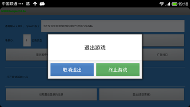
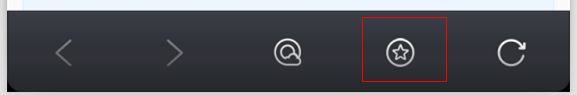
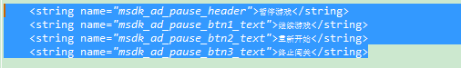

MSDK’s Advertising-related Modules
===
1. Overview
---
The game is set with a “Pause” button. When the user clicks the button, a pause dialog box will pop up; when the user presses the Return key, an exit dialog box will pop up. Starting from MSDK2.1, MSDK adds custom dialogs to show pause and exit, as shown in the below diagram:

 

When the game has an advertisement put on it, the interface is shown in the below diagram. When there are several ads, the picture will automatically skip to the next ad after an interval of time; sliding the picture with fingers can also enter the next ad.

 

Among them, the number of buttons can be configured in __adconfig.ini__, or can be only configured to __2__ or __3__. As shown in Figure 3, the Pause dialog box has three buttons, namely "Continue the game", "Re-start" and "End breaking through the pass". The texts on the buttons can be changed. After a button is clicked, the dialog box will disappear, and MSDK’s callback interface OnADNotify will notify the game. The game implements a specific logic in this function. Each View has the attribute: __android: tag__. Through different tag names, the game distinguishes which button responds. If the dialogue box uses the default layout, as shown in Figure 3, the viewTag of "Continue the game" is `FIRST_BTN_POSITION`, viewTag of "Re-start" is `SECOND_BTN_POSITION`, viewTag of "End breaking through the pass" is `THIRD_BTN_POSITION`; when the game player presses the Return key, MSDK’s callback interface `OnADBackPressedNotify` will notify the game of the message.

In addition, you can use the built-in browser to display ads on the navigation bar. When there are any ads on the navigation bar, a “Recommend” button will appear on the navigation bar at the bottom of the built-in browser, as shown in Figure 5. Click on the button can open the advertising page of the navigation bar.
 

2. Access to the game
---
###Step 1: Access configuration
__Copy MSDKSample/assets/adconfig.ini into the game’s corresponding project assets directory and configure it. __

In assets/adconfig.ini, configure the switch to open the ad:

    MSDK_AD=true // Open the ad in case of true

In assets/adconfig.ini, configure the number of buttons in the ad:

    ;the number of MSDK’s pause-slot ad buttons can be only configured as 2 or 3; the default value is 2
    ;AD_PAUSE=2
    AD_PAUSE=3
    
    ;the number of MSDK’s exit-slot ad buttons can be only configured as 2 or 3; the default value is 2 
    ;AD_STOP=3
    AD_STOP=2

###Step 2: Configure the game’s Activity life cycle
  Configure onPause and onResume of the game's main Acitivity to call the corresponding methods of MSDK, respectively. Be sure to call them.

    @Override
    protected void onResume() {
        super.onResume();
        WGPlatform.onResume();
    }
    @Override
    protected void onPause() {
        super.onPause();
        WGPlatform.onPause();
    }
    @Override
    protected void onDestroy() {
        super.onDestroy();
        WGPlatform.onDestory(this);
    }

###Step 3: Configure the callback function

3.1 After the user clicks the button or presses the return key, MSDK will send a callback to the game, asking the game to add the processing logic. The java call method handles the callback according to the following method. Add the call logic in onCreate, as shown in com.example.wegame.MainActivity in MSDKSample.

    public class ADRet {
        // The default configured viewTag
        // FIRST_BTN_POSITION 
        // SECOND_BTN_POSITION 
        // THIRD_BTN_POSITION 
        // If the game changes android:tag of the View button, viewTag is equal to the corresponding value
        public String viewTag = "";
        public eADType scene;
    }

    // Callback arising from click on the ad button
    class MsdkADCallback implements WGADObserver {

        @Override
        public void OnADNotify(ADRet ret) {
            Logger.d("Java MsdkADCallback OnADNotify:" + ret.toString());
            // TODO: GAME Here adds the processing of the ad callback
        }

        @Override
        public void OnADBackPressedNotify(ADRet ret) {
            Logger.d("Java MsdkADCallback OnADBackPressedNotify:" + ret.toString());
            // TODO GAME If you press the return key to close the ad, you need to call the close method
            WGPlatform.WGCloseAD(ret.scene);
        }
    }

    if (LANG.equals("java")) {
        WGPlatform.WGSetObserver(new MsdkCallback());
        // Callback settings of the ad
        WGPlatform.WGSetADObserver(new MsdkADCallback());
    }

3.2 Configure the CPP callback

Add the global callback object, as shown in com_example_wegame_PlatformTest.cpp in MSDKSample.

    // the ad’s callback
    class ADCAllback: public WGADObserver {

        virtual void OnADNotify(ADRet& adRet) {
            // Here the game adds the processing logic of displaying ads and then clicking the button
            LOGD("ADCAllback OnADNotify Tag:%s ", adRet.viewTag.c_str());
            if(adRet.scene == Type_Pause) {
                LOGD("ADCAllback OnADNotify scene:Type_Pause%s", "");
            } else if(adRet.scene == Type_Stop) {
                LOGD("ADCAllback OnADNotify scene:Type_Stop%s", "");
            }
        }

        virtual void OnADBackPressedNotify(ADRet& adRet) {
             // Here the game adds the processing logic of displaying ads and then pressing the return key
            LOGD("ADCAllback OnADBackPressedNotify Tag:%s ", adRet.viewTag.c_str());
            if(adRet.scene == Type_Pause) {
                LOGD("ADCAllback OnADBackPressedNotify scene:Type_Pause%s", "");
                // Note: the game should close the ad dialog
                WGPlatform::GetInstance()->WGCloseAD(adRet.scene);
            } else if(adRet.scene == Type_Stop) {
                LOGD("ADCAllback OnADBackPressedNotify scene:Type_Stop%s", "");
                // Note: the game should close the ad dialog
                WGPlatform::GetInstance()->WGCloseAD(adRet.scene);
            }
        }
    };

    // Global callback object of the ad
    ADCAllback ad_callback;

    // Initialization
    JNIEXPORT jint JNICALL JNI_OnLoad(JavaVM* vm, void* reserved) {
        //TODO GAME  C++ initialization must be called before onCreate of the game’s main Activity
        WGPlatform::GetInstance()->init(vm);
        WGPlatform::GetInstance()->WGSetObserver(&g_Test);
        // Set the ad callback
    WGPlatform::GetInstance()->WGSetADObserver(&ad_callback);
        
        WGPlatform::GetInstance()->WGSetSaveUpdateObserver(&callback);
        return JNI_VERSION_1_4;
    }

###Step 4: Description of call methods
Describe the functions to be called to display and turn off the ad dialog boxes at the pause slot and exit slot in JAVA

    /**
     * @param scene : advertising scene ID; can not be empty
     * Type_Pause(1) indicates the ad at the pause slot
     * Type_Stop(2) indicates the ad at the exit slot
    */
    WGPlatform.WGShowAD(eADType scene); 
    WGPlatform.WGCloseAD (eADType scene);

Describe the functions to be called to display and turn off the ad dialog boxes at the pause slot and exit slot in CPP
The global enumeration type is defined in WGPublicDefine.h

    typedef enum _eADType
    {
        Type_Pause  = 1, // ad at the pause slot
        Type_Stop = 2, // ad at the exit slot
    }eADType;

Corresponding methods to display and turn off the ad dialog boxes at the pause slot and exit slot

    WGPlatform::GetInstance()->WGCloseAD(Type_Pause);
    WGPlatform::GetInstance()->WGCloseAD(Type_Stop);

###Step 5: Description of resource files

5.1 File path:

【1】MSDKLibrary\res\layout\msdk_ad_pause_three_default.xml

【2】MSDKLibrary\res\layout\msdk_ad_pause_three_show.xml

【3】MSDKLibrary\res\layout\msdk_ad_pause_two_default.xml

【4】MSDKLibrary\res\layout\msdk_ad_pause_two_show.xml

【5】MSDKLibrary\res\layout\msdk_ad_stop_three_default.xml

【6】MSDKLibrary\res\layout\msdk_ad_stop_three_show.xml

【7】MSDKLibrary\res\layout\msdk_ad_stop_two_default.xml

【8】MSDKLibrary\res\layout\msdk_ad_stop_two_show.xml

Wherein:

【1】msdk_ad_pause_three_default.xml corresponds to the effect of Fig. 1;

【2】The effect of msdk_ad_stop_three_default.xml is also so, and only the text is different; the text can be modified in MSDKLibrary\res\values\msdk_ad_strings.xml.

 

【3】msdk_ad_stop_two_default.xml和msdk_ad_pause_two_default.xml corresponds to Fig. 2;

【4】msdk_ad_pause_three_show.xml和msdk_ad_stop_three_show.xml corresponds to Fig. 3;

【5】msdk_ad_stop_two_show.xml和msdk_ad_pause_two_show.xml corresponds to Fig. 4.

** Note: The game can directly modify the files in MSDKLibrary\res, and advertising-related resources all begins with msdk_ad. In fact, each game only needs four layout files, because the number of buttons on the dialog box is determined. For other restrictions, please refer to Step 7. * *

###Step 6: Description of the configuration and layout files of the game

6.1 MSDKLibrary may be modified, and it may be somewhat inconvenient to compare the original files with the copies in the follow-up upgrade. So MSDK makes some improvements for some configuration items. The game can define the layout files in its own project directory and then write the names of the XML files into assets/adconfig.ini. Of course, these layout files need to make some restrictions.

6.2 Configuration steps

First, open the switch which can configure the layout

    ;MSDK’s ad layout file configuration switch; the default switch is false
    AD_NEED_CONFIG_LAYOUT=false

Then, define the dialog layout file in the project.

Finally, configure relevant items in the configuration file

    ;In MSDK’s pause-slot ad dialog, the game customizes the layout configuration; only AD_NEED_CONFIG_LAYOUT=true is effective
    ;the number of buttons in the layout file should be consistent with AD_PAUSE
    ;the layout file to display the dialog when there is no advertisement
    AD_LAYOUT_PAUSE_DEFAULT=myad_pause_default
    ;the layout file to display the dialog when there are ads
    AD_LAYOUT_PAUSE_SHOW=myad_pause_show

    ;In MSDK’s exit-slot ad dialog, the game customizes the layout configuration
    ;the number of buttons in the layout file should be consistent with AD_STOP
    ;the layout file to display the dialog when there is no advertisement
    AD_LAYOUT_STOP_DEFAULT=myad_stop_default
    ;the layout file to display the dialog when there are ads
    AD_LAYOUT_STOP_SHOW=myad_stop_show

For example, MSDKSample/res/layout defines the writing methods of four layout files and configuration files.

 

### Step 7: Precautions for modifying the resources and layout files

**1.	Please ensure that the ID of the button is msdk_ad_btn_1, msdk_ad_btn_2 or msdk_ad_btn_3; otherwise, the button ID can't be found when the dialog box is launched**

**2.	Please keep the layout of the picture scroll effect when there is an ad, that is, the red line-marked part of the id name ad_view_pager can not be changed. Try to keep the picture size to be 300dp*200dp**