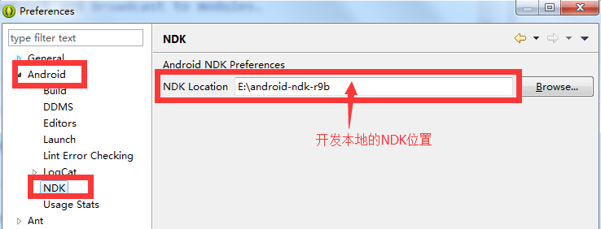

Development Environment Configuration
===

Overview
---

This document mainly aims to help game developers to clearly learn the related configuration of some development environments

C++ compiler configuration
---
#### Overview:

MSDK’s C++ interface is implemented by JNI. When a game using MSDK’s C++ interface is integrated, it needs to use NDK to complete the compilation. MSDK directly provides the source code compilation to the game. MSDK provides NDK environment configuration and completed compilation examples, and the game can refer to them and modify them.

#### Eclipse environment configuration:

Select **window -> preferences -> Android -> NDK**, and configure according to the following picture.

Note: there is no integrated NDK in the latest ADT version (adt-bundle-windows-x86-20140702), and game developers may not see the above configuration in the Android option. The solution for this problem is as follows:

1. Download NDK-related plug-ins of eclipse [com.android.ide.eclipse.ndk_23.0.2.1259578.jar](https://github.com/bihe0832/Settings-Tools/tree/master/adt/plugins)
2. Place the downloaded `com.android.ide.eclipse.ndk_23.0.2.1259578.jar` into `\eclipse\plugins` under adt directory, and then restart eclipse。

#### Import code:

The game needs to copy .cpp and .h files under `MSDKLibrary/jni` directory into the game project.

#### makefile configuration:

After importing the code, the game needs to add the relevant code into makefile. Based on the actual situation, the game can import the configuration information in Android.mk under `MSDKLibrary/jni` into the makefile file of the game or Android.mk.

Self-test of the access configuration
---

#### Overview:

In the access to the game, development team members often directly copy and paste the demo code of MSDK. As a result, they sometimes copy the relevant configuration content of the demo code together into the game project, thus triggering some exceptions. So MSDK adds an internal inspection module, which can be used to reduce some access costs in the game development process.

#### Use method:

When the environment to which the game is connected is a debugging or testing environment, the check module configured by MSDK in the initialization will check if some common settings are incorrect. By viewing the content of logcat, the game developer can view:

- ** When the game has configuration errors, the log case is: **

		11-18 17:10:47.373: E/WeGame CheckBase.queryIntentFilter(9855): Msdk: the intent-filter of com.tencent.tauth.AuthActivity has not be configured correctly
		11-18 17:10:47.373: E/WeGame CheckBase.queryIntentFilter(9855): Msdk: the intent-filter of com.tencent.tauth.AuthActivity has not be configured correctly
		11-18 17:10:47.393: W/WeGame WeGame.Initialized(9855): MSDK Config Error!!!!
		11-18 17:10:47.403: W/WeGame WeGame.Initialized(9855): Check Result: 2
		11-18 17:10:47.403: D/WeGame WeGame.Initialized(9855):  ********************check result start********************
		11-18 17:10:47.403: W/WeGame WeGame.Initialized(9855): QQ AppID for Initialiezed must be the same as configed in AndroidMenifest.xml
		11-18 17:10:47.403: W/WeGame WeGame.Initialized(9855): AuthActivity Category Error
		11-18 17:10:47.403: D/WeGame WeGame.Initialized(9855):  ********************check result end**********************

- ** When the game has no basic configuration errors, the log case is: **

		11-18 17:15:16.825: W/WeGame WeGame.Initialized(13524): Check Result: 0

#### Remarks:

- The check results of the module **only reference for game developers* *; all configuration checks are strong checks; according to the check results and the game’s own needs, the game developer can modify the contents of the corresponding configuration check items. The game developer is not required to solve all the configuration problems completely.