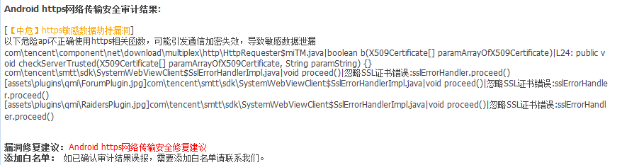
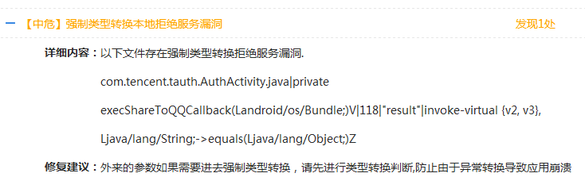
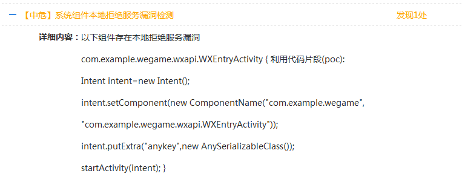
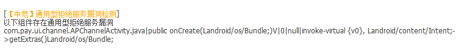
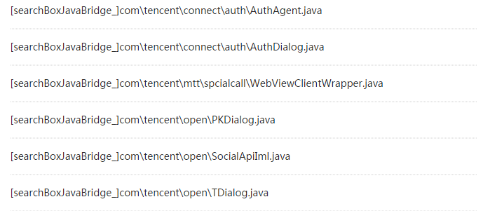
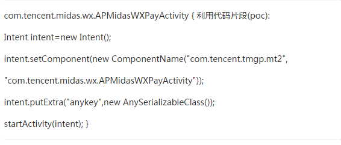
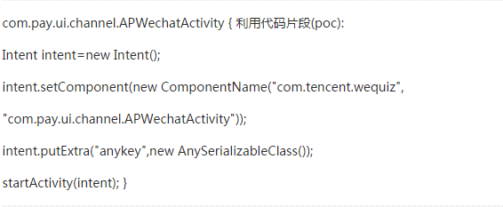
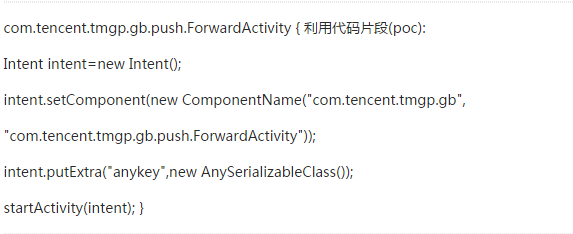
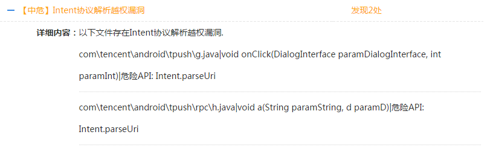

JG Audit Issue
==============

## Overview

Before the release of a new version, MSDK usually makes JG testing to confirm that the version has no loopholes so as to release it. However, as various new types of loopholes appear, games which get access to older versions can still encounter all kinds of loophole-related issues. After exchanging views with the JG team, here the MSDK team now summarizes and combs various risk loopholes detected again in the released versions and gives final solutions to them.

## QMI network transmission security loophole

####MSDK’s recommendation for fixing it: Upgrade MSDK to 2.3.2a and higher versions

## openSDK’s local service denial loophole

####MSDK’s recommendation for fixing it: Upgrade MSDK to 2.6.0a and higher versions

## MSDK system components’ local service denial loophole

####MSDK’s recommendation for fixing it: Upgrade to MSDK2.6.1a and higher versions

## Midas universal service denial loophole

####MSDK’s recommendation for fixing it: Upgrade Midas to 1.3.9b and higher versions (corresponding MSDK 2.4.0a and above)

## MSDK Web component’s remote code execution loophole

####MSDK’s recommendation for fixing it: Upgrade MSDK to 2.6.0a and higher versions

## Open SDK Web component’s remote code execution loophole

####MSDK’s recommendation for fixing it: Upgrade MSDK to 2.6.0a and higher versions

## Midas system components’ local service denial loophole

####MSDK’s recommendation for fixing it: Upgrade Midas to 1.3.9.e and higher versions

## PUSH service denial loophole

####MSDK’s recommendation for fixing it: Please delete the registered code; the game does not need to register ForwardActivity in AndroidManifest.xml

## Pigeon’s Intent protocol resolution ultra vires loophole

####MSDK’s recommendation for fixing it: The loophole has been added to the JG white list; and there will be no loophole warnings any longer
