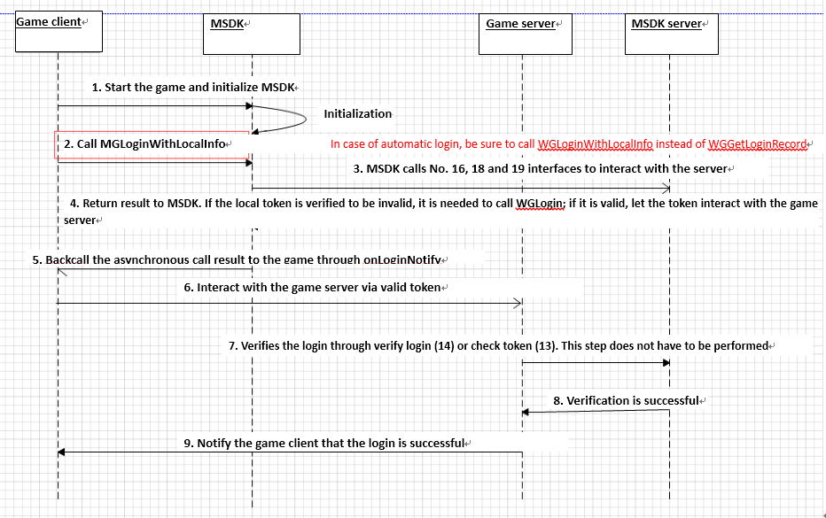

#MSDK Login Module

## Overview

This module will look at all authorization-related modules of MSDK, including the detailed descriptions of authorized login, automatic login, quick login, token refresh, read and other modules. Developers can first refer to the module to get familiar with all authorization-related modules of MSDK and then use the corresponding interfaces to complete authorization and other functions according to their own needs.

## Access to the login module (must-see for developers)

** `Game developers can complete the access to MSDK login module according to the steps provided below to reduce the access cost and omitted processing logic. It is strongly recommended that developers should have a good understanding of the steps and handle all the logics!!! `** 
 
1. Set the permissions for the user’s authorization:
	-After the initialization of MSDK, the game should call the permission setting interface of mobile QQ to set the permissions of the platform which requires that the user authorize the game. Specific method [click to view] (#Set the permissions for the user’s authorization - WGSetPermission).
- ** Handle the authorized login **:
	1. In the login button click event handler, call `WGLogin` to complete the authorized login. Specific methods[click to view] (#Handle the authorized login - WGLogin).
- ** Handle automatic login **:

	1.After the initialization of MSDK in onCreate of the main Activity call `WGLoginWithLocalInfo` to complete the automatic login when the game is evoked. Specific method [click to view] (#Handle automatic login - WGLoginWithLocalInfo)

    2.onResume of the main Activity judge the time when the game switches to the backend; if the time exceeds 30 minutes, it will automatically call `WGLoginWithLocalInfo` to complete the automatic login
		- For how to judge the time when the game switches to the backend, game developers can refer to the demo approach of MSDK, that is, recording a timestamp when the game switches to the backend and calculating the time difference after the game returns to the front-end
- ** Handle user logout **:
	- In the logout button click event handler, call WGLogout to complete the authorized login. Specific method [click to view] (# Handle user logout - WGLogout)
- ** Handle the login callback of MSDK **:
	- In the logic that the game handles MSDK’s callbacks, add the handling of onLoginNotify. Specific method [click to view] (# Handle the login callback of MSDK)
- ** Handle the platform wakeup**:
	- In onCreate and onNewIntent in the game's main activity, call handleCallback to complete handling the platform wakeup. Specific method [click to view] (#Handle the platform wakeup - handleCallback)
- ** Handle the wakeup callback of MSDK:
	- In onWakeUpNotify with which the game handles MSDK’s callbacks, add the handling of the platform wakeup. Specific method [click to view] (# Handle the wakeup callback of MSDK)
- ** Handle Account inconsistency logic **:
	- For details about the logic of the game to handle account inconsistency, please refer to [MSDK Account Inconsistency Access] (diff-account.md # account inconsistency handling logic (developers should pay attention to this))
- ** The Other special logic handling **:
	- A scheme to log in the game after the game process is killed in the authorization process in the low-memory machine. Specific method [click to view] (#The login scheme for the mobile QQ authorization process in the low-memory machine after the game is killed)
	- **`Automatic refresh mechanism of MSDK WeChat token after the token expires` ** Specific method [click to view] (#Automatic refresh of WeChat token)
	- Requirements on the calling of the login data reporting interface. Specific method [click to view] (# Login data reporting)

** `After MSDK2.7.0a, the login process has been transformed and some calls have been adjusted. Places needing special attention are listed below. It is strongly recommended to seriously understand them!!! `**

 - ** Handle automatic login **:

   - 1. In MSDK2.7.0a and later versions, WGLoginWithLocalInfo () is changed into WGLogin (EPlatform.ePlatform_None); of course, these versions now are still compatible with WGLoginWithLocalInfo, but later versions will remove the interface.
   - 2. In MSDK2.7.0a and later versions, tokens will be regularly refreshed when the game starts and returns to the front-end, so the game can call automatic login in onResume when it is just started. The automatic refresh process of tokens [click to view] (#Automatic refresh process of tokens in MSDK2.7.0a and later versions)

- ** Automatic refresh mechanism of MSDK WeChat tokens after the tokens expire **:

   - On the basis of supporting the login process of previous versions, MSDK2.7.0a and later versions optimize the login process and regularly refresh tokens. Please be sure to set WXTOKEN_REFRESH in assets/msdkconfig.ini as follows: WXTOKEN_REFRESH = true, or delete it (namely enabled by default).
  
 
- ** Call requirements of the login data reporting interface **:
   - Be sure to call onRestart in your own launchActivity to call WGPlatform.onRestart; in the similar way, you can call onResume, onPause, onStop and onDestroy in turn.
  
- ** Special notes for the call of WGGetLoginRecord **:
  - In MSDK2.7.0a and later versions, if 'WGGetLoginRecord' returns eFlag_Checking_Token (5001), which means that MSDK is checking the token, and eFlag_WX_AccessTokenExpired (2007), which means that WeChat token expires, MSDK will call WGLogin(EPlatform.ePlatform_None) and then handle the result in onLoginNotify after the token is asynchronously refreshed

	
## Terminology and interface description
	
### Description of login-related terms:
| Name | Description | Support platform | Called interface |
|: ------------- :|
| Authorized login | By evoking the platform’s authorization interface, the game guides the user to authorize the game to obtain the token required for login | mobile QQ / WeChat | WGLogin |
| Quick login | When the player’s operation makes the platform launch the game, the platform will transparently pass login-related token information to the game in order to log into the game. | Mobile QQ | None |
| Automatic login | When the game is started, it directly uses the token information generated by the user's last login into the game to log into the game | MSDK provides the functionality | WGLoginWithLocalInfo |
| Automatic refresh | MSDK provides the interface to automatically refresh WeChat tokens | MSDK provides the functionality | None |
| Account inconsistency | the current login account in the game is not the same with the login account in the platform | Platform/MSDK both supports| WGSwitchUser |

### Overview of login-related interfaces

Among the login-related interfaces, `WGGetLoginRecord` and` WGLogout` are synchronous interfaces, and other interfaces are all asynchronously implemented. Thus, through the form of callback, the final result is called back to the game by OnLoginNotify (LoginRet). Account inconsistency-related interfaces are described alone in the account inconsistency module of MSDK. The description of the login-related interfaces is shown as follows:

| Name | Description | Remarks |
|: -------------: |
| WGGetLoginRecord | Get the locally preserved login token of the current user | |
| WGSetPermission | Set the platform information which the game requires the user’s authorization to access | |
| WGLogin | Launch the platform to authorize login | |
| WGLogout | Clear the login information of the current login account | |
| WGLoginWithLocalInfo | Attempt to log on through the locally stored login token | |
| HandleCallback | Handle various platform wakeup | |
| WGRefreshWXToken | Refresh and get accessToken by WeChat refreshToken | Since MSDK 2.0, it is not recommended that the game itself refreshes WeChat token |

  ### Recommended login process

! [login] (./ recommend_login.png)

### Recommended usage of login-related interfaces

1. Authorized login: directly call `WGLogin` to start the corresponding authorization of the platform
- Check if the token is valid when the game is started and the game switches from the front-end to the back-end: call `WGLoginWithLocalInfo` to complete the verification of the token’s validity
- Get the token: directly call `WGGetLoginRecord` to read the token from the local
- Logout: directly call `WGLogout` to clear the current user's login information

** Special note: **
WGGetLoginRecord is just an interface used to get the local token. If you never log in the system, you need to call WGLogin. After you log in the system successfully, MSDK will save the token locally. Later, after the game is started again, it can use the automatic login interface - WGLoginWithLocalinfo. The automatic login logic suggests that the game follows this calling mode. Its calling timing diagram is shown below.

After being just started, some games judge if the local token is valid by calling WGGetLoginRecord. If the local token is valid, directly interact token with the Game server. `Do not use this way!!! Please use the automatic logon interface – WGLoginWithLocalinfo

## Set permissions for the user’s authorization - WGSetPermission

#### Overview

After the initialization of MSDK, the game needs to call the mobile QQ permission-setting interface to set the permissions of the platform which require the user to authorize to the game.

#### Interface declaration

	/**
	 * @param permissions ePermission: enumeration value or calculated result, which indicates the item requiring authorization
	 * @return void
	 */
	void WGSetPermission(int permissions);

#### Call the interface:

	// Set the item requiring the user’s authorization when QQ is launched
	WGPlatform.WGSetPermission(WGQZonePermissions.eOPEN_ALL); 

#### Notes:

1. The game needs to call the interfaces after the initialization of MSDK. It is recommended that the interface parameter be filled with ** `WGQZonePermissions.eOPEN_ALL` **. Missing the item can cause that MSDK will prompt the game does not have the permission when the game calls some interfaces.

## Handle authorized login - WGLogin

#### Overview:

** Launch mobile QQ/WeChat client or web page (mobile QQ is not installed) for authorization. After the user authorizes it, use onLoginNotify to notify the game to get openID, accessToken, payToken, pf, pfkey and other login information **

#### Effect display:

#### Interface declaration:

	/**
	 * @param platform: platform type passed in by the game; possible values: ePlatform_QQ, ePlatform_Weixin (Note: WeChat is also called Weixin, or WX for short)
	 * @return void
	 *   Return the data to the game through OnLoginNotify(LoginRet& loginRet) method, a global callback set by the game
	 */
	void WGLogin(ePlatform platform);

#### Call the interface:

	WGPlatform::GetInstance()->WGLogin(ePlatform_QQ); 

#### Notes:

- ** Universal **:
	- **The respective bugs of WeChat and mobile QQ can cause the game to be unable to receive callbacks at a number of scenes. After the game calls WGLogin, it can start a countdown. After the countdown is completed, if the game does not receive any callback, this is counted as overtime, allowing the user to go back to the login page. It is recommended that the countdown time is 30s. The game can also set up it on its own.** The scenes in which the game can not receive any callback include but are not limited to:
		- In the case that WeChat is not logged in, the game launches WeChat, enters username and password and then logs in it. In this case, the game may not receive the login callback. This is the known BUG of WeChat client
		- In the WeChat authorization process, click on the “Return” button on the upper left corner may lead to no authorization callback
		- In OpenSDK 2.7 (MSDK 2.5) and earlier versions, there is no callback after the user clicks to cancel authorization through web authorization

- ** Related to mobile QQ **:
	1. When mobile QQ is not installed, boutique games can launch the web page for authorization. Please be sure to configure <data android: scheme = "***" /> in intent-filter in the declaration AuthActivity in AndroidMenifest.xml. For details, please refer to the contents related to the AndeoidMainfest configuration of mobile QQ in this section. ** Hina games now do not support launching the web page for authorization**. Through WGIsPlatformInstalled interface, MSDK can judge if a game has installed mobile QQ. If a game does not install mobile QQ, MSDK will prompt the user not to authorize the game.
	- **Occasionally unable to receive OnLoginNotify callbacks: ** Make sure that `com.tencent.tauth.AuthActivity` and `com.tencent.connect.common.AssistActivity` are consistent in `AndroidManifest.xml` and mobile QQ access permissions declaration ([click to view] ()).
	- If the game’s Activity is Launch Activity, it is needed to add android:configChanges="orientation|screenSize|keyboardHidden" the declaration of the game’s Activity; otherwise, this may cause no login and no callback.

- ** Related to WeChat **: 

	1. WeChat authorization needs to ensure that WeChat version is higher than 4.0
	- When WeChat is launched, WeChat will check if the signature of the application matches the signature of the back-end configuration of WeChat (this signature is submitted when the application applies for WeChat appId). If they do not match, the authorized WeChat client can not be evoked.
	- If the location of `WXEntryActivity.java` is not correct (it must be located under the package name/wxapi directory), the application can not receive any callback.

## Handle automatic login - WGLoginWithLocalInfo

#### Overview:

This interface is used in a game which has been already logged in. When the user enters the game again, the game will first call this interface when it is started. The interface will attempt to go to the backend to verify token and return the result to the game through OnLoginNotify.

#### Interface declaration:

	/**
	  *  @since 2.0.0
	  *  This interface is used in a game which has been already logged in. When the user enters the game again, the game will first call this interface when it is started. The interface will attempt to go to the backend to verify token;
	   *  This interface returns the result to the game through OnLoginNotify. The interface can return two kinds of flag: eFlag_Local_Invalid and eFlag_Succ;
	  *  If there is no local token or the local token validation fails, the returned flag is eFlag_Local_Invalid. When the game receives this flag, it will guide the user to the authorization page to authorize;
	  *  If there is a local token and the validation is successful, the returned flag is eFlag_Succ. When the game receives this flag, it can directly use the token provided by SDK without any verification.
	  *  @return void
	  *  Callback: the verification result is returned through OnLoginNotify
	  */
 	void WGLoginWithLocalInfo();

#### Notes:

1. After the game is logged in with `WGLoginWithLocalInfo`, the obtained token doesn’t need to be passed to the game’s backend to verify its validity. Instead, MSDK will first verify the token and then return it to the game
2. ** In MSDK 2.7.0a and later versions, the method calling WGLoginWithLocalInfo () is changed to WGLogin(EPlatform.ePlatform_None). Of course, the versions are now still compatible with WGLoginWithLocalInfo, but future versions will remove the interface **.

##Handle the user’s logout - WGLogout

#### Overview:

Call this interface to clear the login information of the current login account

#### Interface declaration:

	/**
	 * @return bool: the returned value has been discarded; all return true
	 */
	bool WGLogout();

#### Call example:

    WGPlatform.WGLogout();

#### Notes:

1. ** In the logic of clicking the logout button in the game or other pop-up login boxes, the game must call WGLogout to clear the local login information**. Otherwise, this can cause authorization failure and other problems

## Handle the login callback of MSDK

#### Overview:

MSDK’s login callbacks come from the following scenarios:

- WGLogin authorization return
- WGLoginWithLocalInfo login return
- After handling platform wakeup (if the game is started with token)

#### Specific handling method:

	OnLoginNotify(LoginRet ret) {
        Logger.d("called");
        switch (ret.flag) {
            case CallbackFlag.eFlag_Succ:
				 CallbackFlag.eFlag_WX_RefreshTokenSucc
            	//The handling logic of successful authorization
				break;
            case CallbackFlag.eFlag_WX_UserCancel:
				 CallbackFlag.eFlag_QQ_UserCancel
				//Logic of the user cancelling the authorization
				break;
			case CallbackFlag.eFlag_WX_UserDeny
				//Logic of the user rejecting WeChat authorization
				break;
            case CallbackFlag.eFlag_WX_NotInstall:
				// Logic indicates that the player’s device is not installed with WeChat client
				break;
			case CallbackFlag.eFlag_QQ_NotInstall:
				// Logic indicates that the player’s device is not installed with QQ client
				break;
            case CallbackFlag.eFlag_WX_NotSupportApi:
				//Logic indicates that the player’s WeChat client does not support this interface
				break;
            case CallbackFlag.eFlag_QQ_NotSupportApi:
				//Logic indicates that the player’s mobile QQ client does not support this interface
				break;
            case CallbackFlag.eFlag_NotInWhiteList
				// Logic indicates that the player’s account is not in the whitelist
				break;
            default:
                // The remaining logic indicates login failure
                break;
        }
    }

#### Notes:

** This just lists a few logics of handling important callback flags of loginNotify. For complete info about callback flags, please click to view [callback flag eFlag] (const.md #callback flag eFlag). The game can handle the flags according to its own needs **

## Handle platform wakeup - handleCallback

#### Overview:

Platform wakeup means to start a game through the platform or channel (mobile QQ / WeChat / Game Hall / MyAppCenter, etc.). In some scenes, the platform can launch the game with token to directly log into the game. So the game needs to handle the platform wakeup. 
 
#### Specific handling method:
The game needs to call handleCallback in `onCreat()` and `onNewIntent()` of its `launchActivity`; otherwise, this can cause no login callbacks and other problems.

- **onCreate**:

        if (WGPlatform.wakeUpFromHall(this.getIntent())) {
        	// The platform starting the game is the Game Hall
        	Logger.d("LoginPlatform is Hall");
        } else {  
        	// The platform starting the game is not the Game Hall
            Logger.d("LoginPlatform is not Hall");
            WGPlatform.handleCallback(this.getIntent());
        }

- **onNewIntent**

		if (WGPlatform.wakeUpFromHall(intent)) {
            Logger.d("LoginPlatform is Hall");
        } else {
            Logger.d("LoginPlatform is not Hall");
            WGPlatform.handleCallback(intent);
        }
#### Notes:

- For the launch of the Game Hall, it is needed to add the corresponding configuration in the hall so that such a function is supported. Thus, if the game does not access the hall, it is needed to call `WGPlatform.wakeUpFromHall` to determine whether this launch is from the hall. If yes, it is not needed to call handleCallback. As for how the hall supports the launch with token, you can [click to view] (qqgame.md)

## Handle the wakeup callback of MSDK

#### Overview

The handling of platform wakeup in the game is mainly the logic related to the handling of account inconsistency. Specific handling method is shown as follows

#### Specific handling method:

        if (CallbackFlag.eFlag_Succ == ret.flag
                || CallbackFlag.eFlag_AccountRefresh == ret.flag) {
            //After the game is evoked, the user logs in it with a local account; the handling logic is consistent with that of onLoginNotify
            
        } else if (CallbackFlag.eFlag_UrlLogin == ret.flag) {
            // MSDK will try to verify the login with the token carried with the starting account and return the result through OnLoginNotify; the game is now waiting for a callback from onLoginNotify

        } else if (ret.flag == CallbackFlag.eFlag_NeedSelectAccount) {
            // The current game has account inconsistency and needs to pop out a prompt box, allowing the user to select the desired account for login

        } else if (ret.flag == CallbackFlag.eFlag_NeedLogin) {
            // Without valid token, the user can not log in the game; at this time, the game calls WGLogout to log out, allowing the user to log on again

        } else {
            // Default handling logic; it is recommended that the game should call WGLogout to log out, allowing the user to log on again
        }

## Account inconsistency handling logic

As for account inconsistency-related modules, please refer to [MSDK Account Inconsistency Access](diff-account.md# account inconsistency handling logic (developers should pay attention to this) )

## Other special handling logics

### Login scheme for the game in case of mobile QQ authorization after the game process is killed in the authorization process in the low-memory machine

Since most games now takes up a lot of memory, the launch of mobile QQ authorization in the authorization process can trigger the garbage collection mechanism of android to kill the game progress in the backend, resulting in that mobile QQ authorization does not enter the game. The game needs to add the following code in the main Activity to ensure that the game can still be started and logged in with token even after its process is killed.

	// TODO GAME It is needed to call WGPlatform.onActivityResult in onActivityResult
    @Override
	protected void onActivityResult(int requestCode, int resultCode, Intent data) {
		super.onActivityResult(requestCode, resultCode, data);
		WGPlatform.onActivityResult(requestCode, resultCode, data);
		Logger.d("onActivityResult");
	}

** Note: This interface is added in MSDK2.5.0a and later versions. Please do not call it in the previous versions. **

### Log data reporting

In order to ensure the correct reporting of the login data, when the game accesses MSDK it must call `WGPlatform.onResume` in `onResume` of its own `launchActivity`, call `WGPlatform.onPause` in `onPause`, call `WGPlatform.onRestart` in `onRestart`, call `WGPlatform.onStop` in `onStop` and call `WGPlatform.onDestroy` in `onDestroy`.

### Automatic refresh of WeChat token

1. Since MSDK2.0.0, WeChat token is verified and refreshed regularly during the running period of the game. If the token needs to be refreshed, MSDK can automatically complete refreshing it (at an interval of 30 minutes) and notify the game through OnLoginNotify, with flag as eFlag_WX_RefreshTokenSucc or eFlag_WX_RefreshTokenFail (which is already included in the callback of onLoginNotify).
- 'After the game receives a new token, it requires synchronically updating the token saved in the game client and the token saved in the server, in order to ensure using the new token to complete the follow-up process later on`
- ** In versions earlier than MSDK2.7.0a, if the game does not require WeChat token to automatically refresh its functions, in `assets \ msdkconfig.ini` it can set `WXTOKEN_REFRESH` to `false`. At this point, the game needs to deal with the logic of WeChat token expiration on its own. For details, please refer to: **[WeChat token refresh interface] (login.md # WeChat token refresh interface: WGRefreshWXToken)
- **On the basis of supporting the login process of previous versions, MSDK2.7.0a and later versions optimize the login process and refresh token regularly. Please be sure to set WXTOKEN_REFRESH in assets/msdkconfig.ini as WXTOKEN_REFRESH = true or delete it (that is, enabled by default). **

## WeChat token refresh interface: WGRefreshWXToken

#### Overview:
- WeChat accessToken only has two hours of validity, and refreshToken is valid for 30 days. As long as refreshToken does not expire, refreshToken can be used to refresh accessToken. New accessToken and refreshToken can be gotten after refreshing. If the game does not use the token automatic refresh interface provided by MSDK, it needs to use WGRefreshWXToken () interface to renew accessToken.
 - When the game calls the flag, `eFlag_WX_AccessTokenExpired`, received by `WGGetLoginRecord`, it calls this interface to refresh WeChat token. The refresh result is called back to the game through `OnLoginNotify`. `eFlag_WX_RefreshTokenSucc` indicates to refresh token successfully. `eFlag_WX_RefreshTokenFail` indicates to fail to refresh token.

#### Interface declaration:

	/**
	 * This interface is used to refresh WeChat accessToken
	 * RefreshToken is used to refresh accessToken, but as long as refreshToken is valid, refreshToken can be used to refresh accessToken.
	 * There are two cases which need to refresh accessToken,
	 * return void
	 *   Return the data to the game through the global callback, OnLoginNotify(LoginRet & loginRet) method, set by the game
	 *     Because only WeChat platform has refreshToken, the value of loginRet.platform can only be ePlatform_Weixin
	 *     LoginRet.flag value represents the return status; its possible values (eFlag enumeration) are as follows:
	 *       eFlag_WX_RefreshTokenSucc: refresh token successfully; after receiving this flag, the game directly reads token in LoginRet structure to conduct the game authorization process.
	 *       eFlag_WX_RefreshTokenFail: network error occurs during the call process of WGRefreshWXToken, and refresh fails; the game on its own decides whether to retry WGRefreshWXToken
	 */
	void WGRefreshWXToken();

#### Call example:

	WGPlatform::GetInstance()->WGRefreshWXToken()

#### Notes:

1. Each refreshToken can only be used once; when it is refreshed, a new refreshToken will be gotten.

## Read the local token: WGGetLoginRecord

#### Overview:

Calling this interface can obtain the current account login information.

#### Interface declaration:

	/**
	 * @param LoginRet: returned record
	 * @return: the return value is platform id, type is ePlatform, returning ePlatform_None represents no login record
	 *   LoginRet.platform (type ePlatform) indicates platform id, possible values are ePlatform_QQ, ePlatform_Weixin, ePlatform_None.
	 *   LoginRet.flag (type eFlag) indicates the status of the current local token, possible values and their descriptions are as follows:
	 *     EFlag_Succ: authorization token is valid
	 *     EFlag_QQ_AccessTokenExpired: mobile QQ accessToken has expired; it is needed to display authorization page and guide the user to reauthorize
	 *     EFlag_WX_AccessTokenExpired: WeChat accessToken token has expired; it is needed to call WGRefreshWXToken to refresh it
	 *     EFlag_WX_RefreshTokenExpired: WeChat refreshToken has expired; it is needed to display authorization interface and guide the user to reauthorize;
	 *   Ret.token is Vector <TokenRet>, in which the stored TokenRet has type and value; read the required token by traversing Vector and judging type 
     *
	 */
	int WGGetLoginRecord(LoginRet& loginRet);

#### Call example:

	    LoginRet lr = new LoginRet();
        WGPlatform.WGGetLoginRecord(lr);
	    if(lr.flag == CallbackFlag.eFlag_Succ) {
	        // get token
	    } 
	    // TODO Game In MSDK2.7.0a and later versions, it is needed to call eFlag_Checking_Token and eFlag_WX_AccessTokenExpired by the following method:
	    else if(lr.flag == CallbackFlag.eFlag_Checking_Token || lr.flag == CallbackFlag.eFlag_WX_AccessTokenExpired) {
	        // eFlag_Checking_Token (5001): be examining token, eFlag_WX_AccessTokenExpired (2007):  WeChat  token has expired, check it again and refresh it once
            WGPlatform.WGLogin(EPlatform.ePlatform_None);
        } else {
            // Login status is invalid; guide the user to re-login to authorize
        }

If the flag in the obtained LoginRet is eFlag_Succ, it may be considered that the login is valid and the game can read the valid token information. **In MSDK2.7.0a and later versions, if 'WGGetLoginRecord' returns 5001 and 2007, call WGLogin(EPlatform.ePlatform_None) and then in onLoginNotify handle the result obtained after the asynchronous refresh of token. ** Where, token can be obtained by the follow method:

WeChat platform:

    std::string accessToken = "";
    std::string refreshToken = "";
    for (int i = 0; i < loginRet.token.size(); i++) {
             if (loginRet.token.at(i).type == eToken_WX_Access) {
                 accessToken.assign(loginRet.token.at(i).value);
             } else if (loginRet.token.at(i).type == eToken_WX_Refresh) {
                 refreshToken.assign(loginRet.token.at(i).value);
             }
    }

QQ platform:

    std::string accessToken = "";
    std::string payToken = "";
    for (int i = 0; i < loginRet.token.size(); i++) {
        if (loginRet.token.at(i).type == eToken_QQ_Access) {
            accessToken.assign(loginRet.token.at(i).value);
        } else if (loginRet.token.at(i).type == eToken_QQ_Pay) {
            payToken.assign(loginRet.token.at(i).value);
        }
    }

#### Notes:

None

## FQA

1. If the system prompts that paytoken expires when you make payment, you need to launch the login page to reauthorize paytoken before you can make the payment. After paytoken expires, it must be reauthorized.

2. `When mobile QQ is not installed, the system always prompts "network exception" if you log in the game with webQQ. The system crashes when webQQ login page (or the system prompts to download mobile QQ page) returns to the game. `
If the game is directly packed into Apk package with Unity, when this problem occurs, you need to extract the contents in assets in MSDK jar package into Android/assets. If you use other ways to package the game, you need to ensure to package so files and resource in MSDK jar package into Apk package.

## Automatic refresh process of token in MSDK2.7.0a and later versions
** Overview **

On the basis of supporting the login process of previous versions, MSDK2.7.0a and later versions optimize the login process and regularly refresh tokens. Please be sure to set WXTOKEN_REFRESH in msdkconfig.ini as follows: `WXTOKEN_REFRESH=true` or not set it (namely enabled by default). For details, please consult "Link to MSDK". The developer only needs to pay attention to 'WGLogin' 'WGGetLoginRecord' so as to complete the login and token handling:

* The calling logic for the game to acquire login token:
  

   `If 'WGGetLoginRecord' returns 5001 and 2007, MSDK will call WGLogin(EPlatform.ePlatform_None) and then handle the result in onLoginNotify after the token is asynchronously refreshed`

* When it is required to log in the game with a local token, MSDK does not need to call 'WGLoginWithLocalInfo' but call WGLogin(EPlatform.ePlatform_None) and then wait for the result from onLoginNotify.
* MSDK’s internal token timed refresh logic:
  
  

