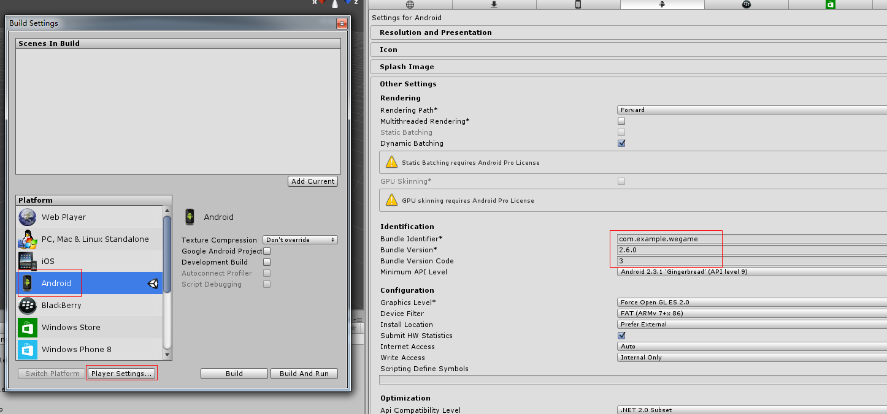

Access to MSDK(Android) for Unity3D
===

## Overview

MSDK for Unity3D is the C# encapsulation of MSDK interfaces made with the Unity3D engine. Games using this version of MSDK can directly call the MSDK interfaces in the C# layer, thus reducing operations related to the mobile phone platform.

The release package (zip) of MSDK(Android) for Unity mainly contains `MSDKUnityLibrary`, `MSDKUnitySample` and `MSDK_Android_Unity_xxx.unityPackage`, of which `MSDKUnitySample` is the Unity3D sample project calling the C# interfaces of MSD. Developers can refer to `Assets\MsdkDemo.cs` to learn the call of the MSDK interfaces. `MSDKUnityLibrary` is the eclipse Android library project which encapsulates the interfaces of MSDK. Games need to use the source codes of the project and make the corresponding modification on them, and then package them into jar for the use of Unity3D projects.
`MSDK_Android_Unity_xxx.unityPackage` is the Unity resource package of this version. As long as the game imports this package, it can access Android MSDK.

**Note: **
When you use MSDKUnitySample project to export APK, please use `debug.keystore` signature (password is Android) under `./Assets/Plugins/Android` directory; otherwise, WeChat authorization can not be launched. When exporting APK of the game project, please use the game’s own keystore.

## Access configuration

### Step1: Import MSDK

Open the game project in IDE of Unity3D, double-click `MSDK_Android_Unity_xxx.unityPackage` and select the required files to import, as shown below:


**Note: **
1. If there is the Android item in the game project, do not import `AndroidManifest.xml`; later, merge the content in `AndroidManifest_Need.xml` into androidmanifest.xml in the game’s **Plugins/Android** directory.
2. If the game uses Unity 5.0 or higher versions, it is needed to remove **MSDK_Android_R_xxx.jar** in libs folder.
3. If the game does not use APK package exported from Unity but uses packages exported eclipse and other similar environments, it is needed to remove **MSDK_Android_R_xxx.jar** in libs folder and only retain `adconfig.ini, channel.ini, msdkconfig.ini` in assets.

### Step2: Crash reporting configuration

#### Bugly configuration

MSDK’s jar package has completed the initialization of Bugly. In the initialization, the game needs to enable the C# layer’s Crash reporting, that is, add the following code:
```   
Bugly.EnableLog (true);
// Set C# stack log capture level, which is default for Exception and can select Assert and Error, etc.
Bugly.RegisterHandler (LogSeverity.Exception);
//If you have initialized SDK in Android or IOS project exported from Unity project, you only need to call this method to enable C# stack capture function
Bugly.EnableExceptionHandler();
```
**Note: **
If you use Unity4.6.1 to package files, there will be bug which native crash can not report! You need to use a version of Unity other than 4.6.1 (lower than or higher than this version) to make Apk packages.


### Step3: Modify BuildSettings and AndroidManifest

#### 3.1 Modify BuildSettings

In the IDE of Unity, click **File -> Build Settings** in turn, choose Android platform’s **Player Settings** as shown in the below figure, and set the game’s package name, version number, screen orientation and other properties in the Inspector panel..



#### 3.2 Modify AndroidManifest

Each game needs to individually modify AndroidManifest.xml in **Plugins/Android** directory, including the package name, appid, screen orientation, etc..


 Modify **package** as the game package name, and modify versionCode and versionName
```
<manifest
    xmlns:android="http://schemas.android.com/apk/res/android"
    package="com.example.wegame"
    android:theme="@android:style/Theme.NoTitleBar"
    android:versionCode="3"
    android:versionName="2.6.0"> 
    ......
```

Revise the value of label as game name, and screenOrientation should keep consistent with screen orientation **Defalult Orientation** in **Player Settings**, place game icon into **drawable** or **drawable-xxx** folder in **Plugins/Android/res/** directory and  fill in the game icon name in `android:icon`.
```
<application
    android:icon="@drawable/game icon"
    android:label="game name"
    android:theme="@style/AppTheme" >

    <activity
        android:name="com.tencent.msdk.u3d.U3DActivity"
        android:configChanges="orientation|keyboardHidden|screenLayout|screenSize"
        android:launchMode="singleTop"
        android:screenOrientation="landscape"
        android:label="game name">
        <intent-filter>
            <action android:name="android.intent.action.MAIN" />
            <category android:name="android.intent.category.LAUNCHER" />
        </intent-filter>
    </activity>
    ......
</application>
```

 Revise the value in `android:scheme` as the game’s WeChat appid.
```
<!-- TODO SDK access  WeChat access configuration START -->
<activity
    android:name=".wxapi.WXEntryActivity"
    android:excludeFromRecents="true"
    android:exported="true"
    android:label="WXEntryActivity"
    android:launchMode="singleTop"
    android:taskAffinity="com.example.wegame.diff" >
    <intent-filter>
        <action android:name="android.intent.action.VIEW" />
        <category android:name="android.intent.category.DEFAULT" />
        <data android:scheme="wxcde873f99466f74a" />
    </intent-filter>
</activity>
<!-- TODO SDK access  WeChat access configuration END -->
```

 Revise the value in `android:scheme` as "tencent+the game’s mobile QQ appid"
```
<!-- TODO SDK access  QQ access configuration START -->
<activity
    android:name="com.tencent.tauth.AuthActivity"
    android:launchMode="singleTask"
    android:noHistory="true" >
    <intent-filter>
        <action android:name="android.intent.action.VIEW" />
        <category android:name="android.intent.category.DEFAULT" />
        <category android:name="android.intent.category.BROWSABLE" />
        <data android:scheme="tencent100703379" />
    </intent-filter>
</activity>
......
<!-- TODO SDK access  QQ access configuration END -->
```

#### 3.3 Export the game’s Android project and import Eclipse

In the IDE of Unity, click **File -> Build Settings** in turn, check **Google Android Project**, and click **Export**, as shown in the below picture.


Open Eclipse IDE, and select **File -> Import** in turn.


On Import panel, select **Existing Android Code Into Workspace**, click **Next**, and then select the above imported Android project folder of the game, and click **Finish**. This way, the game’s Android project can be imported into Eclipse. Its structure is shown in the below figure. The game package name in the src folder should contain the java code marked in the figure.


**Note: **
When you access the functions of various modules, please read the corresponding access configuration contents in wiki and check whether the configuration of AndroidManifest.xml is correct.

### Step4: Import the encapsulated MSDK codes into Eclipse and modify them

#### 4.1 Copy the encapsulated source codes into Eclipse

Copy `com/example/wegame/wxapi/WXEntryActivity.java` file in `MSDKUnityLibrary/src` to  `package name +wxapi` location in src directory in the game’s Android project, and copy `com/tencent/msdk/u3d/U3DActivity.java` to src directory in the game’s Android project and keep the directory structure unchanged. At this time, the directory structure of the game’s Android project should look like the following picture:


#### 4.2 Modify the source codes

Because part of the information can not be gotten, it is needed to manually modify some of the encapsulated source codes.

Open WXEntryActivity.java to modify the package name of the package as the game’s package name:

```
package com.example.wegame.wxapi;
>>>
package the game’s package name.wxapi;
```

Open U3DActivity.java, fill the game’s qqAppId, wxAppId and other initialization information into onCreate:

```
protected void onCreate(Bundle savedInstanceState) {
    super.onCreate(savedInstanceState);
    ......
    //TODO Initialize SDK START 
    /***********************************************************
     *   GAME access documentation must be read. baseInfo value varies with game. When filling in the information, please note the following instructions:  *
     *  If the game fills in baseInfo value incorrectly, this can lead to failure in the sharing and login of QQ and WeChat. Remember this!!!        *
     *  For games only running in a single platform, please do not freely fill in the information of other platforms; otherwise, this can lead to failure in acquiring some announcements.  *
     ***********************************************************/
    MsdkBaseInfo baseInfo = new MsdkBaseInfo();
    baseInfo.qqAppId = "100703379";
    baseInfo.qqAppKey = "4578e54fb3a1bd18e0681bc1c734514e";
    baseInfo.wxAppId = "wxcde873f99466f74a";
    baseInfo.wxAppKey = "bc0994f30c0a12a9908e353cf05d4dea";
    //Note: offered must be filled in
    baseInfo.offerId = "100703379"; 
    ......
}
```

 Modify the package name of `UnityPlayerNativeActivity` of import of U3DActivity as the game’s package name:

```
import com.unity3d.player.UnityPlayerNativeActivity;
or
import com.example.wegame.UnityPlayerNativeActivity
>>>
import the game’s package name.UnityPlayerNativeActivity;
```

Secondly, in OnCrashExtMessageNotify in the next TODO tag SetMsdkObserver method, the game can customize the information used for reporting in case of Crash. The `OnCrashExtMessageNotify` interface can report additional game-customized info to the beacon when the game crashes.

```
	@Override
	public String OnCrashExtMessageNotify() {
	   // TODO START The game supplements additional information for reporting in case of Crash, for example:
	    Logger.d(String.format(Locale.CHINA,"OnCrashExtMessageNotify called"));
	    Date nowTime = new Date();
	    SimpleDateFormat time = new SimpleDateFormat("yyyy-MM-dd hh:mm:ss");
	    return "new Upload extra crashing message for rqd1.7.8 on " + time.format(nowTime);
	}
```

#### 4.3 Add the code to remove redundant instances

In the Android system, when the game interacts with other APP (such as mobile QQ, MyApp), this may give rise to a number of game instances, resulting in behavioral exceptions. Therefore, it is needed to modify UnityPlayerNativeActivity.java in the package name of the game to add a mechanism to remove redundant instances. The demo code added behind super.onCreate () in onCreat is shown as follows:

```
@Override
protected void onCreate (Bundle savedInstanceState)
{
	requestWindowFeature(Window.FEATURE_NO_TITLE);
	super.onCreate(savedInstanceState);

	// TODO Detect whether the game itself is repeated to avoid repeating launching the game’s instances
    if (WGPlatform.IsDifferentActivity(this)) {
        Logger.d("Warning!Reduplicate UnityPlayerNativeActivity was detected.");
        return;
    }
	......
}
```

To avoid killing the game when removing redundant instances, modify onDestroy as follows:

```
@Override
protected void onDestroy ()
{
    if (mUnityPlayer != null ) {
        Logger.d("Quit Unity");
        mUnityPlayer.quit();
    }
	super.onDestroy();
}
```

### Step5: Export the game’s Apk package

There are two ways to export the game’s Apk package. One is to directly export Apk package in the IDE of Unity, and the other is to export Apk package directly with Eclipse or similar Android environments. Next, you need to choose different operations according to the package export mode of the game.

####5.1 Export Apk package in Unity

To export the Apk package in Unity, you need to modify the source code into the jar package and place it into **Plugins/Android/libs** of the game’s Unity project.

Select src in the game Android project in Eclipse and export it into a jar package. The steps are as follows:


The jar package generated here is put into **Plugins/Android/libs** in the game Unity project.  Configure keystore and other related items in **Player Settings**. This can export Apk package in **Build Settings**.

#### 5.2 Export Apk package in Eclipse

If the game has deleted the redundant items according to the operations mentioned in Step 1, it can directly export APK package with the project; otherwise, it is needed to delete the imported redundant files in the game’s Android project.

## Call interface

In Unity3D, the parts associated with MSDK are placed under the Assets/Plugins/Msdk folder:


Among them, MSDK APIs are all encapsulated in the WGPlatform class, which includes the detailed descriptions of the interfaces. `MsdkDemo.cs` in "MSDKUnitySample" contains the call examples of MSDK for C# interfaces. The game developer can refer to such call examples of C# interfaces.


### Login and callback

Take QQ login for example to demonstrate how to call MSDK API and handle the callback:

    // Msdk namespace
    using Msdk;
    // WGPlatform class uses the single-case design
    WGPlatform.Instance.WGLoginQQ (); //log in QQ

Next, handle the login callback (in MsdkDemo, the login callback method is named OnLoginNotify)

    /// <summary>
    /// login callback
    /// </summary>
    /// <param name="jsonRet">Json ret.</param>
    void OnLoginNotify(string jsonRet)
    {       
        LoginRet ret = new LoginRet();
      //What is passed from the Java side is a json string message and first needs analysis
// if analysis succeeds, return true and assign values to the attributes of LoginRet
        bool succ = ret.ParseJson (jsonRet);
        if (succ == false) {
            loginState = "Login fails";
            return;
        }
        /*
         *  LoginRet.platform indicates platform id, possible values are ePlatform_QQ, ePlatform_Weixin, ePlatform_None.
         *     loginRet.platform represents the current authorization platform, the value type is ePlatform, and the potential value is ePlatform_QQ or ePlatform_Weixin
         *       loginRet.flag value indicates the return status, possible values (eFlag enumeration) are listed as follows:
         *       eFlag_Succ: return success; after the game receives the flag, it directly reads tokens in LoginRet structure to make the game authorization process.
         *       eFlag_QQ_NoAcessToken: mobile QQ authorization fails; after the game receives this flag, it will guide the user to re authorize (retry).
         *       eFlag_QQ_UserCancel: the user is in the authorization process
         *       eFlag_QQ_LoginFail: mobile QQ authorization fails; after the game receives this flag, it will guide the user to re authorize (retry).
         *       eFlag_QQ_NetworkErr: a network error occurs during the mobile QQ authorization process; after the game receives this flag, it will guide the user to re authorize (retry).
         *     loginRet.token is a List<TokenRet>, wherein the stored TokenRet has type and value; by traversing Vector, judge type to read the required token. type (TokenType) is defined as follows:
         *       eToken_QQ_Access,
         *       eToken_QQ_Pay,
         *       eToken_WX_Access,
         *       eToken_WX_Refresh
         */
        switch (ret.flag)
        {
            case CallbackFlag.eFlag_Succ:               
                // Login succeeds; read various tokens
                int platform= ret.platform;
                if(EPlatform.ePlatform_Weixin == platform)
                {
                    loginState = " WeChat Login succeeds";
                }else if(EPlatform.ePlatform_QQ == platform)
                {
                    loginState = "QQLogin succeeds";
                }else if(EPlatform.ePlatform_QQHall == platform)
                {
                    loginState = "Succeed to log in the Hall";
                }
                message = ret.ToString();
                break;
            case CallbackFlag.eFlag_WX_UserCancel:
                loginState = "Login fails";
                message = ret.desc;
                break;
            case CallbackFlag.eFlag_WX_NotInstall:
                loginState = "Login fails";
                message = ret.desc;
                break;
            case CallbackFlag.eFlag_WX_NotSupportApi:
                loginState = "Login fails";
                message = ret.desc;
                break;
            case CallbackFlag.eFlag_WX_LoginFail:
                loginState = "Login fails";
                message = ret.desc;
                break;
            case CallbackFlag.eFlag_Local_Invalid:
                // Automatic logon fails; it is needed to re-authorize, including the expiration of the local token, failure of refreshing and other errors
                loginState = "Automatic login fails";
                message = ret.desc;
                break;
            default:
                    break;
        }
    }

## Use description of MSDKUnitySample project

Click on **MSDKUnitySample\Assets\msdk.unity** can open MSDKUnitySample project. The following modifications are needed to package the Apk package of Sample.

1. MSDKUnitySample project only contains only Assets resources, so the scene binding has some problems; it is needed to manually bind **MsdkDemo.cs** script to **msdk.unity**.
2. If Unity used by the game has a version of 5.0 and higher, it is needed to remove **MSDK_Android_R_xxx.jar** in libs folder.
3. In Other Settings set by Android on Player Settings panel, modify the package name and version number, as shown below:
    
4. In Publishing Settings set by Android on Player Settings panel, configure the signature file keystore and select debug.keystore in `MSDKUnitySample/Assets/Plugins/Android` directory. Alias is androiddebugkey, and Password is Android, as shown in the below picture:
	

`MsdkDemo.cs` in "MSDKUnitySample" contains the call examples of MSDK for C# interfaces. The game developer can refer to such call examples of C# interfaces.
