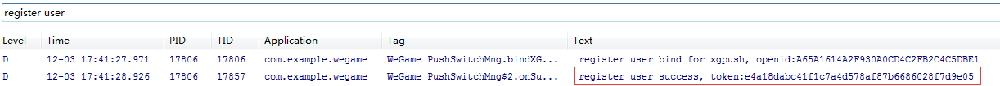

Access to the push function of SDK
======
From MSDK2.2a on, MSDK has begun to access the Pigeon push module. The push function can push game-related information to mobile phone users in the case that the game does not run.
Access configuration
------
Step 1: Set the configuration item

In assets/msdkconfig.ini, open the message push switch:

    PUSH=true //enable the message push

Step 2: Configure AndroidManifest.xml

In MSDK2.6.0a and earlier versions, please configure it as follows.

    <!-- 【Required】  The required permissions of Pigeon SDK -->
    <uses-permission android:name="android.permission.INTERNET" />
    <uses-permission android:name="android.permission.READ_PHONE_STATE" />
    <uses-permission android:name="android.permission.ACCESS_WIFI_STATE" />
    <uses-permission android:name="android.permission.ACCESS_NETWORK_STATE" />
    <uses-permission android:name="android.permission.RECEIVE_BOOT_COMPLETED" />
    <uses-permission android:name="android.permission.RESTART_PACKAGES" />
    <uses-permission android:name="android.permission.BROADCAST_STICKY" />
    <uses-permission android:name="android.permission.WRITE_SETTINGS" />
    <uses-permission android:name="android.permission.RECEIVE_USER_PRESENT" />
    <uses-permission android:name="android.permission.WRITE_EXTERNAL_STORAGE" />
    <uses-permission android:name="android.permission.WAKE_LOCK" />
    <uses-permission android:name="android.permission.KILL_BACKGROUND_PROCESSES" />
    <uses-permission android:name="android.permission.GET_TASKS" />
    <uses-permission android:name="android.permission.READ_LOGS" />
    <uses-permission android:name="android.permission.VIBRATE" />
    <!-- 【Optional】  The required permissions of Pigeon SDK -->
    <uses-permission android:name="android.permission.BLUETOOTH" />
    <uses-permission android:name="android.permission.BATTERY_STATS" />
    
    <!--  Pigeon configuration START -->
    <!-- 【Required】  Pigeon notice column -->
    <activity
        android:name="com.tencent.android.tpush.XGPushActivity"
        android:exported="true" >
        <intent-filter>
            <action android:name="" />
        </intent-filter>
    </activity>
    
    <!-- 【Required】  Pigeon receiver -->
    <receiver
        android:name="com.tencent.android.tpush.XGPushReceiver"
        android:process=":xg_service_v2" >
        <intent-filter android:priority="0x7fffffff" >
            <!-- 【Required】  Pigeon SDK’s internal broadcast -->
            <action android:name="com.tencent.android.tpush.action.SDK" />
            <action android:name="com.tencent.android.tpush.action.INTERNAL_PUSH_MESSAGE" />
        </intent-filter>
        <intent-filter android:priority="0x7fffffff" >
            <!-- 【Required】Broadcast system: spread and network switching -->
            <action android:name="android.intent.action.USER_PRESENT" />
            <action android:name="android.net.conn.CONNECTIVITY_CHANGE" />
        </intent-filter>
    </receiver> 
    
    <!-- 【Required】  Pigeon service -->
    <service
     android:name="com.tencent.android.tpush.service.XGPushService"
        android:exported="true"
        android:persistent="true"
        android:process=":xg_service_v2" />
    <!--  Pigeon configuration  END -->

Versions later than MSDK2.6.0a (such as MSDK2.6.1a and MSDK2.7.1a) also need to add the following configuration. `Note: Modify the package name.`

        <!-- 【Required】Notice service, which helps to improve the arrival rate -->
        <service
            android:name="com.tencent.android.tpush.rpc.XGRemoteService"
            android:exported="true" >
            <intent-filter>
               <!-- 【Required】Please modify it as the current APP package name.PUSH_ACTION-->
               <action android:name="com.example.wegame.PUSH_ACTION" />
           </intent-filter>
        </service>
        <!--  Pigeon configuration END -->

In addition, versions later than MSDK2.6.0a version has also made adjustments in the registration in XGPushActivity; games need to add a configuration item: android:theme="@android:style/Theme.NoDisplay".

    <!--  Pigeon configurationSTART -->
    <!-- 【Required】  Pigeon notice column -->
    <activity
        android:name="com.tencent.android.tpush.XGPushActivity"
        android:theme="@android:style/Theme.NoDisplay"
        android:exported="true" >
        <intent-filter>
            <action android:name="" />
        </intent-filter>
    </activity>

Step 3: Log in http://dev.ied.com/ and set the message push in the message management module. Please use ** message (formal environment) to send message **

** If you can't see the “Message Management” menu, please contact marsrabelma (Ma Teng) to add it. **

Joint debugging
------

1. After you configure the module according to the above steps, you can start the game to filter log. if the following log appears, this indicates that the registration is successfully. You can now push messages in the Eagle system.

2. After you log in the system successfully, if you see the following log, this indicates that binding the user is successfully and you can push the number package in the Eagle system

Solutions for applications which have accessed Pigeon
------
If the game had accessed the Pigeon push module, it can choose to retain its previous logic of access to Pigeon. At this time, importing MSDKLibrary may result in package conflicts,

i)	It is recommended that the game access Pigeon by the MSDK mode, delete the Pigeon SDK which it has accessed and push messages in the MSDK mode

ii)	It can also choose to delete the Pigeon SDK used by MSDK and completely use the old way to access Pigeon, where the preservation location of the Pigeon SDK is:

    MSDKLibrary\libs\armeabi\libtpnsSecurity.so
    MSDKLibrary\libs\armeabi-v7a\libtpnsSecurity.so
    MSDKLibrary\libs\mips\libtpnsSecurity.so
    MSDKLibrary\libs\x86\libtpnsSecurity.so 
    MSDKLibrary\libs\armeabi\Xg_sdk.jar

In addition, if it wants to delete these libs, the game is required to turn off the push function of MSDK. Operate this according the following step. Configure the message push switch in assets/msdkconfig.ini:

    PUSH=false

iii)	Delete Pigeon SDK downloaded from the official website of Pigeon but do not delete Pigeon SDK which is being used by MSDK (what MSDK2.2 uses is Xg_sdk_v2.341.jar), and verify if the old accessed Pigeon functions normally. If the game uses the functions of the old accessed Pigeon, it is recommended to close MSDK’s push switch

Precautions for the obfuscated code of Pigeon and MTA
------
Android app developers usually use Proguard tool to do code obfuscation. Because MTA’s external interfaces and NDK interfaces need to be public, it is necessary to keep the following code in obfuscation; otherwise, this may lead to function failures or exceptions.

    -keep public class * extends android.app.Service
    -keep public class * extends android.content.BroadcastReceiver
    -keep class com.tencent.android.tpush.**  {* ;}
    -keep class com.tencent.mid.**  {* ;}

Precautions for copying SO library
------
Games which can not use Android Library Project need to copy libs under MSDKLibrary. MSDK2.6.1a and later versions need to copy libtpnsWatchdog.so