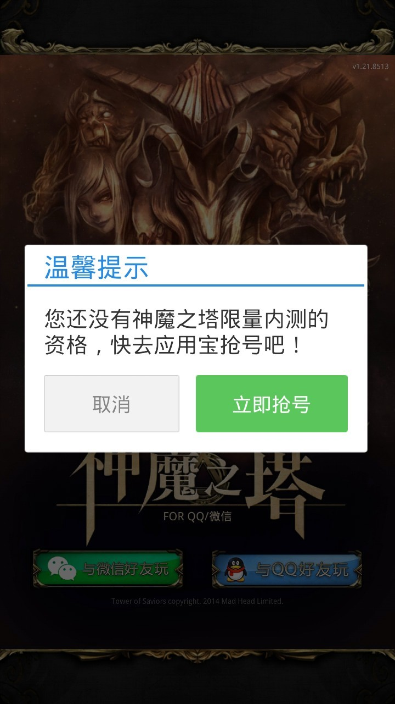
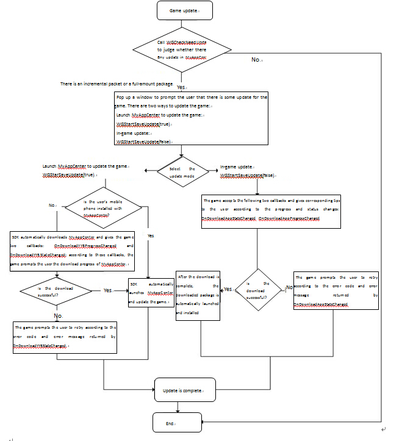
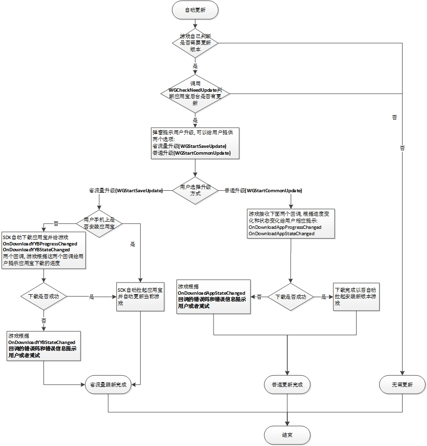

MSDK MyApp-related Module
==================

MSDK and MyApp team together provide number-grabbing and traffic-saving update functions for games before the open beta testing (OBT). This module mainly introduces the number-grabbing and traffic-saving update functions of MyApp

## Overview

- ** Since MSDK 2.7, MyApp traffic-saving update SDK has started to have substantial changes. For games which have accessed MSDK versions earlier than MSDK 2.7.0a, when they get access to the traffic-saving update module, please refer to the documentation: [Access to traffic-saving in versions earlier than MSDK2.7.0a] (myApp.md# Access to traffic-saving in versions earlier than MSDK2.7.0a). For games which have accessed MSDK2.7.0a and higher versions, they can access the traffic-saving update module according to steps given in the document. * *

- ** Starting from MSDK2.7.0a, MyApp no longer provides the full-amount update interface. When a game does not have the incremental package, it will automatically install MyApp with the full-amount package. **

- **Starting from MSDK2.7.0a, MyApp provides the interface to make incremental update within the game. Even if a game does not install MyApp, it can still complete incremental update through SDK. **

## Number-grabbing switch configuration

Two places are configured with the number-grabbing switches. First, configure the client number-grabbing switch in **assets/msdkconfig.ini**; secondly, it is needed to configure the number-grabbing switch in MyApp. If you want to open the number-grabbing function from the front end, you only need this configuration, shown as follows:

	; Function switch of MSDK’s optional modules
	;  MyApp number-grabbing switch
	BETA=true

## Steps for access to number-grabbing

- ** Step 1: ** Add Service declaration to the game's AndroidMenifest.xml

```
<service 
	android:name="com.tencent.tmassistantsdk.downloadservice.TMAssistantDownloadSDKService"
    android:exported="false"
    android:process=":TMAssistantDownloadSDKService" >
</service>
```

- ** Step 2: ** onResume and onDestroy of the game’s main Acitivity call MSDK’s corresponding methods, respectively

```
@Override
protected void onResume() {
    super.onResume();
    WGPlatform.onResume();
}
@Override
protected void onDestroy() {
    super.onDestroy();
    WGPlatform.onDestroy(this);
}
```

-  ** Step 3: ** Modify the number-grabbing document as the file path of the corresponding game name: **MSDKLibrary\res\values\com_tencent_tmassistant_sdk_strings.xml** Modification method: modify the following **TTFC ** into the corresponding game name.
	
```
<string name="white_list_dlg_body"> You do not have the qualification to have the limited OBT for TTFC. Go to MyApp to grab a number! </string>
```

After the platform is logged in, it returns to MSDK. MSDK will initiate the whitelist verification request. When the request returns, MSDK will notify the game through OnLoginNotify. If the user is in the white list, flag is eFlag_Succ. In this case, login is normal. If the user is not in the white list, flag is eFlag_NotInWhiteList. When returning the callback to the game, MSDK will pop out a box to guide the user to MyApp to grab a number at the same time.

**PS: Method of verifying the success of access to the number-grabbing function **
When any new QQ number or WeChat number is used to log in the game, if the following pop-out box is popped out, this indicates that the number-grabbing function of MyApp has been accessed:

<div align=center>  </div>

## Traffic-saving update switch configuration

The use of the update function needs to configure the switch `SAVE_UPDATE` in **assets/msdkconfig.ini** to decide whether to enable the module function. For example::
	
	; SAVE_UPDATE
	SAVE_UPDATE=true

####Notes:
- ** Since MSDK 2.7.0a, MyApp traffic-saving update SDK has started to have substantial changes. For games which have accessed MSDK versions earlier than MSDK 2.7.0a, when they get access to the traffic-saving update module, please refer to the documentation: [Access to traffic-saving in versions earlier than MSDK2.7.0a] (myApp.md# Access to traffic-saving in versions earlier than MSDK2.7.0a). **

## Traffic-saving update access configuration

Add traffic-saving update-related configuration in `AndroidManifest.xml`:

	<service
        android:name="com.tencent.tmdownloader.TMAssistantDownloadService"
        android:exported="false"
        android:process=":TMAssistantDownloadSDKService" >
    </service>

####Notes:
- ** Since MSDK 2.7.0a, MyApp traffic-saving update SDK has started to have substantial changes. For games which have accessed MSDK versions earlier than MSDK 2.7.0a, when they get access to the traffic-saving update module, please refer to the documentation: [Access to traffic-saving in versions earlier than MSDK2.7.0a] (myApp.md# Access to traffic-saving in versions earlier than MSDK2.7.0a). **

## Traffic-saving update access process

Use workflow of MyApp traffic-saving update:



There are the following steps for the use of MyApp traffic-saving update:

### Step 0: Switch configuration

Modify the corresponding configuration according to the above description of Wiki about [Traffic-saving update switch configuration](myApp.md#traffic-saving update switch configuration) and [Traffic-saving update access configuration](myApp.md# traffic-saving update access configuration)

### Step 1: In the life cycle of the game’s Activity, call the corresponding function of the MSDK life cycle

```
@Override
protected void onResume() {
    super.onResume();
    WGPlatform.onResume();
	……
}
@Override
protected void onDestroy() {
	super.onDestroy();
	WGPlatform.onDestory(this);
	……
}
```
### Step 2: Set the global callback object of MyApp traffic-saving update when initializing the module

- **Realize MyApp update callback class**

	The game realizes this by itself. The following is only for reference

	class SaveUpdateDemoObserver extends WGSaveUpdateObserver{
	    @Override
	    public void OnCheckNeedUpdateInfo(long newApkSize, String newFeature, long patchSize,
	            final int status, String updateDownloadUrl, final int updateMethod) {
	        Logger.d("called");
	        String statusDesc = "";
	        switch (status) {
	            case TMSelfUpdateUpdateInfo.STATUS_OK:
	                // Query update is successful
	                statusDesc = "Check success!";
	                break;
	            case TMSelfUpdateUpdateInfo.STATUS_CHECKUPDATE_RESPONSE_IS_NULL:
	                // Query response is empty
	                statusDesc = "Response is null!";
	                break;
	            case TMSelfUpdateUpdateInfo.STATUS_CHECKUPDATE_FAILURE:
	                // Query update fails
	                statusDesc = "CheckNeedUpdate FAILURE!";
	                break;
	        }
	        if(status == TMSelfUpdateUpdateInfo.STATUS_OK) {
		        switch(updateMethod) {
		        	case TMSelfUpdateUpdateInfo.UpdateMethod_NoUpdate:
		        		// No update package
		        		statusDesc += "But no update package.";
		        		break;
		        	case TMSelfUpdateUpdateInfo.UpdateMethod_Normal:
		        		// Have full-amount update package
		        		statusDesc += "Common package is available.";
		        		break;
		        	case TMSelfUpdateUpdateInfo.UpdateMethod_ByPatch:
		        		// Have traffic-saving update package
		        		statusDesc += "Save update package is available.";
		        		break;
		        	default :
		        	    statusDesc += "Happen error!";
		        	    break;
		        }
	        }
	        Logger.d(statusDesc);
	        MsdkCallback.sendResult(statusDesc);
	    }
	
	    @Override
	    public void OnDownloadAppProgressChanged(final long receiveDataLen, final long totalDataLen) {
	    	// The progress of downloading the game is called back from here. The game can display the progress table according to the callback parameters
	        Logger.d("totalData:" + totalDataLen + "receiveData:" + receiveDataLen);
	        MsdkCallback.mainActivity.runOnUiThread(new Runnable() {
	
				@Override
				public void run() {
					MainActivity.mProgressDialog.setMax((int)(totalDataLen/1024));
		            MainActivity.mProgressDialog.setProgress((int)(receiveDataLen/1024));
				}
	        });
	    }
	
	    @Override
	    public void OnDownloadAppStateChanged(int state, int errorCode, String errorMsg) {
	        // The download status is called back from here.
	        String result = "";
	        switch (state) {
	            case TMAssistantDownloadTaskState.DownloadSDKTaskState_SUCCEED:
	                //The game download task within MyApp is completed. Update is completed. And the game continues
	                result = "state: succeed";
	            case TMAssistantDownloadTaskState.DownloadSDKTaskState_DOWNLOADING:
	                // The game in MyApp is being downloaded. The game prompts to wait for the animation or combine OnDownloadAppProgressChanged to show the download progress
	                result = "state: downloading";
	                break;
	            case TMAssistantDownloadTaskState.DownloadSDKTaskState_WAITING:
	                // The game download task in MyApp is waiting to perform. Prompt the user to wait
	                result = "state: waiting";
	                break;
	            case TMAssistantDownloadTaskState.DownloadSDKTaskState_PAUSED:
	                result = "state: paused";
	                break;
	            case TMAssistantDownloadTaskState.DownloadSDKTaskState_FAILED:
	                // Detailed error codes are placed in errorCode. The error codes are defined in the attribute beginning with DownloadSDKErrorCode in TMAssistantDownloadSDKErrorCode.
	                result = "state: failed";
	                break;
	            case TMAssistantDownloadTaskState.DownloadSDKTaskState_DELETE:
	                result = "state: delete";
	                break;
	            default :
	                result = "state: " + state;
	        } 
	        result += "\nerrorCode:" + errorCode + "\nerrorMsg:" + errorMsg; 
	        Logger.d(result);
	        if(state != TMAssistantDownloadTaskState.DownloadSDKTaskState_DOWNLOADING &&
	                state != TMAssistantDownloadTaskState.DownloadSDKTaskState_WAITING &&
	                state != TMAssistantDownloadTaskState.DownloadSDKTaskState_PAUSED)
	            if (MainActivity.mProgressDialog != null && MainActivity.mProgressDialog.isShowing())
	                MainActivity.mProgressDialog.dismiss();
	            MsdkCallback.sendResult(result);
	    }
	    
	    /**
	     * Traffic-saving update (WGStartSaveUpdate); when MyApp is not installed, first download MyApp. This is the progress callback of downloading MyApp package
	     * @param url: Current task’s url
	     * @param receiveDataLen: The length of the received data
	     * @param totalDataLen: The length of the data which need to be all received (if the total length of the target file is unable to obtain, the parameter return -1)
	     */
	    @Override
	    public void OnDownloadYYBProgressChanged(String url, final long receiveDataLen, final long totalDataLen) {
	    	// The progress of downloading MyApp is called back from here. The game can display the progress table according to the callback parameters
	    	Logger.d("totalData:" + totalDataLen + "receiveData:" + receiveDataLen);
	    }
	    
	    /**
	     * @param url: specified task’s URL
	     * @param state: download status; value: TMAssistantDownloadSDKTaskState.DownloadSDKTaskState_*
	     * @param errorCode: error code
	     * @param errorMsg: error description; it may be null
	     */
	    @Override
	    public void OnDownloadYYBStateChanged(final String url, final int state, final int errorCode, final String errorMsg) {
	         Logger.d("called");
	         String result = "OnDownloadYYBStateChanged " + "\nstate:" + state + 
	         		"\nerrorCode:" + errorCode + "\nerrorMsg:" + errorMsg; 
	         Logger.d(result);
	         MsdkCallback.sendResult(result);
	    }
	}

- **Callback configuration**
	
	After the game initializes MSDK, when it sets the callback, it adds settings for the callback of MyApp traffic-saving update

		// MyApp update callback class, which the game realizes on its own
		WGPlatform.WGSetSaveUpdateObserver(new SaveUpdateDemoObserver()); 

### Step 3: Call interface to check if there are any updates, and handle updates according to the callback.

## Traffic-saving update interface specification

### Detect if MyApp is installed.

Call `WGCheckYYBInstalled` interface to detect if MyApp is installed. The interface is described in detail as follows:

#### Interface declaration:

	/**
     * @return  return value is TMYYBInstallState(defined in WGPublicDefine.h)
     */
    int WGCheckYYBInstalled();

#### Call interface:

	ret = WGPlatform.WGCheckYYBInstalled();
    if (ret == 0) {
        return " MyApp has been installed";
    } else if (ret == 1) {
        return " MyApp has not been installed";
    } else {
        return "Install the low version of MyApp";
    }

####Notes:
- ** Since MSDK 2.7.0a, MyApp traffic-saving update SDK has started to have substantial changes. For games which have accessed MSDK versions earlier than MSDK 2.7.0a, when they get access to the traffic-saving update module, please refer to the documentation: [Access to traffic-saving in versions earlier than MSDK2.7.0a] (myApp.md# Access to traffic-saving in versions earlier than MSDK2.7.0a). **

### Detect if there are any updates

Call `WGCheckNeedUpdate` interface to query whether the current application is updated. The query result is called back to `OnCheckNeedUpdateInfo` method of the callback object set by `WGSetSaveUpdateObserver` interface. The interface is described in detail as follows:

#### Interface declaration:

	/**
     * @return void
     * 	The query result is called back to `OnCheckNeedUpdateInfo` method of the callback object set by `WGSetSaveUpdateObserver` interface
     */
    void WGCheckNeedUpdate();

#### Call interface:

	WGPlatform.WGCheckNeedUpdate();

####Notes:
- ** Since MSDK 2.7.0a, MyApp traffic-saving update SDK has started to have substantial changes. For games which have accessed MSDK versions earlier than MSDK 2.7.0a, when they get access to the traffic-saving update module, please refer to the documentation: [Access to traffic-saving in versions earlier than MSDK2.7.0a] (myApp.md# Access to traffic-saving in versions earlier than MSDK2.7.0a). **

### Begin traffic-saving update

Call the `WGStartSaveUpdate` interface to start traffic-saving update. If the phone does not install MyApp, this interface can automatically download MyApp and call relevant data back to the game through `OnDownloadYYBProgressChanged` and `OnDownloadYYBStateChanged` interfaces, respectively. If the phone has installed MyApp, this interface can choose whether to launch MyApp download according to the parameters. The download progress and state change are called back to the game through `OnDownloadAppProgressChanged` and `OnDownloadAppStateChanged`. The interface is described in detail as follows:

#### Interface declaration:

	/**

     * This interface can choose whether to launch MyApp update according to the parameters. The download progress and state change of the application can be called back to the game through `OnDownloadAppProgressChanged` and `OnDownloadAppStateChanged`.
 	 * When isUseYYB is true. If the phone does not install MyApp, this interface can automatically download MyApp and call relevant data back to the game through `OnDownloadYYBProgressChanged` and `OnDownloadYYBStateChanged` interfaces, respectively.
	 * @para  isUseYYB: whether to launch MyApp update the game? If no, directly update MyApp within the game
     */
    void WGStartSaveUpdate(bool isUseYYB);

#### Call interface:

	WGPlatform.WGStartSaveUpdate(true);

####Notes:
- **Since MSDK 2.7.0a, MyApp traffic-saving update SDK has started to have substantial changes. For games which have accessed MSDK versions earlier than MSDK 2.7.0a, when they get access to the traffic-saving update module, please refer to the documentation: [Access to traffic-saving in versions earlier than MSDK2.7.0a] (myApp.md# Access to traffic-saving in versions earlier than MSDK2.7.0a).**

## Access to the traffic-saving update module in MSDK versions earlier than 2.7.0a

### traffic-saving update  switch configuration 

If you want to use the update feature, you need to configure switch `SAVE_UPDATE` in **assets/msdkconfig.ini**, such as:
	
	; SAVE_UPDATE
	SAVE_UPDATE=true

###   traffic-saving update  access configuration 

Configure `AndroidManifest.xml`
	
	<service 
		android:name="com.tencent.tmassistantsdk.downloadservice.TMAssistantDownloadSDKService"
        android:exported="false"
        android:process=":TMAssistantDownloadSDKService" >
    </service>

There are two ways to update the game through MyApp SDK:

- General update: directly download update package from the MyApp backend in the game.
- Traffic-saving update is also called incremental update. This update mode requires the MyApp client. Traffic-saving update is to only offer the user the updated part through file contrast, thus reducing the size of the update package and improving the success rate of update.

The flow chart for the game to access MyApp traffic-saving update is as follows:



### Debugging of traffic-saving update

There are the following steps to use MyApp traffic-saving update:

- Step 1: Selling points of the life cycle of the game’s Activity

```
@Override
protected void onResume() {
    super.onResume();
    WGPlatform.onResume();
}
@Override
protected void onDestroy() {
	super.onDestroy();
	WGPlatform.onDestory(this);
}
```

- Step 2: Set the global callback object of MyApp traffic-saving update in the initialization. As for the detailed description of callback involved, please see: **MSDKLibrary/jni/CommonFiles/WGSaveUpdateObserver.h**.

 MyApp update callback class, which the game realizes on its own


    WGPlatform.WGSetSaveUpdateObserver(new SaveUpdateDemoObserver()); 

    class SaveUpdateDemoObserver extends WGSaveUpdateObserver{
        @Override
        public void OnCheckNeedUpdateInfo(long newApkSize, String newFeature, long patchSize,
                final int status, String updateDownloadUrl, final int updateMethod) {
            Logger.d("called");
            String statusDesc = "";
            switch (status) {
                case TMSelfUpdateSDKUpdateInfo.STATUS_OK:
                    // Query update is successful
                    statusDesc = "Check success!";
                    break;
                case TMSelfUpdateSDKUpdateInfo.STATUS_CHECKUPDATE_RESPONSE_IS_NULL:
                    // Query response is empty
                    statusDesc = "Response is null!";
                    break;
                case TMSelfUpdateSDKUpdateInfo.STATUS_CHECKUPDATE_FAILURE:
                    // Query update fails
                    statusDesc = "CheckNeedUpdate FAILURE!";
                    break;
            }
            if(status == TMSelfUpdateSDKUpdateInfo.STATUS_OK) {
                switch(updateMethod) {
                    case TMSelfUpdateSDKUpdateInfo.UpdateMethod_NoUpdate:
                        // No update package
                        statusDesc += "But no update package.";
                        break;
                    case TMSelfUpdateSDKUpdateInfo.UpdateMethod_Normal:
                        // have full-amount update package
                        // WGPlatform.WGStartCommonUpdate(); //update the game
                        statusDesc += "Common package is available.";
                        break;
                    case TMSelfUpdateSDKUpdateInfo.UpdateMethod_ByPatch:
                        // have traffic-saving update package
                        // WGPlatform.WGStartSaveUpdate(); //update the game
                        statusDesc += "Save update package is available.";
                        break;
                    default :
                        statusDesc += "Happen error!";
                        break;
                }
            }
            Logger.d(statusDesc);
            MsdkCallback.sendResult(statusDesc);
        }

        @Override
        public void OnDownloadAppProgressChanged(final long receiveDataLen, final long totalDataLen) {
            // The progress of downloading the game is called back from here. The game can display the progress table according to the callback parameters
            Logger.d("totalData:" + totalDataLen + "receiveData:" + receiveDataLen);
        }

        @Override
        public void OnDownloadAppStateChanged(int state, int errorCode, String errorMsg) {
            // The download status is called back from here.
            switch (state) {
                    case TMAssistantDownloadSDKTaskState.DownloadSDKTaskState_SUCCEED:
                        // The game download task within MyApp is completed. Update is completed. And the game continues
                    case TMAssistantDownloadSDKTaskState.DownloadSDKTaskState_DOWNLOADING:
                        //The game in MyApp is being downloaded. The game prompts to wait for the animation or combine OnDownloadAppProgressChanged to show the download progress
                        break;
                    case TMAssistantDownloadSDKTaskState.DownloadSDKTaskState_WAITING:
                        // The game download task in MyApp is waiting to perform. Prompt the user to wait
                        break;
                    case TMAssistantDownloadSDKTaskState.DownloadSDKTaskState_PAUSED:
                        break;
                    case TMAssistantDownloadSDKTaskState.DownloadSDKTaskState_FAILED:
                        // Detailed error codes are placed in errorCode. The error codes are defined in the attribute beginning with DownloadSDKErrorCode in TMAssistantDownloadSDKErrorCode
                        break;
                    case TMAssistantDownloadSDKTaskState.DownloadSDKTaskState_DELETE:
                        break;
            } 
            Logger.d(String.format("%d, %d, %s", state, errorCode, errorMsg));
        }
        
        /**
         * Traffic-saving update (WGStartSaveUpdate); when MyApp is not installed, first download MyApp. This is the progress callback of downloading MyApp package
         * @param url: Current task’s url
         * @param receiveDataLen: The length of the received data
         * @param totalDataLen: The length of the data which need to be all received (if the total length of the target file is unable to obtain, the parameter return -1)
         */
        @Override
        public void OnDownloadYYBProgressChanged(String url, final long receiveDataLen, final long totalDataLen) {
            // The progress of downloading MyApp is called back from here. The game can display the progress table according to the callback parameters
            Logger.d("totalData:" + totalDataLen + "receiveData:" + receiveDataLen);
        }
        
        /**
         * @param url: specified task’s URL
         * @param state: download status; value: TMAssistantDownloadSDKTaskState.DownloadSDKTaskState_*
         * @param errorCode: error code
         * @param errorMsg: error description; it may be null
         */
        @Override
        public void OnDownloadYYBStateChanged(final String url, final int state, final int errorCode, final String errorMsg) {
             Logger.d("OnDownloadYYBStateChanged " + "\nstate:" + state + 
                    "\nerrorCode:" + errorCode + "\nerrorMsg:" + errorMsg);
        }
    }


- Step 3: Call `WGCheckNeedUpdate`, and choose the available update mode according to `updateMethod` in callback `OnCheckNeedUpdateInfo`. The interfaces are as follows:

	/**
	 * @param saveUpdateObserver: global callback of traffic-saving update;  all update-associated callbacks are called back through this object
	 */
	void WGSetSaveUpdateObserver(WGSaveUpdateObserver * saveUpdateObserver);
	
	/**
	 * @return void
	 *  The query result is called back to `OnCheckNeedUpdateInfo` method of the callback object set by `WGSetSaveUpdateObserver` interface
	 */
	void WGCheckNeedUpdate()
	
	/**
	 * Start the general update; this type of update does not rely on MyApp client. The download progress and state change are called back to the game through OnDownloadAppProgressChanged and OnDownloadAppStateChanged
	 */
	void WGStartCommonUpdate();
	
	/**
* If the phone does not install MyApp, this interface can automatically download MyApp and call relevant data back to the game through `OnDownloadYYBProgressChanged` and `OnDownloadYYBStateChanged` interfaces, respectively. 
* If the phone has installed MyApp, this interface can launch MyApp download. The download progress and state change are called back to the game through `OnDownloadAppProgressChanged` and `OnDownloadAppStateChanged`.
	 */
	void WGStartSaveUpdate()
	
