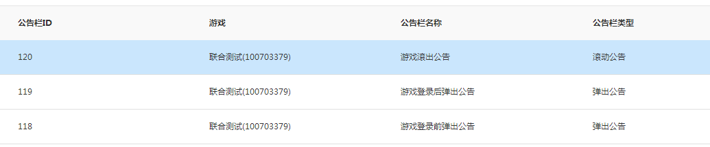

MSDK Announcement Module
===

Introduction of the modul
---

### Overview 
The announcement system is the in-game information notification system provided by SDK. Through web-based visualized operations, it can inform the public of activities, region data and other information, effectively improving the coverage rate of information. It can now provide the game with the following: 

- Send different announcements or notices under different scenarios (for example: pre-login announcement, post-login announcement) 
- Multiple user range selection: full announcement, regional operating system, specified number (WeChat number, WeChat number) 
- A variety of announcement forms: pop-up announcement, scroll announcement - Rich announcement contents: text, image, web page, etc.

### Terminology| Term | Description |
| ------------- |:-------------:|
|Announcement column | SDK announcement module marks announcement fields at different locations. The game will choose one field from the fields when it configures the announcement. It is scene parameter when the client calls the announcement display interface |
|Pop-out announcement | Display an announcement in the pop-up form, and support text, image and web forms. In case of multiple announcements to display, the next announcement will pop up after the user closes the current announcement.   Pop-out announcement can add a hoplink (skip link). Click on the hoplink can open the corresponding link with the built-in Webview |
| Scroll announcement | Display an announcement on the top of the game screen in the scroll form. Currently, it only supports text. When a number of announcements need to display, they will be pieced together to display in scroll |

## Notes on access (important, must-see for access) 

- The announcement module will go to the backend of the system to draw the effective announcement of the APP after SDK is initialized and the player logs in the system. In addition, the announcement module also has a timed draw mechanism (draw once every 10 minutes by default)
- When an app calls the announcement display interface and announcement data acquisition interface, it obtains the currently active announcements of the app from the local database. It is proposed that the game should directly use the announcement UI carried by SDK itself to reduce the access cost of the game. 
- ** This function is provided in versions later than MSDK 1.7.0a. Announcements are divided into two forms: scroll announcements and pop-out announcement s. ** Starting from MSDK 2.0.0a, the content forms of the announcement have increased from only the text form to three forms: text, image and webpage.
- ** `SDK uses announcement columns to distinguish announcements displayed at different locations. For example, the common pre-login announcement and post-login announcement correspond to different announcement columns in SDK announcement module`**

Recommended usage
---

### Scheme overview 

This section will provide a recommended scheme for the game to access SDK announcement module. The following content simulates the process that a game accesses SDK announcement module:

- Access pop-out announcements at several locations before login and after login and a scroll announcement at any location in the game.
- The game uses the UI style provided by SDK announcement module

 ### Access process 

1. In the SDK announcement management side [http://dev.ied.com/](http://dev.ied.com/), add the game’s corresponding announcement columns. The following picture shows information about the corresponding demo announcement columns of SDK:

	

- Access to the client:

	1. In `AndroidMainfest` and `assets/msdkconfig.ini`, add the relevant configuration of MSDK announcement, and add a module of viewing documents on the page [access configuration] (notice.md# Access configuration) and [switch configuration] (notice.md# Switch configuration).

	- Call of announcements on the client (only for reference):
		- At the end of the game’s initialization, when the user stays in the login page, the page will display the pre-login announcement. Use the announcement display interface [announcement display interface] (notice.md# announcement display interface) and the corresponding announcement column ID as the parameter to display the pre-login announcement
		- When the game receives the success callback from loginNotify and enters its main page, the post-login announcement will be displayed. Use the announcement display interface [announcement display interface] (notice.md# announcement display interface) and the corresponding announcement column ID as the parameter to display the post-login announcement
		- The game calls the interface to display a scroll announcement at the location where it wants to display the scroll announcement (such as the game main page after login, etc.). Use the announcement display interface [announcement display interface] (notice.md# announcement display interface) and the corresponding announcement column ID as the parameter. After the game begins to display a scroll announcement, it generally sets a timer so as to hide the scroll announcement when the specified time period is used up.
		
### Joint debugging and testing

1. Confirm that the domain name set by the client `assets/msdkconfig.ini` is `http://msdktest.qq.com`
2. The product staff select announcements (test environment) and add announcements in the announcement management section [http://dev.ied.com/] (http://dev.ied.com/)
3. The client displays announcements according to the announcement types set by the products (pre-login, post-login, scroll or popup announcements, etc). If an announcement cannot be displayed, please click [Check steps for game announcements which cannot be normally displayed] (notice.md# Check steps for game announcements which cannot be normally displayed) and check it in accordance with the steps.

Access configuration
---
#### Announcement Initialization:
	
The announcement module does not need to be initialized alone. What needs to do is to complete the initialization of MSDK. ** If the game only accesses mobile QQ or WeChat, please only set the corresponding platform’s appid in the initialization (onCreate) and do not freely fill in the rest platforms’ appid; otherwise, this can lead to failure in drawing the pre-login announcement of the game. 

**#### Configuration of announcement AndroidMainfest: 

This section is mainly to set permissions related to the announcement UI of MSDK.

	<!-- TODO Notice  Announcement configuration  START -->
    <!--  MSDK Pop-out announcement-related configuration  -->
   	<activity
       	android:name="com.tencent.msdk.notice.AlertMsgActivity"
       	android:configChanges="orientation|screenSize|keyboardHidden"       	android:screenOrientation="sensor"
       	android:theme="@style/NoticeAlertTheme" >    </activity>
	<!--  MSDK Scroll announcement-related configuration  -->
    <service android:name="com.tencent.msdk.notice.RollFloatService" >
    </service>
    <!-- TODO Notice  Announcement configuration  END -->

**Note: The game can set the screen orientation of the announcement activity (android:screenOrientation's value) in accordance with the orientation of the screen. 

**Switch configuration
--- 
MSDK provides switches for game to control whether to enable MSDK announcement and control the timed draw time-frequency of announcements.
#### Whether to enable announcement
	
The announcement module is turned off by default. Games which need to use the announcement module need to set the value of needNotice to true in assets/msdkconfig.ini. 
#### Set the timed draw time of announcements 

The default automatic draw time of the announcement module is ten minutes. Games can set the value of needNotice to the corresponding time in assets/msdkconfig.ini according to their needs. ** (the shortest draw time which the game can set is 5 minutes) **

## Announcement display interface 
Call WGShowNotice to use a set of UI configured by MSDK to display the current valid announcement. For pop-out announcements, you can set whether they can carry a hoplink. For announcements with a hoplink, click on Details can launch MSDK’s built-in WebView to open the URL of the corresponding content. 

#### Interface declaration:
	
	/**
	 * Display the corresponding type of announcements under the specified announcement column
	 * @param scene: announcement column ID; can not be empty; the parameter corresponds with the "announcement column" setting made in the announcement management side
	 */

  	void WGShowNotice(unsigned char *scene); 
#### Call interface:

	String sceneString = "1";	WGPlatform.WGShowNotice(sceneString);	

#### Notes: 
1. When calling the interface, the announcement column id (scene) used corresponds with **”announcement column” ID set by the announcement management side. Don’t use the announcement ID (msgid) to replace announcement column ID**
2. Starting from 2.4.0, MSDK has begun to adjust the interface. Games accessing versions earlier than 2.4.0 can refer to the following interface documentation:

	
### The original announcement display interface (the interface has been abandoned from 2.4.0 onwards but is changed to [Announcement display interface] (notice.md# Announcement display interface)) 

Call WGShowNotice to use a set of UI configured by MSDK to display the current valid announcement. For pop-out announcements, you can set whether they can carry a hoplink. For announcements with a hoplink, click on Details can launch MSDK’s built-in WebView to open the URL of the corresponding content. 
#### Interface declaration:	
	/**
	 * Display the corresponding type of announcements under the specified announcement column
	 * @param type   type of the to-be-displayed announcement	 * 	  eMSG_NOTICETYPE_ALERT: pop-out announcement	 * 	  eMSG_NOTICETYPE_SCROLL: scroll announcement	 * 	  eMSG_NOTICETYPE_ALL: pop-out announcement && scroll announcement 	 * @param scene  announcement column ID; can not be empty; the parameter corresponds with the “announcement column” setting made in the announcement management side	 */

  	void WGShowNotice(eMSG_NOTICETYPE type, unsigned char *scene); #### Call interface：

	eMSG_NOTICETYPE noticeTypeID = eMSG_NOTICETYPE.eMSG_NOTICETYPE_ALERT;
	String sceneString = "1";
	WGPlatform.WGShowNotice(noticeTypeID, sceneString);	
#### Notes:
When calling the interface, the announcement column id (scene) used corresponds with **”announcement column” ID set by the announcement management side. Don’t use the announcement ID (msgid) to replace announcement column ID**  Hide scroll announcement interface --- Calling WGHideScrollNotice can hide the displaying scroll announcement. #### Interface declaration:

	/**
	 * Hide the displaying scroll announcement	 */

	 void WGHideScrollNotice();

#### Call interface:：

	WGPlatform.WGHideScrollNotice();## Announcement data acquisition interface

Calling WGGetNoticeData can return a list of currently valid announcement data of specified types.

#### Interface declaration:

	/**
	 * From the local database, read the specified type of currently valid announcements under the specified scene
	 * @param sence: the parameter corresponds with the “announcement column” setting made in the announcement management side
	 * @return NoticeInfo array; NoticeInfo structure is as follows:
		typedef struct
		{
			std::string msg_id;			// announcement id
			std::string open_id;		//the user’s open_id
			std::string msg_url;		// the announcement’s hoplink
			eMSG_NOTICETYPE msg_type;	// announcement type, eMSG_NOTICETYPE
			std::string msg_scene;		// announcement column used for the announcement display, the management backend configuration
			std::string start_time;		// valid start time of the announcement
			std::string end_time;		// valid end time of the announcement
			eMSG_CONTENTTYPE content_type;	// announcement content and type, eMSG_CONTENTTYPE

			//webpage announcement’s special field
			std::string content_url;     //webpage announcement URL
			//image announcement’s special field
			std::vector<PicInfo> picArray;    //image array
			//text announcement’s special field
			std::string msg_title;		// announcement title
			std::string msg_content;	// announcement content
			}NoticeInfo;
	 */
		 
	 std::vector<NoticeInfo> WGGetNoticeData(unsigned char *scene);

#### Call interface:
	
	String sceneString = "1";
	Vector<NoticeInfo> noticeInfos = new Vector<NoticeInfo>();
    noticeInfos = WGPlatform.WGGetNoticeData(sceneString);

#### Notes:
1. When calling the interface, the announcement column id (scene) used corresponds with **”announcement column” ID set by the announcement management side. Don’t use the announcement ID (msgid) to replace announcement column ID**
2. Starting from 2.4.0, MSDK has begun to adjust the interface. Games accessing versions earlier than 2.4.0 can refer to the following interface documentation:

### The original announcement acquisition interface (the interface has been abandoned from 2.4.0 onwards but is changed to [Announcement acquisition interface] (notice.md# Announcement acquisition interface)) Calling WGGetNoticeData can return a list of currently valid announcement data of specified types.#### Interface declaration:：

	/**
	 * From the local database, read the specified type of currently valid announcements under the specified scene  	 * @param type: type of the to-be-displayed announcement. The type is eMSG_NOTICETYPE, and specific value is as follows:
	 * 	  eMSG_NOTICETYPE_ALERT: pop-out announcement  	 * 	  eMSG_NOTICETYPE_SCROLL: scroll announcement  	 * @param sence the parameter corresponds with the “announcement column” setting made in the announcement management side 	 * @return NoticeInfo array; NoticeInfo structure is as follows: 		typedef struct 		{ 			std::string msg_id;			// announcement id 			std::string open_id;		//the user’s open_id 			std::string msg_url;		// the announcement’s hoplink 			eMSG_NOTICETYPE msg_type;	// announcement type, eMSG_NOTICETYPE 			std::string msg_scene;		// announcement column used for the announcement display, the management backend configuration 			std::string start_time;		// valid start time of the announcement 			std::string end_time;		// valid end time of the announcement 			eMSG_CONTENTTYPE content_type;	// announcement content and type, eMSG_CONTENTTYPE
 			//webpage announcement’s special field
			std::string content_url;     //webpage announcement URL 			//image announcement’s special field 			std::vector<PicInfo> picArray;    //image array 			//text announcement’s special field 			std::string msg_title;		// announcement title 			std::string msg_content;	// announcement content 			}NoticeInfo; 	 */ 		  	 std::vector<NoticeInfo> WGGetNoticeData(eMSG_NOTICETYPE type,unsigned char *scene);
 #### Call interface: 	
	eMSG_NOTICETYPE noticeTypeID = eMSG_NOTICETYPE.eMSG_NOTICETYPE_ALERT;
	String sceneString = "1"; 	Vector<NoticeInfo> noticeInfos = new Vector<NoticeInfo>();
    noticeInfos = WGPlatform.WGGetNoticeData(noticeTypeID, sceneString);    
#### Notes: When calling the interface, the announcement column id (scene) used corresponds with **”announcement column” ID set by the announcement management side. Don’t use the announcement ID (msgid) to replace announcement column ID**        Check steps for game announcements which cannot be normally displayed---1. Can the announcement module be enabled?：

	**Check if the value of needNotice in assets/msdkconfig.ini in the game is true. If not, change it to true and then debug again; if yes, continue to check. ** Check method:

	- Check the MSDK log. If the following line of log exists, this indicates that the announcement module is closed:：
	
			WeGame NoticeManager.init	 notice module is closed!  	If the following line of log exists, this indicates that the announcement module is open:  			WeGame NoticeManager.init	 notice module init start!	- Decompile the game package, find msdkconfig.ini file in assets directory, check whether needNotice is configured, and confirm whether the value of needNotice is true.

- Check whether there are valid contents in the called interfaces:

	** Check MSDK logs and check whether there are announcements in the logs of the call interfaces. If it is not 0, contact MSDK’s related development staff to validate; if it is 0, continue to check. ** Check method:

	Log in MSDK seen ** noticeVector size ** values:

		WeGame NoticeDBModel.getNoticeRecordBySceneAndType	 query result:0
		WeGame NoticeManager.getNoticeFromDBBySceneAndType	 noticeVector size:0- Check if appid of the gotten announcement is correct:：

	** Check MSDK logs and check if appid of the gotten announcement is correct. The appid of the pre-login announcement is the combination of mobile QQ and WeChat appid, and the appid of the post-login announcement is the appid of the corresponding platform. If they are incorrect, please retry after modifying the initialization place. If correct, please continue to check. ** Check method:

	In MSDK log, check the value of appid when calling ** NoticeManager.getNoticeInfo **; and compare it with the dev backend and the timing of requesting announcement (if logging in) to see if it is correct ** Especially, it is commonly seen that games which only access a single platform freely fill in the information of the remaining platforms, resulting in failure to obtain announcements **:：

		WeGame NoticeManager.getNoticeInfo	 appid: 100703379|wxcde873f99466f74a;openid:		WeGame NoticeManager.getNoticeInfo	 Notice Model:mat_id may be null:860463020910104;mMatId:860463020910104 - Check if the announcement is issued from the management segment to the client:

	**Clear the game’s local data, then restart the game, and then view MSDK logs and see if the announcement list issued by the backend contains the configured announcement. If not, find MSDK’s backend to confirm; if yes, continue to read. ** Check method:：
	
	In MSDK log, view the return content of the requested /notice/gather_data/. Examples are as follows:
		strResult:{"appid":"100703379|wxcde873f99466f74a","invalidMsgid":[{"invalidMsgid":"499"},{"invalidMsgid":"500"},{"invalidMsgid":"483"},{"invalidMsgid":"509"},{"invalidMsgid":"513"}],"list":[{"appid":"100703379|wxcde873f99466f74a","beginTime":"1403614800","contentType":2,"contentUrl":"http://www.qq.com","endTime":"1412168400","msgContent":"","msgUrl":"http://www.baidu.com","msgid":"528","noticeType":0,"openid":"","picUrlList":[],"scene":"10","title":""},{"appid":"100703379|wxcde873f99466f74a","beginTime":"1403614800","contentType":1,"contentUrl":"","endTime":"1412168400","msgContent":"","msgUrl":"","msgid":"527","noticeType":0,"openid":"","picUrlList":[{"hashValue":"7a7ac418fb79917875cfd80c81ee4768","picUrl":"http://img.msdk.qq.com/notice/527/20140624211729_610X900.jpg","screenDir":1},{"hashValue":"2243f401734483f09ceeffd86006262d","picUrl":"http://img.msdk.qq.com/notice/527/20140624211739_1080X440.jpg","screenDir":2}],"scene":"10","title":""},{"appid":"100703379|wxcde873f99466f74a","beginTime":"1403573435","contentType":0,"contentUrl":"","endTime":"1412127095","msgContent":"& && compatible test case,2& && about special characters ","msgUrl":"","msgid":"490","noticeType":0,"openid":"","picUrlList":[],"scene":"10","title":"& && compatible test 2&"},{"appid":"100703379|wxcde873f99466f74a","beginTime":"1396575095","contentType":0,"contentUrl":"","endTime":"1412127095","msgContent":" when scroll announcement is configured,  the newline cannot be input. Why? \r\n\r\n","msgUrl":"","msgid":"491","noticeType":1,"openid":"","picUrlList":[],"scene":"11","title":""},{"appid":"100703379|wxcde873f99466f74a","beginTime":"1396575095","contentType":0,"contentUrl":"","endTime":"1412127095","msgContent":"The following is a newline \r\n A newline, \r\n Another newline\r\n Oh, there is one more \r\n Well, I think this should be the last one \r\n I go. There's still one \r\n This is really the last one ","msgUrl":"","msgid":"492","noticeType":0,"openid":"","picUrlList":[],"scene":"10","title":" Newline test "},{"appid":"100703379|wxcde873f99466f74a","beginTime":"1396575095","contentType":0,"contentUrl":"","endTime":"1412127095","msgContent":" The following is a newline \r\n A newline, \r\n Another newline\r\n Oh, there is one more \r\n Well, I think this should be the last one \r\n I go. There's still one \r\n This is really the last one \r\n Click on the details; I should skip; I skip \r\n","msgUrl":"http://im.qq.com","msgid":"493","noticeType":0,"openid":"","picUrlList":[],"scene":"10","title":"Newline + skip test "},{"appid":"100703379|wxcde873f99466f74a","beginTime":"1396575095","contentType":0,"contentUrl":"","endTime":"1412127095","msgContent":" when scroll announcement is configured,  the newline cannot be input. Why?  \r\n\r\n","msgUrl":"","msgid":"494","noticeType":1,"openid":"","picUrlList":[],"scene":"11","title":""},{"appid":"100703379|wxcde873f99466f74a","beginTime":"1396575095","contentType":0,"contentUrl":"","endTime":"1412127095","msgContent":"& &&compatible test case,2& && about special characters *&……￥%……@#——+()？》《, I should appear in the scroll announcement column; next to me there should be a scroll announcement. Is it in front of me or behind me? ","msgUrl":"","msgid":"495","noticeType":1,"openid":"","picUrlList":[],"scene":"11","title":""},{"appid":"100703379|wxcde873f99466f74a","beginTime":"1403229600","contentType":0,"contentUrl":"","endTime":"1404011100","msgContent":"For announcements which are sent to all users and carry hoplinks, their end time is very close from the current time ","msgUrl":"http://www.qq.com","msgid":"487","noticeType":0,"openid":"","picUrlList":[],"scene":"1","title":" end time; have a hoplink "},{"appid":"100703379|wxcde873f99466f74a","beginTime":"1403748000","contentType":0,"contentUrl":"","endTime":"1403834400","msgContent":" WeChat + mobile QQ + android + scroll","msgUrl":"","msgid":"514","noticeType":1,"openid":"","picUrlList":[],"scene":"4","title":""}],"msg":"success","ret":0,"sendTime":"1403777179"}	The above contains all the contents of the announcement. The game can narrow the search scope according to the announcement id configured by the backend and other factors and see if the announcement is issued.
		
- Check whether the local time of the announcement is valid:

	** Check MSDK logs and see the local time when the announcement is called and displayed. If the local time is not within the validity period of the announcement, please modify the local time and then retry; if the local time is valid, please continue to read. ** Check method:	In the previous step, you must find the start and end time of the announcement and other relevant information. In MSDK logs, view the value of currentTimeStamp when NoticeDBModel.getNoticeRecordBySceneAndType is called:

		WeGame MsdkThreadManager.showNoticeByScene	 showNotice
		WeGame NoticeManager.setAppinfo	 mAppId：wxcde873f99466f74a;mOpenId:oGRTijsKcz0dOi__dwJTZmINGfx0
		WeGame NoticeDBModel.getNoticeRecordBySceneAndType	 appId:wxcde873f99466f74a,openid:oGRTijsKcz0dOi__dwJTZmINGfx0,scene:10,noticetype:eMSG_NOTICETYPE_ALERT,currentTimeStamp:1403835077
		WeGame NoticeDBModel.getNoticeRecordBySceneAndType	 query result:5

		
	Compare the local time gotten when the announcement is gotten, and see if the local time is in the validity period of the announcement (in the interval between the start and end time of the announcement).
	
- Check whether the call interface parameters are correct	**Compare MSDK logs and the game’s configuration in the management side of the announcement and see if the call configuration of the announcement interface is consistent with the backend. If not, modify it and then debug; if yes, continue to read. ** Check method:

	In MSDK logs, read logs similar like the following log:

		WeGame NoticeDBModel.getNoticeRecordBySceneAndType	 appId:100703379|wxcde873f99466f74a,openid:,scene:11,noticetype:eMSG_NOTICETYPE_SCROLL,currentTimeStamp:1409632268

	View if the scene value and noticetype passed when the announcement is called are consistent with the configuration of the game in the announcement management section ** especially what the value of scene corresponds to is the announcement column ID of the announcement configured by the management section.**
	
- Check if the game’s appid configuration is correct

	**Compare if appid configured by the game in onCreate is the same with the one registered in the dev platform; if not, modify it and then debug, if yes, contact MSDK development staff for solutions. **