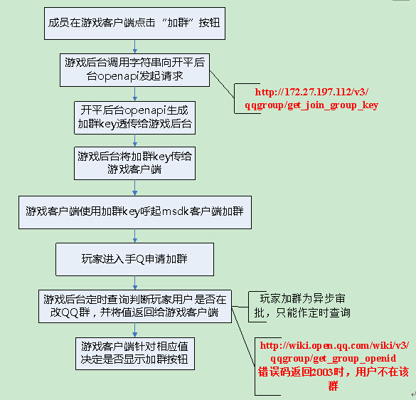


Relevant Modules of MSDK Mobile QQ
=======

Access configuration 
------

### AndroidMainfest configuration

- The developer fills in the configuration information according to the following example.

		<!-- TODO SDK access  QQ access configuration START -->
		<activity
		    android:name="com.tencent.tauth.AuthActivity"
		    android:launchMode="singleTask"
		    android:noHistory="true" >
		    <intent-filter>
		        <action android:name="android.intent.action.VIEW" />
		        <category android:name="android.intent.category.DEFAULT" />
		        <category android:name="android.intent.category.BROWSABLE" />
		        <data android:scheme="tencent game’s mobile QQ appid" />
		    </intent-filter>
		</activity>
		<activity
		    android:name="com.tencent.connect.common.AssistActivity"
		    android:configChanges="orientation|screenSize|keyboardHidden"
		    android:screenOrientation="portrait"
		    android:theme="@android:style/Theme.Translucent.NoTitleBar" />
		<!-- TODO SDK access  QQ access configuration  END -->

- **Note: **

	1. **Fill in The developer’s mobile QQ appid behind “tencent” in```<data android:scheme="tencent game’s mobile QQ appid" />``` in intent-filter in com.tencent.tauth.AuthActivity.** For example: ```<data android:scheme="tencent100703379" />```

	- **launchMode of The developer’s Activity needs to be set as singleTop**; after launchMode is set as singleTop, The developer’s Activity may be launched twice while the platform launches The developer. Thus, in The developer Activity's onCreate, it is needed to check if the current Activity is a duplicate of The developer Activity. If yes, the current game Activity needs to be finished.


### Appid configuration: 

- Appid configuration has been completed when the Java layer was initialized.

		public void onCreate(Bundle savedInstanceState) {
			...
    		//The developer must use its own QQ AppId for joint debugging
            baseInfo.qqAppId = "1007033***";
            baseInfo.qqAppKey = "4578e54fb3a1bd18e0681bc1c7345***";

            //The developer must use its own WeChat AppId for joint debugging
            baseInfo.wxAppId = "wxcde873f99466f***"; 
            baseInfo.wxAppKey = "bc0994f30c0a12a9908e353cf05d4***";

            //The developer must use its own payment offerId for joint debugging
            baseInfo.offerId = "100703***";
    		...
    		WGPlatform.Initialized(this, baseInfo);
    		WGPlatform.handleCallback(getIntent());
    		...
		}
- **Note: **

	1. If The developer fills in a wrong value for baseInfo, this can cause failure in the sharing and login of QQ and WeChat. Please notice this!!!

### Callback configuration for joining a group or binding a group

-Starting from MGSDK2.7.0, the mobile QQ group joining and group binding function of MSDK adds a separate global callback: `WGQQGroupObserver`. Through the global callback, The developer can receive the corresponding callback information when binding a group, querying the group information or unbinding a group.

#### Java layer callback:

- **Implementation example of the callback:**

		//Callback for joining a group or binding a group
		class MsdkQQGroupCallback implements WGQQGroupObserver {

			@Override
			public void OnQueryGroupInfoNotify(QQGroupRet groupRet) {
				//TODO GAME Add the callback for querying the group information
				Logger.d("flag:"+ groupRet.flag + ";errorCode: "+ groupRet.errorCode + ";desc:" + groupRet.desc);
				if(CallbackFlag.eFlag_Succ == groupRet.flag){
					//The developer can show the “Unbind” button on the page for the union president, but display the “Enter QQ group” button on the page for users who are not the union president.
					MsdkCallback.sendResult("Query successfully. \n Group name is "+groupRet.getGroupInfo().groupName 
							+"\n group’s openID:"+groupRet.getGroupInfo().groupOpenid 
							+"\n Group key is: "+groupRet.getGroupInfo().groupKey);
				}else{
					if(2002 == groupRet.errorCode){
						//The developer can show the “Bind” button on the page for the union president, but display the “Not bind yet” button on the page for users who are not the union president.
						MsdkCallback.sendResult("Query fails. The union now has no binding records");
					}else if(2003 == groupRet.errorCode){
						//The developer can show the “Join the group” button on the page for users as common union members
						MsdkCallback.sendResult("Query fails. The current user has not joined QQ group. Please first join QQ group! ");
					}else if(2007 == groupRet.errorCode){
						//The developer can show the “Join the group” button on the page for users as common union members
						MsdkCallback.sendResult("Query fails. QQ group has been dissolved or does not exist!");
					}else{
						//The developer can guide the user to retry
						MsdkCallback.sendResult("Query fails. A system error occurs. Please try again!");
					}
				}
			}
		
			@Override
			public void OnBindGroupNotify(QQGroupRet groupRet) {
				//TODO GAME Add the callback for binding QQ group
				Logger.d("flag:"+ groupRet.flag + ";errorCode: "+ groupRet.errorCode + ";desc:" + groupRet.desc);
				if(CallbackFlag.eFlag_Succ == groupRet.flag){
                 // The developer can go to query relevant information about binding the union.
                // Because the current mobile QQ SDK does not yet support this function, no matter whether the binding is successful, MSDK will give The developer a success callback; after The developer receives the callback, it needs to call the query interface to confirm if binding is successful
					MsdkCallback.sendResult("Binding is successful.");
				}else{
					//The developer can guide the user to retry
					MsdkCallback.sendResult("Binding fails. A system error occurs. Please try again!");
				}
			}
		
			@Override
			public void OnUnbindGroupNotify(QQGroupRet groupRet) {
				//TODO GAME Add the callback for unbinding QQ group
				Logger.d("flag:"+ groupRet.flag + ";errorCode: "+ groupRet.errorCode + ";desc:" + groupRet.desc);
				if(CallbackFlag.eFlag_Succ == groupRet.flag){
					//Unbinding is successful. The developer can prompt the user that unbinding is successful and displays the “Unbind” button on the page for the union president, but displays the “Not unbind yet” button on the page for users who are not the union president
					MsdkCallback.sendResult("Unbinding is successful.");
				}else{
					if(2001 == groupRet.errorCode){
						//The group openID used for unbinding has no group-binding records. The developer re-calls the query interface to query the binding situation
						MsdkCallback.sendResult("Unbinding fails. The current QQ group has no binding records!");
					}else if(2003 == groupRet.errorCode){
						//The user’s login mode expires. Please logon again
						MsdkCallback.sendResult("Unbinding fails. The user’s login mode expires. Please log in again！");
					}else if(2004 == groupRet.errorCode){
						// Operate too frequently. Let the user try again later
						MsdkCallback.sendResult("Unbinding fails. Operate too frequently. Let the user try again later！");
					}else if(2005 == groupRet.errorCode){
						//Unbundling parameter error occurs. The developer re-calls the query interface to query the binding situation
						MsdkCallback.sendResult("Unbinding fails. Unbundling parameter error occurs");
					}else{
						//The developer can guide the user to retry
						MsdkCallback.sendResult("Unbinding fails. A system error occurs. Please try again!");
					}
				}
			}
		}

- **Callback configuration: **

		 //QQ Callback for joining a group or binding a group
	     WGPlatform.WGSetQQGroupObserver(new MsdkQQGroupCallback());

#### C++ layer callback:

- **Implementation example of the callback (Here is just a simple example. For details, please refer to Java layer callback): **

		// Callback of advertising,
		class QQGroupCallback: public WGQQGroupObserver {
		
			virtual void OnQueryGroupInfoNotify(QQGroupRet& groupRet){
				//The developer adds here a logic which is used after the queried group information is returned
				LOGD("QQGroupCallback OnQueryGroupInfoNotify;flag:%d;errorCode:%d;desc:%s",groupRet.flag,groupRet.errorCode,groupRet.desc.c_str());
			}
			virtual void OnBindGroupNotify(QQGroupRet& groupRet){
				//The developer adds here a logic which is used after the group is bound. Note: The current openSDK does not support the function, and MSDK can only return that the interface call succeeds
				LOGD("QQGroupCallback OnQueryGroupInfoNotify;flag:%d;errorCode:%d;desc:%s",groupRet.flag,groupRet.errorCode,groupRet.desc.c_str());
			}
			virtual void OnUnbindGroupNotify(QQGroupRet& groupRet){
				///The developer adds here the returned result after calling the unbundling interface
				LOGD("QQGroupCallback OnQueryGroupInfoNotify;flag:%d;errorCode:%d;desc:%s",groupRet.flag,groupRet.errorCode,groupRet.desc.c_str());
			}
		};
		QQGroupCallback qqGroup_callback;

- **Callback configuration: **
	
		WGPlatform::GetInstance()->WGSetQQGroupObserver(&qqGroup_callback);


## Quick Login

Quick login refers to that when the player clicks on the sharing information for direct launch and entry into The developer in mobile QQ or WeChat, the platform will transparently transmit the login-related token information and thus directly complete the login and enter The developer. In this scenario, after The developer is launched, the player can enter The developer without being authorized again.

### Mobile QQ Game Center’s quick login configuration

In mobile QQ player can directly log in The developer quickly by clicking the “Start” button in The developer Center. But this depends on the configuration of The developer when players enter The developer through The developer Center’s details page. The specific configuration method is: The developer’s **operator co-works with the planning PM** to submit the demand to the Mobile QQ Game Center, and then the principal of The developer Center will complete configuration. The configuration is as follows:

1. Support openID:

	Check opened, as shown in the following diagram

	 

2. Support taking openID, accessToken, PayToken

  1 Check the corresponding option

  2 Fill in the corresponding versionCode of the version in which The developer supports account inconsistency. After completing filling, this code or later versions can carry the token to launch The developer. Previous versions can only carry openID to launch The developer but do not affect the normal logic of The developer.

	 

3. Precautions

   When configuring the quick login, you generally only need to configure the first three items and don’t need to configuration the later few items.

Query personal information
------

After the user authorizes The developer through mobile QQ, The developer requires the user’s nickname, head portrait and other information. The personal information includes: nickname, openId, gender, pictureSmall, pictureMiddle and pictureLarge. Interfaces required to accomplish this function include: WGQueryQQMyInfo. The detailed description of the interface is as follows:

#### Interface declaration:

/**
 * Get your own QQ information
 * @return void
 *  The call result of the interface returns data to The developer through the callback of OnRelationCallBack (RelationRet& relationRet).
 *  Persons property of RelationRet object is a Vector <PersonInfo>. Take the data from position 0 in the Vector. The taken data are the user's personal information.
 *  The personal information acquired by a user authorized by mobile QQ includes:
 *   nickname, openId, gender, pictureSmall, pictureMiddle, pictureLarge, gpsCity, and other fields are null.
*/

	bool WGQueryQQMyInfo();

####  Interface call: 

 Interface call example:

	WGPlatform::GetInstance()->WGQueryQQMyInfo();
Callback reception example:

	virtual void OnRelationNotify(RelationRet& relationRet) {
    switch (relationRet.flag) {
    case eFlag_Succ:
        // What is saved in relationRet.persons.at(0) is the personal information
        break;
    default:
        break;
    	}
	}

Query game friends’ information
------

After the user authorizes The developer through mobile QQ, it is needed to launch game friends’ information (for example, friends’ leader board). Interfaces required to accomplish this function include: WGQueryQQGameFriendsInfo. The detailed description of the interface is as follows:

	/**
 * Get QQ friends’ information, and call them back in OnRelationNotify,
 * in which RelationRet.persons is a Vector. The content in Vector is friends’ information. In the QQ friends’ information, province and city are null
 * @return void
 *   The call result of the interface returns data to The developer through the callback of OnRelationNotify(RelationRet& relationRet). Persons property of RelationRet object is a Vector <PersonInfo>,
 *  in which every PersonInfo object is a friend’s information,
 *   A friend’s information contains: nickname, openId, gender, pictureSmall, pictureMiddle, pictureLarge
 */
bool WGQueryQQGameFriendsInfo();

	
####  Interface call:

 Interface call example:

	WGPlatform::GetInstance()->WGQueryQQGameFriendsInfo();

Callback reception example:

	virtual void OnRelationNotify(RelationRet& relationRet) {
    	switch (relationRet.flag) {
    	case eFlag_Succ:
        // What is saved in relationRet.persons is all friends’ information
       		break;
    	default:
        	break;
    	}
	}

Structured message sharing
------

This type of message sharing needs to evoke mobile QQ and requires the user’s participation. Only so can the entire sharing process can be completed. It can be used to share messages with both game friends and non-game friends. It is usually used to invite non-game friends.

After the message is shared out, as long as the message recipient clicks on the message, he or she can get URL passed in when the interface is called. This URL is usually configured to be The developer Center’s URL, so that the user can configure automatic launch in the Mobile QQ Game Center, achieving the effect of evoking The developer by clicking on the message. 

If the user’s mobile phone is not installed with mobile QQ or is installed with mobile QQ with a version of less than 4.0, this interface can evoke the Web page to complete the sharing function. Interfaces required to accomplish this function include: WGSendToQQ. The detailed description of the interface is as follows:

#### Usage scenario:
	Invitation, show-off
####  Interface declaration:

/**
	 * @ param scene: identifier sent to mobile QQ dialogue or Qzone
     *      eQQScene.QQScene_QZone: share message to QZone (support versions 4.5 and above)
	 * 		eQQScene.QQScene_Session: share message to session
	 * @param title: structured message’s title
	 * @param desc: structured message’s summary
	 * @param url: the content’s skip url. Fill in the detailed page of the corresponding game center of The developer. When The developer is waked up by sharing messages, MSDK will give callback to The developer’s OnWakeup (WakeupRet & wr), and wr.extInfo will take back all custom parameters in the way of key-value.
	 * @param imgUrl: thumbnail URL of the shared message; it can be a local path (directly fill in the path, such as: /sdcard/*** test.png) or network path (such as: http://***.jpg). The local path should be placed in sdcard
	 * @param imgUrlLen: thumbnail URL length of the shared message
	 * @return void
	 *  Return data to The developer through OnShareNotify(ShareRet& shareRet), a global callback set up by The developer; shareRet.flag value represents the return status, and its possible values and descriptions are as follows:
	 *     eFlag_Succ: share success
	 *     eFlag_Error: share failure
	 *     
	 *     @return void
*  Return data to The developer through OnShareNotify(ShareRet& shareRet), a global callback set up by The developer; shareRet.flag value represents the return status, and its possible values and descriptions are as follows: 
    * EFlag_Succ: share success
    * EFlag_Error: share failure
*   Note: 
*   Sharing requires SD card. if there is no SD card, share success is not guaranteed
*   Because callback returned by mobile QQ client with a version of less than 4.6 is problematic, do not rely on this callback to do other logics. (Currently, all returns of flag are eFlag_Succ)
	 */ 
 
	void WGSendToQQ(
		const eQQScene& scene,
		unsigned char* title, 
		unsigned char* desc,
		unsigned char* url, 
		unsigned char* imgUrl,
		const int& imgUrlLen
		);
	
####  Interface call:

 Interface call example:

	int scene = 1; 
	std::string title = "title";
	std::string summary = "summary";
	std::string targetUrl = "http://www.qq.com";
	std::string imgUrl = "http://mat1.gtimg.com/erweimaNewsPic.png";
	WGPlatform::GetInstance()-> WGSendToQQ(
		1, 
		((unsigned char *) title.c_str()),
		((unsigned char *)summary.c_str()), 
		((unsigned char *)targetUrl.c_str()),
		((unsigned char *)imgUrl.c_str()),
		imgUrl.length()
	);

Callback reception example:

	virtual void OnShareNotify(ShareRet& shareRet) {
    	LOGD("OnShareNotify: platform:%d flag:%d",
            shareRet.platform, shareRet.flag);
    	// Handle share callback
    	if (shareRet.platform == ePlatform_QQ) {
        	switch (shareRet.flag) {
        		case eFlag_Succ:
            		// Share success
            		break;
        		case eFlag_Error:
            		// Share failure
            		break;
        		}
    		} else if (shareRet.platform == ePlatform_Weixin) {
        	...
    	}
	}

#### Note: 

* Mobile QQ 4.5 or later is required to support the launch of mobile QQ and the pop-up of the default pop-up box of QZone
* `The recommended size of shared pictures is 200*200; if one side of such a picture is less than 100, it will not be able to displayed properly`

Music message sharing
------
Music sharing needs to evoke mobile QQ and requires the user’s participation, so that to complete the whole sharing process.

After the message is shared out, as long as the message recipient clicks on the play button, he or she can directly play music. Even if he or she quits the session, he or she still can continue play the music. Click on the message can jump to the specified page.

If the user’s mobile phone is not installed with mobile QQ or is installed with mobile QQ with a version of less than 4.0, this interface can evoke the Web page to complete the sharing function. Interfaces required to accomplish this function include:
#### Usage scenario:
	Invitation, show-off
####  Interface declaration:

   /**
 * Share music message to mobile QQ session
 * @param scene eQQScene:
 * QQScene_QZone: Share message to QZone
 * QQScene_Session: Share message to session
 * @param title: structured message’s title
 * @param desc: structured message’s summary
 * @param musicUrl: jump URL after click on the message
 * @param musicDataUrl: music data URL (for example, http:// ***.mp3)
 * @param imgUrl: thumbnail URL of the shared message
 * @return void
 * Return data to The developer through OnShareNotify(ShareRet& shareRet), a global callback set up by The developer; shareRet.flag value represents the return status, and its possible values and descriptions are as follows: 
    * EFlag_Succ: share success
    * EFlag_Error: share failure
 */

	void WGSendToQQWithMusic(
		const eQQScene& scene,
		unsigned char* title,
		unsigned char* desc,
		unsigned char* musicUrl,
		unsigned char* musicDataUrl,
		unsigned char* imgUrl
	);

####  Interface call:

 Interface call example:

	int scene = 1; 
	std::string title = "title";
	std::string desc = "desc";
	std::string musicUrl = "http://y.qq.com/i/song.html?songid=1135734&source=qq";
	std::string musicDataUrl = "http://wekf.qq.com/cry.mp3";
	std::string imgUrl = "http://imgcache.qq.com/music/photo/mid_album_300/g/l/002ma2S64Gjtgl.jpg";
	WGPlatform::GetInstance()->WGSendToQQWithMusic(
		1, 
		((unsigned char *) title.c_str()),
		((unsigned char *)desc.c_str()), 
		((unsigned char *)musicUrl.c_str()),
		((unsigned char *)musicDataUrl.c_str()),
		((unsigned char *)imgUrl.c_str()),
		imgUrl.length()
	);

Callback reception example:

	virtual void OnShareNotify(ShareRet& shareRet) {
    	LOGD("OnShareNotify: platform:%d flag:%d",
            shareRet.platform, shareRet.flag);
    	// Handle share callback
    	if (shareRet.platform == ePlatform_QQ) {
        	switch (shareRet.flag) {
        		case eFlag_Succ:
            		// Share success
            		break;
        		case eFlag_Error:
            		// Share failure
            		break;
        		}
    		} else if (shareRet.platform == ePlatform_Weixin) {
        	...
    	}
	}

#### Note: 

* `The recommended size of shared pictures is 200*200; if one side of such a picture is less than 100, it will not be able to displayed properly`

Back-end sharing
------

After obtaining friends’ information in the above step, The developer needs to share the message to the specified friend (the specified friend’s openId). Such sharing does not need to use the mobile QQ client, and the sharing process doesn’t need the user’s involvement. The sharing can be completed by calling the interface, but it can only share messages to game friends. After the message is shared out, as long as the message recipient clicks on the message, he or she can get URL passed in when the share interface is called. This URL is usually configured to be The developer Center’s URL, so that the user can configure automatic launch in mobile QQ Game Center, achieving the effect of evoking The developer by click on the message. Interfaces required to accomplish this function include: WGSendToQQGameFriend. The detailed description of the interface is as follows:

#### Usage scenario:
	Inform friends after sending heart to them
####  Interface declaration:

/**
	 * @param act: Launch the web page or directly launch The developer when friends click on the shared message? 1: launch The developer; 0: launch targetUrl
	 * @param fopenid: friend’s openId
	 * @param title: shared message title
	 * @param summary: shared message summary
     * @param targetURL: the content’s jump url. Fill in the detailed page of the corresponding game center of The developer. When The developer is waked up by sharing messages, MSDK will give callback to The developer’s OnWakeup (WakeupRet & wr), and wr.extInfo will take back all custom parameters in the way of key-value.
	 * @param imgUrl: thumbnail URL of the shared message
	 * @param previewText: optional, preview text
	 * @param gameTag: Optional; this parameter must be filled in with one of the following values
				 MSG_INVITE                //invite
				 MSG_FRIEND_EXCEED       //show off “exceed”
				 MSG_HEART_SEND          //send heart
				 MSG_SHARE_FRIEND_PVP    //PVP fight
	 */ 

		bool WGSendToQQGameFriend(
			int act, 
			unsigned char* fopenid,
			unsigned char *title, 
			unsigned char *summary,
			unsigned char *targetUrl, 
			unsigned char *imgUrl,
			unsigned char* previewText, 
			unsigned char* gameTag
		);

####  Interface call:

 Interface call example:

	int act = 1;
	std::string friendOpenId = "791AB3A5864670BB6E331986FB86582A";
	std::string title = "qq title";
	std::string summary = "qq summary";
	std::string targetUrl = "http://qq.com";
	std::string imageUrl = "http://mat1.gtimg.com//erweimaNewsPic.png";
	std::string previewText = "qq previewText";
	std::string gameTag = "qq gameTag";
	WGPlatform::GetInstance()->WGSendToQQGameFriend(
		1, 
		((unsigned char *) friendOpenId.c_str()), 
		((unsigned char *)title.c_str()), 
		((unsigned char *)summary.c_str()), 
		((unsigned char *)targetUrl.c_str()), 
		((unsigned char *)picUrl.c_str()), 
		((unsigned char *)previewText.c_str()), 
		((unsigned char *)game_tag.c_str())
	);

Callback reception example:

	virtual void OnShareNotify(ShareRet& shareRet) {
    	LOGD("OnShareNotify: platform:%d flag:%d",
            shareRet.platform, shareRet.flag);
    	// Handle share callback
    	if (shareRet.platform == ePlatform_QQ) {
       		switch (shareRet.flag) {
        	case eFlag_Succ:
            	// Share success
            	break;
        	case eFlag_Error:
            	// Share failure
            	break;
        	}
    	} else if (shareRet.platform == ePlatform_Weixin) {
        	...
    	}
	}

#### Note: 
The shared message can not be displayed on PC QQ. The recipient needs to pay attention to the public account "QQ mobile game" so that he or she can receive the shared message. The same user can receive about 20 pieces of message about the same game on the same day.

Big picture sharing
------

This type of message sharing needs to evoke mobile QQ and requires the user’s participation, so that to complete the whole sharing process. Big pictures can be shared with game friends and non-game friends. They are usually used to show off scores or used for other functions which need detailed pictures.

After the message is shared out, the message recipient’s click on the message can not evoke The developer.

If the user’s mobile phone is not installed with mobile QQ or is installed with mobile QQ with a version of less than 4.5, this interface can evoke the Web page to complete the sharing function. When the picture’s shortest side is larger than 640px, the backstage will compress the picture. Interfaces required to accomplish this function include: WGSendToQQWithPhoto. The detailed description of the interface is as follows:

#### Usage scenario:
	Show-off

####  Interface declaration:

/**
	 * @param scene: identifier is sent to mobile QQ session or Qzone
	 * 		eQQScene.QQScene_QZone: Share message to QZone
     *      eQQScene.QQScene_Session: Share message to mobile QQ session
	 * @param imgFilePath: require the local file path of the shared picture. The picture should be placed in SD card. The picture path of each sharing can not be the same; otherwise, this can cause some problems in picture display. The developer itself needs to ensure that the picture path of each sharing is not the same.
	 * @return void
     * Return data to The developer through OnShareNotify(ShareRet& shareRet), a global callback set up by The developer; shareRet.flag value represents the return status, and its possible values and descriptions are as follows: 
     * EFlag_Succ: share success
     * EFlag_Error: share failure
	 * Note: Because callback returned by mobile QQ client with a version of less than 4.6 is problematic, do not rely on this callback to do other logics. (Currently, all returns of flag are eFlag_Succ)
	 */
     void WGSendToQQWithPhoto(const eQQScene& scene, unsigned char* imgFilePath);
####  Interface call:
 Interface call example:

	// The photo supports png, jpg and must be placed in sdcard
	std::string filePath = "/mnt/sdcard/test.png";
	WGPlatform::GetInstance()->WGSendToQQWithPhoto(
	1, 
	((unsigned char *)filePath.c_str())
	);
		
Callback reception example:

	virtual void OnShareNotify(ShareRet& shareRet) {
    	LOGD("OnShareNotify: platform:%d flag:%d",
            shareRet.platform, shareRet.flag);
    	// Handle share callback
    	if (shareRet.platform == ePlatform_QQ) {
        	switch (shareRet.flag) {
        		case eFlag_Succ:
            		// Share success
            		break;
        		case eFlag_Error:
            		// Share failure
            		break;
        		}
    		} else if (shareRet.platform == ePlatform_Weixin) {
        	...
    	}
	}

#### Note: 

1.	This interface only supports passing the local picture path. The picture path of each sharing can not be the same; otherwise, this can cause some problems in picture display. The developer itself needs to ensure that the picture path of each sharing is not the same.
2.	Mobile QQ 4.5 or later is required to support the launch of mobile QQ and the pop-up of the default pop-up box of QZone
3.	Big picture messages can not be shared via web.


Binding QQ group
------
In The developer union/alliance, in The developer the union president can pull the group created by the president himself to bind a group as the union group of the union. Call interface: WGBindQQGroup. The binding message is returned to The developer via callback. For the callback configuration, please refer to [Callback configuration for joining a group or binding a group] (qq.md # Callback configuration for joining a group or binding a group)

#### About the version:

 - MSDK has begun to provide this functionality since MSDK1.7.5
 - ** For any game running in versions lower then MSDK2.6, the interface must be called in the main thread **.


####  Interface declaration:
	
/ **
 * Game group binding: In The developer union/alliance, by clicking the "Bind" button, the union president can pull the group created by the president himself to bind a group as the union group of the union
 * The binding result can be called back to The developer through OnBindGroupNotify of WGQQGroupObserver
 * Because the current mobile QQ SDK does not support the callback of the bound group, so MSDK always gives The developer a success callback since MSDK2.7.0a no matter whether the binding is a success
 * After The developer receives the callback, it will call the query interface to confirm if the binding is successful
 * @param cUnionid Union ID, opensdk can only be filled with a number; if it is filled with a character, this may cause the binding to fail
 * @param cUnion_name Union name
 * @param cZoneid Zone ID, opensdk can only be filled with a number; if it is filled with a character, this may cause the binding to fail
 * @param cSignature The developer alliance chief’s authentication signature, whose generation algorithm is that the player’s openid_ The developer appid_ The developer appkey_ the union id_ the zone id is processed with md5. If you follow this method, you still can not bind the group successfully. Consult OpenAPIHelper via RTX.
 *
 * /

	void WGBindQQGroup(unsigned char* cUnionid, unsigned char* cUnion_name,
			unsigned char* cZoneid, unsigned char* cSignature);

####  Interface call:
 Interface call example:

	std::string cUnionid = "1";
	std::string cUnion_name = "union_name";
	std::string cZoneid = "1";
	//signature is related with unionid and zoneid; when it is modified, they should be modified synchronously
	std::string cSignature = "5C336B37DBCDB04D183A3F4E84B2AB0E";
	WGPlatform::GetInstance()->WGBindQQGroup(
		(unsigned char *)cUnionid.c_str(),
		(unsigned char *)cUnion_name.c_str(), 
		(unsigned char *)cZoneid.c_str(),
		(unsigned char *)cSignature.c_str()
	);


#### Note:

1. **When you bind a group within The developer, union id and zone id must be numbers**. If they are filled with characters, this may cause the binding to fail. This is generally prompted as "Parameter validation failure".

 - When you bind a group within The developer, the rule for generating a signature is: the md5 value of the player’s openid\_The developer appid\_The developer appkey\_union id\_zone id. If the signature generated in accordance with the rule does not work, directly RTX to consult OpenAPIHelper

 - A union id of The developer can only be bound with a QQ group. If the user dissolves the union QQ group, the union ID and the union QQ group will not automatically be unbound, so the union ID can not bind a new QQ group. In this case, the application needs to call the unbinding interface to unbind the union ID and the QQ group to create a new union QQ group or let the union ID bind with another existing QQ group.

 - ** The variables used to call api had better not be a temporary variables**

-**Because the current mobile QQ SDK does not support the callback of the bound group, so MSDK always gives The developer a success callback since MSDK2.7.0 no matter whether the binding is a success. After The developer receives the callback, it needs to call the query interface (qq.md# Query the binding information of QQ group) to confirm if the binding is successful**

 - For more details, please refer to [FAQ about joining QQ group or binding QQ group within The developer] (qq.md #FAQ about joining QQ group or binding QQ group)


Query the binding information of QQ group
 ------
When the player opens the union page or binds a group, he needs to query the binding information. Calling the query interface can query the basic information of the current union-bound group. Call interface `WGQueryQQGroupInfo`. The query result is returned to The developer via callback. As for callback settings, please refer to [Callback configuration for joining a group or binding a group](qq.md#Callback configuration for joining a group or binding a group)

#### About the version:

- MSDK has begun to provide this functionality since MSDK2.7.0. 
- **For any game running in versions lower then MSDK2.7, learn the solution in [FAQ about joining QQ group or binding QQ group within The developer] (qq.md #FAQ about joining QQ group or binding QQ group)**

####  Interface declaration:
	
	/**
	 * Query the information of the union-bound group. The query result will be returned to The developer via a callback called OnQueryGroupInfoNotify of WGQQGroupObserver
	 * @param unionid Union ID
	 * @param zoneid Zone ID
	 */
    void WGQueryQQGroupInfo(unsigned char* cUnionid,unsigned char* cZoneid);

####  Interface call:
 Interface call example:

	std::string cUnionid = "1";
	std::string cZoneid = "1";
	WGPlatform::GetInstance()->WGQueryQQGroupInfo(
		(unsigned char *)cUnionid.c_str(),(unsigned char *)cZoneid.c_str());

#### Error code: 

| Error code| Description |
| ------------- |:-----|
|2002 	|There is no binding record. The union now has no binding record! Please check if the incoming union ID and zone ID are correct. |
|2003 	|Query fails. The current user has not joined QQ group. Please first join the QQ group. |
|2007 	|Query fails. The current union-bound QQ group has been dissolved or does not exist. |
|Other 	|System error; please contact technical support through enterprise QQ, investigate the cause of the problem and get solutions. | 


Join QQ group
------
When the player directly joins QQ group in The developer, he or she can call interface: WGJoinQQGroup.

#### About the version:

- MSDK has begun to provide this functionality since MSDK1.7.5.
- ** For any game running in versions lower then MSDK2.6.0a, the interface must be called in the main thread. **

####  Interface declaration:

	/**
   * Join QQ group within The developer: after the union successfully binds the QQ group, union members can join the union group by clicking the "Join QQ group" button
   *param cQQGroupKey: the corresponding key of QQ group to join; The developer server can obtain it by calling openAPI’s interface; as for the calling method, please RTX to consult OpenAPIHelper
	 */
	void WGJoinQQGroup(unsigned char* cQQGroupKey);

####  Interface call:
 Interface call example:

	std::string cQqGroupKey = "xkdNFJyLwQ9jJnozTorGkwN30Gfue5QN";
	WGPlatform::GetInstance()->WGJoinQQGroup((unsigned char *)cQqGroupKey.c_str());

#### Note: 

1. The parameter used in joining the QQ group is not the group number of the corresponding QQ group but a special Key value generated by openAPI background. When The developer uses it, it needs to call openAPI’s interface to obtain it. As for the calling method, please RTX to consult OpenAPIHelper. In the joint debugging stage, you can view relevant codes at **(Components for joining QQ group/Android code)** in [http://qun.qq.com] (http://qun.qq.com), as shown below: ![Schematic for joining QQ group] (qqgrouup.png)

 - ** The variables used to call api had better not be a temporary variables**

 - For more details, please refer to [FAQ about joining QQ group or binding QQ group within The developer] (qq.md #FAQ about joining QQ group or binding QQ group)


 Unbinding QQ group
 ------
 Union president can unbind the binding of the union and QQ group. Call interface `WGUnbindQQGroup`. The unbinding result is returned to The developer through the callback. As for callback settings, please refer to [Callback configuration for joining a group or binding a group](qq.md#Callback configuration for joining a group or binding a group)

#### About the version:

- MSDK has begun to provide this functionality since MSDK2.7.0a.
- **For MSDK2.7.0a, you can learn the unbinding method in [FAQ about joining QQ group or binding QQ group within The developer] (qq.md #FAQ about joining QQ group or binding QQ group)**

####  Interface declaration:
	
	/**
	 * Unbind the QQ group currently bound with the union. The result will be returned to The developer through a callback called OnUnbindGroupNotify of WGQQGroupObserver
	 * @param cGroupOpenid: group opened of the union-bound group
	 * @param cUnionid Union ID
	 */

    void WGUnbindQQGroup(unsigned char* cGroupOpenid,unsigned char* cUnionid);

####  Interface call:
 Interface call example:

	std::string cGroupOpenid = "5C336B37DBCDB04D183A3F4E84B2AB0E";
	std::string cUnionid = "1";
	WGPlatform::GetInstance()->WGUnbindQQGroup(
		(unsigned char *)cGroupOpenid.c_str(),(unsigned char *)cUnionid.c_str());

#### Error code:

| Error code| Description |
| ------------- |:-----|
|2001 	|Unbinding fails. The current QQ group has no binding records!|
|2003 	|Unbinding fails. The user’s login mode expires. Please log in again！|
|2004 	|Unbinding fails. Operate too frequently. Let the user try again later！|
|2004 	|Unbinding fails. Unbinding parameter error occurs！|
|Other 	|System error; please contact technical support through enterprise QQ, investigate the cause of the problem and get solutions. | 

FAQ about joining QQ group or binding QQ group
 ---
 ### Why does the system prompt that the identity authentication fails?
 - When you bind QQ group within The developer, Union id and Zone id must be numeric. If they are characters, this may result in binding failure. This is generally prompted as "Parameter validation failure".
 - When you bind a group within The developer, the rule for generating a signature is: the md5 value of the player’s openid\_The developer appid\_The developer appkey\_union id\_zone id. If the signature generated in accordance with the rule does not work, directly RTX to consult OpenAPIHelper
 - If there is no zone id, it can be represented with 0. (The reason for the unsuccessful binding in Demo is because the signature in it is fixed. This is not correct. You need to re-calculate the signature by yourself. appid, appkey and openid can be found inside logcat)

### The workflow of binding QQ group in versions lower than MSDK 2.7:
 ! [Flowchart of binding QQ group] (bindqqgroup.jpg)

 ### How can we query if a QQ group has already been bound in versions lower than MSDK 2.7?
Please refer to:
[http://wiki.open.qq.com/wiki/v3/qqgroup/get_group_openid](http://wiki.open.qq.com/wiki/v3/qqgroup/get_group_openid). The returned error code is 2004. The group has no binding relation with appid

### How can we query if a union member is the QQ group in versions lower than MSDK 2.7?
Please refer to: 
[http://wiki.open.qq.com/wiki/v3/qqgroup/get_group_openid](http://wiki.open.qq.com/wiki/v3/qqgroup/get_group_openid). The returned error code is 2003. The group has no binding relation with appid

### How can we judge if the QQ group is bound successfully in versions lower than MSDK 2.7?
Please refer to: 
[http://wiki.open.qq.com/wiki/v3/qqgroup/get_group_openid](http://wiki.open.qq.com/wiki/v3/qqgroup/get_group_openid). The returned code is 0. group_openid is QQ group’s group_openid. Then query the group name through group_openid (refer to Section 6) 
** Special note: msdk and mobile QQ can not return the binding result. The developer needs to take the initiative to query if the binding succeeds **

### How can we unbind QQ group in versions lower than MSDK 2.7?
Please refer to: 
[http://wiki.open.qq.com/wiki/v3/qqgroup/unbind_qqgroup](http://wiki.open.qq.com/wiki/v3/qqgroup/unbind_qqgroup)

### The workflow of unbinding QQ group in versions lower than MSDK 2.7:
 ! [Flowchart of unbinding QQ group] (unbindqqgroup.jpg)

### How can we query which QQ group a union id is bound with in versions lower than MSDK 2.7?
Please refer to: 
[http://wiki.open.qq.com/wiki/v3/qqgroup/get_group_info](http://wiki.open.qq.com/wiki/v3/qqgroup/get_group_info)

### The workflow of joining QQ group in versions lower than MSDK 2.7:


### More questions
Please refer to: 
[http://wiki.open.qq.com/wiki/API%E5%88%97%E8%A1%A8](http://wiki.open.qq.com/wiki/API%E5%88%97%E8%A1%A8)
Application promotion API----QQ capacity promotion ---- Union QQ group


Add QQ friends
------
In The developer, a player can directly add other game players as QQ friends. Call interface: WGAddGameFriendToQQ.

#### About the version:

- MSDK has begun to provide this functionality since MSDK1.7.5.
- ** For any game running in versions lower then MSDK2.6.0a, the interface must be called in the main thread. **

####  Interface declaration:

	/**
	 * Add QQ friends in The developer
	 * @param cFopenid: openid of the friend to be added
	 * @param cDesc: description of the friend to be added
	 * @param cMessage: Verification information sent when a friend is added
	 */		
	void WGAddGameFriendToQQ(unsigned char* cFopenid, unsigned char* cDesc,
			unsigned char* cMessage);

####  Interface call:
 Interface call example:

	std::string cFopenid = "66C7CFB0D5336EA1FABAD9B0FEECCE74";
	std::string cDesc = "apiWGAddGameFriendToQQ";
	std::string cMessage = "add";
	WGPlatform::GetInstance()->WGAddGameFriendToQQ(
		(unsigned char *)cFopenid.c_str(),
		(unsigned char *)cDesc.c_str(), 
		(unsigned char *)cMessage.c_str()
	);


 Corresponding versions that mobile QQ feature supports
------
1. **Overview**:
	
The functions of mobile QQ are related to mobile QQ versions. The specific function-version relationship is shown as follows:
Function	Description	Android mobile QQ version
Login authorization	Authorization for launching Web	mobile QQ 4.0 and higher
Structured message sharing	Sharing	mobile QQ 4.5 and higher
Authorization		4.1 and higher
Directed sharing		4.1 and higher
Big picture sharing		4.1 and higher
QZone sharing pop-up box	Evoke the default pop-up box of mobile QQ	4.5 and higher
Rapid authorization	Mobile QQ evokes a game with authorization status	4.6 and higher
Qzone & friend circle sharing		4.5 and higher
Account inconsistency	When the platform evokes The developer, does it carry opened to The developer (account inconsistency)?	4.2 and higher
Join QQ group within The developer	Mobile QQ evokes a game with authorization status	4.7 and higher
Bind QQ group within The developer	Mobile QQ evokes a game with authorization status	5.1 and higher
Add friends within The developer	Mobile QQ evokes a game with authorization status	5.1 and higher


Game Center’s details page
 ------
Mobile QQ Game Center’s details page is a Mobile QQ Game Center link (effects are shown in the following picture) provided by mobile QQ to boutique games. When the target address of The developer message sharing is fill in with the link, a click on the message can jump to the target link and automatically carry the token to launch The developer, thus achieving the quick login of The developer (equivalent to clicking the “Start” button in The developer Center).

Share URL address:

http://gamecenter.qq.com/gcjump

Field specification:

 | Field | Required/optional | Type | Description |
 |: -------: |: -------: |: -------: |: -------: |
 | appid | Required | Integer | The application’s unique identification ID |
 | pf | Required | String | It is fixed to be "invite" due to historical reasons; when The developer center detect that the value of pf is “invite”, it will directly evoke The developer |
 | plat | Required | String | Source platform; its value is qq |
 | from | Required | String | <p> Message source platform Possible values are: </p><p> androidqq: Android QQ </p><p> iphoneqq: iPhone QQ</p> |
 | ADTAG | Required | String | <p> Mark different structured message sources; possible values are: </p><p> gameobj.msg_invite (representing invitation) </p><p> gameobj.msg_exceed (representing exceeding) </p><p> gameobj.msg_heart (representing sending heart) </p><p> gameobj.msg_pvp (representing challenge) </p><p> gameobj.msg_show (representing show-off) </p> |
 | Originuin | Required | String | Initiator’s openID |
 | Platformdata | Optional | String | Data transparently passed to The developer|
 | Gamedata | Optional | String | Data transparently passed to The developer| |


Example:

http://gamecenter.qq.com/gcjump?appid={YOUR_APPID}&pf=invite&from=iphoneqq&plat=qq&originuin=111&ADTAG=gameobj.msg_invite

Usage scenario:

The following interfaces will be used in the client:

	WGSendToQQ: The corresponding parameter is url
	WGSendToQQGameFriend: The corresponding parameter is targetUrl
	WGSendToQQWithMusic: The corresponding parameter is musicUrl
