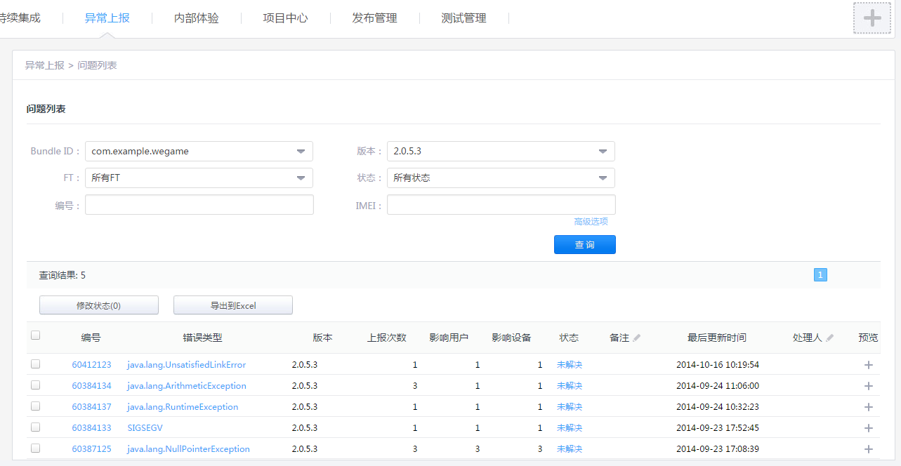

MSDK Crash Reporting Module
===
Overview
---
In versions earlier than MSDK2.5a (not including MSDK2.5a), crash reporting used RQD reporting. At that time, after reporting was submitted successfully, specific details about the crash and the stack can only be viewed in http://rdm.wsd.com/. They could only be viewed by Tencent employees by logging in the system with RTX, and it is very inconvenient for non-Tencent game developers to view them. MSDK2.5 and later versions use bugly reporting, whose details can be viewed at http://bugly.qq.com/. Users can use QQ account to bind related application. This way, non-Tencent game developers can easily view the reporting details. Of course, they can also be viewed in http://rdm.wsd.com/. To do so, game developers do not need any additional operations. Only both ways’ switches to turn off the crash reporting are not consistent. For details, please refer to **RQD reporting switch settings** and **Bugly reporting switch settings **.

Precautions for upgrading versions earlier than MSDK2.5a to versions later than 2.5a
---
For games which can’t use Android Library Project, they should specially note that they need to copy libs under MSDKLibrary to the corresponding directory of the game project. In versions earlier than MSDK2.5a, is copy libNativeRQD.so under armeabi, armeabi-v7a, mips and x86 to the corresponding directory of the game project. In MSDK2.5a and later versions, copy libBugly.so to the corresponding directory of the game project. If libNativeRQD.so has been in existence, delete it.

RQD reported switch settings
---
Set the function used to turn on or off RDM data reporting:

     public static void WGEnableCrashReport(boolean bRdmEnable, boolean bMtaEnable)

This function is in WGPlatform. If you set bRdmEnable as false (bMtaEnable can be set as false), you close RDM crash reporting. By default, crash reporting is opened, so there is no need to call the function.

View Crash data on the RDM platform
---
####1. Registration binding

Games which are registered via DEV can automatically register RDM and do not need to register manually. Games which are manually registered can directly log in RDM, click the exception reporting module and then configure the product’s BoundID.

Steps: log in [http://rdm.wsd.com/] (http://rdm.wsd.com/), enter your product -> report exceptions. If your product is not registered, you will be reminded as shown in the following figure:

Wherein, boundID is packageName in your AndroidManifest. Unregistered products will be directly discarded when data are reported.

For more details, please contact RDM staff like Xiao Mi; for Android problems, you can contact spiritchen (Spirit Chen)

####2. How to view the reported data
- Website: [http://rdm.wsd.com/] - (http://rdm.wsd.com/) - > exception reporting > problem list

Bugly reporting switch settings
---
The switch for opening and closing the bugly reporting is required to be configured in /assets/msdkconfig.ini

      ; turn off the bugly reporting switch, which should by default be set as false. If the switch is set as true, this closes the crash reporting function
      CLOSE_BUGLY_REPORT=false

View Crash data on the Bugly platform
---
- Website: [http://bugly.qq.com/](http://bugly.qq.com/)-> log in with QQ account -> select the corresponding App

Proguard obfuscation-related handling of App
-
For security reasons, the Java code will be obfuscated before an app is released. When you obfuscate the app codes, you should note to not obfuscate the classes or methods which should not be obfuscated in Bugly!

** Scheme one: Do not obfuscate msdk*.jar (recommended) **

Bugly.jar has been integrated in MSDK*.jar. It is recommended that users do not obfuscate MSDK*.jar (such as MSDK_Android_2.7.0a_svn53805.jar) when obfuscating app codes.

Users can directly import MSDK*.jar through -libraryjars.

** Scheme two: Add the keep information of SDK when obfuscating MSDK*.jar **

If you need to obfuscate MSDK*.jar, please add the following keep information into the obfuscation configuration of App:

    -keep class * extends android.app.Activity{*;}
    -keep class * extends android.app.Service{*;}

    #Bugly interface
    -keep public class com.tencent.bugly.crashreport.crash.jni.NativeCrashHandler{public *; native <methods>;}
    -keep public interface com.tencent.bugly.crashreport.crash.jni.NativeExceptionHandler{*;}

App’s symbol restoration table configuration
---
** As for recommendations related to the symbol restoration table configuration, please first view the eight-chapter video tutorial in     http://www.jikexueyuan.com/course/406.html?hmsr=bugly_androidcrash **. This can help you have a good understanding of the symbol restoration table.

**1. Generate Java Progurad symbol restoration table: **

When you obfuscate codes with the progurad tool, the tool can output a symbol restoration table file called mapping.txt. Bugly can restore the Java stack according to mapping.txt.

After progurad is started in Eclipse, it can generate the symbol table file mapping.txt under the progurad directory after the compiled result is released.

**2. Generate Native symbol file: **

Through SymbolTool.jar, a symbol table tool, you can extract the debug information from the SO file to generate the symbol file. Bugly can restore the Native stack according to the symbol file.

**3. In NDK build result: **

libs directory ->cpu architecture directory ->XX.so is a SO file which does not carry debug information and is used for release and has a small volume.
obj directory ->cpu architecture directory ->XX.so is a SO file which carries debug information (debug_info, debug_line) and is used for debugging and has a large volume.

Bugly symbol table tool needs to extract the symbol information of functions from the debug SO file and then restore the stack reduction.

    <cmd>
    java -jar AndroidSymbolTools.jar -i debugSoPath -a armeabi
    </cmd>

In the same directory of debugSo, the tool will generate a symbol table file called buglySymbol&cpuArchitecture&SO name.zip.

**4. Configure the symbol table: **

In the bugly platform, enter Product -> Settings -> Version Management and directly upload the symbol table according to the version!

The symbol table configuration is set according to the version:

A version only has a Java symbol table (mapping.txt)

A version + cpu architecture only has a Native symbol table (buglySymbol&cpuArchitecture&SO name.zip)

Repeated configuration will be an overridden operation.

Add additional business logs in Crash reporting
---

When the program crashes, it is sometimes needed to add some additional business logs and report these logs along with the crash log to http://rdm.wsd.com/ platform, so as to help people better locate the causes of the crash. Finally, these logs can be viewed on the RDM platform, of which the additional business logs are saved in extraMessage.txt. Bugly does not yet open the function to view extraMessage.txt. This function is currently under development.

To complete this feature, you only need to add the callback function OnCrashExtMessageNotify into the global observer (i.e., WGPlatformObserver). Java is called by the following mode:

    @Override
    public String OnCrashExtMessageNotify() {
      // Here the game developer supplements additional information for crash reporting, used to help analyze the cause of the crash
      //for example, String str = "test extra crash upload!";
      // if not needed, please fill in String str = ""
      String str = "test extra crash upload!";
      return str;
    }

cpp is called by the following mode:

    virtual std::string OnCrashExtMessageNotify() {
    	// Here the game developer supplements additional information for crash reporting, used to help analyze the cause of the crash
    	// for example, std::string str = "test extra crash upload!";
    	// if not needed, please fill in std::string str = ""
    	std::string str = "test extra crash upload!";
    	LOGD("OnCrashExtMessageNotify test %s", str.c_str());
    	return str;
    }

