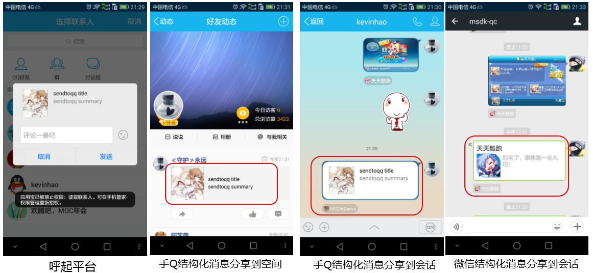
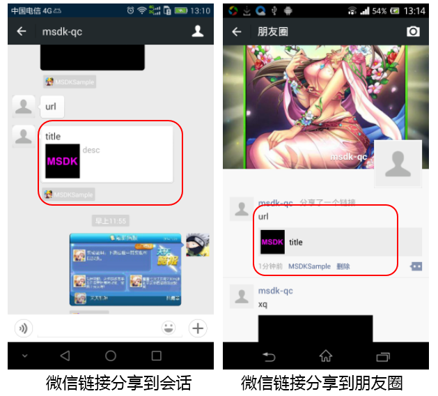
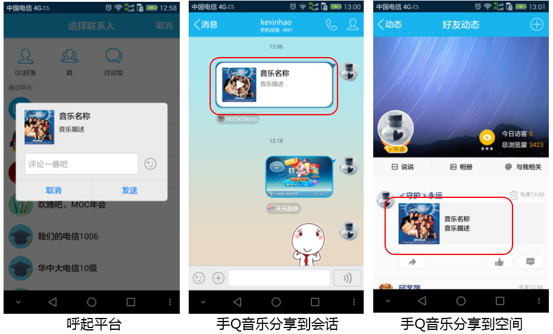
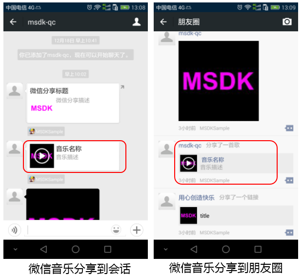
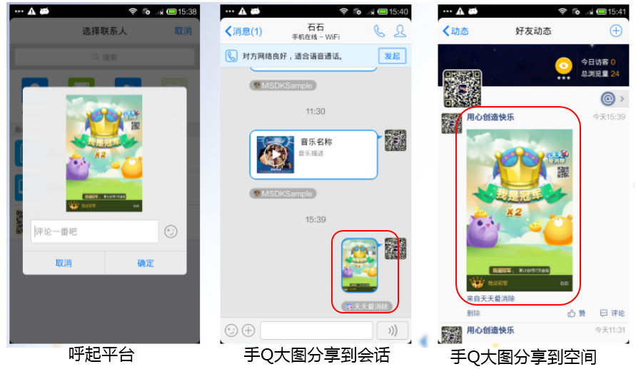
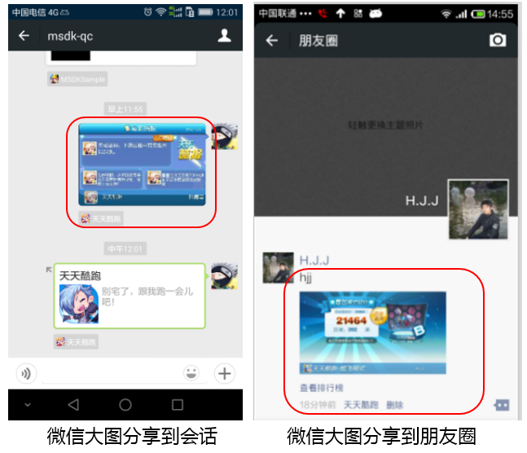
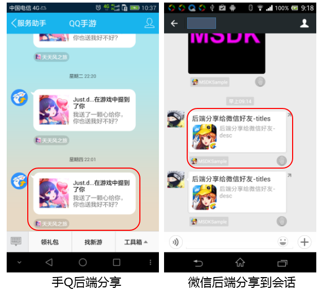

# MSDK’s Share Module

## Overview

This module will look at all share-related modules of MSDK, including the share method, usage scenarios, share effects, click effects, precautions and called interface description of each type of share. Game developers can first refer to the article to get familiar with all share-related interfaces of MSDK and then use the corresponding share-related interfaces according to their actual needs to achieve the interaction among players.

## Recommended usages of MSDK

According to the common sense of game development, MSDK offers the types of sharing messages recommended for use at various scenarios. Game developers can refer to the recommended usages of MSDK to realize their own functions.

- ** Friend invitation (including, but not limited to invitation for registration) **: structured messages, music messages
- ** Invitation among game friends (such as inviting to the designated rooms, etc.) **: structured messages, music messages, backend sharing
- ** Inform friends or inform friends within the game after sending the heart **: the backend sharing
- ** Show off achievements in the game **: pure image messages or structured messages
- ** Sharing of the game's official website-related activities **: link messages, structured messages

## Comparison of various share messages

### A simple comparison of the similarities and differences among various share messages

| Share type | Share location | Can the message be shared to non-game friends? | Does it need to launch the client? | Calling interface | Detailed description |
|: ----- :|: ----- :|: ----- :|: ----- :|: ----- :|: ----- :|: ----- :|
| QQ structured message share 		| session/QZone 	| Yes | Yes   | WGSendToQQ           | [Click to view](qq.md# structured message share)|
| WeChat  structured message share 	| session 			| Yes | Yes   | WGSendToWX           | [Click to view](wechat.md# structured message share)|
| WeChat  link message share 		| session/WeChat moment  	| Yes | Yes   | WGSendToWeixinWithUrl| [Click to view](wechat.md# link share)|
| QQ music message share  		| session/QZone 	| Yes | Yes   | WGSendToQQWithMusic  | [Click to view](qq.md# music message share)|
| WeChat  music message share  		| session/WeChat moment 	| Yes | Yes   | WGSendToWXWithMusic  | [Click to view](wechat.md# music message share)|
| QQ pure image message share  			| session/QZone 	| Yes | Yes   | WGSendToQQWithPhoto  | [Click to view](qq.md# big picture message share)|
| WeChat  pure image message share  			| session/WeChat moment  	| Yes | Yes   | WGSendToWXWithPhoto  | [Click to view](wechat.md# big picture message share)|
| QQthe backend sharing 			| QQ mobile public number	| No | No | WGSendToQQGameFriend | [Click to view](qq.md#the backend sharing)|
| WeChat backend sharing 			| session  			| No | No | WGSendToWXGameFriend | [Click to view](wechat.md#the backend sharing)|

### Click effects of shared messages:

Here are only the common features and click effects of all shared messages. As for their specific differences, please refer to the below reference documentation

### Mobile QQ

1. Click on `small tail` in the shared message, can launch the game. In this case, the launch doesn’t `carry any information`, so the judgment result of `account inconsistency can not be received`, namely ** `the game can not and do not do account inconsistency processing`**.
* ** Some interface parameters of mobile QQ contain hoplinks (or skip-links). Game developers can add hoplinks according to the following logic **:
	1. Games which have passed PR2 review
		- Link configuration: The hoplink can be set as the details page of the Mobile QQ Game Center (for details, refer to [The details page of the Mobile QQ Game Center](qq.md#The details page of the Mobile QQ Game Center))
		- Corresponding case: Through different configurations in the Mobile QQ Game Center, the hoplink can launch the game with token or launch the game without token ([as for the configuration method, please refer to QQ Quick Login](qq.md#Quick login))

	2. Games which have not passed PR2 review
		- Link configuration: The hoplink can be set as the details page of MyApp (for details, please consult MyApp manager Vivian Hui)
		- Corresponding effect: The hoplink can launch the game or download the game

	3. Games which have neither passed PR2 review nor accessed MyAppCenter
		- Link configuration: Hoplinks can only be set as other links
		- Corresponding effect: Click on the message can skip to the corresponding website and the game can be downloaded on the website or launched on the web

* **About the detailed page of the Mobile QQ Game Center**: the details page of the Mobile QQ Game Center is a link provide by mobile QQ for the Mobile QQ Game Center. When the target address carrying skip message sharing is filled with this link, click on the message can skip to the target link and can launch the game with parameters to achieve the quick login (equivalent to click on the Start button on the Mobile QQ Game Center). As for the specific usage and configuration of the Mobile QQ Game Center, please refer to: [the details page of the Mobile QQ Game Center](qq.md#The details page of the Mobile QQ Game Center)

### WeChat

* Click on the message body of the shared message can launch the game (need to be configured by the Operations Manager), and click on the small tail can enter the game's official website (need to be configured by the Operations Manager).
* WeChat does not support quick login, that is, when the game is launched from WeChat, the game can receive the judgment result of account inconsistency, but the user can not use the launch account for login authorization.

## Structured message sharing

### Usage scenario:

Because the structured message can be sent to friends on any platform and click on the structured message can launch the game with parameters, the structured message is generally used for invitation and show-off.

### Sharing effects:

### Click effects:

#### Mobile QQ
  
* Click on the message body of the shared message can skip to targetUrl (the parameter provided when the interface is called). If targetUrl is set as the URL of the corresponding details page of the game at the Mobile QQ Game Center (provided by the Operations Manager), click on it can launch the game and it can carry a token based on the configuration in the Mobile QQ Game Center. The user can directly use the launch account for login authorization.

### Notes:

1. It is recommended that the size of mobile QQ QZone thumbnail is 200 * 200; too small or too large images can not be displayed.
2. WeChat’s structured message can not be shared to WeChat moment and can be only shared to friends, and its thumbnails can not be more than 32K.
3. The game launched from WeChat only has opened, and the user needs to make WeChat login authorization so as to use the launch account to log in the game.

### Interface description:

- Mobile QQ structured message: Click to view[WGSendToQQ](qq.md#Structured message share)Interface description
- WeChat structured message: Click to view[WGSendToWeixin](wechat.md#Structured message share)Interface description

## Link message sharing

Link message is actually a type of structured message. Because WeChat structured message does not support skipping to the specified link by clicking the structure body, it adds the link message. The link message can also be sent to any friends, and click on its structure body can open the link. So the link message is generally used for invitation, show-off, event page sharing, etc.

### Sharing effects:

### Click effects:

Click on the message can open the website specified by the `url` parameter in the incoming `WGSendToWeixinWithUrl` interface in WeChat.

### Interface description:

* Link message share: Click to view[WGSendToWeixinWithUrl](wechat.md# link share)Interface description

## Music message share

Music message has a similar display format with the structured message. Click on the shared message can play music directly in mobile QQ or WeChat. It is generally used for sharing the game music.

### Sharing effects:

### Click effects:

#### Mobile QQ

* In ** mobile QQ session **, click on the icon of the music message can play music directly, and click on the structure on the right of the icon in the music message can pass in the corresponding URL of `musicUrl` in `WGSendToQQWithMusic` interface.
* In ** mobile QQ QZone **, click on the icon of the music message can skip to the website specified by the `musicUrl` parameter, and click on the right area of the icon in the music message can open the details page of the message.

#### WeChat

* Click on the icon of the music message can make WeChat play music directly. Click on the right area of the icon in the music message can open the website specified by the `musicUrl` parameter in the incoming `WGSendToWXWithMusic` interface.

### Notes:

1. It is recommended that the size of WeChat QZone thumbnail is 200 * 200; too small or too large images can not be displayed.
2. WeChat music message sharing needs to use local images

### Interface description:

* Mobile QQ music message: Click to view[WGSendToQQWithMusic](qq.md#music message share)Interface description
* WeChat music message: Click to view[WGSendToWXWithMusic](wechat.md#music message share)Interface description

## Pure image message sharing

Pure image message is also called big picture message. The entire message is a piece of picture or image. So it is usually used for show-off and sharing of scores and achievements, etc.

### Sharing effects:

### Click effects:

- Click on the image of the pure image message can show the original image.

### Notes:

1. Any image for WeChat big picture message sharing should not exceed 10MB.
2. What the pure image message sharing uses are local images or pictures; It requires to store pictures into a location where third-party applications have permissions to read, such as SD Card‘s partition.

### Interface description:

* Mobile QQ pure image message: Click to view[WGSendToQQWithPhoto](qq.md# big picture message share)Interface description
* WeChat pure image message: Click to view[WGSendToWXWithPhoto](wechat.md# big picture message share)Interface description

## Backend sharing

The backend sharing does not need to launch mobile QQ WeChat and backend messages can only be shared with game friends (friends who play the same game), so the backend sharing is commonly used to send the heart and can also be used for invitation show-off and so on

### Sharing effects:

### Click effects:

#### Mobile QQ

The message shared by the mobile QQ backend to friends is located in ** "QQ mobile game" ** service number.

* Click on the message body in the shared message can skip to targetUrl (the corresponding parameter in the called interface). If targetUrl is set as the URL of the corresponding details page of the game at the Mobile QQ Game Center (provided by the Operations Manager), click on it can launch the game.

#### WeChat

The message shared by the backend to sessions is located in the chat records of friends.

* The backend shares the message to session; click on the shared message can directly launch the game.

### Notes:

1. Mobile QQ backend-shared messages are not displayed on PC QQ and Overseas QQ. The backend messages of mobile QQ are all sent to mobile QQ’s "QQ mobile game" service number, so recipients need to pay attention to the service number (default attention) so that they can receive the messages. The same user can receive about 20 pieces of messages about the same game on the same day.
2. WeChat’s frequency limit on the backend sharing only targets individual users of individual games.

### Interface description:

* Mobile QQ backend sharing: Click to view[WGSendToQQGameFriend](qq.md#the backend sharing)Interface description
* WeChat backend sharing: Click to view[WGSendToWXGameFriend](wechat.md#the backend sharing)Interface description
