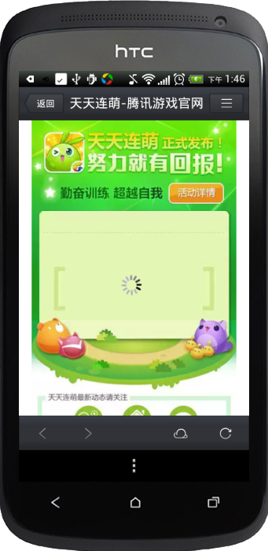

MSDK Built-in Webview Module
======
MSDK provides support for built-in Webview. This built-in Webview outperforms the system’s built-in Webview in terms of security, performance and other aspects. The Webview provides functions to share messages to QQ and WeChat. It allows a game to launch web pages within the game, such as marketing campaign pages, forum and other pages. Access to the built-in Webview needs to complete the following two steps.
Access configuration
------
** For MSDK2.7.0a and lower versions, they can configure the access as follows: **
    
If your phone is installed with QQ browser, it will use QQ built-in WebView kernel; if it is not installed with QQ browser, it will use the system’s default built-in WebView, whose memory may exist leaks, so it is needed to change the process into the independent process.
** `It is needed to add android:process=":msdk_inner_webview". When the game exits from the built-in WebView, it will kill the process. If you do not set this item, the system will kill the main process of the game and the game will have to exit` **

        <!-- TODO Related to WebView START -->
        <activity
            android:name="com.tencent.msdk.webview.JumpShareActivity"
            android:theme="@android:style/Theme.Translucent.NoTitleBar">
        </activity>
        
        <activity
            android:name="com.tencent.msdk.webview.WebViewActivity"
            android:process=":msdk_inner_webview" 
            android:configChanges="orientation|screenSize|keyboardHidden|navigation|fontScale|locale"
            android:screenOrientation="unspecified"
            android:theme="@android:style/Theme.Translucent.NoTitleBar"
            android:windowSoftInputMode="adjustPan" >
        </activity>

** For versions between MSDK2.0.0a (including) and MSDK2.7.0a (not including), they can configure the access as follows: **

    <activity
       android:name="com.tencent.msdk.webview.WebViewActivity"
       android:configChanges="orientation|screenSize|keyboardHidden|navigation|fontScale|locale"
       android:theme="@android:style/Theme.NoTitleBar"
       android:screenOrientation="unspecified"
       android:windowSoftInputMode="adjustPan">
    </activity>

** For versions earlier than MSDK2.0.0a, they can configure the access as follows: **

    <activity
       android:name="com.tencent.mtt.spcialcall.SpecialCallActivity"
       android:configChanges="orientation|keyboardHidden|navigation|fontScale|locale|screenSize"
       android:screenOrientation="unspecified"
       android:theme="@style/ThrdCallActivity"
       android:exported="false"
       android:windowSoftInputMode="adjustPan" >
    <intent-filter>
       <action android:name="com.tencent.QQBrowser.action.VIEWLITE" />
       <category android:name="android.intent.category.DEFAULT" />
       <category android:name="android.intent.category.BROWSABLE" />
       <data android:scheme="http" />
       <data android:scheme="https" />
       <data android:scheme="file" />
    </intent-filter>
    </activity>

If you need to keep built-in Webview in the landscape mode, you can change `android:screenOrientation="unspecified"` into `android:screenOrientation="landscape"`.

If you need to keep built-in Webview in the portrait mode, you can change `android:screenOrientation="unspecified"` into `android:screenOrientation="portrait"`

If you upgrade MSDK version to 2.0.0a, you can delete the previous configurations before 2.0.0a and then add the new configuration.

Open Webview
------
As long as WGOpenUrl interface is called to pass URL, you can use Webview provided by SDK. The description of WGOpenUrl interface is as follows:

    /**
      *Open the built-in Webview. This built-in Webview outperforms the system’s built-in Webview in terms of security, performance and other aspects. If your mobile phone is installed with the QQ browser, the built-in Webview can use mobile QQ browser’s kernel and have better performances. Meanwhile, it also provides functions to share messages to QQ and WeChat in the built-in Webview.
      *@param openUrl: URL to be opened
      */
    void WGOpenUrl(unsigned char * openUrl);

Demo codes for call are as follows:

    WGPlatform::GetInstance()->WGOpenUrl(cOpenUrl);

Demo effects are as follows:

 

Description of transparently transmitted parameters
------
### 1. Transmit encrypted login parameters
If the game is logged in, when its page is visited via the built-in Webview, the page’s URL will carry the encrypted login parameters. Details about the process are as follows:

1. MSDK encrypts these parameters and passes them to the page;

2. After the page gets the ciphertext, it calls MSDK’s back-end decryption interface to obtain the plaintext;

3. Make the login authentication via the token in the plaintext.

### 2. Encrypted data
Login parameters to be encrypted are listed in the following table

| Parameter  | Description  |
| ------------- |:-------------:|
| acctype| Account type; value: qq or wx |
| appid| Game ID |  
| openId | The unique identifier returned by the platform after the user’s authorization |  
| access_token| The user’s authorization token | 
| platid| Terminal type; value: 0. iOS; 1. Android |

The additional parameters which MSDK will add behind URL are shown as follows. _Do not repeat passing the parameters, because this can lead to decryption failure:

| Parameter  | Description  |  
| ------------- |:-------------:|
| timestamp| Request’s timestamp |
| appid| Game ID |
| algorithm | Encryption algorithm identifier; value: v1 or v2 | 
| msdkEncodeParam | Ciphertext |
| version | MSDK version number, such as 1.6.2a |
| sig | Signature of the request itself |
| encode | Encoding parameter, such as 1 |
| openid | The unique identifier returned by the platform after the user’s authorization |

###3. Examples
Supposed that Webview launches URL: http://apps.game.qq.com/ams/gac/index.html, the access URL which the actual capturing packet can see is as follows:

`http://apps.game.qq.com/ams/gac/index.html?sig=***&timestamp=**&appid=***&openid=***&algorithm=v1&msdkEncodeParam=***&version=1.6.2i&encode=1`

In which what msdkEncodeParam transmits is actually a ciphertext (URL encode) obtained by encrypting the following parameters:

`acctype=weixin&appid=100732256&openid=ol7d0jsVhIm3BQwlNG9g2f4puyUg&access_token=OezXcEiiBSKSxW0eoylIeCKi7qrm-
vXrr62qKiSw2otDBgCzzKZZfeBOSv9fplYsIPD844sNIDeZgG3IyarYcGCNe8XuYKHncialLBq0qj9-rVGhoQVkgSYJ8KXr9Rmh8IvdqK3zsXryo37sMJAa9Q&platid=0`

encrypted login status
------
### 1. How to decrypt
After the business page gets the above URL, it will call MSDK’s decryption interface. Currently, the decryption interface has two parameter transmission solutions. According to algorithm parameters, the business backend implements and is compatible with the two encrypted parameter transmission solutions:

1. For MSDK1.8.1a and later versions, the encrypted parameter transmission solution is: (what the following URL can access is the MSDK test environment)

`http://msdktest.qq.com/comm/decrypv1/?sig=***&timestamp=**&appid=***&openid=***&algorithm=v2&version=1.8.1i&encode=1`

Place the ciphertext value of msdkEncodeParam gotten in the first step in the body in the Post mode and transmit it in the Post mode. Note: do not add key “msdkEncodeParam=”.

2. For versions older than MSDK1.8.1a, the encrypted parameter transmission solution is as follows: (the solution is no longer used in the client, but the backend needs to realize it in order to be compatible with older versions)

`http://msdktest.qq.com/comm/decrypv1/?sig=***&timestamp=**&appid=***&openid=***&algorithm=v1&version=1.6.2i&encode=1`
 
Place the ciphertext value (URL Decode) of msdkEncodeParam in the body and transmit it in the Post mode. Note: do not add key “msdkEncodeParam=”. The capturing packet is as follows:

3、Fiddler decryption examples

3.1 Supposed that Webview launches URL: http://www.qq.com, the access URL which the actual capturing packet can see is as follows:

    http://www.qq.com?algorithm=v2&version=2.0.6a&timestamp=1423538227203&appid=100703379&sig=427291da31b56b59739be6da61d433ec&encode=1&msdkEncodeParam=BAD8B1625CB04523B06AAF6739ACB3CEA96F54393831AF5C6890E92EE61CF1A29F493710592DD84B47D4217BA9FA9DAFB8025CEB27E45EC958689A794E8BD33CF2544CC5D00FCE03AEF7B23EE2BFCA4332F5D69547477A3E93E44F3270F19664D5499CA2990BE5BA9E232036197B184F1411B76CF95537AC07E3D6A27F054AD3F26648B18554F9C1

3.2 Under the Fiddler simple test, url which needs to be assembled is:

    http://msdktest.qq.com/comm/decrypv1/?sig=427291da31b56b59739be6da61d433ec&timestamp=1423538227203&appid=100703379&algorithm=v2&version=2.0.6a&encode=1

   Wherein, Post body is:
          
    BAD8B1625CB04523B06AAF6739ACB3CEA96F54393831AF5C6890E92EE61CF1A29F493710592DD84B47D4217BA9FA9DAFB8025CEB27E45EC958689A794E8BD33CF2544CC5D00FCE03AEF7B23EE2BFCA4332F5D69547477A3E93E44F3270F19664D5499CA2990BE5BA9E232036197B184F1411B76CF95537AC07E3D6A27F054AD3F26648B18554F9C1

3.3 Debug on Fiddler:

The result of the implementation is:

    acctype=qq&appid=100703379&openid=4FC5813635C21D7C0A64729E4E2D3041&access_token=B85D2A1D7DB1B564CADE7116BF70AD0D&platid=1

PS: The formal environment uses http://msdk.qq.com/comm/decrypv1/.

### 2. Demo codes for decrypting the ciphertext (PHP version)

### 3. Demo codes for decrypting the ciphertext (C version)
1. Import the following file UrlCoding.h:

    #ifndef URL_H
    #define URL_H

    #ifdef __cplusplus
       extern "C" {
          #endif
    
          int php_url_decode(const char *str, int len, char *out, int *outLen);
          char *php_url_encode(char const *s, int len, int *new_length);
          int php_url_decode_special(const char *str, int len, char *out, int *outLen);
    
          #ifdef __cplusplus
       }
    #endif

    #endif /* URL_H */

2. Import the following file UrlCoding.c:

    #include <stdlib.h>
    #include <string.h>
    #include <ctype.h>
    #include <sys/types.h>
    #include <stdio.h>
    #include "UrlCoding.h"
    
    static unsigned char hexchars[] = "0123456789ABCDEF";
    
    static int php_htoi(const char *s)
    {
        int value;
        int c;
        
        c = ((unsigned char *)s)[0];
        if (isupper(c))
            c = tolower(c);
        value = (c >= '0' && c <= '9' ? c - '0' : c - 'a' + 10) * 16;
        
        c = ((unsigned char *)s)[1];
        if (isupper(c))
            c = tolower(c);
        value += c >= '0' && c <= '9' ? c - '0' : c - 'a' + 10;
        
        return (value);
    }
    
    
    char *php_url_encode(char const *s, int len, int *new_length)
    {
        register unsigned char c;
        unsigned char *to, *start;
        unsigned char const *from, *end;
        
        from = (unsigned char *)s;
        end  = (unsigned char *)s + len;
        start = to = (unsigned char *) calloc(1, 3*len+1);
        
        while (from < end)
        {
            c = *from++;
            
            if (c == ' ')
            {
                *to++ = '+';
            }
            else if ((c < '0' && c != '-' && c != '.') ||
                     (c < 'A' && c > '9') ||
                     (c > 'Z' && c < 'a' && c != '_') ||
                     (c > 'z'))
            {
                to[0] = '%';
                to[1] = hexchars[c >> 4];
                to[2] = hexchars[c & 15];
                to += 3;
            }
            else
            {
                *to++ = c;
            }
        }
        *to = 0;
        if (new_length)
        {
            *new_length = to - start;
        }
        return (char *) start;
    }
    
    
    int php_url_decode(const char *str, int len, char *out, int *outLen)
    {
        const char *data = str;
        char *orgOut = out;
        while (len--)
        {
            if (*data == '+')
            {
                *out = ' ';
            }
            else if (*data == '%' && len >= 2 && isxdigit((int) *(data + 1)) && isxdigit((int) *(data + 2)))
            {
                *out = (char) php_htoi(data + 1);
                data += 2;
                len -= 2;
            }
            else
            {
                *out = *data;
            }
            data++;
            out++;
        }
    //  *out = '/0';
        *outLen = out - orgOut;
        return *outLen;
    }
    
    //The decoding method implemented especially for encodeForURL in WGCommonMethods.h   by haywoodfu 2014-04-23
    int php_url_decode_special(const char *str, int len, char *out, int *outLen)
    {
        const char *data = str;
        char *orgOut = out;
        while (len--)
        {
            if (*data == '+')
            {
                *out = ' ';
            }
            else if (*data == '%' && len >= 2 && isxdigit((int) *(data + 1)) && isxdigit((int) *(data + 2)))
            {
                int value = 0;
                sscanf((data+1), "%2x", &value);
                *out = (char) value;
                data += 2;
                len -= 2;
            }
            else
            {
                *out = *data;
            }
            data++;
            out++;
        }
    //  *out = '/0';
        *outLen = out - orgOut;
        return *outLen;
    }

3. Decode the incoming string encodeParam with php_url_decode and php_url_decode_special, respectively. What is gotten is the cipher text.

