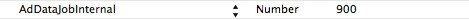

Advertisement
===

##Overview
 - The feature is available in versions after MSDK2.1.0, and the developer needs to add the following configuration  info to draw the ad data at the fixed time:


---

##Advertisement interface
 - Call WGShowAD to use a set of pages configured by MSDK to display the current valid announcements, and call WGHideScrollNotice to hide the displaying scroll announcement.

```ruby
 void WGPlatform::WGShowAD(const _eADType& scene) const;
```
>Description: Display the current valid announcement of the specified scene. Through the parameter type, MSDK determines which announcement should be displayed, as follows:
```ruby
typedef enum _eADType
{
   Type_Pause  = 1, // ad at the pause slot
Type_Stop = 2, // ad at the exit slot
}eADType;
```
IOS can now only use Type_Pause (ad at the pause slot).
Parameter:
- Type: the type of ad needing to display

 - 
```ruby
void WGCloseAD (const _eADType& scene);
```
>Description: hide the ad which has been displaying
Note: The buttons on the ad display page are customized through AdvertisementConfig.plist. Through plist, the user can configure the number of buttons, images and tags. A corresponding tag will be returned to the game through the callback after the user clicks a button. The plist file is placed in the corresponding subdirectory of framework/Resources/AdvertisementResources. The elements and definitions of the template are described in Appendix G.

---
## Demo code
 - Demo code for accessing the announcement data list interface:
```ruby
WGPlatform *plat = WGPlatform::GetInstance();
plat->WGShowAD(Type_Pause);
```

 - After the user sets WGAdObserver according to “Get Started-Step 5”, the event of the user’s clicking on the button can be called back in OnADNotify function of observer. The demo code is as follows:
```ruby
void MyAdObserver::OnADNotify(ADRet& adRet) 
{
NSString *string = [NSString stringWithCString:(const char*)adRet.viewTag.c_str() encoding:NSUTF8StringEncoding];
    NSLog(@"btn tag == %@",string);
    
    WGPlatform *plat = WGPlatform::GetInstance();
    plat->WGCloseAD(Type_Pause);
}
```