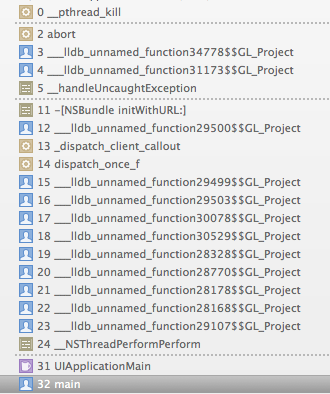
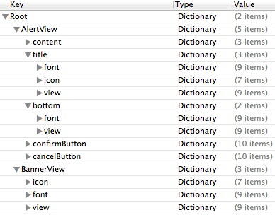
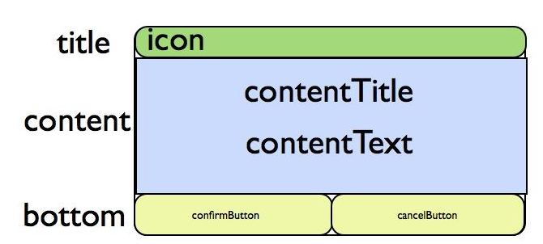
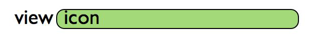

Announcement
===

##Overview
 - This feature is provided in MSDK versions later than 1.6.1. Announcement provides two forms of interfaces. Announcement in Version 1.6.2 is in the testing phase. It is not recommended that games use it. Games can add a setting in info to close the announcement function. If they need to use the announcement function, set the setting to yes, as shown in the following chart:
Text] [Alt (./Announcement1.png)
 - 2.0.1i and later versions support the announcement data timed draw feature. It is needed to make the following configuration in info:

---

## Interface of displaying the announcement with MSDK UI
 - Call WGShowNotice to use a set of UI configured by MSDK to display the current valid announcement. Calling WGHideScrollNotice can hide the displaying scroll announcement.
```
Void WGShowNotice (eMSG_NOTICETYPE type, unsigned char *scene);
```
>Description: Display the currently valid announcement under the specified scene. Determine which announcement to display through parameter type, as shown as follows:
```
typedef enum _eMSG_NOTICETYPE
{
	//All announcement types
	eMSG_NOTICETYPE_ALL = 0,
	//pop-out announcement
	eMSG_NOTICETYPE_ALERT,
	// scroll announcement 
    eMSG_NOTICETYPE_SCROLL,
}eMSG_NOTICETYPE;
```
Parameter:
1. type: type of the to-be-displayed announcement.
2. scene: announcement column ID; can not be empty; the parameter corresponds with the "announcement column" setting made in the announcement management side
 - 
```
void WGHideScrollNotice ();
```
>Description: Hide the displaying scroll announcement

## Announcement data list acquisition interface
```
std::vector<NoticeInfo> WGGetNoticeData(eMSG_NOTICETYPE type,unsigned char *scene);
```
>Description: Display the currently valid announcement data under the specified scene.  Determine which announcement to display through parameter type, as shown as follows:
```
typedef enum _eMSG_NOTICETYPE
{
	//All announcement types
	eMSG_NOTICETYPE_ALL = 0,
	//pop-out announcement
	eMSG_NOTICETYPE_ALERT,
	// scroll announcement 
    eMSG_NOTICETYPE_SCROLL,
}eMSG_NOTICETYPE;
```
Parameter:
1. type: type of the to-be-displayed announcement.
2. scene: announcement column ID; can not be empty; the parameter corresponds with the "announcement column" setting made in the announcement management side; can only specify the valid announcement in the announcement column for display
Return:
1. NoticeInfo array; NoticeInfo structure is as follows:
```
typedef struct
{
    std::string msg_id; // announcement id
    std::string open_id; //the user’s open_id
    std::string msg_content; // announcement content
    std::string msg_title; // announcement title
 	std::string msg_url; // the announcement’s hoplink
  	eMSG_NOTICETYPE msg_type; // announcement type, eMSG_NOTICETYPE
  	std::string msg_scene; // the scene used for the announcement display, the management backend configuration
  	std::string start_time; // valid start time of the announcement
  	std::string end_time; // valid end time of the announcement
	std::string content_url; //webpage announcement url
	std::vector<PicInfo> picArray; //image announcement’s image data
}NoticeInfo; 
typedef struct
{
	eMSDK_SCREENDIR screenDir;      // screen orientation  1: landscape mode  2: portrait mode
    std::string picPath;    //local path of image
    std::string hashValue;  //hash value of image
}PicInfo; 
```

---

## Demo code
 - Demo code for calling the announcement data list acquisition interface:
```
WGPlatform *plat = WGPlatform::GetInstance();
std::vector<NoticeInfo> vec = plat->WGGetNoticeData(eMSG_NOTICETYPE_ALERT, (unsigned char *)[scene UTF8String]);
for (int i = 0; i < vec.size(); i++) {
   NoticeInfo info = vec[i];
   NSLog(@"NoticeInfo msgID: %@\nNoticeInfo msgTitle:%@\nNoticeInfo msgContent:%@",
                [NSString stringWithUTF8String: info.msg_id.c_str()],
                [NSString stringWithUTF8String: info.msg_title.c_str()],
                [NSString stringWithUTF8String: info.msg_content.c_str()]);
            }
```

## FQA
 - Not properly importing resource files can lead to Crash:
	If MsdkReources.bundle is not properly imported into “Copy Bundle Resources” of the project, crash will occur when the announcement is displayed

 - If the window property is not created in AppDelegate(AppController), crash will occur when the announcement is called:
	[AppController window]: unrecognized selector sent to instance 0x17fa7130
	Solution: add the window property in AppDelegate(AppController), which points to keywindow created by it 

    **Note:** The display UI of the announcement is customized by plist. There are now 4 templates for pop-out announcements: "white bottom, blue bottom, black bottom, custom". These templates and the corresponding resource files are placed in the corresponding subdirectories under WGPlatformResources.bundle/AnnouncementResources. The elements and definitions of the templates are described in Appendix.
## Appendix
  -  Description of the announcement plist configuration
    The display UI of the announcement is customized by plist. There are now 4 templates for pop-out announcements: "white bottom, blue bottom, black bottom, custom". These templates and the corresponding resource files are placed in the corresponding subdirectories under framework/Resources/AnnouncementResources. The elements of each template are described as follows:
    
    Wherein, AlertView nodes construct the pop-out announcement UI; and BannerView nodes construct the scroll announcement UI.
    The correspondence relationship of pop-out announcements and AlertView nodes is shown in the following diagram. At present, only a block is set, so there is only "Close" button:
    
     The correspondence relationship of scroll announcements and BannerView nodes is shown in the following diagram. Icon is optional.
    
   Each node is composed of Font, view and icon elements, which are respectively described as follows:
Text attributes in the custom view of Font node:

| Item	| Type	| Description	| Example| 
| ------------- |:-------------:|:----:|
| font	| Number	| Font size	| 20| 
| fontColor	| string	| font color	| #ffffff| 
| fontShadow	| number	| font shadow	| 0| 
| fontShadowColor	| string	| Shadow color	| #ffffff| 
| labelWidth	| Number	| text width	| 280| 
| labelLeft	| Number	| X coordinate of text	| 10| 
| labelTop	| Number	| y coordinate of text	| 10| 
| labelHeight	| Number	| text height	| 30| 
| textAlign	Number	| text alignment mode	| 0- left align  1- center right  2- right align | |

Background and other attributes in the custom view of View node:

| Item	| Type	| Description	| Example| 
| ------------- |:-------------:|:----:|
| backgroudColor	| string	| background color	| #ffffff| 
| backgroudColorAlpha	| number	| background color transparency.	| 0.5(0.0-1.0)| 
| backgroundLeftImage	| string	| left of background image	| nullable| 
| backgroundMidImage	| string	| Tensile part of background image | file is saved in the same directory as that of plist| 
| backgroundRightImage	| string	| right of background image | nullable| 
| viewHeight	| number	| view height	| 40| 
| viewWidth	| number	| view width	| 200| 
| viewTop	| number	| y coordinate of view（if bottom is not set in the view, it is adaptive to below the content view）	| 10| 
| viewLeft	| number	| x coordinate of view | 10| 


Icon attributes in the custom view of Icon node:
	
| Item	| Type	| Description	| Example| 
| ------------- |:-------------:|:----:|
| iconPath	| string	| image file name; same directory with plist | icon.png| 
| backgroudColor	| string	| background color	| #ffffff
| backgroudColorAlpha	| number	| background color transparency	| 0.5(0.0-1.0)| 
| viewHeight	| number	| view height	| 30| 
| viewWidth	| number	| view width	| 30| 
| viewTop	| number	| y coordinate of view 	| 10| 
| viewLeft	| number	| x coordinate of view 	| 10| 


Button attributes in the custom view of cancelButton node:
	
| Item	| Type	| Description	| Example| 
| ------------- |:-------------:|:----:|
| titleColor	| string	| button title color	| #ffffff| 
| backgroudColor	| string	| button background color	| #ffffff| 
| backgroudColorAlpha	| number	| button background color transparency	| 1| 
| btnImage	| string	| button background image	| icon.png| 
| selectedBtnImage	| string	| selected image for button	| selIcon.png| 
| buttonLeft	| number	| x coordinate of button	| 10| 
| buttonWidth	| number	| view width of button	| 80| 
| buttonHeight	| number	| view height	 of button | 30| 
| buttonTop	| number	| y coordinate of button (if y coordinate is not set or is 0, it is adaptive to the bottom）	| 10| 
| buttonTitle	| string	| button title color	| #ffffff|