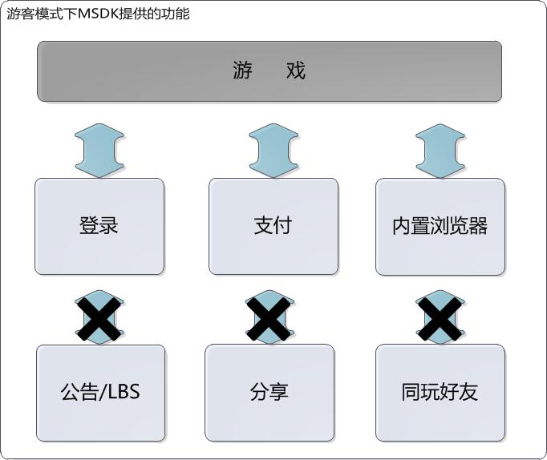
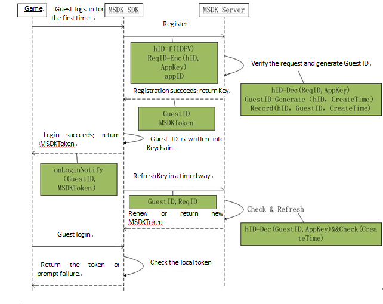
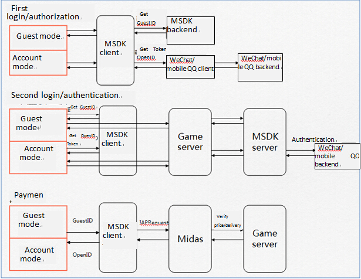
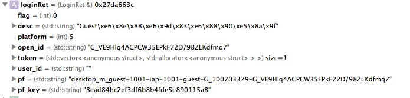

Guest Mode
===

## Content and function
 - In the MSDK Guest mode, the existing features of MSDK are as follows:

---

## Log sequence diagram
 - In Guest mode, login is divided into two sequences: registration and login. But the difference between the two scenes is shielded by MSDK. But games do not need to care for the difference between the two scenes. Here only make a scheme to explain it:

---

## Process comparison
 - Comparison between OpenID system and Guest mode processes

---

## Changes needed to make
###Step1: How to log in Guest mode
- Call the following code
```
WGPlatform* plat = WGPlatform::GetInstance();
    // If there is no OB, please set it at first
    MyObserver* ob = new MyObserver();
    plat->WGSetObserver(ob);
    plat->WGSetPermission(eOPEN_ALL);
    plat->WGLogin(ePlatform_Guest);
```

- 2.4.0i and later versions can also use delegate. The code is as follows:
```
[MSDKService setMSDKDelegate:self];
MSDKAuthService *authService = [[MSDKAuthService alloc] init];
[authService setPermission:eOPEN_ALL];
[authService login:ePlatform_Guest];
```

###Step2: onLoginNotify callback
 - LoginRet returned by onLoginNotify is as follows:
 
If the registration error (eFlag_Guest_RegisterFailed) is returned, it is suggested to call WGResetGuestID to initiate the registration request again. GuestID obtained after the successful registration will be written into Keychain. After App is deleted, its re-installation will not lose the visitor progress, either.

- 2.4.0i and later versions can also use delegate. The code is as follows:
```
-(void)OnLoginWithLoginRet:(MSDKLoginRet *)ret
{
    //The internal implementation logic is the same with void MyObserver::OnLoginNotify(LoginRet& loginRet)
}
```

###Step3: How to pay
 - The current version of payment is consistent with the previous version. Both versions have the same process: registerPay->pay, but their parameters are slightly different. Note the value pass of session_id and session_type.
```
registerPay:
 WGPlatform* plat = WGPlatform::GetInstance();
    if (!plat->WGIsSupprotIapPay())
    {
        NSLog(@"Not support IAP payment");
        return;
    }
    
    LoginRet ret;
    int retCode = plat->WGGetLoginRecord(ret);
    //    plat->WGRegisterPay();
    std::string openid = ret.open_id;
    std::string paytoken;    
    std::string sessionId;
    std::string sessionType;    
    if (retCode == ePlatform_Guest)
    {
        for(int i=0;i<ret.token.size();i++)
        {
            TokenRet* pToken = &ret.token[i];
            if(pToken->type == eToken_Guest_Access)
            {
                paytoken = pToken->value;
                break;
            }
        }
        sessionId = "hy_gameid";
        sessionType = "st_dummy";
    }
    std::string pf = plat->WGGetPf();
    std::string pfKey = plat->WGGetPfKey();    
    plat->WGRegisterPay(
                        ((unsigned char*)"1450000495"),
                        (unsigned char *)openid.c_str(),
                        (unsigned char *)paytoken.c_str(),
                        (unsigned char *)sessionId.c_str(),
                        (unsigned char *)sessionType.c_str(),
                        NULL
                        );
Pay:
    WGPlatform* plat = WGPlatform::GetInstance();
    if (!plat->WGIsSupprotIapPay())
    {
        NSLog(@"Not support IAP payment");
        return;
    }
    LoginRet ret;
    int retCode = plat->WGGetLoginRecord(ret);
    std::string openid = ret.open_id;
    std::string paytoken;
    
    std::string sessionId;
    std::string sessionType;
    if (retCode == ePlatform_Guest)
    {
        for(int i=0;i<ret.token.size();i++)
        {
            TokenRet* pToken = &ret.token[i];
            if(pToken->type == eToken_Guest_Access)
            {
                paytoken = pToken->value;
                break;
            }
        }
        sessionId = "hy_gameid";
        sessionType = "st_dummy";
    }
    
    std::string pf = "desktop_m_qq-10001-iap-10001";//plat->WGGetPf();
    std::string pfKey = "abcdefg";//plat->WGGetPfKey();
    
    plat->WGSetIapEnvirenment((unsigned char*)"test");//test: set the sandbox environment;  release: the current network environment [supplementary notes]
    unsigned char * payItem = (unsigned char*)PayPayitem;
    unsigned char * productId = (unsigned char*)PayProductid;
    
    bool isDepositGameCoin = true;
    uint32_t productType = 0;
    uint32_t quantity = 1;
    unsigned char * zoneId = (unsigned char*)"1";
    unsigned char * varItem = (unsigned char*)"com.lightspeed.weshoothd.600*1";
    
    MyObserver* ob = new MyObserver();
    plat->WGSetObserver(ob);
    
    plat->WGSetIapEnalbeLog(true);
    
    plat->WGPay(
                ((unsigned char*)"1450000495"),
                (unsigned char *)openid.c_str(),
                (unsigned char *)paytoken.c_str(),
                (unsigned char *)sessionId.c_str(),
                (unsigned char *)sessionType.c_str(),
                payItem, productId,
                isDepositGameCoin, productType,
                quantity,
                zoneId,
                varItem,
                (unsigned char*)"dsafasdfa"
                ); 
```

###Step4: Call the function that cannot be called
 - 	Return eFlag_InvalidOnGuest in the corresponding callback

###Step5: How to reset the Guest account
 - 	After GameServer clears the relevant data, the following code can be called to remove the Guest account data left by MSDK in the terminal. When you log in Guest mode next time, the system will generate a new Guest account.
```
WGPlatform* plat = WGPlatform::GetInstance();
plat->WGResetGuestID();
```

-  2.4.0i and later versions can also use delegate. The code is as follows:
```
[MSDKService setMSDKDelegate:self];
MSDKAuthService *authService = [[MSDKAuthService alloc] init];
[authService resetGuestId];
```**Notes: ** Guest mode account number and game data are limited to the machine for use. That the mobile phone restores the factory settings or is set to be a new iPhone after being upgrading via iTunes will lead to the removal of the machine’s visitor data.