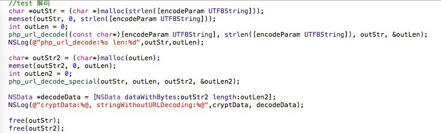
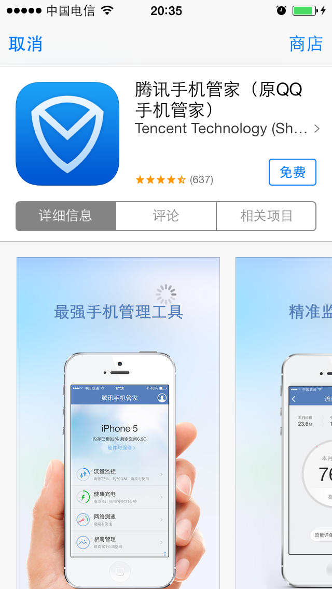
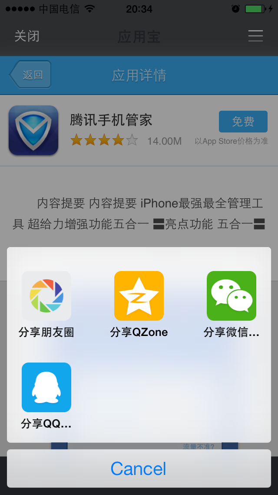

Built-in Webview
===

## Overview
 - The feature is available after MSDK1.6.1, and it needs to be compiled with XCode5.0 and higher versions.
Call the following code to open the specified URL.
```
WGPlatform* plat = WGPlatform::GetInstance();
plat->WGOpenUrl((unsigned char*)[url UTF8String]);
```
---

## Precautions in the use of the module
 - The WebView module customizes UI via xib, which is placed in WGPlatformResources.bundle/ directory. PNG files and other resources used by xib are placed in WGPlatformResources.bundle/WebViewResources directory. Because the module needs to be compatible with iOS7.0, it needs Xcode5.0 and higher versions to edit.
 - Mobile QQ sharing limits the length of URL within 512 bytes, so a ultra long links needs to be turned into a short link.
---

## Encrypted transmission of login state parameters
  - ### Overall scheme
If the game is logged in, the built-in Webview carries login state parameters when accessing webpages. Specific steps are as follows:
1. MSDK encrypts these parameters and delivers then to the page;
2. After getting the cipher text, the page calls MSDK’s backend decryption interface to get the clear text;
3. Make the login validation via Token in the clear text.

  - ### Parameters contained in URL
  - Parameters which MSDK adds behind URL are shown as follows. Please do not pass in the repeated parameter, for this can result in decryption failure:

|Parameter name|	Description	|Value|
|--|--|--|
|timestamp|	request timestamp||	
|appid |	game ID |	　|
|algorithm|	encryption algorithm logo|	v1|
|msdkEncodeParam|	cipher text|	　|
|version|	MSDK version number|	for example 1.6.2i|
|sig|	signature of the request itself|	|
|encode|	coding parameters|	1|
|openid|	The only identifier returned by the platform after the user's authorization | | 

 
  - ### Encrypted data
  - The logon state parameter to be encrypted are shown as follows:

|Parameter name|	Description|	Value|
|--|--|--|
|acctype |	 account type|	qq/wx|
|appid 	| game ID	　||
|openid |	The only identifier returned by the platform after the user's authorization ||
|access_token|	token authorized by the user |	　|
|platid 	| terminal type||	0.iOS；1.Android|
 
    
   - Describe this with example. Supposed that the URL launched by built-in Webview is http://apps.game.qq.com/ams/gac/index.html, but the URL which the capturing packet can actually see and access is as follows:
http://apps.game.qq.com/ams/gac/index.html?sig=***&timestamp=**&appid=***&openid=***&algorithm=v1&msdkEncodeParam=***&version=1.6.2i&encode=1 
   - Wherein what msdkEncodeParam transmits is actually the cipher text gotten by encrypting the following parameters (url encode):
acctype=weixin&appid=100732256&openid=ol7d0jsVhIm3BQwlNG9g2f4puyUg&access_token=OezXcEiiBSKSxW0eoylIeCKi7qrm-
vXrr62qKiSw2otDBgCzzKZZfeBOSv9fplYsIPD844sNIDeZgG3IyarYcGCNe8XuYKHncialLBq0qj9-rVGhoQVkgSYJ8KXr9Rmh8IvdqK3zsXryo37sMJAa9Q&platid=0

- ### How to decrypt
- After the business page gets the above URL, the assembly request will call MSDK’s decryption interface. The decryption interface now has two kinds of transmission schemes. Based on the algorithm parameters, the business backend realizes and is compatible with the two encrypted parameter transmission schemes:
- In MSDK1.7.1i and later versions, the encrypted parameter transmission scheme is as follows: (the following URL is MSDK test environment).
http://msdktest.qq.com/comm/decrypv1/?sig=***&timestamp=**&appid=***&openid=***&algorithm=v2&version=1.7.1i&encode=1
	For the cipher text value in msdkEncodeParam gotten in the first step, directly place it in body via Post mode and then transmit it in the Post mode. Note: don’t need to add key”msdkEncodeParam= ".
- Before MSDK1.7.1i, the encrypted parameter transmission scheme is as follows: (the scheme is no longer used in the terminal, but the backend needs to realize and be compatible with the old version).
http://msdktest.qq.com/comm/decrypv1/?sig=***&timestamp=**&appid=***&openid=***&algorithm=v1&version=1.6.2i&encode=1 
 Decode the cipher text URL in msdkEncodeParam, place it in body and then transmit it in the Post mode. Note: don’t need to add key”msdkEncodeParam= ". The capturing packet is as follows:

- ### Demo code for decoding the cipher text (PHP version)
- Demo code:
```php
<?php
//var_dump($argv);
$getparam = urldecode($argv[1]);
$postparam = $argv[2];
$algorithm = $argv[3];
//$sUrl = "http://msdktest.qq.com/comm/decrypv1/?" . $getparam;
$sUrl = "http://msdktest.qq.com/comm/decrypv1/?" . $getparam;
//var_dump($sUrl);
//var_dump($postparam);
$curl  =  curl_init();
curl_setopt( $curl, CURLOPT_URL, $sUrl );
curl_setopt( $curl, CURLOPT_RETURNTRANSFER,1 );
curl_setopt( $curl, CURLOPT_CUSTOMREQUEST, "POST" );
$str = $algorithm == "v2" ? $postparam : urldecode(urldecode($postparam));
curl_setopt( $curl, CURLOPT_POSTFIELDS, $str );
try{
	$data = curl_exec($curl);
} catch ( exception $e ){
	print $e->getMessage().$sUrl;
}
curl_close($curl);
print $data;
?>
```
- ### Demo code for decoding the cipher text (C version)
1. Import the two files:

```
#ifndef URL_H
#define URL_H

#ifdef __cplusplus
extern "C" {
#endif
    int php_url_decode(const char *str, int len, char *out, int *outLen);
    char *php_url_encode(char const *s, int len, int *new_length);
    int php_url_decode_special(const char *str, int len, char *out, int *outLen);
#ifdef __cplusplus
}
#endif
#endif /* URL_H */
```

```
#include <stdlib.h>
#include <string.h>
#include <ctype.h>
#include <sys/types.h>
#include <stdio.h>
#include "UrlCoding.h"
static unsigned char hexchars[] = "0123456789ABCDEF";
static int php_htoi(const char *s)
{
	int value;
	int c;
    
	c = ((unsigned char *)s)[0];
	if (isupper(c))
		c = tolower(c);
	value = (c >= '0' && c <= '9' ? c - '0' : c - 'a' + 10) * 16;
    
	c = ((unsigned char *)s)[1];
	if (isupper(c))
		c = tolower(c);
	value += c >= '0' && c <= '9' ? c - '0' : c - 'a' + 10;
    
	return (value);
}
char *php_url_encode(char const *s, int len, int *new_length)
{
	register unsigned char c;
	unsigned char *to, *start;
	unsigned char const *from, *end;
	
	from = (unsigned char *)s;
	end  = (unsigned char *)s + len;
	start = to = (unsigned char *) calloc(1, 3*len+1);
    
	while (from < end)
	{
		c = *from++;
        
		if (c == ' ')
		{
			*to++ = '+';
		}
		else if ((c < '0' && c != '-' && c != '.') ||
				 (c < 'A' && c > '9') ||
				 (c > 'Z' && c < 'a' && c != '_') ||
				 (c > 'z'))
		{
			to[0] = '%';
			to[1] = hexchars[c >> 4];
			to[2] = hexchars[c & 15];
			to += 3;
		}
		else
		{
			*to++ = c;
		}
	}
	*to = 0;
	if (new_length)
	{
		*new_length = to - start;
	}
	return (char *) start;
}
int php_url_decode(const char *str, int len, char *out, int *outLen)
{
    const char *data = str;
    char *orgOut = out;
	while (len--)
	{
		if (*data == '+')
		{
			*out = ' ';
		}
		else if (*data == '%' && len >= 2 && isxdigit((int) *(data + 1)) && isxdigit((int) *(data + 2)))
		{
			*out = (char) php_htoi(data + 1);
			data += 2;
			len -= 2;
		}
		else
		{
			*out = *data;
		}
		data++;
		out++;
	}
//	*out = '/0';
    *outLen = out - orgOut;
	return *outLen;
}
// The decoding method designed specially for encodeForURL in WGCommonMethods.h haywoodfu 2014-04-23
int php_url_decode_special(const char *str, int len, char *out, int *outLen)
{
    const char *data = str;
    char *orgOut = out;
	while (len--)
	{
		if (*data == '+')
		{
			*out = ' ';
		}
		else if (*data == '%' && len >= 2 && isxdigit((int) *(data + 1)) && isxdigit((int) *(data + 2)))
		{
            int value = 0;
            sscanf((data+1), "%2x", &value);
			*out = (char) value;
			data += 2;
			len -= 2;
		}
		else
		{
			*out = *data;
		}
		data++;
		out++;
	}
//	*out = '/0';
    *outLen = out - orgOut;
	return *outLen;
}
```

2. The incoming string encodeParam is decoded with php_url_decode and php_url_decode_special, respectively, and what is resulted is the encrypted text.


---

## The game’s custom transmission parameters
The game can add key-value parameters behind URL as the URL's supplemental information, such as: http://***.com?key1=value1&key2=value2

---

## Judge if App is installed.
- Add the following JS code to your web page. This way, you can determine whether the corresponding App is installed in your web page:
```
document.addEventListener('WebViewJavascriptBridgeReady', onBridgeReady, false)
function onBridgeReady(event) {
var bridge = event.bridge
bridge.init(function(message, responseCallback) {
var data = { 'Javascript Responds':'Wee!' }
responseCallback(data)
})
bridge.callHandler('getInstallState', {'packageName':'com.tencent.news','packageUrl' :'qqnews://can_open_me_if_install_and_regeister_this_scheme'
}, function(msg) {
if(msg.indexOf("get_install_state:yes") > -1) {
log("install: Tencent News");} 
else {
log("not install: Tencent News");
}
})
```

---

## Open the details page of App Store within the application
(iOS6.0 and higher versions) Click on the iTunes link （http://itunes.apple.com/cn/app/id439638720?mt=8) in your web page. This way, you can open the details page of the application in App Store within the application, as shown in the following picture:


---

## Share
Click the “Share” button to share the current page to the WeChat moment, QZone, WeChat friends and QQ friends, as shown in the following picture. Please note that the maximum length of URL for sharing in mobile QQ is 512 bytes; if the URL is very long, please use a short URL.


---