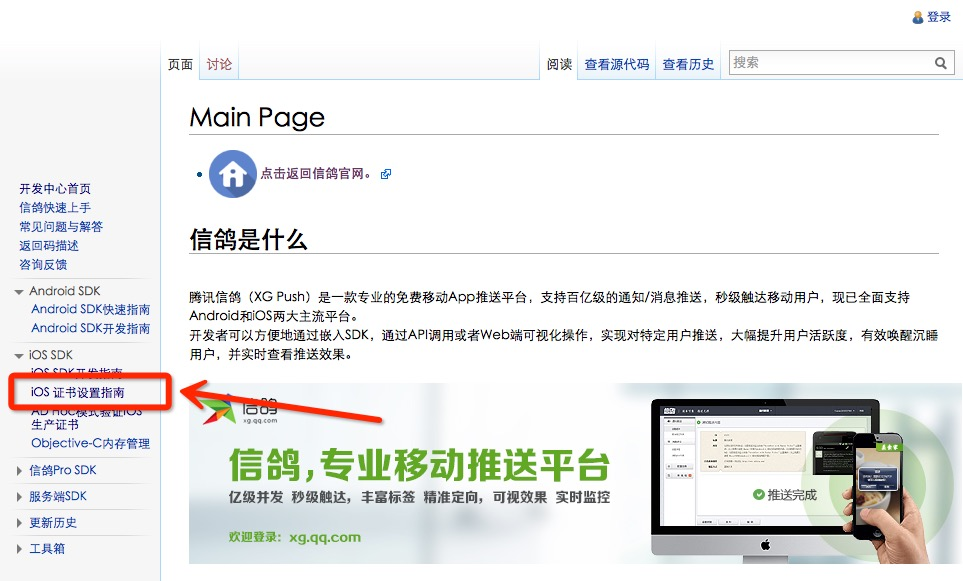
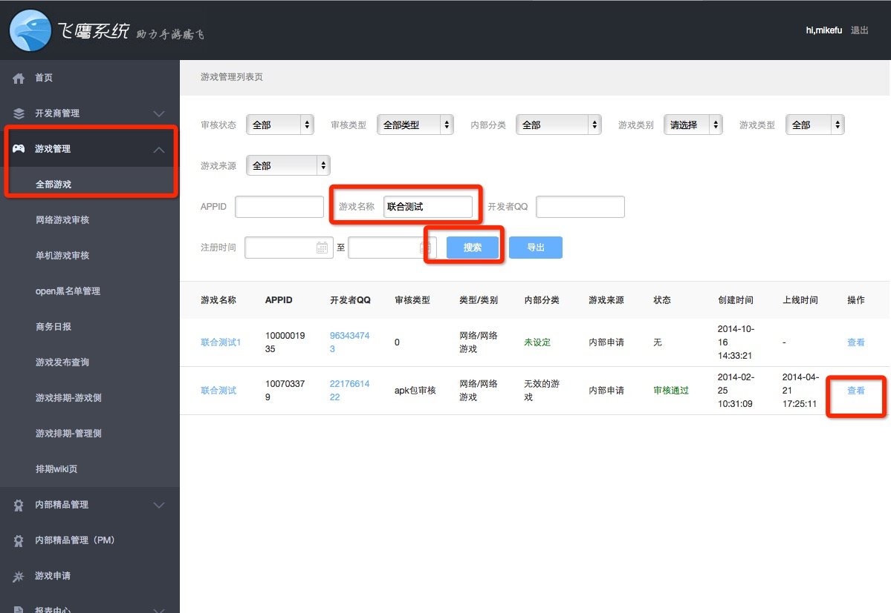
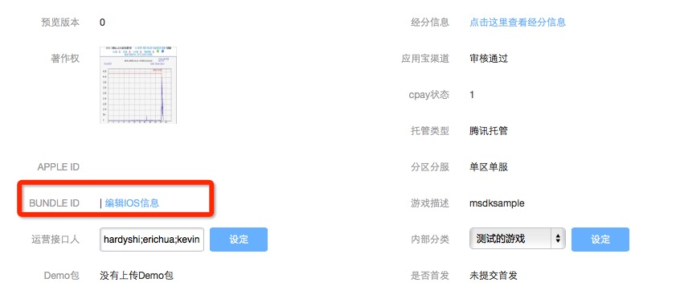
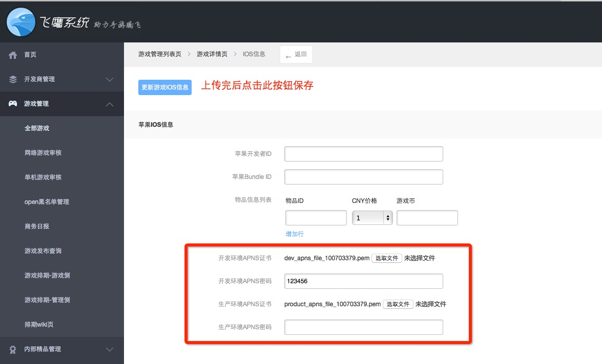
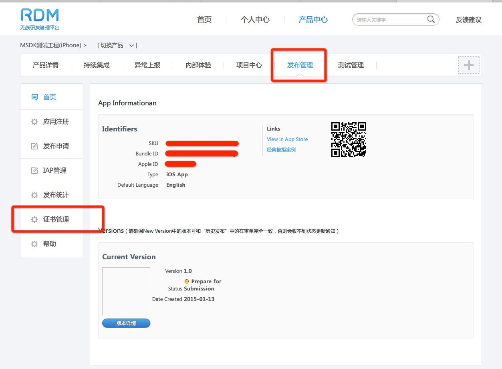

Message Push
===

 > From MSDK2.2 on, MSDK has begun to access the Pigeon push module.   [ Pigeon official website ](http://xg.qq.com/)。

## Overview

- configure the push switch in info.plist, as shown below:

When updating MSDK2.3.0, games which have accessed Pigeon push don’t need to configure this switch or set it as OFF if they want to turn off MSDK’s Pigeon push. Other games must configure this switch as ON if they want to access MSDK’s Pigeon push
In versions higher than MSDK2.4.0i, the value has been changed to Boolean. Please note to modify Info.plist.

- MSDK iOS push is realized by relying on Apple's APNS. You need to open the push function of the application in developer.apple.com and produce the push certificate and signature file (.Mobileprovision).
- Push SSL certificate: MSDK needs to use this certificate to send the push message to the application, so you need to send the certificate and password to MSDK. Configure the certificate in dev.ied.com
- Signature file: The game is required to set this signature file in the Build PhasesProvisioning Profile of the project when it is put online.
- The game also needs to implement the 5 push-related methods in UIApplicationDelegate:
>*When the game tests MSDK’s push function, it needs to use formal push certificate to package and test the push message in AD HOC way. >Note: don’t use push messages in the full-amount way! 

##Produce and upload PEM certificate 
- Produce certificate 

Produce PEM certificate according to the official website of Pigeon, [production steps] (http://developer.xg.qq.com/index.php/IOS_%E8%AF%81%E4%B9%A6%E8%AE%BE%E7%BD%AE%E6%8C%87%E5%8D%97). 

If the production steps have no content when they are opened, [click here] (http://developer.xg.qq.com/index.php/Main_Page), and  then click iOS SDK->iOS Certificate Settings Guide in the left navigation bar in the opened page, as shown below: 

 
- Upload certificate
- 
### Step1: 
Enter [the Eagle system] (http://dev.ied.com), click Game Management -> All Games in the left navigation bar and search your own game. Here, take MSDK for example, as shown below: 



### Step2: 
Click the “View” button in the above image to enter the game’s details page and find the information shown below.: 

 

### Step3: 
Click the “Edit iOS Information” button in the image above to enter the iOS information page, as shown below: 

 

Separately upload the PEM certificate of the development environment and production environment produced and generated according to the steps given in the Pigeon website. If the certificate does not set the password, the password item can not be filled. Finally, click the “Update the Game’s iOS Information” button on the upper left corner to save the info. 

**Note:** 
The certificate of the production environment needs to download from RDM. The specific download path: Game products - > Publishing management - > Certificate management. Take MSDK for example, as shown below: 

 

In the opened page, download the corresponding xxx_push.p12 file, open the terminal to enter the directory where the xxx_push.p12 file is located to perform the following command:

```
openssl pkcs12 -in xxx_push.p12 -out xxx_push.pem -nodes

```
Upload the generated xxx_push.pem file into the Eagle system.

## Registration push
- In the overview, only when the signature file is configured correctly can the registration be pushed successfully.
The game needs to call MSDK’s WGRegisterAPNSPushNotification method in didFinishLaunchingWithOptions method to push the registration.
Demo code:
```
- (BOOL)application:(UIApplication *)application didFinishLaunchingWithOptions:(NSDictionary *)launchOptions
{
    …
    [WGApnsInterface WGRegisterAPNSPushNotification:launchOptions];
    …
} 
```

- 2.4.0i and later versions may also use the following mode:
```
-(BOOL)application:(UIApplication *)application didFinishLaunchingWithOptions:(NSDictionary *)launchOptions
{
	…
	[MSDKXG WGRegisterAPNSPushNotification:launchOptions];
	…
}
```

---

## Registration push is successful
 - When the registration push is successful, the game will receive callback from didRegisterForRemoteNotificationsWithDeviceToken method. The game needs to call WGSuccessedRegisterdAPNSWithToken method in the above method to report deviceToken to MSDK.
Demo code:
```
- (void)application:(UIApplication *)application didRegisterForRemoteNotificationsWithDeviceToken:(NSData *)deviceToken
{
    [WGApnsInterface WGSuccessedRegisterdAPNSWithToken:deviceToken];
} 
```

- 2.4.0i and later versions may also use the following mode:
```
-(void)application:(UIApplication *)application didRegisterForRemoteNotificationsWithDeviceToken:(NSData *)deviceToken
{
	[MSDKXG WGSuccessedRegisterdAPNSWithToken:deviceToken];
}
```

---

## Registration push fails
- When the registration fails, the game will receive callback from didFailToRegisterForRemoteNotificationsWithError method. The game needs to call WGFailedRegisteredAPNS method to notify MSDK that the registration push fails.

Demo code:
```
- (void)application:(UIApplication *)application didFailToRegisterForRemoteNotificationsWithError:(NSError *)error
{
    [WGApnsInterface WGFailedRegisteredAPNS];
} 
```

- 2.4.0i and later versions may also use the following mode:
```
-(void)application:(UIApplication *)application didFailToRegisterForRemoteNotificationsWithError:(NSError *)error
{
	[MSDKXG WGFailedRegisteredAPNS];
}
```

---


## Receive messages
 After the registration push is successful, the application will receive the push message and enter the didReceiveRemoteNotification method. The game needs to call the WGReceivedMSGFromAPNSWithDict method in the above method to push the message to MSDK for parsing. The parsing results will be sent to the game.
Demo code:
```
- (void)application:(UIApplication *)application didReceiveRemoteNotification:(NSDictionary *)userInfo
{
    [WGApnsInterface WGReceivedMSGFromAPNSWithDict:userInfo];
} 
```

- 2.4.0i and later versions may also use the following mode:
```
-(void)application:(UIApplication *)application didReceiveRemoteNotification:(NSDictionary *)userInfo
{
	[MSDKXG WGReceivedMSGFromAPNSWithDict:userInfo];
}
```

---

## Clear badge

 - The application needs to call WGCleanBadgeNumber method in the applicationDidBecomeActive method to clear the push items on the upper right corner of the application desktop icon.
Demo code:
```
- (void)applicationDidBecomeActive:(UIApplication *)application
{
    [WGApnsInterface WGCleanBadgeNumber];
} 
```

- 2.4.0i and later versions may also use the following mode:
```
-(void)applicationDidBecomeActive:(UIApplication *)application
{
	[MSDKXG WGCleanBadgeNumber];
}
```