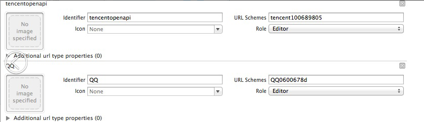
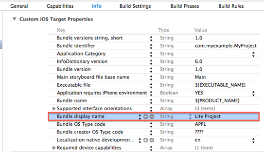

QQ Access
===

## Access configuration

  * Add configuration items in `Target->Info->Custom iOS Target Properties` under the Project Configuration. Major configuration items are as follows:

  
  
| Key      |    Type | Value  | Remarks | Relevant modules |
| :-------- | --------:| :-- |:--|:---:|
| QQAppID  | String |  Vary with games | mobile QQ’s AppID| All|
| QQAppKey | String |  Vary with games | mobile QQ’s AppKey| All|
  
  *	Configure URL Scheme in `Target->Info->URL Types` under the Project Configuration. The configuration is as follows:
    
	
  
| Identifier|    URL Scheme |  Example |  Remarks   |
| :-------- | :--------| :--: | :--: |
| tencentopenapi  | Format: tencent+ the game’s QQAppID |tencent100703379|  Access to mobile QQ is required; no spaces within it   |
| QQ  | Format: QQ+ the game’s QQAppID hexadecimal |QQ06009C93 | Access to mobile QQ is required; no spaces within it   |
| QQLaunch  | Format: tencentlaunch+ the game’s QQAppID |tencentlaunch100703379|  Access to mobile QQ is required; no spaces within it   |

   > **Note: 
  1. Various games’ configurations are inconsistent. For details, please consult the contact person between each game and MSDK or RTX to contact "Link to MSDK".
  2. When creating a project, Xcode6.0 may not configure Bundle Display Name, but OpenSDK needs this configuration so that it can start properly, so make sure that this attribute is present. If not, please configure it. **
  
 ---
## Authorized login
 ### Overview
-Authorize by evoking mobile QQ client or web page; after the authorization is completed successfully, return openId, accessToken, payToken, pf and pfKey to the game.
 It is needed to call WGSetPermission and WGLogin interfaces to complete the mobile QQ authorization
```
void WGSetPermission(unsigned int permissions);
```

> Description: Set a list of permissions required to be authorized by the user when logging in QQ
 Parameter:
 - permissions WGQZonePermissions have defined all the permissions, from which you can select the required permission or calculation result, which is this parameter.

 - 
```
void WGLogin(ePlatform platform);
```
> Description: Log in the unified interface to pass _ePlatform ePlatform_QQ to call mobile QQ authorization
 Parameters:
   - Pass _ePlatform ePlatform_QQ to call mobile QQ client authorization
   - In the case of having set the global callback object, the authorization result, no matter whether success or failure, is called back to the game through OnLoginNotify (LoginRet ret). LoginRet.platform is the currently authorized platform. LoginRet.flag marks the authorized result:
    eFlag_Succ // success
        eFlag_QQ_NoAcessToken // mobile QQ authorization fails, and accesstoken can’t be gotten
        eFlag_QQ_UserCancel //the user cancels mobile QQ authorization
        eFlag_QQ_LoginFail // mobile QQ authorization fails
        eFlag_QQ_NetworkErr // network failure

#### Demo code
- Authorization call code is as follows:
```
WGPlatform* plat = WGPlatform::GetInstance();//Initialize MSDK
MyObserver* ob = new MyObserver();
plat->WGSetObserver(ob);//Set a callback
plat->WGSetPermission(eOPEN_ALL);//Set the permission to authorize
plat->WGLogin(ePlatform_QQ);//call mobile QQ client or web to authorize
```
- Authorization callback code is as follows:
```
void MyObserver::OnLoginNotify(LoginRet& loginRet)
{
if(eFlag_Succ == loginRet.flag)
{
    …//login success
    std::string openId = loginRet.open_id;
    std::string payToken;
    std::string accessToken;
    if(ePlatform_QQ == loginRet.Platform)
    {
        for(int i=0;i< loginRet.token.size();i++)
        {
            TokenRet* pToken = & loginRet.token[i];
            if(eToken_QQ_Pay == pToken->type)
            {
                paytoken = pToken->value;
            }
            else if (eToken_QQ_Access == pToken->type)
{
     accessToken = pToken->value;
}
        }
    }
else if (ePlatform_Weixin == loginRet.platform)
{
        ….
}
} 
else
{
    …//login fails
     NSLog(@"flag=%d,desc=%s",loginRet.flag,loginRet.desc.c_str()); 
}
}
```
- 2.4.0i and later versions can still use delegate mode; the code is as follows:
```
[MSDKService setMSDKDelegate:self];
MSDKAuthService *authService = [[MSDKAuthService alloc] init];
[authService setPermission:eOPEN_ALL];
[authService login:ePlatform_QQ];
```
-  Callback code is as follows:
```
-(void)OnLoginWithLoginRet:(MSDKLoginRet *)ret
{
    //The internal logic is the same with that of void MyObserver::OnLoginNotify(LoginRet& loginRet)
}
```


#### Precautions:

- Only mobile QQ 4.0 and higher version support client authorization
- If mobile QQ is not installed or configured wrongly, the system will enter the web authorization, which should evoke the in-built webVeiw authorization of mobile QQ. If any external browser is evoked, please contact “Link to MSDK” through RTX.
- scheme tencentopenapi in URL Types must be correctly configured in order to evoke mobile QQ client authorization.

---
## Quick login
### Overview
- In the mobile QQ game list or share link, directly pass the logged account information of mobile QQ to the game to achieve login and do not require the game to reauthorize.

- Required environment:
>1. MSDK 1.8.0i and above;
>2. Mobile QQ 4.6.2 and above;
>3.  The game’s configuration scheme:
	

- Success means carrying openId, accessToken, payToken, pf and pfKey when the game is launched

- Quick login and account inconsistency results are returned in flag of wakeupRet. The relevant description of flag is shown below:
 `` `
 eFlag_Succ:
 Account inconsistency does not exist, and the game is successfully evoked. The URL of App evoked in this case does not carry any token and is consistent with the evoked results of previous versions.
 eFlag_AccountRefresh:
 Account inconsistency does not exist. MSDK refreshes the local account token with the token information carried by URL of the evoked App.
eFlag_UrlLogin:
 Account inconsistency does not exist. The game is successfully logged in through the quick login information. After the game receives this flag, it directly reads the token in LoginRet structure for the game authorization process
 eFlag_NeedLogin:
 The game’s local account and the evoked account are unable to log in. After the game receives this flag, it needs to pop out the login page to allow the user to log in.
 eFlag_NeedSelectAccount:
 The game’s local account and the evoked account have inconsistency. After receiving this flag, the game needs to pop out a dialog box to allow the user to select a login account.
 When the flag is eFlag_NeedSelectAccount, the game needs to pop out a dialog box to allow the user to select the original account or the account carried by quick login. This is the logic which the mobile QQ platform requires any game to implement. If a game does not implement the logic, it will be refused to be put online when the platform audits it.
 
```

Prompt example (the interface is implemented by each game)
 ! [Alt text] (./ QQ5.png)


 - After the user selects an account, need to call WGSwitchUser interface for the subsequent logic processing of account inconsistency (two options need to call the following interface. For details, see Demo code).
 `` `
 bool WGSwitchUser (bool flag);
 `` `
 > Description: Log in the game through an external evoked URL. The interface is called in case that the user chooses to use an external evoked account when account inconsistency occurs.
 Parameters:
 > - Flag
 > - YES indicates that the user needs to switch to an external account. At this time, the interface will use the last saved account inconsistency login data for login. After successful login, the result will be called back through onLoginNotify; if there is no token or the token is an invalid function, NO will be returned and the onLoginNotify callback will not occur.
 > - NO indicates that the user continues to use the original account. At this moment, delete the saved account inconsistency data to avoid confusion.
 Return: If there is no token or the token is invalid, return NO; otherwise, return YES.


### Demo code

- Add the callback setting code for evoking app
```
-(BOOL)application:(UIApplication*)application openURL:(NSURL *)url sourceApplication:(NSString *)sourceApplication annotation:(id)annotation
{
    NSLog(@"url == %@",url);
    WGPlatform* plat = WGPlatform::GetInstance();
    WGPlatformObserver *ob = plat->GetObserver();
    if (!ob) {
        MyObserver* ob = new MyObserver();
        ob->setViewcontroller(self.viewController);
        plat->WGSetObserver(ob);
    }
    return [WGInterface HandleOpenURL:url];
}
```
- Demo code for callback evocation is shown as follows:
```
void MyObserver::OnWakeupNotify (WakeupRet& wakeupRet)
{
	switch (wakeupRet.flag) 
	{
	    case eFlag_Succ:[viewController setLogInfo:@" Evocation succeeds"];
		break;
		case eFlag_NeedLogin:[viewController setLogInfo:@” Account inconsistency occurs; you need to enter the login page"];
	    break;
		case eFlag_UrlLogin:[viewController setLogInfo:@” Account inconsistency occurs; log in successfully through external evocation"];
	    break;
		case eFlag_NeedSelectAccount:
		{
		    [viewController setLogInfo:@” Account inconsistency occurs; it is needed to prompt the user to select an account"];
		    UIAlertView *alert = [[[UIAlertView alloc]initWithTitle:@" account inconsistency " message:@" Account inconsistency is found. Please choose to use which account for login" delegate:viewController cancelButtonTitle:@" Don’t switch the account. Use the original account" otherButtonTitles:@" Switch to the external account for login", nil] autorelease];
		     [alert show];
		}
	    break;
	 	case eFlag_AccountRefresh:[viewController setLogInfo:@" The external account and the logged account are the same. Use the external token to replace the local token"];
	    break;
	 	default:
	    break;
	}
	
    if(eFlag_Succ == wakeupRet.flag ||
eFlag_NeedLogin == wakeupRet.flag ||
eFlag_UrlLogin == wakeupRet.flag ||
eFlag_NeedSelectAccount == wakeupRet.flag ||
eFlag_AccountRefresh == wakeupRet.flag)
    {
 		[viewController setLogInfo:@" Evocation succeeds"];
    }
    else
   	{
 		[viewController setLogInfo:@" Evocation fails"];
   	}
} 

- (void)alertView:(UIAlertView *)alertView clickedButtonAtIndex:(NSInteger)buttonIndex 
{
   	BOOL switchFlag = NO;
   	switch (buttonIndex) 
   	{
      	case 0:
     	NSLog(@" The user chooses not to switch the account");
     	break;
	 	case 1:
	 	{
	     	NSLog(@" The user chooses to switch the account ");
	     	switchFlag = YES;
	 	}
	     break;
	 	default:
	     break;
            
    }
    WGPlatform* plat = WGPlatform::GetInstance();
    plat->WGSwitchUser(switchFlag);
 }
```

### Precautions
-  Only mobile QQ 4.6 and higher versions support quick login.
- scheme in URL Types needs to configure tencentlaunch+AppID, the login information carried only when the game is launched.

## Query the relation chain of mobile QQ

- ### Query personal information
#### Overview
The user can only get opened and accessToken through mobile QQ authorization. At this time, the game requires the user’s nickname, gender, head portrait and other information. After mobile QQ authorization is successfully completed, the game can call WGQueryQQMyInfo to get the personal information.
```
bool WGQueryQQMyInfo();
```
>Description: Get the basic information of the user’s QQ account
Return value:
  - false: mobile QQ does not authorize or AppID and other parameters are configured incorrectly
  -  true: No parameter anomalies
The return value is called back to the game through OnRelationNotify(RelationRet& relationRet)
In PersonInfo in RelationRet structure in mobile QQ, province and city fields are empty; the sizes of small, medium and large pictures are 40, 40 and 100 (pixel), respectively.

#### Call code example:
```
WGPlatform *plat = WGPlatform::GetInstance();
plat->WGQueryQQMyInfo();
```
#### Callback code example:

```
OnRelationNotify(RelationRet &relationRet)
{
    NSLog(@"relation callback");
    NSLog(@"count == %d",relationRet.persons.size());
    for (int i = 0; i < relationRet.persons.size(); i++)
    {
        PersonInfo logInfo = relationRet.persons[i];
        NSLog(@"nikename == %s",logInfo.nickName.c_str());
        NSLog(@"openid==%s",logInfo.openId.c_str());
    }
}
```

- 2.4.0i and later versions can also use delegate mode; the code is shown as follows:
```
[MSDKService setMSDKDelegate:self];
MSDKRelationService *service = [[MSDKRelationService alloc] init];
[service queryMyInfo];
```
-  callback code is as follows:
```
-(void)OnRelationWithRelationRet:(MSDKRelationRet *)ret
{
    //The internal logic is the same with that of OnRelationNotify(RelationRet &relationRet)
}
```

 ### Query game friends’ information
####Overview
- After the game is authorized, the game needs to query the nickname, gender, head portrait, openid and other information of the user’s game friends. The game can call WGQueryQQGameFriendsInfo to get such information.
```
bool WGQueryQQGameFriendsInfo();
```
>Description: Get the basic information of the user’s QQ game friends
Return value:
  - false: mobile QQ does not authorize or AppID and other parameters are configured incorrectly
  - true: No parameter anomalies
Call back to the game through OnRelationNotify(RelationRet& relationRet)
In PersonInfo of RelationRet structure in mobile QQ, province and city fields are empty; the sizes of small, medium and large pictures are 40, 40 and 100 (pixel), respectively.

- Call code example:
```
WGPlatform *plat = WGPlatform::GetInstance();
plat->WGQueryQQGameFriendsInfo();
Callback code example:
OnRelationNotify(RelationRet &relationRet)
{
    NSLog(@"relation callback");
    NSLog(@"count == %d",relationRet.persons.size());
    for (int i = 0; i < relationRet.persons.size(); i++)
    {
        PersonInfo logInfo = relationRet.persons[i];
        NSLog(@"nikename == %s",logInfo.nickName.c_str()]);
        NSLog(@"openid==%s",logInfo.openId.c_str();
    }
}
```
- 2.4.0i and later versions can also use delegate mode; the code is shown as follows:
```
[MSDKService setMSDKDelegate:self];
MSDKRelationService *service = [[MSDKRelationService alloc] init];
[service queryMyGameFriendsInfo];
```
-  callback code is as follows:
```
-(void)OnRelationWithRelationRet:(MSDKRelationRet *)ret
{
    //The internal logic is the same with that of OnRelationNotify(RelationRet &relationRet)
}
```

#### Precautions
-  mobile QQ authorization is successful
---

## mobile QQ structured message sharing
  
-   ###Overview

- Mobile QQ structured messages can evoke mobile QQ sharing through WGSendToQQ. select the to-be-shared objects (groups, discussion groups, friends) or QZone in mobile QQ. You can directly share messages to the designated friends in the game through WGSendToQQGameFriend interface (do not need to evoke mobile. QQ), but you need to pass the designated friend’s openId, so you can only share messages to the game friends.

 ###  Evoke mobile QQ client sharing
 - By evoking mobile QQ (iphone version) or via the web page, select friends or Qzone for message sharing in mobile QQ. In mobile QQ session, click on the session can open the incoming url, which is usually configured as the details page of the game in the Mobile QQ Game Center. In Qzone, click on this message can show big pictures, which are displayed poorly in the web page. So it is not recommended to use the web page to display big pictures. The game can pop out a box to prompt the user to install mobile QQ.
```
void WGSendToQQ(const eQQScene[Int is converted into eQQScene]& scene, unsigned char* title,  unsigned char* desc,   unsigned char* url,  unsigned char* imgData, const int& imgDataLen);
```
> Description: Share messages to mobile QQ session or Qzone; url is filled with the details page of the game in the Mobile QQ Game Center; click on the message on the details page of the Mobile QQ Game Center can evoke the game.
Parameters:
    - scene: identify whether the message is shared to the wechat moment or session
    - QQScene_Qzone: evoke mobile QQ and pop out the pop-up box to share the message to Qzone by default
    - QQScene_session: evoke mobile QQ, but because Qzone has no space, the message can only be shared to friends
    - title: title of the shared message
    - sesc: detailed description of the shared message
    - url: the content’s jump url; it is filled with the corresponding details page of the game in the Game Center & the game’s custom field. Click on this session in mobile QQ will make MSDK transparently pass the game’s custom parameters to the game through OnWakeupNotify (Wakeu pRet ret) ret.extInfo. If the game does not need to transparently pass the parameters, you can directly fill in the Game Center’s details page. The transparent transmission of custom fields needs the support of mobile QQ 4.6 and higher versions.
 For example: If the Game Center’s details page is "AAAAA" and the game’s custom field is "bbbbb", url is: AAAAA & bbbbb bbbbb is returned to the game through wakeupRet.extInfo
    - ImgData: image file data
    - ImgDataLen: the length of image file data
The sharing result, no matter whether success or failure, will be called back to the game through OnShareNotify (ShareRet ret). ret.flag represents different sharing results. For details, please see eFlag (constant query)

- Call code example:
```
WGPlatform* plat = WGPlatform::GetInstance();
MyObserver* ob = new MyObserver();
plat->WGSetObserver(ob);
NSString* gameid=@"Slightly obese";
NSString* question=@"What is the problem? Can it move?";
NSString* 	url=@"XXXXX"
NSString *path = "188.jpg"
NSData* data = [NSData dataWithContentsOfFile:path];
plat->WGSendToQQ(
                     1,
                     (unsigned char*)[gameid UTF8String],
                     (unsigned char*)[question UTF8String],
                     (unsigned char*) [url UTF8String],
                     (unsigned char*)[data bytes],
                     [data length]
                     ); 
```

- Callback code example:
```
void MyObserver::OnShareNotify(ShareRet& shareRet)
{
    if (eFlag_Succ == shareRet.flag)
{
    NSLog(@”Sharing succeeds”);
    }
    else if(eFlag_QQ_UserCancel == shareRet.flag)
{
    NSLog(@”The user cancells sharing”);
    }
    else if(eFlag_QQ_NetworkErr == shareRet.flag)
    {
        NSLog(@"Network error");
    }
}
```

- 2.4.0i and later versions can also use delegate mode; the code is shown as follows:
```
[MSDKService setMSDKDelegate:self];
MSDKShareService *service = [[MSDKShareService alloc] init];
[service WGSendToQQ:QQScene_QZone
title:(unsigned char*)[gameid UTF8String]
desc:(unsigned char*)[revStr UTF8String]
url:(unsigned char*)"XXXX"
imgData:NULL
imgDataLen:0];
```
-  callback code is as follows:
```
-(void)OnShareWithShareRet:(MSDKShareRet *)ret
{
    //The internal logic is the same with that of void MyObserver::OnShareNotify(ShareRet& shareRet)
}
```

### Directly share messages to friends (without evoking mobile QQ client)
#### Overview
 - Do not evoke the mobile QQ client, but directly send messages to a specified game friend, whose openId can be gotten through WGQueryQQGameFriendsInfo interface. Such shared messages are not displayed on the PC QQ.
```
bool WGSendToQQGameFriend(int act, unsigned char* fopenid, unsigned char *title, unsigned char *summary, unsigned char *targetUrl, unsigned char *imgUrl, unsigned char* previewText, unsigned char* gameTag, unsigned char* extMsdkInfo[1.7.0i])
```
>Description: Point-to-point directional sharing (share messages to mobile QQ friends; the shared message can be displayed in the dialog box). The shared content can only be seen on mobile QQ and can not be seen on PC QQ. In Mobile QQ, click on this session can evoke the game
Return value:
     false: mobile QQ does not authorize or parameters are illegal
     true: no parameter anomalies
Parameter: 
 - act: required;
0: In Mobile QQ, click on this shared message can jump to the address in targetUrl
1: In Mobile QQ, click on this shared message can evoke the game
 - fopenid: required; opened of the friend to whom the message is shared in the corresponding game
 - title: required; title of the shared message
 - summary: required; summary of the shared message
 - targetUrl: required; url of the shared message
 - imgUrl: required; 
Shared image’s url (image dimensions are 128 x 128; it needs to ensure that its website is accessible; and its size can not exceed 2M)
 - previewText: Optional.
   - Shared text content, which can be empty, such as: "I am playing LinkLink"; it can not be longer than 45 bytes
 - gameTag: Optional.
    game_tag	: Used for the platform to make statistics of “share” type, such as “send heart” share and “exceed” share. The value is set by the game and sent synchronically to the mobile QQ platform. The current values are:
MSG_INVITE                //invite
MSG_FRIEND_EXCEED       // show off “exceed”
MSG_HEART_SEND          //send heart
  MSG_SHARE_FRIEND_PVP    //PVP fight
- extMsdkInfo: passed in by the game when sharing message; it is called back to the game through ShareRet.extInfo [1.7.0i].
  When the sharing ends, it is called back to the game through OnShareCallBack (ShareRet ret). Ret.flag represents different sharing results. For details, please see eFlag (constant query)


 - Call code example:
```
unsigned char* openid = (unsigned char*)"86EA9CA0C965B7EE9793E7D0B29161B8";
unsigned char* picUrl = (unsigned char*)"XXXXX";
unsigned char* title = (unsigned char*)"msdk tests QQ sharing";
unsigned char* target_url = (unsigned char*)"http://www.qq.com";
unsigned char* summary = (unsigned char*)"msdk summary also comes";
unsigned char* previewText = (unsigned char*)"I’m playing Tian Tian Ai Xiao Chu";
unsigned char* game_tag = (unsigned char*)"MSG_INVITE";
WGPlatform *plat = WGPlatform::GetInstance();
plat->WGSendToQQGameFriend(
                               1,
                               openid1,
                               title,
                               summary,
                               target_url,
                               picUrl,
                               previewText,
                               game_tag
                               );
```
Callback code example:
```
void MyObserver::OnShareNotify(ShareRet& shareRet)
{
    if (eFlag_Succ == shareRet.flag)
{
        NSLog(@”Sharing succeeds”);
    }
    else 
{
   NSLog(@"error message = %s",shareRet.desc.c_str()); 
    }
}
```

- 2.4.0i and later versions can also use delegate mode; the code is shown as follows:
```
[MSDKService setMSDKDelegate:self];
MSDKShareService *service = [[MSDKShareService alloc] init];
[service WGSendToQQGameFriend:0
fopenid:(unsigned char *)"E7B0E64C39A09127A698326F4941A9B6"
title:(unsigned char *)"WGShare_WGSendToQQGameFriend_LONG_URL"
summary:(unsigned char *)"WGShare_WGSendToQQGameFriend_LONG_URL_Summary"
targetUrl:(unsigned char *)"http://bbs.oa.com"
imgUrl:(unsigned char *)"http://bbs.oa.com"
previewText:(unsigned char *)"WGShare_WGSendToQQGameFriend_LONG_URL_PreviewText"
gameTag:(unsigned char *)"MSG_INVITE"];
```
-  callback code is as follows:
```
-(void)OnShareWithShareRet:(MSDKShareRet *)ret
{
    //The internal logic is the same with that of void MyObserver::OnShareNotify(ShareRet& shareRet)
}
```

#### Precautions
 - Require mobile QQ 4.0 and higher versions
 - Direct sharing must first have successful mobile QQ authorization
 - Evoking mobile QQ to share messages to Qzone’s pop-up box requires mobile QQ 4.5 and higher versions
 - The transparent transmission of WGSendToQQ’s custom fields requires the support of mobile QQ 4.6 and higher versions.
## mobile QQ big picture sharing
### Overview
Calling WGSendToQQWithPhoto can evoke mobile QQ; inside mobile QQ, select friends or Qzone for big picture sharing; in mobile QQ, click on the shared message can make a full-screen preview of the picture.
```
void WGSendToQQWithPhoto(const eQQScene[Int is converted into eQQScene]& scene, unsigned char* imgData, const int& imgDataLen)
```
>Description: Share messages to mobile QQ session or Qzone;
- scene: identify whether the message is shared to the friend circle or session
QQScene_Qzone: evoke mobile QQ and pop out the pop-up box to share the message to Qzone by default
QQScene_session: evoke mobile QQ, but because Qzone has no space, the message can only be shared to friends
  - imgData: image file data
  - imgDataLen: the length of image file data
  
  -The sharing result, no matter whether success or failure, will be called back to the game through OnShareNotify(ShareRet ret). ret.flag represents different sharing results. For details, please see eFlag (constant query)

 ### Demo code
- Call code example:
```
WGPlatform* plat = WGPlatform::GetInstance();
MyObserver* ob = new MyObserver();
ob->setViewcontroller(self);
plat->WGSetObserver(ob);
NSString *path = "422.png";
NSData* data = [NSData dataWithContentsOfFile:path];
plat->WGSendToQQWithPhoto(1,(unsigned char*)[data bytes], [data length]);
```
 - Callback code example:
```
void MyObserver::OnShareNotify(ShareRet& shareRet)
{
    if (eFlag_Succ == shareRet.flag)
{
        NSLog(@”Sharing succeeds”);
}
else if(eFlag_QQ_NotInstall == shareRet.flag)
{
        NSLog(@" mobile QQ is not installed");
    }
    else if(eFlag_QQ_UserCancel == shareRet.flag)
{
        NSLog(@”The user cancells sharing”);
    }
    else if(eFlag_QQ_NetworkErr == shareRet.flag)
    {
            NSLog(@"Network error");[The code indentation should be uniform]
    }
}
```

- 2.4.0i and later versions can also use delegate mode; the code is shown as follows:
```
UIImage *image = [UIImage imageNamed:@"422.png"];
NSData *data = UIImageJPEGRepresentation(image, 1.0);
[MSDKService setMSDKDelegate:self];
MSDKShareService *service = [[MSDKShareService alloc] init];
[shareService WGSendToQQWithPhoto:QQScene_QZone
imgData:(unsigned char*)[data bytes]
imgDataLen:(int)[data length]];
```
-  callback code is as follows:
```
-(void)OnShareWithShareRet:(MSDKShareRet *)ret
{
    //The internal logic is the same with that of void MyObserver::OnShareNotify(ShareRet& shareRet)
}
```

### Precautions
 -  Require mobile QQ 4.2 and higher versions
 -  Evoking mobile QQ to share messages to Qzone’s pop-up box requires mobile QQ 4.5 and higher versions
 -  Unable to share big pictures through web
 ---
## Precautions for mobile QQ access
 - ### Corresponding support versions of mobile QQ functions
Get mobile QQ version number through `WGGetIphoneQQVersion()` method.
```
int WGGetIphoneQQVersion();
[MSDKInfoService getIphoneQQVersion];//2.4.0i and later versions
```
> Description: Get the basic information of the user’s QQ account
      Mobile QQ version number enumeration is as follows:
        typedef enum QQVersion
    	{
        kQQVersion3_0,
        kQQVersion4_0,      //support sso login
    	kQQVersion4_2_1,    //ios7 compatibility
    	kQQVersion4_5,      //4.5 version
    	kQQVersion4_6,      //4.6 version
	    } QQVersion;
Return value:
    mobile QQ version

- Functions vs. mobile QQ versions

Function	Description	Required mobile QQ version
|----|----|----|
Authorization		4.0 and higher
Structured sharing		4.0 and higher
Big picture sharing		4.0 and higher
QZone sharing pop-up box	Evoke the default pop-up box of mobile QQ	4.5 and higher
Quick login	Mobile QQ evokes a game with login status	4.6 and higher
Structured message transparently transmits a field	MSDK transparently transmits this field back to the game	
Account inconsistency	When the platform evokes the game, does it carry opened to the game (account inconsistency)?	4.2 and higher


## Add friends and groups in the mobile QQ game
 - ### Overview
The following interfaces are provided in mobile QQ 5.1 versions higher than 2.0.2i and require mobile QQ 5.1 version or higher, and App id has passed the audit of the mobile QQ backstage and has put online:
 WGAddGameFriendToQQ: You can choose other players in the game; call the interface to add friends;
 WGBindQQGroup: union president can choose to create a group on their own and bind a group as the union group of the union
```
void WGAddGameFriendToQQ(
unsigned char* cFopenid, unsigned char* cDesc, unsigned char* cMessage)
```
>Description: Add friends in the game
  - Parameters:
  - cFopenid: required; the to-be-added friend’s openid
  - cDesc: required; the to-be-added friend’s description
  - cMessage: verification message sent when adding a friend
  The adding result, no matter whether success or failure, will be called back to the game through OnShareNotify(ShareRet ret). ret.flag represents different sharing results. For details, please see eFlag (constant query)

 ```
void  WGBindQQGroup (unsigned char* cUnionid, unsigned char* cUnion_name,
                       unsigned char* cZoneid, unsigned char* cSignature)
```
  
> Description: Binding of a group in the game: In the game union/alliance, by clicking the "Bind" button, the union president can draw a group created on his own and bind a group as the union group of the union
   - Parameters:
   - cUnionid: union ID; opensdk can only be filled in with a number; if it is filled with a character, this may cause the binding to fail. A union can only bind a group. If you need to unbind a group, please see the QQ API documentation (shown below). If you have other problems, you may RTX to contact. OpenAPIHelper (OpenAPI technical support):  http://wiki.open.qq.com/wiki/v3/qqgroup/unbind_qqgroup
   - cUnion_name: union name
   - cZoneid: zone ID; opensdk can only be filled in with a number; if it is filled with a character, this may cause the binding to fail.
   - cSignature: the game alliance chief’s authentication signature, whose generation algorithm is the md5 value of openid_AppID_appkey_union id_zone id
The adding result, no matter whether success or failure, will be called back to the game through OnShareNotify(ShareRet ret). ret.flag represents different sharing results. For details, please see eFlag (constant query)
  
 - ###Demo code 
- Call code example:
```
WGPlatform* plat = WGPlatform::GetInstance();
//Add friends
plat->WGAddGameFriendToQQ((unsigned char*)"D2DEFFFBE310779E88CD067C9D3329E5", (unsigned char*)"Test on adding friends", (unsigned char*)"How do you do～");
  //Bind a group
    LoginRet ret;
    plat->WGGetLoginRecord(ret);    
    NSString *uinionId = @"1";
    NSString *zoneId = @"1";
    NSString *openId = [NSString stringWithCString:ret.open_id.c_str() encoding:NSUTF8StringEncoding];
    NSString *AppID = @"100703379";
    NSString *appKey = @"4578e54fb3a1bd18e0681bc1c734514e";
    NSString *orgSigStr = [NSString stringWithFormat:@"%ld",(unsigned long)[[NSString stringWithFormat:@"%@_%@_%@_%@_%@",openId,AppID,appKey,uinionId,zoneId]hash]];
    
    plat->WGBindQQGroup((unsigned char*)"1", (unsigned char*)"1", (unsigned char*)"test", (unsigned char*)[orgSigStr UTF8String]);
```
- Callback code example:
```
void MyObserver::OnShareNotify(ShareRet& shareRet)
{
    if (eFlag_Succ == shareRet.flag)
{
        NSLog(@”Sharing succeeds”);
}
else if(eFlag_QQ_NotInstall == shareRet.flag)
{
        NSLog(@" mobile QQ is not installed");
    }
    else if(eFlag_QQ_UserCancel == shareRet.flag)
{
        NSLog(@”The user cancells sharing”);
    }
    else if(eFlag_QQ_NetworkErr == shareRet.flag)
    {
            NSLog(@"Network error");
    }
}
```

- 2.4.0i and later versions can also use delegate mode; the code is shown as follows:
```
//Add friends
MSDKRelationService *service = [[MSDKRelationService alloc] init];
[service addFriend:@"C1BF66286792F24E166C9A5D27CFB519"
remark:@"Test on adding friends "
description:@" How do you do～"
subId:nil];
// Bind a group
NSString *uinionId = @"33";
NSString *zoneId = @"1";
NSString *openId = [NSString stringWithCString:ret.open_id.c_str() encoding:NSUTF8StringEncoding];
NSString *appId = @"100703379";
NSString *appKey = @"4578e54fb3a1bd18e0681bc1c734514e";
NSString *orgSigStr = [NSString stringWithFormat:@"%@_%@_%@_%@_%@",openId,appId,appKey,uinionId,zoneId];
NSString *md5Str = [self md5HexDigest:orgSigStr];
MSDKRelationService *service = [[MSDKRelationService alloc] init];
[service bindGroup:md5Str
unionId:uinionId
zoneId:zoneId
appDisplayName:@"MSDKSampleTest"];
```
-  callback code is as follows:
```
-(void)OnShareWithShareRet:(MSDKShareRet *)ret
{
    //The internal logic is the same with that of void MyObserver::OnShareNotify(ShareRet& shareRet)
}
```

### Precautions
 -  mobile QQ 5.1 and higher versions 
 - A union can only bind a group. If you need to unbind a group, please see the QQ API documentation (shown below). If you have other problems, you may contact. OpenAPIHelper (OpenAPI technical support) through RTX.
http://wiki.open.qq.com/wiki/v3/qqgroup/unbind_qqgroup
 - Use the interface binding friends and groups in the game. App id to be accessed has passed the audit of the mobile QQ backstage and has put online:
 ---
 
 ##  FQA
 ### Mobile QQ API needs to be called in the main thread. Otherwise, an assertion failure will occur: Assertion failure in +[QQApi sendMessage:], /data/rdm/projects/7088/src/QQApi/QQApi.m:275

