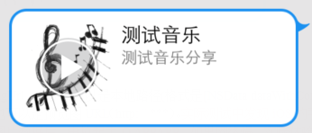

Music Sharing
=== 

## Overview
 - This feature is provided in MSDK1.7.0 and later visions. It offers an interface to share music to WeChat and mobile QQ.

---

## Interface description
 - Call WGShowNotice, which will use a set of interfaces configured by MSDK to display the currently valid notice
```ruby
void WGSendToQQWithMusic(const int& scene,
                             unsigned char* title,
                             unsigned char* desc,
                             unsigned char* musicUrl,
                             unsigned char* musicDataUrl,
                             unsigned char* imgUrl);
```
>Description: Share messages to mobile QQ session or Qzone; url is filled with the details page of the game in the Mobile QQ Game Center; click on the shared message can play music in mobile QQ.
Parameters:
  - scene: identify whether the message is shared to QZone or session
0: evoke mobile QQ and by default pop out a pop-up box to share the message to QZone
1: evoke mobile QQ and only share messages to friends
  - title: shared message’s title
  - desc: shared message’s description
  - MusicUrl: the skip URL of the music content; it can be filled in with the corresponding details page of the game in the Game Center & the game’s custom field. With click on this session in mobile QQ, MSDK can transparently pass the game’s custom parameter to the game through ret.extInfo of OnWakeupNotify(WakeupRet ret). If the game does not need to transparently pass the parameter, directly fill the Game Center’s details page into the field. The transparent transmission of custom fields needs the support of mobile QQ 4.6 and higher versions.
   For example: if the Game Center’s details page is "AAAAA" and the game’s custom field is "bbbbb", the url is: AAAAA&bbbbb. bbbbb is returned to the game by wakeupRet.extInfo.
  - musicDataUrl: this parameter allows the shared music message to be directly played by clicking on the Play button, as shown in the following picture. Its generally required format is http://***.mp4

  - imgUrl: In iOS, it can be a local path (format is required by [NSData dataWithContentsOfFile:path]); it can also be a preview URL (http:// ***). In actual tests, it was found that iOS mobile QQ components are to first get the URL image data and then launch mobile QQ APPAPP. If the network speed is slow, the actual experience may be relatively poor. Note: at this time, the interface should make corresponding match.
    In Android, it is only a preview URL.
The sharing result, no matter whether success or failure, will be called back to the game through OnShareNotify(ShareRet ret). ret.flag represents different sharing results. For details, see eFlag (Appendix A).

 - 
```ruby
void WGSendToWeixinWithMusic(const int &scene,
                                 unsigned char* title,
                                 unsigned char* desc,
                                 unsigned char* musicUrl,
                                 unsigned char* musicDataUrl,
                                 unsigned char *mediaTagName,
                                 unsigned char *imgData,
                                 const int &imgDataLen,
                                 unsigned char *messageExt,
                                 unsigned char *messageAction);
```
>Description: Share App music messages to WeChat friends; click on the shared message can play music in WeChat.
Parameters: 
  - scene: identify whether the message is shared to WeChat moment or session
0: evoke WeChat and only share messages to friends
1: evoke WeChat and by default pop out a pop-up box to share the message to WeChat moment
  - title: shared message’s title
  - desc: shared message’s description
  - musicUrl: the skip URL of the music content
  - musicDataUrl: this parameter allows the shared music message to be directly played by clicking on the Play button, as shown in the following picture. Its generally required format is http://***.mp4
  - mediaTagName: the user can fill in a value according to the actual situation. This value will be passed to WeChat for statistical purposes. When the shared message returns, it will also bring back the value, which can be used to distinguish the source of the shared message
  - imgData: thumbnail data of the display in sharing (Note: size should not exceed 32KB)
  - imgDataLen: length of thumbnail data of the display in sharing; it needs to match  thumbImgData and can’t be empty
  - messageExt: a field passed in by the game in sharing; click on the shared message in WeChat can launch the game, and MSDK can transparently pass the field to the game. It requires WeChat 5.1 and higher versions.
  - messageAction: only when the first argument scene is 1 can it work; one more button will be added in the message shared to the WeChat moment; click on the button can evoke the game and then skip to the leaderboard or the game’s homepage.
     Possible values of messageAction are as follows:
     WECHAT_SNS_JUMP_SHOWRANK      // skip to the leaderboard
     WECHAT_SNS_JUMP_URL            //skip to the link
     WECHAT_SNS_JUMP_APP           // skip to APP
The sharing result, no matter whether success or failure, will be called back to the game through OnShareNotify(ShareRet ret). ret.flag represents different sharing results. For details, see eFlag (Appendix A).

---

##Demo code
 - Call demo code for sharing music to WeChat:
```ruby
WGPlatform *plat = WGPlatform::GetInstance();
    NSString *path = [[QQViewController testResourcePath] stringByAppendingPathComponent:@"music.jpg"];//news.jpg
    NSData* data = [NSData dataWithContentsOfFile:path];
    plat->WGSendToWeixinWithMusic(1,                 
                                (unsigned char*)"Test music",  
                                (unsigned char*)"Test music sharing",  
                                (unsigned char*)"http://y.qq.com/#type=song&mid=000cz9pr0xlAId",  
                                 (unsigned char*)"http://tsmusic24.tc.qq.com/M500000cz9pr0xlAId.mp3",      
                                NULL, 
                                 (unsigned char*)[data bytes], 
                                [data length], 
                               NULL, 
                               NULL);
```
 - Callback demo code:
```ruby
void MyObserver::OnShareNotify(ShareRet& shareRet)
{
    if (eFlag_Succ == shareRet.flag)
{
    NSLog(@"Share success");
}
     else if(eFlag_WX_NotInstall == shareRet.flag)
{
    NSLog(@" WeChat is not installed");
    }
 else if(eFlag_WX_UserCancel == shareRet.flag)
{
    NSLog(@"The user cancels sharing");
    }
    else if(eFlag_WX_UserDeny == shareRet.flag)
{
    NSLog(@"The user refuses sharing");
    }
}
```
 -  Call demo code for sharing music to mobile QQ:
```ruby
NSString *path = [[QQViewController testResourcePath] stringByAppendingPathComponent:@"music.jpg"];        
    plat->WGSendToQQWithMusic(2,
                          (unsigned char*)"Test music",
                              (unsigned char*)"Test music sharing",
                              (unsigned char*)"http://y.qq.com/#type=song&mid=000cz9pr0xlAId",
                              (unsigned char*)"http://tsmusic24.tc.qq.com/M500000cz9pr0xlAId.mp3",
                              (unsigned char*)[path UTF8String]); 
```
or
```ruby
    WGPlatform *plat = WGPlatform::GetInstance();        
    plat->WGSendToQQWithMusic(1, (unsigned char*)"Test music",
                              (unsigned char*)"Test music sharing",
                              (unsigned char*)"http://y.qq.com/#type=song&mid=000cz9pr0xlAId",
                              (unsigned char*)"http://tsmusic24.tc.qq.com/M500000cz9pr0xlAId.mp3",                              (unsigned char*)"http://www.monsterworking.com/wp-content/uploads/music.jpg");
```
 - Callback demo code:
```ruby
void MyObserver::OnShareNotify(ShareRet& shareRet)
{
    if (eFlag_Succ == shareRet.flag)
{
        NSLog(@"Share success");
    }
    else if(eFlag_QQ_UserCancel == shareRet.flag)
{
        NSLog(@"The user cancels sharing");
    }
    else if(eFlag_QQ_NetworkErr == shareRet.flag)
    {
        NSLog(@"Network error");
    }
}
```