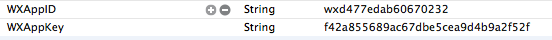

Access WeChat
===

## WeChat access configuration
 
  * Add configuration items in `Target->Info->Custom iOS Target Properties` under the Project Configuration. Major configuration items are as follows:
  

| Key      |    Type | Value  |Remark| Relevant modules |
| :-------- | --------:| :-- |:--|:---:|
| WXAppID  | String |  Vary with games | WeChat 的AppID|All |
| WXAppKey  | String |  Vary with games | WeChat 的AppKey|All|
  
  *	Configure URL Scheme in `Target->Info->URL Types` under the Project Configuration. The configuration is as follows:
  
  
| Identifier|    URL Scheme | Example  | Remark  |
| :-------- | :--------| :--: | :--: |
| weixin  | Game’s WeChat AppID |wxcde873f99466f74a | Access to WeChat; required   |

---

## WeChat authorization
 - ### Overview
Evoke WeChat client to authorize the game and get WeChat opened, accesstoken and refreshtoke (Appendix A Token type), pf and pfKey.
```
void WGLogin(ePlatform platform);
```
>Description: Log in the unified interface to pass _ePlatform. ePlatform_Weixin to call WeChat to authorize the game
Parameter:
   -  Pass _ePlatform ePlatform_Weixin to call mobile WeChat client to authorize the game
In the case of having set observer, the authorization result, no matter whether success or failure, is called back to the game through OnLoginNotify(LoginRet ret). The callback result ret.flag is described as follows:
```
eFlag_WX_NotInstall     = 2000,     // WeChat is not installed
eFlag_WX_NotSupportApi  = 2001,     // WeChat version doesn’t support
eFlag_WX_UserCancel     = 2002,     //the user cancels WeChat authorization
eFlag_WX_UserDeny       = 2003,     //the user refuses WeChat authorization
eFlag_WX_LoginFail      = 2004,     // WeChat authorization fails
```

- ###Demo code
Call code is as follows:
```
MyObserver* ob = new MyObserver(); 
plat->WGSetObserver(ob);//Set a callback object
plat->WGLogin(ePlatform_Weixin);
```
Callback code is as follows:
```
void MyObserver::OnLoginNotify(LoginRet& loginRet)
{
	if(eFlag_Succ == loginRet.flag)
	{
    	…//login success
    	std::string openId = loginRet.open_id;
    	std::string refreshToken;
    	std::string accessToken;
    	if(ePlatform_Weixin == loginRet.Platform)
    	{
        	for(int i=0;i< loginRet.token.size();i++)
        	{
            	TokenRet* pToken = & loginRet.token[i];
            	if(eToken_WX_Access == pToken->type)
            	{
                	accessToken = pToken->value;
            	}
            	else if (eToken_WX_Refresh == pToken->type)
				{
     				refreshToken = pToken->value;
				}
        	}
    	}
		else if(ePlatform_QQ == loginRet.Platform)
		{
		}
	}
	else
	{
    	…//login fail
     	NSLog(@"flag=%d,desc=%s",loginRet.flag,loginRet.desc.c_str()); 
	}
}
```

- 2.4.0i and later versions can still use delegate mode; the code is as follows:
```
[MSDKService setMSDKDelegate:self];
MSDKAuthService *authService = [[MSDKAuthService alloc] init];
[authService login:login:ePlatform_Weixin];
```
- Callback code is as follows:
```
-(void)OnLoginWithLoginRet:(MSDKLoginRet *)ret
{
	//The internal logic is the same with that of void MyObserver::OnLoginNotify(LoginRet& loginRet)
}
```
- ###  Notes:
 -  WeChat 4.0 and higher versions 
 
---

##  WeChat relation chain interface
 - ### Query personal information
 - Call WGQueryWXMyInfo to query WeChat personal information, including: nickname, gender, head portrait, city and province.
```
bool WGQueryWXMyInfo();
```
>Description: Get the basic information of the user’s WeChat account
Return value:
   false: WeChat does not authorize or AppID and other parameters are configured incorrectly
   true: No parameter exception

The return value is called back to the game through OnRelationNotify(RelationRet& relationRet)
In PersonInfo in RelationRet (Appendix B) structure, the sizes of small, medium and large pictures are 46, 96 and 132 (pixels), respectively; country and language in the personal info are returned to the game through country and lang. [MSDK1.7.0 adds country and language information]

 - Call demo code:
```
WGPlatform *plat = WGPlatform::GetInstance();
plat->WGQueryWXMyInfo();
Callback demo code:
OnRelationNotify(RelationRet &relationRet)
{
    NSLog(@"relation callback");
    NSLog(@"count == %d",relationRet.persons.size());
    for (int i = 0; i < relationRet.persons.size(); i++)
    {
        PersonInfo logInfo = relationRet.persons[i];
        NSLog(@"nikename==%s",logInfo.nickName.c_str()]);
        NSLog(@"openid==%s",logInfo.openId.c_str());
    }
}
```

- 2.4.0i and later versions can still use delegate mode; the code is as follows:
```
[MSDKService setMSDKDelegate:self];
MSDKRelationService *service = [[MSDKRelationService alloc] init];
[service queryMyInfo];
```
- Callback code is as follows:
```
-(void)OnRelationWithRelationRet:(MSDKRelationRet *)ret
{
	//The internal logic is the same with that of OnRelationNotify(RelationRet &relationRet)
}
```

- ### Query WeChat game friends’ information
Call WGQueryWXGameFriendsInfo to query WeChat game friends’ information, including: nickname, gender, head portrait, city and province.
```
bool WGQueryWXGameFriendsInfo();
```
>Description: Get the basic information of the user’s WeChat game friends
Return value:
   false: WeChat does not authorize or AppID and other parameters are configured incorrectly
   true: No parameter exception

The return value is called back to the game through OnRelationNotify(RelationRet& relationRet)
In PersonInfo in RelationRet (Appendix A) structure, the sizes of small, medium and large pictures are 46, 96 and 132 (pixels), respectively, and there is no country or language in the friends’ info.

 - Call code example: 
```
WGPlatform *plat = WGPlatform::GetInstance();
plat->WGQueryWXGameFriendsInfo();
```
Callback demo code:
```
OnRelationNotify(RelationRet &relationRet)
{
    NSLog(@"relation callback");
    NSLog(@"count == %d",relationRet.persons.size());
    for (int i = 0; i < relationRet.persons.size(); i++)
    {
        PersonInfo logInfo = relationRet.persons[i];
        NSLog(@"nikename==%s",logInfo.nickName.c_str());
        NSLog(@"openid==%s",logInfo.openId.c_str());
    }
}
```

- 2.4.0i and later versions can still use delegate mode; the code is as follows:
```
[MSDKService setMSDKDelegate:self];
MSDKRelationService *service = [[MSDKRelationService alloc] init];
[service queryMyGameFriendsInfo];
```
- Callback code is as follows:
```
-(void)OnRelationWithRelationRet:(MSDKRelationRet *)ret
{
	//The internal logic is the same with that of OnRelationNotify(RelationRet &relationRet)
}
```

### Notes:
 -  WeChat authorizes the game correctly

---

## WeChat structured message sharing
 - ### Evoke mobile WeChat client to share messages to friends
The game can evoke WeChat client to share messages. The player can select the to-be-shared friends in WeChat. The image size can not exceed 32k; otherwise, WeChat will share a default image and can’t share the target image to the WeChat moment.
```
void WGSendToWeixin(unsigned char* title, unsigned char* desc, unsigned char* mediaTagName, unsigned char* thumbImgData, const int& thumbImgDataLen, unsigned char* messageExt);
```
>Description: Share a message to WeChat friends; click on the shared message can evoke the game. Such messages can’t be shared to WeChat moment. If you want to share messages to WeChat moment, you should use WGSendToWeixinWithPhoto interface.
Parameter: 
- title: shared message’s title
  - desc: shared message’s description
  - mediaTagName: please fill in one of the following values according to the actual situation. This value will be passed to WeChat for statistical purposes. When the shared message returns, it will also bring back the value, which can be used to distinguish the source  
  - thumbImgData: shared message’s thumbnail data (Note: size should not exceed 32KB)
  - thumbImgDataLen: shared message’s thumbnail data length; the parameter needs to match with thumbImgData and can’t be empty
  - messageExt: a string passed in by the game in sharing; in WeChat, click on the message can evoke the game, and MSDK can transparently pass the field to the game. This requires WeChat 5.1and higher versions.
 
The sharing result, no matter whether success or failure, will be called back to the game through OnShareNotify (ShareRet ret). ret.flag represents different sharing results. For details, please see eFlag (Appendix A)

 - 
```
void WGSendToWeixin(const eWechatScene& scene, unsigned char* title, unsigned char* desc, unsigned char* url, unsigned char* mediaTagName, unsigned char* thumbImgData, const int& thumbImgDataLen);
```
>Description: Retaining this interface is only to be compatible with games which have accessed the old versions of the MSDK. Games newly accessing MSDK do not need to care about this interfaces

 - Call demo code:
```
WGPlatform* plat = WGPlatform::GetInstance();
MyObserver* ob = new MyObserver();
plat->WGSetObserver(ob);
NSString* title=@"shared message’s title";
NSString* desc=@"shared message’s content";
char*  mediaTag = "MSG_INVITE";
NSString *path = "29.jpg";
NSData* data = [NSData dataWithContentsOfFile:path];
plat->WGSendToWeixin(
                         (unsigned char*)[title UTF8String],
                         (unsigned char*)[desc UTF8String],
                         (unsigned char*)mediaTag,
                         (unsigned char*)[data bytes],
                         [data length],
                         (unsigned char*)ext
                         ); 
```
 - Callback demo code:
```
void MyObserver::OnShareNotify(ShareRet& shareRet)
{
    if (eFlag_Succ == shareRet.flag)
	{
    	NSLog(@"Shared successfully");
	}
    else if(eFlag_WX_NotInstall == shareRet.flag)
	{
    	NSLog(@" WeChat is not installed");
    }
 	else if(eFlag_WX_UserCancel == shareRet.flag)
	{
    	NSLog(@"The user cancels sharing");
    }
    else if(eFlag_WX_UserDeny == shareRet.flag)
	{
    	NSLog(@"The user refuses sharing");
    }
}
```

- 2.4.0i and later versions can still use delegate mode; the code is as follows:
```
[MSDKService setMSDKDelegate:self];
UIImage *image = [UIImage imageNamed:@"4.jpg"];
NSData *data = UIImageJPEGRepresentation(image, 0.5);
MSDKShareService *service = [[MSDKShareService alloc] init];
[service WGSendToWeixin:(unsigned char*)"shared message’s title"
desc:(unsigned char*)"shared message’s content"
mediaTagName:(unsigned char*)"MSG_INVITE"
thumbImgData:(unsigned char*)[data bytes]
thumbImgDataLen:(int)[data length]
messageExt:(unsigned char*)"msdkwuwuwu"];
```
- Callback code is as follows:
```
-(void)OnShareWithShareRet:(MSDKShareRet *)ret
{
    //The internal logic is the same with that of void MyObserver::OnShareNotify(ShareRet& shareRet)
}
```

 ### Directly share messages to WeChat friends
 - Call WGSendToWXGameFriend to share the message to a WeChat friend with the specified   opened. It is not needed to evoke WeChat client.
 ```
WGSendToWXGameFriend(unsigned char *fOpenId, unsigned char *title, unsigned char *description, unsigned char *mediaId, unsigned char *extinfo, unsigned char *mediaTagName,  unsigned char *extMsdkInfo)[1.7.0i]
```
>Description: Share the message to WeChat friends (only share it to friends who have installed the same game in their devices). Click on the message in WeChat can evoke the game.
Return value:
      false: WeChat does not authorize or parameters are illegal
      true: No parameter exception
Parameter:
  - fopenid: Required parameter; opened of the friend to whom the message is shared in the corresponding game
  - title: Required parameter; shared message’s title
  - description: Required parameter; the description of the applied message
  - mediaId: Required parameter; the game’s icon, which is obtained through the backend interface /share/upload_wx
  - extinfo: Optional
Third-party program’s customized simple data, which WeChat can send back to the third-party program to be handled; its length should not exceed 2k; click on the client can get this field.
  - mediaTagName: Optional
Used to distinguish the game message type; used for statistical purposes
  - extMsdkInfo: A message which is passed in by the game sharing and returned to the game through ShareRet.extInfo. [1.7.0i]
After the sharing is complete, the sharing result will be called back to the game through OnShareNotify (ShareRet ret). ret.flag represents different sharing results. For details, please see eFlag (Appendix A)

- Call demo code:
```
unsigned char* title = (unsigned char*)"MSDK comes to test QQ sharing";
unsigned char* description = (unsigned char*)"I’m playing Tian Tian Ai Xiao Chu";
unsigned char* media_tag_name = (unsigned char*)"MSG_INVITE";
unsigned char* fopenid = (unsigned char*)"oKdX1juRjuwIwIeSXRrTiq51kjc4";
unsigned char* mediaid = (unsigned char*)XXXXX";
unsigned char* extinfo = (unsigned char*)"balabalabalabala";
WGPlatform *plat = WGPlatform::GetInstance();
plat->WGSendToWXGameFriend(fopenid, title, description, mediaid, extinfo, media_tag_name);
```
- Callback demo code:
```
void MyObserver::OnShareNotify(ShareRet& shareRet)
{
    if (eFlag_Succ == shareRet.flag)
	{
        NSLog(@"Shared successfully");
    }
    else 
	{
   		NSLog(@"error message = %s",shareRet.desc.c_str()); 
    }
}
```
- 2.4.0i and later versions can still use delegate mode; the code is as follows:
```
[MSDKService setMSDKDelegate:self];
MSDKShareService *service = [[MSDKShareService alloc] init];
[service WGSendToWXGameFriend:(unsigned char*)"oGRTijiaT-XrbyXKozckdNHFgPyc"
title:(unsigned char*)"MSDK comes to test QQ sharing"
description:(unsigned char*)"I’m playing Tian Tian Ai Xiao Chu"
mediaId:(unsigned char*)""
messageExt:(unsigned char*)"balabalabalabala"
mediaTagName:(unsigned char*)"MSG_INVITE"];
```
- Callback code is as follows:
```
-(void)OnShareWithShareRet:(MSDKShareRet *)ret
{
	//The internal logic is the same with that of void MyObserver::OnShareNotify(ShareRet& shareRet)
}
```

### Notes:
-  WGSendToWeixin: Any shared image must have a size of less than 32K
 - The size of any image can not exceed 10M

 ---
 
## WeChat big picture sharing
 - ### Overview
By evoking WeChat client, the game shares messages to friends selected in WeChat. The size of any image can not exceed 10M.
```
void WGSendToWeixinWithPhoto(const eWechatScene[Int is converted into eWechatScene]& scene, unsigned char* mediaTagName, unsigned char* imgData, const int& imgDataLen, unsigned char* messageExt, unsigned char* messageAction);
```
>Description: Share image messages to WeChat; such messages can only be shared to conversation and the Wechat moment. Click on the shared image can display image in the form of big picture.
Parameter: 
  - scene: mark whether the image message is shared to WeChat moment or conversation
WechatScene_Session: session or conversation
WechatScene_Timeline: WeChat moment
  - mediaTagName: please fill in one of the following values according to the actual situation. This value will be passed to WeChat for statistical purposes. When the shared message returns, it will also bring back the value, which can be used to distinguish the source  
  - imgData: shared image data; images in png format need to obtain image data through UIImagePNGRepresentation method
  - imgDataLen: shared image data length
  - messageExt: a string passed in by the game in sharing; the player can launch the game through the message, and the message is returned to the game through ret.messageExt of OnWakeUpNotify(WakeupRet ret)
  - messageAction: It works only when the first argument scene is equal to 1; one button will be added in the message shared to WeChat moment; click on the button can evoke the game, skip to the leaderboard or the game homepage. Possible values and roles are as follows:
WECHAT_SNS_JUMP_SHOWRANK       skip to the leaderboard
WECHAT_SNS_JUMP_URL            skip to the link
WECHAT_SNS_JUMP_APP           skip to APP[The button display in the Wechat moment has the network delay and requires WeChat 5.1and higher versions]
void WGSendToWeixinWithPhoto(const int& scene, unsigned char* mediaTagName, unsigned char* imgData, const int& imgDataLen);
Description: Retaining this interface is only to be compatible with games which have accessed the old versions of the MSDK. Games newly accessing MSDK do not need to care about this interfaces
The sharing result, no matter whether success or failure, will be called back to the game through OnShareNotify (ShareRet ret). ret.flag represents different sharing results. For details, please see eFlag (Appendix A)

 ### Democ code
Call demo code:
```
WGPlatform* plat = WGPlatform::GetInstance();
MyObserver* ob = new MyObserver();
ob->setViewcontroller(self);
plat->WGSetObserver(ob);
char* mediaTag = "mediaTag";
UIImage *image = [UIImage imageNamed:@"356.png"];
NSData *data = UIImagePNGRepresentation(image);
plat->WGSendToWeixinWithPhoto(
                                  1,
                                  (unsigned char*)mediaTag,
                                  (unsigned char*)[data bytes],
                                  [data length],
                                  (unsigned char*)"msdkwuwuwu",
                                  (unsigned char*)"WECHAT_SNS_JUMP_APP"
                                  ); 
```
Callback demo code:
```
void MyObserver::OnShareNotify(ShareRet& shareRet)
{
    if (eFlag_Succ == shareRet.flag)
	{
    	NSLog(@"Shared successfully");
	}
    else if(eFlag_WX_NotInstall == shareRet.flag)
	{
    	NSLog(@" WeChat is not installed");
	}
 	else if(eFlag_WX_UserCancel == shareRet.flag)
	{
    	NSLog(@"The user cancels sharing");
	}
    	else if(eFlag_WX_UserDeny == shareRet.flag)
	{
    	NSLog(@"The user refuses sharing");
    }
}
```

- 2.4.0i and later versions can still use delegate mode; the code is as follows:
```
[MSDKService setMSDKDelegate:self];
UIImage *image = [UIImage imageNamed:@"356.png"];
NSData *data = UIImageJPEGRepresentation(image, 1.0);
MSDKShareService *service = [[MSDKShareService alloc] init];
[service WGSendToWeixinWithPhoto:WechatScene_Session
mediaTagName:(unsigned char*)"mediaTag"
imgData:(unsigned char*)[data bytes]
imgDataLen:(int)[data length]
messageExt:NULL
messageAction:NULL];
```
- Callback code is as follows:
```
-(void)OnShareWithShareRet:(MSDKShareRet *)ret
{
	//The internal logic is the same with that of void MyObserver::OnShareNotify(ShareRet& shareRet)
}
```

### Notes:
 - The size of any image can not exceed 10M

---

## Share URL to WeChat
 - ### Overview
Have the same function with WGSendToWeixin; add URL-sharing parameters and share the URL to WeChat moment.
```
void WGSendToWeixinWithUrl(
                        const eWechatScene& scene,
                        unsigned char* title,
                        unsigned char* desc,
                        unsigned char* url,
                        unsigned char* mediaTagName,
                        unsigned char* thumbImgData,
                        const int& thumbImgDataLen,
                        unsigned char* messageExt
                        );
```
>Description: Share App message to WeChat friends or WeChat moment; click on this shared message can open the URL-specified page.
Parameter: 
  - scene: sharing scene
  - title: shared message’s title
  - desc : shared message’s description
  - url: sharing URL
  - mediaTagName: please fill in one of the following values according to the actual situation. This value will be passed to WeChat for statistical purposes. When the shared message returns, it will also bring back the value, which can be used to distinguish the source  
  - thumbImgData: shared message’s thumbnail data (Note: size should not exceed 32KB)
  - thumbImgDataLen: shared message’s thumbnail data length; the parameter needs to match with thumbImgData and can’t be empty
  - messageExt: a string passed in by the game in sharing; in WeChat, click on the message can evoke the game, and MSDK can transparently pass the field to the game. This requires WeChat 5.1and higher versions.
  - The sharing result, no matter whether success or failure, will be called back to the game through OnShareNotify (ShareRet ret). ret.flag represents different sharing results. For details, please see eFlag (Appendix A)

 - ###Democ code
Call demo code:
```
WGPlatform *plat = WGPlatform::GetInstance();
NSString* title=@"shared message’s title";
NSString* desc=@"shared message’s content";
NSString* url = @"http://www.baidu.com";
const char*  mediaTag = "MSG_INVITE";
const char*  ext = "msdkwuwuwu";
NSString *path = [[QQViewController testResourcePath] stringByAppendingPathComponent:@"4.png"];
NSData* data = [NSData dataWithContentsOfFile:path];
plat->WGSendToWeixinWithUrl(WechatScene_Session, (unsigned char*)[title UTF8String], (unsigned char*)[desc UTF8String],(unsigned char*)[url UTF8String], (unsigned char*)mediaTag,(unsigned char*)[data bytes],(int)[data length], (unsigned char*)ext);
```
Callback demo code:
```
void MyObserver::OnShareNotify(ShareRet& shareRet)
{
    shareRet.extInfo = “xxx”;// The message shared by the game is extMsdkInfo field passed in
    if (eFlag_Succ == shareRet.flag)
	{
    	NSLog(@"Shared successfully");
	}
    else if(eFlag_WX_NotInstall == shareRet.flag)
	{
    	NSLog(@" WeChat is not installed");
    }
 	else if(eFlag_WX_UserCancel == shareRet.flag)
	{
    	NSLog(@"The user cancels sharing");
    }
    else if(eFlag_WX_UserDeny == shareRet.flag)
	{
    	NSLog(@"The user refuses sharing");
    }
}
```

- 2.4.0i and later versions can still use delegate mode; the code is as follows:
```
[MSDKService setMSDKDelegate:self];
UIImage *image = [UIImage imageNamed:@"4.png"];
NSData* data = UIImageJPEGRepresentation(image, 1.0);
MSDKShareService *service = [[MSDKShareService alloc] init];
[service WGSendToWeixinWithUrl:WechatScene_Session
title:(unsigned char*)"shared message’s title"
desc:(unsigned char*)"shared message’s content"
url:(unsigned char*)"http://www.baidu.com"
mediaTagName:(unsigned char*)"MSG_INVITE"
thumbImgData:(unsigned char*)[data bytes]
thumbImgDataLen:(int)[data length]
messageExt:(unsigned char*)"msdkwuwuwu"];
```
- Callback code is as follows:
```
-(void)OnShareWithShareRet:(MSDKShareRet *)ret
{
	//The internal logic is the same with that of void MyObserver::OnShareNotify(ShareRet& shareRet)
}
```

### Notes:
 - Require the support of WeChat 5.2 or later versions

---

## WeChat refreshes accesstoken
-  Overview
WeChat accessToken has only two hours of validity, and refreshToken has 30 days of validity. As long as refreshToken does not expire, accessToken can be refreshed with refreshToken. After accessToken is refreshed, new accessToken and refreshToken can be gotten. Every refreshToken can only be used onece.
WGRefreshWXToken() interface corresponds to MSDK server’s /auth/wxexpired_login/ service. If the game uses WGRefreshWXToken() to refresh WeChat accessToken, don’t call MSDK server’s /auth/wxexpired_login/ to refresh accessToken again. It is suggested to use WGRefreshWXToken() interface to renew accessToken. The game doesn’t need to save any token and can get tokens through WGGetLoginRecord(loginRet ret). [1.7.0]
```
void WGRefreshWXToken();
```
>Description: In order to renew WeChat accessToken, call WGGetLoginRecord(LoginRet ret); when ret.flag is eFlag_WX_AccessTokenExpired, call this interface to refresh WeChat token.
The refreshed result is returned to the game through OnLoginNotify(LoginRet ret).
ret.flag = eFlag_WX_RefreshTokenSucc   Refresh token successfully
ret.flag = eFlag_WX_RefreshTokenFail    Fail to refresh token

- Demo code
Call demo code:
```
WGPlatform* plat = WGPlatform::GetInstance();
plat->WGRefreshWXToken()
```
Callback demo code:
```
void MyObserver::OnLoginNotify(LoginRet& loginRet)
{
	if(eFlag_WX_RefreshTokenSucc == loginRet.flag)
	{
    	…//refresh success
    	std::string openId = loginRet.open_id;
    	std::string refreshToken;
    	std::string accessToken;
    	for(int i=0;i< loginRet.token.size();i++)
    	{
        	TokenRet* pToken = & loginRet.token[i];
        	if(eToken_WX_Access == pToken->type)
        	{
            	accessToken = pToken->value;
        	}
        	else if (eToken_WX_Refresh == pToken->type)
			{
				refreshToken = pToken->value;
			}
     	}
	}
	else
	{
    	…//login fail
     	NSLog(@"flag=%d,desc=%s",loginRet.flag,loginRet.desc.c_str()); 
	}
}
```
- 2.4.0i and later versions can still use delegate mode; the code is as follows:
```
[MSDKService setMSDKDelegate:self];
MSDKAuthService *authService = [[MSDKAuthService alloc] init];
[authService refreshWXToken];
```
- Callback code is as follows:
```
-(void)OnShareWithShareRet:(MSDKShareRet *)ret
{
//The internal logic is the same with that of void MyObserver::OnShareNotify(ShareRet& shareRet)
}
```

### Notes:
- Refreshed callback flag is eFlag_WX_RefreshTokenSucc and eFlag_WX_RefreshTokenFail
- Every refreshToken can only be refreshed once and then expires.

---

## Features different WeChat versions support
- ### Corresponding version support needed by WeChat functions

|Function	|Description|	WeChat version|
|---|---|---|
|Authorization|	|	Higher than 4.0|
|Directed sharing|	Share messages to friends|	Higher than 4.0|
|Big picture sharing|	Share pictures (WGSendToWeixinWithPhoto interface)|	Higher than 4.0|
| WeChat moment sharing|	Share messages to the WeChat moment|	Higher than 4.2|
|Account inconsistency prompt|	WeChat login account informs MSDK|	Higher than 5.0|
| WeChat moment skip|	The Wechat moment message is added with a button. Click on the button can skip to the leaderboard or the details page of the game, or directly launch the game|	Higher than 5.1|