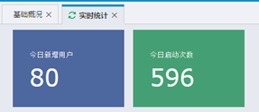
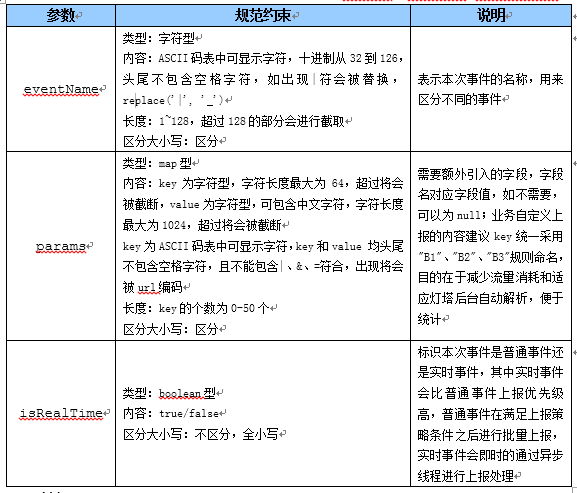
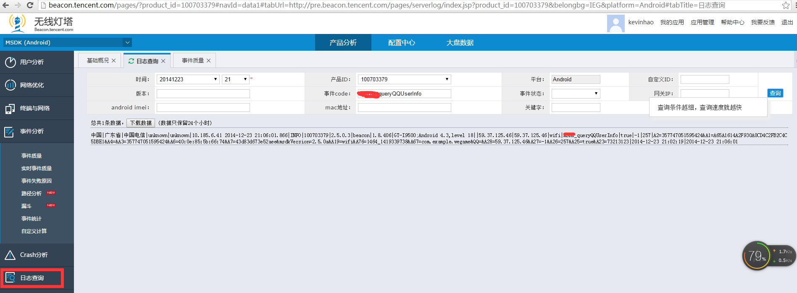

MSDK Beacon-related Module
===
Beacon Access Configuration
---
Since MSDK1.7, the game accessing msdk does not any longer need to apply the beacon’s appkey from the beacon side but uses qqAppId as the beacon key to achieve the access to the beacon. In the user analysis -> real-time statistics, if there are the displayed data, this indicates that the access is successful.

If you can not see any data, please handle the problem according to the following steps.

1.     First of all, the game may have applied for multiple beacon applications, but beacon can only correlate one of the beacon applications with qqAppId(100703379).

2.     Although the game is access to MSDK1.7 or later versions, beacon does not correlate the previously applied appkey with qqAppid. This can also make you unable to see the data. In this case, please contact beacon staffer @jiaganzheng and tell him qqAppId

3.     If your game accesses MSDK for the first time, you should confirm whether your game have the permission to do so. For this, you can contact beacon staffer @jiaganzheng and tell him qqAppId

Self-defined Data Reporting
---
Through the event interface, MSDK records and reports the user’s key events to the beacon and MTA, thus making statistical analysis on the occurrence number of the events. Interfaces required to accomplish this function include: WGReportEvent. The detailed description of the interface is as follows:

     /**	 * Custom data reporting: This interface only supports one key-value reporting. Beginning from MSDK1.3.4, it is recommended to use void WGReportEvent( unsigned char* name, std::vector<KVPair>& eventList, bool isRealTime)	 * @param name: event name
	 * @param body: event content
	 * @param isRealTime: whether or not to report in real time
	 * @return void
	 */
     void WGReportEvent(
		unsigned char* name, 
		unsigned char * body, 
		bool isRealTime
	) DEPRECATED(1.3.4);

The other interface is:
     
     /**
	 * @param name: event name
	 * @param eventList: event content, a vector in the key-value format
	 * @param isRealTime: whether or not to report in real time
	 * @return void
	 */
	void WGReportEvent(
		unsigned char* name, 
		std::vector<KVPair>& eventList, 
		bool isRealTime
	);

Wherein, the parameters are restricted as follows: **eventName doesn't start with MSDK_, because this is the naming style of MSDK’s custom events. **

Application Scenario
---

You can query the number of calls to a certain interface. If you query the QQ user’s personal information, the event is named queryQQUserInfo. Its calling method is as follows:

    WGReportEvent("queryQQUserInfo", null, true);

If the event is successfully reported, you can query the event data in the log of the corresponding beacon app in http://beacon.tencent.com/. If an event is reported in real time, after you call the above method, you can generally query the event data within five minutes.

In addition, you can view the statistics of data in the event quality list:

For more details, consult beacon staffer Xiao Mi via RTX.

In addition: the beacon custom event module has the statistics of the success rate and time delay. The module is not yet encapsulated now. When the game needs to use it, it can call UserAction.onUserAction on its own. As for the application method, please see the reference documentation available in the official website of beacon.