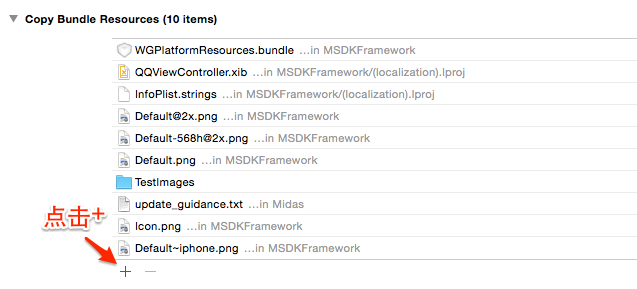

Quick Access
======

### Let's Get Started!

> Please make sure to use the latest version of Xcode (5.0+) and aim at iOS 5.1.1 or later versions. We recommend Xcode 5 and iOS 6 or higher versions.

---
##Step1: Import dependency library

 * In `Target->Build Phases->Link Binary With Libraries`, add the system libraries which the project is dependent on, as shown as follows:
```ruby
libz.dylib
libstdc++.dylib
libz.1.1.3.dylib
libsqlite3.dylib
libxml2.dylib
libstdc++.6.0.9.dylib
CoreTelephony.framework
SystemConfiguration.framework
UIKit.framework
Foundation.framework
CoreGraphics.framework
MobileCoreServices.framewrok
StoreKit.framework
CFNetwork.framewrok
CoreData.framework
Security.framework
CoreLocation.framework
ImageIO.framework
CoreText.framework
QuartzCore.framework
AdSupport.framework【Required by versions later than MSDK2.6.0i】
```
【Versions later than MSDK2.6.0i requires to select the corresponding items in iTC when auditing. For details, please see [Description](http://km.oa.com/articles/show/234073)】
---	
##Step2: Import MSDK
* 2.3.4i and earlier versions:
  - [Download SDK](http://mcloud.ied.com/wiki/MSDK%E4%B8%8B%E8%BD%BD)
  - In SDK, header files and class library files are placed in `WGPlatform.framework` and need to be imported into `Target->Build Phases->>Link Binary With Libraries` set by the project.
  1. 
  2. 
  3. 
  - In SDK, resource files needed by built-in Webview and announcement are placed in `WGPlatformResources.bundle` and need to be imported into `Target->Build Phases->Build Phases->Copy Bundle Resources` set by the project..
  1. 
  2. 
  3. 

* 2.4.0i and later versions are plug-in versions and can import the corresponding frame according to needs. The import mode is the same with 2.3.4i.
  1. MSDKFoundation: basic dependency library; if you want to use other libraries, you are required to import this framework at first.
  2. MSDK: login and share functions of mobile QQ and WeChat;
  3. MSDKMarketing: provide cross-marketing and built-in Webview functions. Resource files needed by announcement and built-in Webview are placed in WGPlatformResources.bundle file.
  4. MSDKXG: provide Pigeon’s Push function.
  The four components also provide C99 and C11 language standards at the same time, in which **_C11 package is C11 version.
  
    If you only want to use C++ interfaces, you only need to import the following header files:
```
<MSDKFoundation/MSDKStructs.h>
<MSDK/WGInterface.h>
<MSDK/WGPlatform.h>
<MSDK/WGPlatformObserver.h>
```  
After some games import framework, they may be unable to find framework. The phenomenon is to be unable to open the built-in WebView, and log outputs "No MSDKWebViewService exists". At this time, it is needed to add "-ObjC" “-framework MSDKFoundation -framework MSDK -framework MSDKMarketing -framework MSDKXG” in other link flags, and import relevant framework.
---
##Step3: Configuration item
 
  * In .plist file，add configuration items. Major configuration items are as follows.

| Key      |    Type | Value  |Remarks|Relevant module|
| :-------- | --------:| :-- |:--|:---:|
| MSDK_URL  | String |  http://msdktest.qq.com |MSDK test environment. Before the game is formally launched online, the environment needs to change to http://msdk.qq.com|All|
| MSDK_PUSH_URL  | String |  http://pushtest.msdk.qq.com | MSDK test environment for reporting info. Before the game is formally launched online, the environment needs to change to http://push.msdk.qq.com|All|
| QQAppID  | String |  Vary with games |mobile QQ’s Appid|All|
| QQAppKey  | String |  Vary with games |mobile QQ’s AppKey|All|
| WXAppID  | String |  Vary with games |WeChat ‘s Appid|All|
| WXAppKey  | String |  Vary with games |WeChat’s AppKey|All|
| CHANNEL_DENGTA  | String |  1001 |iOS system channel number |Statistics |
| MSDK_PUSH_SWITCH  | String |  ON |This is switch for the push function; if you do not use MSDK push  function, you do not need to configure it |Push|
| MSDK_XGPUSH_URL | String | Pigeon push URL, which can not be configured |Pigeon push URL; if it is not configured, it uses the default value|Push|
| MSDK_OfferId  | String |  Vary with games |Payment Required OfferId|Payment|
| NeedNotice  | Boolean | Whether to enable the announcement  function?  |Yes-enable No（not configured）-disable|announcement|
| Noticetime  | Number | time interval of automatic draw of announcement (s) |15 minutes by default| announcement| 
| NSLocationWhenInUseUsageDescription  | NSString |  LBS locating function used under iOS8  |Value can be empty |LBS| 
| MSDK_WebView_Share_SWITCH  | Boolean | Whether to enable built-in Webview to share? | Yes-enable No（not configured）-disable (only for 2.5.0 and later versions) |built-in Webview|
 
  *	Configure URL Scheme in `Target->Info->URL Types` set by the project, as shown as follows:
  
| Identifier|    URL Scheme | Example  |  Remarks  |
| :-------- | :--------| :--: | :--: |
| weixin  | The game’s WeChat AppID |wxcde873f99466f74a | Required for access to WeChat   |
| tencentopenapi  | format: tencent+ game’s QQAppID |tencent100703379|  Required for access to mobile QQ; there is no space in the middle   |
| QQ  | format: QQ+ game’s QQAppID hexadecimal |QQ06009C93 | Required for access to mobile QQ; there is no space in the middle   |
| QQLaunch  | format: tencentlaunch+ game’s QQAppID |tencentlaunch100703379|  Required for access to mobile QQ; there is no space in the middle   |

   > ** Note: Various games’ configurations are inconsistent. For details, please consult the contact person between each game and MSDK or RTX to contact "Link to MSDK". **
  
---
##Step4: Realize callback object
 
  * The global callback object handles game authorization, sharing, query, or platform wakeup. The object needs to inherit and implement all methods of `WGPlatformObserver` class.
  * Example: create a global callback object called MyObserver. Paste the code as follows:
  * 2.3.4i and the previous versions:
  ```ruby
//MyObserver.h
// if use C99 compiler option
#import <WGPlatform/WGPlatform.h>
#import <WGPlatform/WGPublicDefine.h>
//if use C11 compiler option
#import <WGPlatform_C11/WGPlatform.h>
#import <WGPlatform_C11/WGPublicDefine.h>
class MyObserver: public WGPlatformObserver,public APMidasInterfaceObserver
{
public:
    void OnLoginNotify(LoginRet& loginRet);//login callback
    void OnShareNotify(ShareRet& shareRet);//share callback
    void OnWakeupNotify(WakeupRet& wakeupRet);//platform wakeup callback
    void OnRelationNotify(RelationRet& relationRet);//callback related to relation chain query
    void OnLocationNotify(RelationRet &relationRet);//location-related callback
    void OnLocationGotNotify(LocationRet& locationRet);//location-related callback
    void OnFeedbackNotify(int flag,std::string desc);//feedback-related callback
    std::string OnCrashExtMessageNotify();//crash handling
}
```
```ruby
//MyObserver.mm
#include "MyObserver.h"
void MyObserver::OnLoginNotify(LoginRet& loginRet){}
void MyObserver::OnShareNotify(ShareRet& shareRet){}
void MyObserver::OnWakeupNotify(WakeupRet& wakeupRet){}
void MyObserver::OnRelationNotify(RelationRet &relationRet){}
void MyObserver::OnLocationNotify(RelationRet &relationRet) {}
void MyObserver::OnLocationGotNotify(LocationRet& locationRet){}
void MyObserver::OnFeedbackNotify(int flag,std::string desc){}
std::string MyObserver::OnCrashExtMessageNotify(){return "message";}
```

  * 2.4.0i and later versions:
```ruby
//MyObserver.h
//if use C99 compiler option
#import <MSDK/MSDK.h>
//if use C11 compiler option
#import <MSDK_C11/MSDK.h>
class MyObserver: public WGPlatformObserver,public WGADObserver
{
public:
void OnLoginNotify(LoginRet& loginRet);//login callback
void OnShareNotify(ShareRet& shareRet);//share callback
void OnWakeupNotify(WakeupRet& wakeupRet);//platform wakeup callback
void OnRelationNotify(RelationRet& relationRet);//callback related to relation chain query 
void OnLocationNotify(RelationRet &relationRet);//location-related callback
void OnLocationGotNotify(LocationRet& locationRet);//location-related callback
void OnFeedbackNotify(int flag,std::string desc);//feedback-related callback
std::string OnCrashExtMessageNotify();//crash handling
void OnADNotify(ADRet& adRet);//Ad callback
}
```
```ruby
//MyObserver.mm
#include "MyObserver.h"
void MyObserver::OnLoginNotify(LoginRet& loginRet){}
void MyObserver::OnShareNotify(ShareRet& shareRet){}
void MyObserver::OnWakeupNotify(WakeupRet& wakeupRet){}
void MyObserver::OnRelationNotify(RelationRet &relationRet){}
void MyObserver::OnLocationNotify(RelationRet &relationRet) {}
void MyObserver::OnLocationGotNotify(LocationRet& locationRet){}
void MyObserver::OnFeedbackNotify(int flag,std::string desc){}
std::string MyObserver::OnCrashExtMessageNotify(){return "message";}
void MyObserver::OnADNotify(ADRet& adRet){}
```

---
## Step5: Set the global callback object

 * Open `AppDelegate.mm` file and add the following import statement to the header:
  * 2.3.4i and the previous versions:
 ```ruby
///if use C99 compiler option
#import <WGPlatform/WGPlatform.h>
#import "WGPlatform/WGInterface.h"
#import <WGPlatform/WGPublicDefine.h>
///if use C11 compiler option
#import <WGPlatform_C11/WGPlatform.h>
#import "WGPlatform_C11/WGInterface.h"
#import <WGPlatform_C11/WGPublicDefine.h>
#import "MyObserver.h"
```
   * Paste the following code to `application:didFinishLaunchingWithOptions:`
 ```ruby
WGPlatform *plat = WGPlatform::GetInstance();
MyObserver  *pObserver =plat->GetObserver();
MyADObserver *adObserver =(MyADObserver *)plat->GetADObserver();
if(!pObserver){
        pObserver = new MyObserver(); 
        plat -> WGSetObserver(pObserver);
}
```
   * Paste the following code to `application:openURL:sourceApplication:annotation:`
```ruby
WGPlatform* plat = WGPlatform::GetInstance();
MyObserver* ob =(MyObserver *) plat->GetObserver();
        if (!ob) {
            ob = new MyObserver();
            plat->WGSetObserver(ob);
        }
return  [WGInterface  HandleOpenURL:url];
```

  * 2.4.0i and later versions::
```ruby
///if use C99 compiler option
#import <MSDK/MSDK.h>
#import "MyObserver.h"
///if use C11 compiler option
#import <MSDK_C11/MSDK.h>
#import "MyObserver.h"
```
   * Paste the following code to `application:didFinishLaunchingWithOptions:`
```ruby
WGPlatform* plat = WGPlatform::GetInstance();
WGPlatformObserver *ob = plat->GetObserver();
if (!ob)
{
        MyObserver* ob = MyObserver::GetInstance();
        plat->WGSetObserver(ob);
}

或
WGPlatformObserver *ob = [MSDKService getObserver];
if (!ob)
{
        MyObserver* ob = MyObserver::GetInstance();
        [MSDKService setObserver:ob];
}

```
   * Paste the following code to `application:openURL:sourceApplication:annotation:`
```ruby
WGPlatform* plat = WGPlatform::GetInstance();
WGPlatformObserver *ob = plat->GetObserver();
if (!ob)
{
        MyObserver* ob = MyObserver::GetInstance();
        plat->WGSetObserver(ob);
}
return  [WGInterface  HandleOpenURL:url];

或
WGPlatformObserver *ob = [MSDKService getObserver];
if (!ob)
{
        MyObserver* ob = MyObserver::GetInstance();
        [MSDKService setObserver:ob];
}
return [MSDKService handleOpenUrl:url];

```

>** After the object is created, it is only set once.  Repeated settings can override the previous one. Only the latest setting can receive a callback. It is recommended to set the global callback object when the game is initialized. **

---
## Step:6 Good To Go!
### Next: [QQ enter](QQ.md) [ WeChat enter](WX.md)
