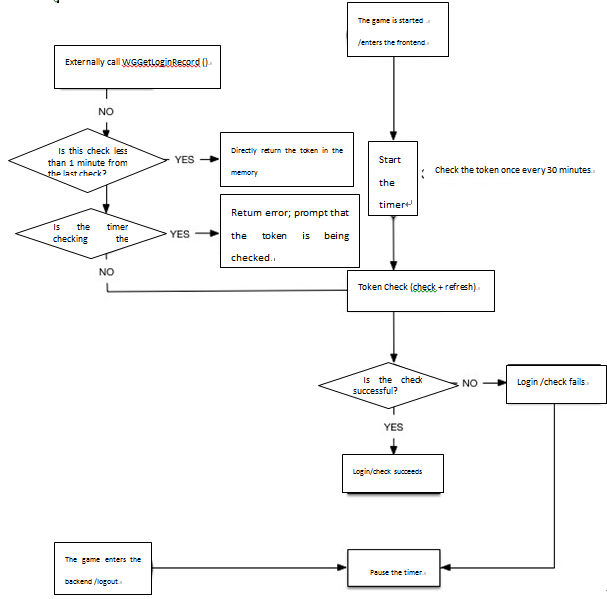

#MSDK token

## Overview

The module will comb all authorization-related modules of MSDK, including the detailed descriptions of authorized login, automatic login, quick login, token refresh, read and other modules. Developers can first refer to the module to get familiar with all authorization-related modules of MSDK and then use the corresponding interfaces to complete authorization and other functions according to their own needs.

## Terminology and interface description
	
### Description of login-related terms:
| Name | Description | Support platform | Called interface |
|: -------------: |
| Authorized login | By evoking the platform’s authorization interface, the game guides the user to authorize the game to obtain the token required for login | mobile QQ / WeChat | WGLogin |
| Quick login | When the player’s operation makes the platform launch the game, the platform will transparently pass login-related token information to the game in order to log into the game. | Mobile QQ | None |
| Automatic login | When the game is started, it directly uses the token information generated by the user's last login into the game to log into the game | MSDK provides the functionality | WGLoginWithLocalInfo |
| Automatic refresh | MSDK provides the interface to automatically refresh WeChat tokens | MSDK provides the functionality | None |
| Account inconsistency | the current login account in the game is not the same with the login account in the platform | Platform/MSDK both supports| WGSwitchUser |

### Overview of login-related interfaces

Among the login-related interfaces, `WGGetLoginRecord` and` WGLogout` are synchronous interfaces, and other interfaces are all asynchronously implemented. Thus, through the form of callback, the final result is called back to the game by OnLoginNotify (LoginRet). Account inconsistency-related interfaces are described alone in the account inconsistency module of MSDK. The description of the login-related interfaces is shown as follows:

| Name | Description | Remarks |
|: -------------: |
| WGGetLoginRecord | Get the locally preserved login token of the current user | |
| WGSetPermission | Set the platform information which the game requires the user’s authorization to access | |
| WGLogin | Launch the platform to authorize login | |
| WGLogout | Clear the login information of the current login account | |
| WGLoginWithLocalInfo | Attempt to log on through the locally stored login token | |
| HandleCallback | Handle various platform wakeup | |
| WGRefreshWXToken | Refresh and get accessToken by WeChat refreshToken | Since MSDK 2.0, it is not recommended that the game itself refreshes WeChat token |

### Recommended login process (earlier versions than 2.6.0i)


** Description of steps: **

* Step 1: First initialize MSDK after starting the game
* Step 2: Call the automatic login interface `WGLoginWithLocalInfo ()`; this interface will go to MSDK server to check if the local token is valid.
* Step 3: The automatic logon interface returns the login result to the game through `OnLoginNotify (LoginRet ret)`. By `ret.flag`, the game judges the login result. If the flag is `eFlag_Succ` (0) or `eFlag_WX_RefreshTokenSucc` (2005), the login is successful; otherwise, the login fails.
* Step 4: If the login authorization is successful, skip to Step 9
* Step 5: If automatic login fails, call `WGLogin(EPlatform platform)` to launch mobile QQ or WeChat platform to make the login authorization.
* Step 6: The login result is called back to the game through `OnLoginNotify(LoginRet ret)`. By `ret.flag`, the game judges the login result. If the flag is `eFlag_Succ` (0), the login is successful; otherwise, the login fails.
* Step 7: Launching the platform for the login authorization fails; the game guides the user to log in again; skip to step 5.
* Step 8: The login authorization succeeds.
* Step 9: Synchronically send the latest token in the client to the game server. If the game server needs to use the login token, **note that the latest token must be synchronically sent to the game server upon receipt of a callback indicating successful login**, in order to avoid the server from using an invalid token in its operations.

### Recommended usage of login-related interfaces

1. Authorized login: directly call `WGLogin` to start the corresponding authorization of the platform
- Check if the token is valid when the game is started and the game switches from the front-end to the back-end: call `WGLoginWithLocalInfo` to complete the verification of the token’s validity
- Get the token: directly call `WGGetLoginRecord` to read the token from the local
- Logout: directly call `WGLogout` to clear the current user's login information

## Access the login module (must-see for developers)

**Game developers can complete the access to MSDK login module according to the steps provided below to reduce the access cost and omitted processing logic. It is strongly recommended that developers should have a good understanding of the steps and handle all the logics!!! `** 

1. Set the permissions for the user’s authorization:
	- After the initialization of MSDK, the game should call the permission setting interface of mobile QQ to set the permissions of the platform which requires that the user authorize the game. Specific method [click to view] (#Set the permissions for the user’s authorization: WGSetPermission).
-** Handle the authorized login **:
	1. In the login button click event handler, call `WGLogin` to complete the authorized login. Specific methods [click to view] (#Handle the authorized login - WGLogin).
- ** Handle automatic login **:
	1. After the game returns to the front-end, it will call `WGLoginWithLocalInfo` to complete the automatic login when the game is evoked. Specific method [click to view] (#Handle automatic login - WGLoginWithLocalInfo)
	- applicationDidEnterBackground in AppDelegate can judge the time when the game switches to the backend; if the time exceeds 30 minutes, it will automatically call `WGLoginWithLocalInfo` to complete the automatic login
		- For how to judge the time when the game switches to the backend, game developers can refer to the demo approach of MSDK, that is, recording a timestamp when the game switches to the backend and calculating the time difference after the game returns to the front-end
- ** Handle user logout **:
	- In the logout button click event handler, call WGLogout to complete the authorized login. Specific method [click to view] (# Handle user logout - WGLogout)
- ** Handle the login callback of MSDK **:
	- In the logic that the game handles MSDK’s callbacks, add the handling of onLoginNotify. Specific method [click to view] (# Handle the login callback of MSDK)
- ** Handle the wakeup callback of MSDK:
	- In onWakeUpNotify with which the game handles MSDK’s callbacks, add the handling of the platform wakeup. Specific method [click to view] (# Handle the wakeup callback of MSDK)
- ** Account inconsistency handling logic **:
	- For details about the logic of the game to handle account inconsistency, please refer to [MSDK Account Inconsistency Access] (diff-account.md # account inconsistency handling logic (developers should pay attention to this))
- ** The Other special handling logics **:
	- A scheme to log in the game after the game process is killed in the authorization process in the low-memory machine. Specific method [click to view] (#The login scheme for the mobile QQ authorization process in the low-memory machine after the game is killed)
- ** `Automatic refresh mechanism of MSDK WeChat token after the token expires` ** Specific method [click to view] (#Automatic refresh of WeChat token)
	- Requirements on the calling of the login data reporting interface. Specific method [click to view] (# Login data reporting)

## Set permissions for the user’s authorization - WGSetPermission

#### Overview

After the initialization of MSDK, the game needs to call the mobile QQ permission-setting interface to set the permissions of the platform which require the user to authorize to the game.

#### Interface declaration

	/**
	 * @param permissions ePermission: enumeration value or calculated result, which indicates the item requiring authorization
	 * @return void
	 */
	void WGSetPermission(int permissions);

#### Call the interface:

	// Set the item requiring the user’s authorization when QQ is launched
	WGPlatform.WGSetPermission(WGQZonePermissions.eOPEN_ALL); 

#### Notes:

1. The game needs to call the interfaces after the initialization of MSDK. It is recommended that the interface parameter be filled with ** `eOPEN_ALL` **. Missing the item can cause that MSDK will prompt the game does not have the permission when the game calls some interfaces.


## Handle authorized login - WGLogin

#### Overview:

** Launch mobile QQ/WeChat client or web page (mobile QQ is not installed) for authorization. After the user authorizes it, use onLoginNotify to notify the game to get openID, accessToken, payToken, pf, pfkey and other login information **

#### Interface declaration:

	/**
	 * @param platform: platform type passed in by the game; possible values: ePlatform_QQ, ePlatform_Weixin (Note: WeChat is also called Weixin, or WX for short)
	 * @return void
	 *   Return the data to the game through OnLoginNotify(LoginRet& loginRet) method, a global callback set by the game
	 */
	void WGLogin(ePlatform platform);

#### Call the interface:

	WGPlatform::GetInstance()->WGLogin(ePlatform_QQ);

#### Notes:
- ** Universal **:
	- **Unable to receive any callback from OnLoginNotify/OnWakeupNotify;
		- Please ensure that didFinishLaunchingWithOptions function of AppDelegate returns YES;
		- appid/appkey of QQ and WeChat in info.plistis properly configured;
		- Url Schemes are configured according to wiki;

## Handle automatic login - WGLoginWithLocalInfo

#### Overview:

This interface is used in a game which has been already logged in. When the user enters the game again, the game will first call this interface when it is started. The interface will attempt to go to the backend to verify token and return the result to the game through OnLoginNotify. The game no longer needs to handle WeChat token refresh and mobile QQ/WeChat AccessToken verification.

#### Interface declaration:

	/**
	  *  @since 2.0.0
	  *  This interface is used in a game which has been already logged in. When the user enters the game again, the game will first call this interface when it is started. The interface will attempt to go to the backend to verify token;
	   *  This interface returns the result to the game through OnLoginNotify. If the returned flag is eFlag_Succ`(0) or `eFlag_WX_RefreshTokenSucc`(2005), this indicates to log in the game successfully; others indicate to fail to log in the game;
	  * If there is no local token or the local token validation fails, the returned flag is eFlag_Local_Invalid. When the game receives this flag, it will guide the user to the authorization page to authorize;
	  *  If there is a local token and the validation is successful, the returned flag is eFlag_Succ. When the game receives this flag, it can directly use the token provided by SDK without any verification.
	  *  @return void
	  *  Callback: the verification result is returned through OnLoginNotify
	  */
 	void WGLoginWithLocalInfo();

#### Notes:

1. After the game is logged in with `WGLoginWithLocalInfo`, the obtained token doesn’t need to be passed to the game’s backend to verify its validity. Instead, MSDK will first verify the token and then return it to the game

##Handle the user’s logout - WGLogout

#### Overview:

Call this interface to clear the login information of the current login account

#### Interface declaration:

	/**
	 * @return bool: the returned value has been discarded; all return true
	 */
	bool WGLogout();

#### Call example:

    WGPlatform.WGLogout();

#### Notes:

1. ** In the logic of clicking the logout button in the game or other pop-up login boxes, the game must call WGLogout to clear the local login information**. Otherwise, this can cause authorization failure and other problems

## Handle the login callback of MSDK

#### Overview:

MSDK’s login callbacks come from the following scenarios:

 - WGLogin authorization return
 - WGLoginWithLocalInfo login return
 - After handling platform wakeup (if the game is started with token)

#### Specific handling method:

	OnLoginNotify(LoginRet ret) {
        Logger.d("called");
        switch (ret.flag) {
            case CallbackFlag.eFlag_Succ:
				 CallbackFlag.eFlag_WX_RefreshTokenSucc
            	//The handling logic of successful authorization
				break;
            case CallbackFlag.eFlag_WX_UserCancel:
				 CallbackFlag.eFlag_QQ_UserCancel
				//Logic of the user cancelling the authorization
				break;
			case CallbackFlag.eFlag_WX_UserDeny
				//Logic of the user rejecting WeChat authorization
				break;
            case CallbackFlag.eFlag_WX_NotInstall:
				// Logic indicates that the player’s device is not installed with WeChat client
				break;
             case CallbackFlag.eFlag_QQ_NotInstall:
				// Logic indicates that the player’s device is not installed with QQ client
				break;
            case CallbackFlag.eFlag_WX_NotSupportApi:
				//Logic indicates that the player’s WeChat client does not support this interface
				break;
            case CallbackFlag.eFlag_QQ_NotSupportApi:
				//Logic indicates that the player’s mobile QQ client does not support this interface
				break;
            case CallbackFlag.eFlag_NotInWhiteList
				// Logic indicates that the player’s account is not in the whitelist
				break;
            default:
                // The remaining logic indicates login failure
                break;
        }
    }
			
#### Notes:

** This just lists a few logics of handling important callback flags of loginNotify. For complete info about callback flags, please click to view [callback flag eFlag] (const.md #callback flag eFlag). The game can handle the flags according to its own needs **

## Handle the wakeup callback of MSDK

#### Overview

The handling of platform wakeup in the game is mainly the logic related to the handling of account inconsistency. Specific handling method is shown as follows

#### Specific handling method:

        if (CallbackFlag.eFlag_Succ == ret.flag
                || CallbackFlag.eFlag_AccountRefresh == ret.flag) {
            //After the game is evoked, the user logs in it with a local account; the handling logic is consistent with that of onLoginNotify
            
        } else if (CallbackFlag.eFlag_UrlLogin == ret.flag) {
            // MSDK will try to verify the login with the token carried with the starting account and return the result through OnLoginNotify; the game is now waiting for a callback from onLoginNotify

        } else if (ret.flag == CallbackFlag.eFlag_NeedSelectAccount) {
            // The current game has account inconsistency and needs to pop out a prompt box, allowing the user to select the desired account for login

        } else if (ret.flag == CallbackFlag.eFlag_NeedLogin) {
            // Without valid token, the user can not log in the game; at this time, the game calls WGLogout to log out, allowing the user to log on again

        } else {
            // Default handling logic; it is recommended that the game should call WGLogout to log out, allowing the user to log on again
        }

## Account inconsistency handling logic

As for account inconsistency-related modules, please refer to [MSDK Account Inconsistency Access](diff-account.md# account inconsistency handling logic (developers should pay attention to this) )

## Other special handling logics

### Login scheme for the game in case of mobile QQ authorization after the game process is killed in the authorization process in the low-memory machine

Since most games now takes up a lot of memory, the launch of mobile QQ authorization in the authorization process can trigger the garbage collection mechanism of android to kill the game progress in the backend, resulting in that mobile QQ authorization does not enter the game. The game needs to add the following code in the main Activity to ensure that the game can still be started and logged in with token even after its process is killed.
```ruby
- (BOOL)application:(UIApplication *)application openURL:(NSURL *)url sourceApplication:(NSString *)sourceApplication annotation:(id)annotation
{
    NSLog(@"!!!!!!!!!!!!!!!!!!!!!!!!!!!!!!!!!!!!!!!!!!!!!!!!!url == %@",url);
    WGPlatform* plat = WGPlatform::GetInstance();
    WGPlatformObserver *ob = plat->GetObserver();
    if (!ob) {
        MyObserver* ob = new MyObserver();
        ob->setViewcontroller(self.viewController);
        plat->WGSetObserver(ob);
    }
	//Unable to set WGADObserver without achieving the advertising function
    WGADObserver *adOb = plat->GetADObserver();
    if (!adOb) {
        MyAdObserver *adObserver = new MyAdObserver();
        plat->WGSetADObserver(adObserver);
    }
     return  [WGInterface  HandleOpenURL:url];
}
```
### Automatic refresh of WeChat token

1. Since MSDK2.0.0, WeChat token is verified and refreshed regularly during the running period of the game. If the token needs to be refreshed, MSDK can automatically complete refreshing it and notify the game through OnLoginNotify, with flag as eFlag_WX_RefreshTokenSucc or eFlag_WX_RefreshTokenFail (which is already included in the callback of onLoginNotify).
- 'After the game receives a new token, it requires synchronically updating the token saved in the game client and the token saved in the server, in order to ensure using the new token to complete the follow-up process later on`
-  If the game does not require WeChat token to automatically refresh its functions, just set `AutoRefreshToken` in `info.plist` to be `NO`.

## List of other interfaces

###WGGetLoginRecord

####  Overview：

Calling this interface can obtain the current account login information.

#### Interface declaration:

	/**
	 * @param LoginRet: returned record
	 * @return: the return value is platform id, type is ePlatform, returning ePlatform_None represents no login record
	 *   LoginRet.platform (type ePlatform) indicates platform id, possible values are ePlatform_QQ, ePlatform_Weixin, ePlatform_None.
	 *   LoginRet.flag (type eFlag) indicates the status of the current local token, possible values and their descriptions are as follows:
	 *     EFlag_Succ: authorization token is valid
	 *     EFlag_QQ_AccessTokenExpired: mobile QQ accessToken has expired; it is needed to display authorization page and guide the user to reauthorize
	 *     EFlag_WX_AccessTokenExpired: WeChat accessToken token has expired; it is needed to call WGRefreshWXToken to refresh it
	 *     EFlag_WX_RefreshTokenExpired: WeChat refreshToken has expired; it is needed to display authorization interface and guide the user to reauthorize;
	 *   Ret.token is Vector <TokenRet>, in which the stored TokenRet has type and value; read the required token by traversing Vector and judging type
     *
	 */
	int WGGetLoginRecord(LoginRet& loginRet);

#### Call example:

    LoginRet ret = new LoginRet();
    WGPlatform.WGGetLoginRecord(ret);

If the flag in the obtained LoginRet is eFlag_Succ, it may be considered that the login is valid and the game can read the valid token information, where token can be obtained by the follow method:

WeChat platform:

    NSString *accessToken = "";
    NSString *refreshToken = "";
    for (int i = 0; i < loginRet.token.size(); i++) {
             if (loginRet.token.at(i).type == eToken_WX_Access) {
                 accessToken = [NSString stringWithCString:loginRet.token.at(i).value.c_str() encoding:NSUTF8StringEncoding];
             } else if (loginRet.token.at(i).type == eToken_WX_Refresh) {
                 payToken = [NSString stringWithCString:loginRet.token.at(i).value.c_str() encoding:NSUTF8StringEncoding];
             }
    }

QQ platform:

    NSString *accessToken = "";
    NSString *payToken = "";
    for (int i = 0; i < loginRet.token.size(); i++) {
        if (loginRet.token.at(i).type == eToken_QQ_Access) {
            accessToken = [NSString stringWithCString:loginRet.token.at(i).value.c_str() encoding:NSUTF8StringEncoding];
        } else if (loginRet.token.at(i).type == eToken_QQ_Pay) {
            payToken = [NSString stringWithCString:loginRet.token.at(i).value.c_str() encoding:NSUTF8StringEncoding];
        }
    }

####  Notes:

None

## FAQ

1. If the system prompts that paytoken expires when you make payment, you need to launch the login page to reauthorize paytoken before you can make the payment. After paytoken expires, it must be reauthorized.

## Automatic refresh process of token in MSDK2.6.0i and later versions
** Overview **

On the basis of supporting the login process of previous versions, MSDK2.6.0i and later versions optimize the login process and regularly refresh tokens. The developer only needs to pay attention to 'WGLogin' 'WGGetLoginRecord' so as to complete the login and token handling:

* The calling logic for the game to acquire login token:

   `If 'WGGetLoginRecord' returns non-zero, MSDK will call WGLogin() (it isn’t needed to add any platform parameters) and then handle the result in onLoginNotify after the token is asynchronously refreshed`
* When it is required to log in the game with a local token, MSDK does not need to call 'WGLoginWithLocalInfo' but call WGLogin() and then wait for the result from onLoginNotify.
* MSDK’s internal token timed refresh logic:
   
  
** Description of new calling steps: **

* Step 1: First initialize MSDK after starting the game
* Step 2: Call the automatic login interface `WGLoginWithLocalInfo() (it isn’t needed to add any platform parameters)`; this interface will go to MSDK server to check if the local token is valid.
* Step 3: The automatic logon interface returns the login result to the game through `OnLoginNotify (LoginRet ret)`. By `ret.flag`, the game judges the login result. If the flag is `eFlag_Succ` (0), the login is successful; otherwise, the login fails.
* Step 4: If the login authorization is successful, skip to Step 9
* Step 5: If automatic login fails, call `WGLogin(EPlatform platform)` to launch mobile QQ or WeChat platform to make the login authorization.
* Step 6: The login result is called back to the game through `OnLoginNotify(LoginRet ret)`. By `ret.flag`, the game judges the login result. If the flag is `eFlag_Succ` (0), the login is successful; otherwise, the login fails.
* Step 7: Launching the platform for the login authorization fails; the game guides the user to log in again; skip to step 5.
* Step 8: The login authorization succeeds.
* Step 9: Synchronically send the latest token in the client to the game server. If the game server needs to use the login token, **note that the latest token must be synchronically sent to the game server upon receipt of a callback indicating successful login**, in order to avoid the server from using an invalid token in its operations.