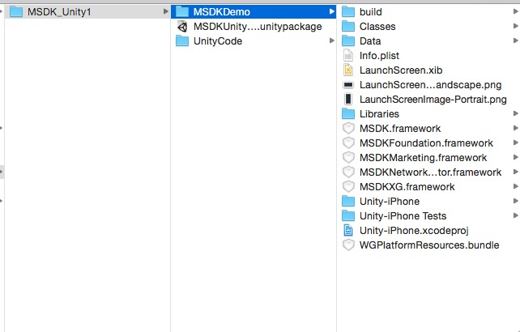
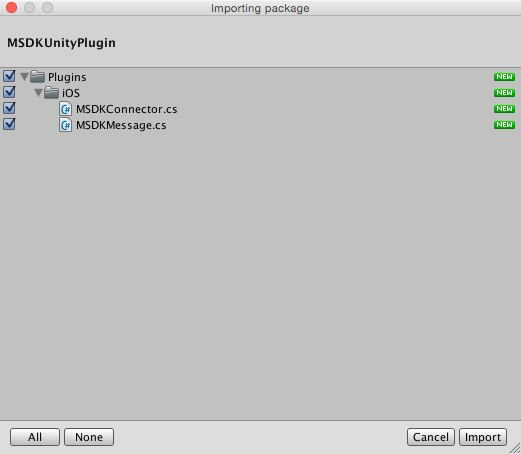
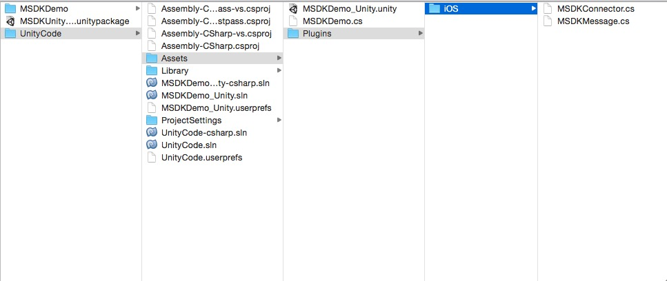
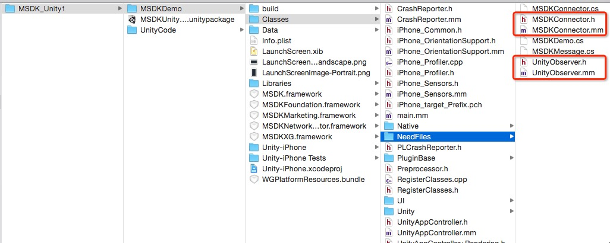

Access to MSDK(iOS) for Unity3D
===

## Overview

MSDK for Unity3D is the C# encapsulation of MSDK interfaces made with the Unity3D engine. Games using this version of MSDK can directly call the MSDK interfaces in the C# layer, thus reducing operations related to the mobile phone platform.

The release package (zip) of MSDK(iOS) for Unity mainly contains `UnityCode`, `MSDKDemo` and `MSDKUnityPlugin.unityPackage`, as shown in the following picture: 
Wherein, `UnityCode` is the Unity3D sample project calling the C# interfaces of MSD. Developers can refer to `Assets\MsdkDemo.cs` to learn the call of the MSDK interfaces. `MSDKDemo` is the demo project of MSDK after UnityCode is exported as a Xcode project. `MSDKUnityPlugin.unityPackage` is the Unity resource package of this version and contains the C# interfaces of MSDK.

## Access configuration

### Step1: Import C# interface

Open the game project in IDE of Unity3D, double-click `MSDKUnityPlugin.unityPackage` and select the required files to import, as shown below:

**Note:**
In the import process, files will not be overridden if they exist. Thus, when updating the version, please be sure to delete the content of the plug-in

### Step2: Mount script 
Select the first or main scene and create an empty game object (GameObject), which is named MSDKMessage. Open the Plugins directory, and drag the MSDKMessage.cs script file to the new game object to mount the script.
### Step3: Call Interface 
In Unity3D, the parts associated with MSDK are placed under the Assets/Plugins/iOS folder:

 

MSDK APIs are all encapsulated in the MSDKConnector class, and callbacks are all encapsulated in the MSDKMessage class. `MSDKDemo.cs` in "UnityCode" contains the call examples of MSDK for C# interfaces. The game developer can refer to such call examples of C# interfaces. Now, take QQ login as an example to demonstrate how to call MSDK API and handle callbacks:：

    // MSDKConnector’s namespace
    using MSDKConnector;
    // MSDKConnector class uses the single-case design
    MSDKConector.Instance.Login(2);      // log in QQ
    Next, handle the login callback (in MSDKMessage, the login callback method is named OnLoginNotify)

	/// 

	///  login callback	/// 

	/// <param name="jsonRet">Json ret.</param>
	void OnLoginNotify(string jsonRet)
	{
		Debug.Log ("\n\nUnity Receive Message From iOS\n\n OnLoginNotify = " + jsonRet);
		// After JSON analysis, do the next operation based on flag.
	}

### Step4: Export Xcode project and copy interface files 
Export the Unity project as the Xcode project; from MSDKDemo/Classes/NeedFiles/, copy the four files in the diagram to the Xcode project. 
 

### Step5: Get access to various frameworks of MSDK Get access to various frameworks of MSDK according to the needs