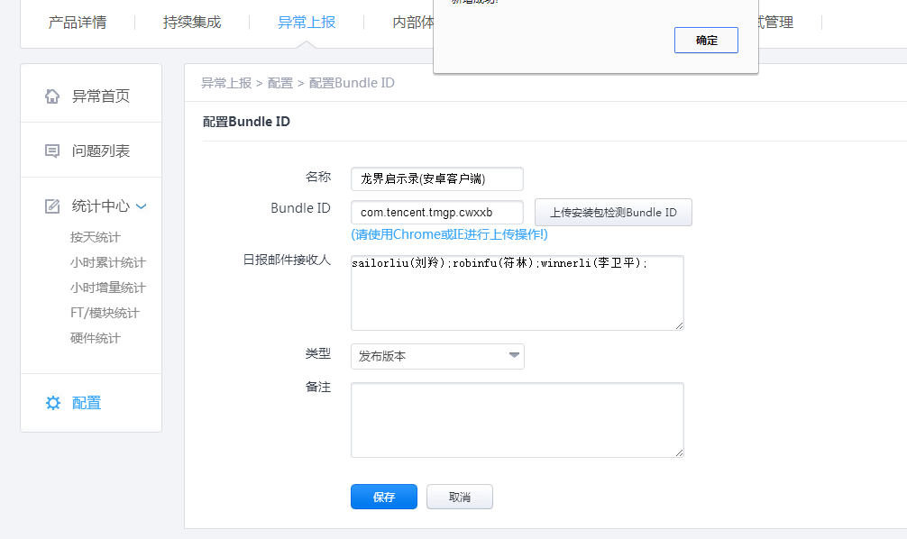
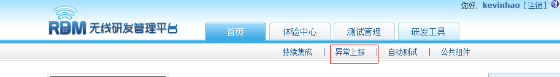
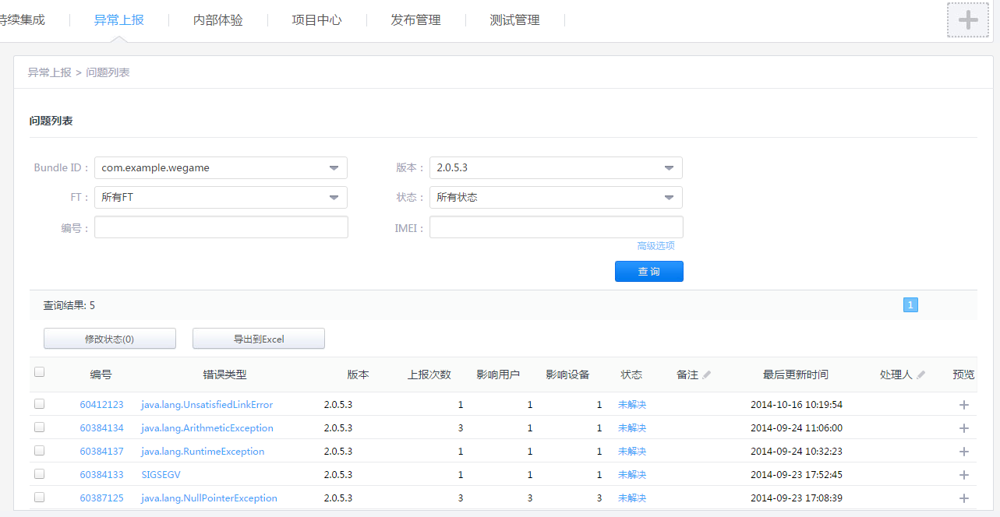
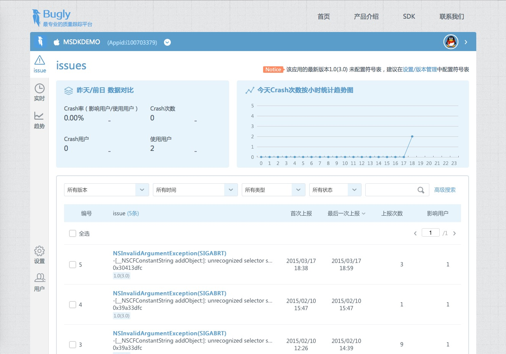
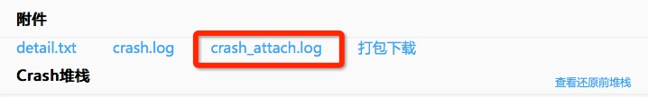

MSDK Crash Reporting Module
===
Overview
---
In versions earlier than MSDK2.6.1i (not including MSDK2.6.1i), crash reporting used RQD reporting. At that time, after reporting was submitted successfully, specific details about the crash and the stack can only be viewed in http://rdm.wsd.com/. They could only be viewed by Tencent employees by logging in the system with RTX, and it is very inconvenient for non-Tencent game developers to view them. MSDK2.6.1i and later versions use bugly reporting, whose details can be viewed at http://bugly.qq.com/. Users can use QQ account to bind related application. This way, non-Tencent game developers can easily view the reporting details. Of course, they can also be viewed in http://rdm.wsd.com/. To do so, game developers do not need any additional operations.

Reporting switch settings
---
Set the function used to turn on or off RDM data reporting:

     public static void WGEnableCrashReport(boolean bRdmEnable, boolean bMtaEnable)

This function is in WGPlatform. If you set bRdmEnable as false (bMtaEnable can be set as false), you close RDM crash reporting.

View Crash data on the RDM platform
---
####1.Registration binding

Games which are registered via DEV can automatically register RDM and do not need to register manually. Games which are manually registered can directly log in RDM, click the exception reporting module and then configure the product’s BoundID.

Steps: log in [http://rdm.wsd.com/] (http://rdm.wsd.com/), enter your product -> report exceptions. If your product is not registered, you will be reminded as shown in the following figure:

Wherein, boundID is packageName in your AndroidManifest. Unregistered products will be directly discarded when data are reported.

For more details, please contact RDM staff like Xiao Mi; for Android problems, you can contact spiritchen (Spirit Chen)

####2. How to view the reported data
- Website: [http://rdm.wsd.com/] - (http://rdm.wsd.com/) - > exception reporting > problem list

View Crash data on the Bugly platform
---
- Website: [http://bugly.qq.com/](http://bugly.qq.com/)-> log in with QQ account -> select the corresponding App

Add additional business logs in Crash reporting
--

When the program crashes, it is sometimes needed to add some additional business logs and report these logs along with the crash log to http://rdm.wsd.com/ platform, so as to help people better locate the causes of the crash. Finally, these logs can be viewed on the RDM platform.

To complete this feature, you only need to add the callback function OnCrashExtMessageNotify into the global observer:

    std::string MyObserver::OnCrashExtMessageNotify()
	{
    	return "dsafdasfsafdasdfasdf";
	}

