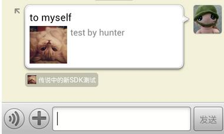
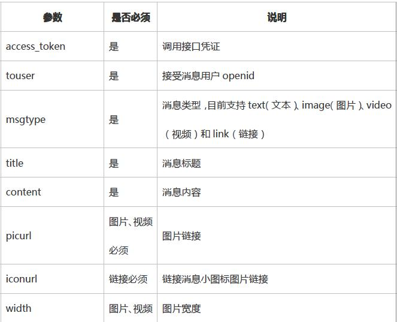
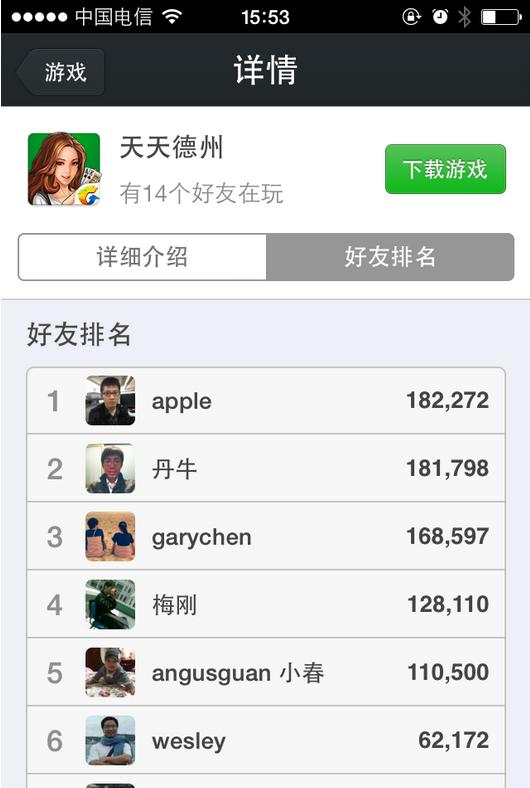
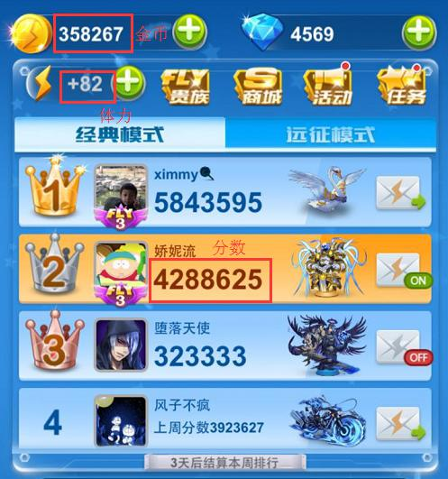
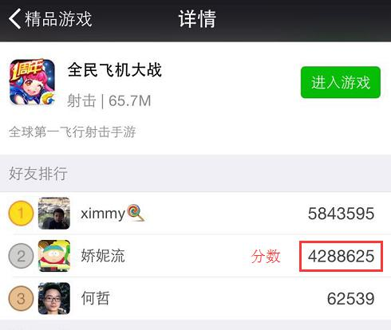

# 3. WeChat Interfaces #

## 3. auth services ##

　　Realize the relevant functions of the authorized login of WeChat Oauth

### 3.1.1 /auth/refresh_token ###

#### 3.1.1.1Interface specification ####

Because access_token has a relatively short validity period (2 hours), when access_token expires, you can use refresh_token to refresh it; refresh_token has a longer validity period (30 days); after refresh_token expires, you need to log in again.  
URL carries msdkExtInfo = xxx (request serial number). The returned contents bring back the original data of msdkExtInfo, namely, able to achieve a purely exceptional request. msdkExtInfo is an optional parameter.

#### 3.1.1.2 Input parameter description ####

| Parameter name| Type|Description|
| ------------- |:-------------:|:-----|
| appid|string| The exclusive id of an app in the platform |
| refreshToken|string| Fill in refreshToken parameter acquired through the front-end login |

#### 3.1.1.3 Output parameter description ####

| Parameter name| Description|
| ------------- |:-----|
| ret|Return code 0: correct  Others: failure |
| msg|If ret is not 0, it means “Error code, error prompt”. For details, please refer to Section 5|
| accessToken|The interface calls tokens |
| expiresIn|Expiration time for accessToken interface to call tokens; unit: second |
| refreshToken|Used by the user to refresh accessToken |
| openid|The unique identifier of a common user (WeChat platform) |
| scope| The action scope authorized by the user; use a comma (,) to separate it; more information about the action scope is shown in the table below. Action scope	Action	Default status  snsapi_friend	Not checked by default when authorized	Authorized to obtain information of the user’s friends  snsapi_message	Not checked by default when authorized	Authorized to obtain the user’s qualification to issue WeChat snsapi_userinfo	Checked by default when authorized	Authorized to obtain the user's personal information |

#### 3.1.1.4 Interface call description ####

| Parameter name|  Description|
| ------------- |:-----|
| url|http://msdktest.qq.com/auth/refresh_token/ |
| URI|?timestamp=**&appid=**&sig=**&openid=**&encode=1|
| Format|JSON |
| Request mode|POST  |

#### 3.1.1.5 Request example ####

	POST /auth/refresh_token/?timestamp=*&appid=**&sig=***&openid=**&encode=1 HTTP/1.0
	Host:$domain
	Content-Type: application/x-www-form-urlencoded
	Content-Length: 198
	
	{
	    "appid": "wxcde873f99466f74a",
	    "refreshToken": "OezXcEiiBSKSxW0eoylIeLl3C6OgXeyrDnhDI73sCBJPLafWudG-idTVMbKesBkhBO_ZxFWN4zlXCpCHpYcrXFXf2RE2ETF5F7lhiPkxA9ewAu90r3JLXpM1T4nfr9Iz184ZB0G7br72EfycDenriw"
	}
	
	//Returned result
	{
	    "ret": 0,
	    "msg": "success",
	    "accessToken": "OezXcEiiBSKSxW0eoylIeLl3C6OgXeyrDnhDI73sCBJYyBcXKXYWTlxU_BAMfu7Rzsr51Nu-CarhcPT6zYlD9FrWRzuA0ccQMgrTGqpao2AnzoP_nZ6CrBdwZ3VEQcqDPNZ-wLIvK998t3s2ecEM4Q",
	    "expiresIn": 7200,
	    "refreshToken": "OezXcEiiBSKSxW0eoylIeLl3C6OgXeyrDnhDI73sCBJYyBcXKXYWTlxU_BAMfu7Rzsr51Nu-CarhcPT6zYlD9D8IrNu9lm2w4XfMqS3j9OJgjv_8L1vvSkTjBt0q7X5foYiJOhVaNx6tDGzFkJw0vw",
	    "openid": "oGRTijrV0l67hDGN7dstOl8CphN0",
	    "scope": "snsapi_friend,snsapi_message,snsapi_userinfo,"
	}

### 3.1.2 /auth/check_token ###

#### 3.1.2.1Interface specification ####

WeChat checks if access_token is valid.

URL carries msdkExtInfo = xxx (request serial number). The returned contents bring back the original data of msdkExtInfo, namely, able to achieve a purely exceptional request. msdkExtInfo is an optional parameter.

#### 3.1.2.2 Input parameter description ####

| Parameter name| Type|Description|
| ------------- |:-------------:|:-----|
| accessToken|string|Login status |
| openid|string|The unique identifier of a user in an application |

#### 3.1.2.3Output parameter description ####

| Parameter name| Description|
| ------------- |:-----|
| ret|Return code 0: correct  Others: failure | 
| msg|If ret is not 0, it means “Error code, error prompt”. For details, please refer to Section 5|

#### 3.1.2.4 Interface call description ####

| Parameter name| Description|
| ------------- |:-----|
| url|http://msdktest.qq.com/auth/check_token/ |
| URI|?timestamp=**&appid=**&sig=**&openid=**&encode=1|
| Format|JSON |
| Request mode|POST  |

#### 3.1.2.5 Request example ####
	
	POST /auth/check_token/?timestamp=*&appid=**&sig=***&openid=**&encode=1 HTTP/1.0
	Host:$domain
	Content-Type: application/x-www-form-urlencoded
	Content-Length: 198
	
	{
	    "accessToken": "OezXcEiiBSKSxW0eoylIeLl3C6OgXeyrDnhDI73sCBJPLafWudG-idTVMbKesBkhBO_ZxFWN4zlXCpCHpYcrXNG6Vs-cocorhdT5Czj_23QF6D1qH8MCldg0BSMdEUnsaWcFH083zgWJcl_goeBUSQ",
	    "openid": "oGRTijiaT-XrbyXKozckdNHFgPyc"
	}
	
	//Returned result
	{"ret":0,"msg":"ok"}

## 3.2 Share service ##
Provide the directed sharing ability of WeChat

### 3.2.1/share/upload_wx ###

#### 3.2.1.1 Interface specification ####

Upload pictures to WeChat to exchange for media_id, which is used by the input parameter thumb_media_id of /share/wx interface. If you use the default picture (upload the app icon when registering an app) when you share a picture, you do not need to call the interface and just let thumb_media_id=””. (Do not call this interface every time you share pictures; only call it once to get media_id when you want to replace the picture used in the share; when you call /share/wx interface later, directly fill in the obtained media_id)
Note: media_id obtained via the interface is not valid in Android WeChat 5.4-6.1 (solved by the operation manager to re-upload the default icon). Android WeChat 6.2 fixes the problem.

#### 3.2.1.2  Input parameter description ####

| Parameter name| Type|Description|
| ------------- |:-------------:|:-----|
| flag|int| Fill in 1 by default; use secret to log in |
| appid|string|The unique identifier of an application |
| secret|string| Fill in appkey |
| access_token|string| The default is empty "" |
| type|string| Type of media files; default: thumb |
| filename|string|File name |
| filelength|int| The file’s binary stream length, in byte, max. 64KB|
| content_type|string| File type; please the following typs, such as: "image/jpeg" or "image/jpg" |
| binary|string| The file’s binary stream, transcoded with urlencode, for example (PHP language):
	$filename = 'b.jpg';
	$image = './image/'.$filename;
	$handle = fopen($image,'r');
	$filelength = filesize($image);//number of bytes
	$contents=fread($handle,filesize($image));
	$binary = rawurlencode($contents);
	Note: In Jave, the encoding is: “ISO-8859-1”. For example: URLEncoder.encode(new String(bs, "ISO-8859-1"), "ISO-8859-1"); |

#### 3.2.1.3 Output parameter description ####

| Parameter name| Description|
| ------------- |:-----|
| ret|Return code 0: correct  Others: failure |
| msg|If ret is not 0, it means “Error code, error prompt”. For details, please refer to Section 5|
| type|Media file’s type; existing value: thumb |
| media_id| The unique ID acquired by the media file after the file is uploaded. The ID is used for a parameter in the WeChat share interface |
| created_at| Media file’s upload time |
| access_token| Token used to call the interface |
| expire| Ignore this parameter|

#### 3.2.1.4 Interface call description ####

| Parameter name|  Description |
| ------------- |:-----|
| url|http://msdktest.qq.com/share/upload_wx/ |
| URI|?timestamp=**&appid=**&sig=**&openid=**&encode=1|
| Format|JSON |
| Request mode|POST  |

#### 3.2.1.5 Request example ####

	POST /share/upload_wx/?timestamp=*&appid=**&sig=***&openid=**&encode=1 HTTP/1.0
	Host:$domain
	Content-Type: application/x-www-form-urlencoded
	Content-Length: 198
	
	{"flag":1,"appid":"wx6f15c6c03a84433d","secret":"bf159627552fa6bc8473d492c5b3e06d","access_token":"","type":"thumb","filename":"b.jpg","filelength":65050,"content_type":"image\/jpeg","binary":"%FF%D8%FF%E0%00%10JFIF%00%01%01%01%00%60%00%60%00%00%FF%DB%00C%00%03%02%02%03%02%02%03%03%03%03%04%03%03%04%05%08%05%05%04%04%05%0A%07%07%06%08%0C%0A%0C%0C%0B%0A%0B%0B%0D%0E%12%10%0D%0E%11%0E%0B%0B%10%16%10%11%13%14%15%15%15%0C%0F%17%18%16%14%18%12%14%15%14%FF%DB%00C%01%03%04%04%05%04%05%09%05%05%09%14%0D%0B%0D%14%14%14%...."}
	
	//Returned result
	{
	    "ret": 0,
	    "msg": "success",
	    "type": "thumb",
	    "media_id": "CAUmtmwCq6jSGWaypYRzJRpErL-vUZj8UPeU8UupzyMFGGpmOnkeUDGLLI9RiTqN",
	    "created_at": "1379579554",
	    "access_token": "avl-4_K9aZ7MY88Tb-FKfCt3LNvsFkkCXGErRmX7tn19iqw0p45nGjB76tdRfhfi-7oWAQr8ZbvwC1EuWx_f8m5-A0kNNhEC7HAaePUokAtb6xGgRGyyAkoftjlk42sp4OSVJCgkuwWvithft4a00Q",
	    "expire": ’’
	}

### 3.2.2/share/wx ###

#### 3.2.2.1Interface specification ####
　　　Send the shared messages to WeChat friends (only send them to friends who have installed the same games).

#### 3.2.2.2 Input parameter description ####

| Parameter name| Type|Description|
| ------------- |:-------------:|:-----|
| openid|string|The unique identifier of a user in an application |
| fopenid|string| openid of a friend shared with messages|
| access_token|string|Login status |
| extinfo|string| Simple data self-defined by a third-party program. WeChat will send the data back to the third-party program to process the data. Data length is not more than 2k; when the client is clicked, it can get this field. |
| title|string| Application message title |
| description|string| Application message description  |
| media_tag_name|string| Distinguish game info types; used for statistics |
| thumb_media_id|string| Default value is empty: the argument is empty; the picture used for sharing is the picture used to register in WeChat platform. If you need to change the picture for sharing, media_id can be acquired by /share/upload_wx interface |

#### 3.2.2.3Output parameter description ####

| Parameter name| Description|
| ------------- |:-----|
| ret|Return code 0: correct  Others: failure |
| msg|If ret is not 0, it means “Error code, error prompt”. For details, please refer to Section 5|

#### 3.2.2.4 Interface call description ####

| Parameter name| Description|
| ------------- |:-----|
| url|http://msdktest.qq.com/share/wx/ |
| URI|?timestamp=**&appid=**&sig=**&openid=**&encode=1|
| Format|JSON |
| Request mode|POST  |

#### 3.2.2.5 Request example ####

	POST /share/wx/?timestamp=*&appid=**&sig=***&openid=**&encode=1 HTTP/1.0
	Host:$domain
	Content-Type: application/x-www-form-urlencoded
	Content-Length: 198
	{
	    "openid": "oGRTijrV0l67hDGN7dstOl8CphN0",
	    "fopenid": "oGRTijrV0l67hDGN7dstOl8CphN0",
	    "access_token": "OezXcEiiBSKSxW0eoylIeLl3C6OgXeyrDnhDI73sCBJYyBcXKXYWTlxU_BAMfu7Rzsr51Nu-CarhcPT6zYlD9FrWRzuA0ccQMgrTGqpao2BZMgzJc8KWgXT8uGw242GeNigmf9VQCouPmZ9ciBE4MA",
	    "extinfo": "extinfo",
	    "title": "to myself",
	    "description": "test by hunter",
	    "media_tag_name": "media_tag_name",
	    "thumb_media_id": ""
	}
	
	//Returned result
	{"ret":0,"msg":"success"}

#### 3.2.2.6 Share screenshot example ####

### 3.2.3/share/wxgame (the interface is not open) ### ###

#### 3.2.3.1 Interface specification ####

Send messages to friends authorized to use the same developer account; the messages will be displayed in the game center.
Messages are divided into the display module (supporting text, images, videos and links) and the button module (supporting starting games, opening the leaderboard edition and opening links). Construct the message request if requesting through the interface.

#### 3.2.3.2 Input parameter description ####

| Parameter name| Type|Description|
| ------------- |:-------------:|:-----|
| appid|string| The exclusive id of an app in the platform |
| openid|string|The unique identifier of a user in an application |
| access_token|string|Login status |
| touser|string| The receiver’s opened |
| msgtype|string| Message type. Currently support text, image, video and link|
| title|string|Login status |
| content|string| Message content, which correspond to text, image, video and link contents |
| type_info|struct| Type parameter |
| button|struct| Button effect |
Description of parameters in the request example:

#### 3.2.3.3Output parameter description ####

| Parameter name| Description|
| ------------- |:-----|
| ret|Return code 0: correct  Others: failure |
| msg|If ret is not 0, it means “Error code, error prompt”. For details, please refer to Section 5|

#### 3.2.3.4 Interface call description ####

| Parameter name|  Description |
| ------------- |:-----|
| url|http://msdktest.qq.com/share/wxgame/ |
| URI|?timestamp=**&appid=**&sig=**&openid=**&encode=1|
| Format|JSON |
| Request mode|POST  |

3.2.3.5 Request example

	POST /share/wxgame/?timestamp=*&appid=**&sig=***&openid=**&encode=1 HTTP/1.0
	Host:$domain
	Content-Type: application/x-www-form-urlencoded
	Content-Length: 198
	//Send text message; the button is to skip to the leaderboard edition
	{
	    "access_token": "OezXcEiiBSKSxW0eoylIeLl3C6OgXeyrDnhDI73sCBJYyBcXKXYWTlxU_BAMfu7Rzsr51Nu-CarhcPT6zYlD9FrWRzuA0ccQMgrTGqpao2B9F0OYlWIOzWjd_GdcKvIZX4PQn0Qs651yNntCvTeIUg",
	    "openid": "oGRTijrV0l67hDGN7dstOl8CphN0",
	    "appid": "wxd477edab60670232",
	    "touser": "OPENID",
	    "msgtype": "text",
	    "title": "TITLE",
	    "content": "CONTENT",
	    "button": {
	        "type": "rank",
	        "name": "BUTTON_NAME",
	        "rankview": {
	            "title": "RANK_TITLE",
	            "button_name": "LAUNCH_GAME",
	            "message_ext": "MESSAGE_EXT"
	        }
	    }
	}
	//Send image message; the button is to skip to the leaderboard edition
	{
	    "access_token": "OezXcEiiBSKSxW0eoylIeLl3C6OgXeyrDnhDI73sCBJYyBcXKXYWTlxU_BAMfu7Rzsr51Nu-CarhcPT6zYlD9FrWRzuA0ccQMgrTGqpao2B9F0OYlWIOzWjd_GdcKvIZX4PQn0Qs651yNntCvTeIUg",
	    "openid": "oGRTijrV0l67hDGN7dstOl8CphN0",
	    "appid": "wxd477edab60670232",
	    "touser": "OPENID",
	    "msgtype": "image",
	    "title": "TITLE",
	    "content": "CONTENT",
	    "type_info": {
	        "picurl": "PICURL",
	        "width": 180,
	        "height": 180
	    },
	    "button": {
	        "type": "rank",
	        "name": "BUTTON_NAME",
	        "rankview": {
	            "title": "RANK_TITLE",
	            "button_name": "LAUNCH_GAME",
	            "message_ext": "MESSAGE_EXT"
	        }
	    }
	}
	//Send video message; the button is to open the link
	{
	    "access_token": "OezXcEiiBSKSxW0eoylIeLl3C6OgXeyrDnhDI73sCBJYyBcXKXYWTlxU_BAMfu7Rzsr51Nu-CarhcPT6zYlD9FrWRzuA0ccQMgrTGqpao2B9F0OYlWIOzWjd_GdcKvIZX4PQn0Qs651yNntCvTeIUg",
	    "openid": "oGRTijrV0l67hDGN7dstOl8CphN0",
	    "appid": "wxd477edab60670232",
	    "touser": "OPENID",
	    "msgtype": "video",
	    "title": "TITLE",
	    "content": "CONTENT",
	    "type_info": {
	        "picurl": "PICURL",
	        "width": 300,
	        "height": 300,
	        "mediaurl": "http://v.youku.com/v_show/id_XNjc0NTA4MzM2.html?f=21949327&ev=2"
	    },
	    "button": {
	        "type": "web",
	        "name": "BUTTON_NAME",
	        "webview": {
	            "url": "http://www.qq.com/"
	        }
	    }
	}
	//Send link message; the button is to open the game
	{
	    "access_token": "OezXcEiiBSKSxW0eoylIeLl3C6OgXeyrDnhDI73sCBJYyBcXKXYWTlxU_BAMfu7Rzsr51Nu-CarhcPT6zYlD9FrWRzuA0ccQMgrTGqpao2B9F0OYlWIOzWjd_GdcKvIZX4PQn0Qs651yNntCvTeIUg",
	    "openid": "oGRTijrV0l67hDGN7dstOl8CphN0",
	    "appid": "wxd477edab60670232",
	    "touser": "ocfbNjkN8WfPRFlTx4cLU-jNiXKU",
	    "msgtype": "link",
	    "title": " A link of Youku",
	    "content": " This is a wonderful link",
	    "type_info": {
	        "url": "http://www.youku.com/",
	        "iconurl": "http://tp4.sinaimg.cn/1949746771/180/5635873654/1"
	    },
	    "button": {
	        "type": "app",
	        "name": " start",
	        "app": {
	            "message_ext": "ext"
	        }
	    }
	}
	
	//Returned result
	{"ret":0,"msg":"success"}

## 3.3.Relation service ##

　Provide services to inquire the basic account information of the WeChat user and his/her friends

### 3.3.1 /relation/wxfriends_profile ###

#### 3.3.1.1Interface specification ####
　Acquire the basic account information of the WeChat user and his/her game friends

*** PS: This interface is a new interface which is formed by merging two interfaces of /relation/wxprofile&/relation/wxfriends, namely, as long as you make only one request, you can get your game friends’ basic information. You do not need to get your friends list before requesting your friends’ personal information. The interface coexists with the interfaces before the merger. It is recommended to use this interface to get your game friends’ information. ***

#### 3.3.1.2 Input parameter description ####

| Parameter name| Type|Description|
| ------------- |:-------------:|:-----|
| accessToken|string|Login status |
| openid|string|The unique identifier of a user in an application |

#### 3.3.1.3Output parameter description ####

| Parameter name| Description|
| ------------- |:-----|
| ret|Return code 0: correct  Others: failure |
| msg|If ret is not 0, it means “Error code, error prompt”. For details, please refer to Section 5|
| lists| WeChat game friends’ personal info list, Type `vector<WXInfo>`|
| privilege| The user’s privilege information; json array; if WeChat Voca user is China Unicom, the system only returns the corresponding Voca information of the first openid in the array, but later openid in the array can not get Voca information. |
| country| country |
| language| language |

	struct WXInfo {
		string          nickName;       // nickname
		int             sex;            // gender 1: male 2: female
		string          picture;        // the user’s head portrait, behind which the following parameters /0, /132, /96 and /64 must be appended to, so that different specifications of pictures can be obtained: the original pictures(/0), 132*132(/132), 96*96(/96), 64*64(/64), 46*46(/46)
		string          provice;        //province
		string          city;           //city
		string          openid;        //user identifier
	};

#### 3.3.1.4 Interface call description ####

| Parameter name| Description|
| ------------- |:-----|
| url|http://msdktest.qq.com/relation/wxfriends_profile/ |
| URI|?timestamp=**&appid=**&sig=**&openid=**&encode=1|
| Format|JSON |
| Request mode|POST  |

#### 3.3.1.5 Request example ####

	POST /relation/wxfriends_profile/?timestamp=1380018062&appid=wxcde873f99466f74a&sig=dc5a6330d54682c88846b1294fbd5fde&openid=A3284A812E%20CA15269F85AE1C2D94EB37&encode=1
	
	{
	    "accessToken": "OezXcEiiBSKSxW0eoylIeLl3C6OgXeyrDnhDI73sCBJYyBcXKXYWTlxU_BAMfu7Rzsr51Nu-CarhcPT6zYlD9FrWRzuA0ccQMgrTGqpao2DJrEqoT5SW76pqG7N3Mh6ZI79VLoFSM7wdVpS4bz61Vg",
	    "openid": "oGRTijrV0l67hDGN7dstOl8CphN0"
	}
	
	//Returned result
	{
	    "country": "CN",
	    "language": "zh_CN",
	    "ret": 0,
	    "msg": "success",
	    "lists": [{
	        "nickName": "ufo",
	        "sex": 1,
	        "picture": "http:\/\/wx.qlogo.cn\/mmhead\/LwcbhAmMnZBAqZyUkv1z3qJibczZRdrZRkTgcNnqKqovicmDxLmyffdQ",
	        "provice": "",
	        "city": "Shenzhen",
	        "openid": "oy6-ljl-aYH1tl3L2clpVhhVXHtY"
	    },
	    {
	        "nickName": "\u8054\u901atest",
	        "sex": 2,
	        "picture": "",
	        "provice": "",
	        "city": "",
	        "openid": "oy6-ljtb1PKnNtRKlouJAj952hlg"
	    },
	    {
	        "nickName": "ila",
	        "sex": 2,
	        "picture": "http:\/\/wx.qlogo.cn\/mmhead\/Q3auHgzwzM5wrVe0CbkibUDWDvJpgzt1W4QicbXF09SPo1rLO8Glff5Q",
	        "provice": "",
	        "city": "",
	        "openid": "oy6-ljqJeurpVex1kyRAZl5blq3U"
	    },
	    {
	        "nickName": "KDS\u9648\u5c0f\u4eae\u5f88\u5c4c\u4e1d",
	        "sex": 1,
	        "picture": "http:\/\/wx.qlogo.cn\/mmhead\/HS9jXWzBezdQrNojlmPvvQlwhGJcrN923nrJCSmv2rk",
	        "provice": "",
	        "city": "Yangpu",
	        "openid": "oy6-ljrzoW6jjxS2jI2LHZvGdsqA"
	    },
	    {
	        "nickName": "Lewis",
	        "sex": 1,
	        "picture": "http:\/\/wx.qlogo.cn\/mmhead\/zreQPiaCicYfReYeU0sicsc92cfBdMejRFsicXK1fZibP7aM",
	        "provice": "",
	        "city": "Po",
	        "openid": "oy6-ljoHSdnupQFMgHNTWoqSXXVg"
	    }],
	    "privilege": []
	}

### 3.3.2/relation/wxprofile (only for boutique games) ###

#### 3.3.2.1Interface specification ####

Acquire the basic information of the user’s WeChat account

#### 3.3.2.2 Input parameter description ####

| Parameter name| Type|Description|
| ------------- |:-------------:|:-----|
| accessToken|string|Login status |
| openids|`vector<string>`|`vector<string>` type; need the launched openid account list (if you want to get the current logging user’s Voca information, please place the user’s openid in the first place, because only the first openid in the array can get the corresponding Voca information, and later openid can not get Voca information.) |

#### 3.3.2.3Output parameter description ####

| Parameter name| Description|
| ------------- |:-----|
| ret|Return code 0: correct  Others: failure |
| msg|If ret is not 0, it means “Error code, error prompt”. For details, please refer to Section 5|
| lists|Info list `vector<WXInfo>` type |
| privilege|The user’s privilege information; json array; if WeChat Voca user is China Unicom, the system only returns the corresponding Voca information of the first openid in the array, but later openid in the array can not get Voca information.|

	struct WXInfo {
		string          nickName;       //nickname
		int             sex;           //gender 1: male; 2: female; if the user does not fill out, the default value is 1
		string          picture;        //the user’s head portrait, behind which the following parameters /0, /132, /96 and /64 must be appended to, so that different specifications of pictures can be obtained: the original pictures(/0), 132*132(/132), 96*96(/96), 64*64(/64), 46*46(/46)
		string          provice;        //province
		string          city;           //city
		string          openid;        //user identifier
		string          country        //country
		string          language      // language
	};

#### 3.3.2.4 Interface call description ####

| Parameter name| Description|
| ------------- |:-----|
| url|http://msdktest.qq.com/relation/wxprofile/ |
| URI|?timestamp=**&appid=**&sig=**&openid=**&encode=1|
| Format|JSON |
| Request mode|POST  |

#### 3.3.2.5 Request example ####

	POST /relation/wxprofile/?timestamp=*&appid=**&sig=***&openid=**&encode=1 HTTP/1.0
	Host:$domain
	Content-Type: application/x-www-form-urlencoded
	Content-Length: 198
	{
	    "accessToken": "OezXcEiiBSKSxW0eoylIeLl3C6OgXeyrDnhDI73sCBJYyBcXKXYWTlxU_BAMfu7Rzsr51Nu-CarhcPT6zYlD9FrWRzuA0ccQMgrTGqpao2Ccq_dcbciAvC8frI3gYk5d2p6pDFy-bOqyPTNysUxOQg",
	    "openids": ["oGRTijrV0l67hDGN7dstOl8CphN0", "oGRTijlTxQPrvr-H5-pgoZMhZgog"]
	}
	
	//Returned result
	{
	    "country": "CN",
	    "language": "zh_CN",
	    "lists": [
	        {
	            "city": "Shenzhen",
	            "nickName": "Hunter",
	            "openid": "oGRTijrV0l67hDGN7dstOl8CphN0",
	            "picture": "http://wx.qlogo.cn/mmhead/RpIhxf6qwjeF1QA6YxVvE8El3ySJHWCJia63TePjLSIc",
	            "provice": "",
	            "sex": 1
	        },
	        {
	            "city": "Zhongshan",
	            "nickName": "WeGame test",
	            "openid": "oGRTijlTxQPrvr-H5-pgoZMhZgog",
	            "picture": "",
	            "provice": "",
	            "sex": 2
	        }
	    ],
	    "msg": "success",
	    "privilege": [],
	    "ret": 0
	}

### 3.3.3/relation/wxfriends ###

#### 3.3.3.1 Interface specification ####

Get the openid list of WeChat game friends. After getting the list, you can query your friends’ basic information in batch through /relation/wxprofile interface.

#### 3.3.3.2 Input parameter description ####

| Parameter name| Type|Description|
| ------------- |:-------------:|:-----|
| accessToken|string|Login status |
| openid|string|The unique identifier of a user in an application |

#### 3.3.3.3Output parameter description ####

| Parameter name| Description|
| ------------- |:-----|
| ret|Return code 0: correct  Others: failure |
| msg|If ret is not 0, it means “Error code, error prompt”. For details, please refer to Section 5|
| openids|Friend list vector<string> Type  |

#### 3.3.3.4 Interface call description ####

| Parameter name| Description|
| ------------- |:-----|
| url|http://msdktest.qq.com/relation/wxfriends/ |
| URI|?timestamp=**&appid=**&sig=**&openid=**&encode=1|
| Format|JSON |
| Request mode|POST  |

#### 3.3.3.5 Request example ####

	POST 
	/relation/wxfriends/?timestamp=*&appid=**&sig=**&openid=**&encode=1 HTTP/1.0
	Host:$domain
	Content-Type: application/x-www-form-urlencoded
	Content-Length: 198

	{
	    "openid": "oGRTijiaT-XrbyXKozckdNHFgPyc",
	    "accessToken": "OezXcEiiBSKSxW0eoylIeLl3C6OgXeyrDnhDI73sCBJPLafWudG-idTVMbKesBkhaKJhRmjhioMlDM_zBq_SxfYO2jdJKzAR6DSHL5-02O6oATRKHf57K-teO6bPsB1RHjH5Z0I1TzMn4DllSYrf3Q"
	}
	
	//Returned result
	{
	    "ret": 0,
	    "msg": "success",
	    "openids": ["oy6-ljtb1PKnNtRKlouJAj952hlg", "oy6-ljrzoW6jjxS2jI2LHZvGdsqA", "oy6-ljqJeurpVex1kyRAZl5blq3U", "oy6-ljoHSdnupQFMgHNTWoqSXXVg", "oy6-ljl-aYH1tl3L2clpVhhVXHtY"]
	}

### 3.3.4/relation/wxuserinfo (for non-boutique businesses) ###

### 3.3.4.1 Interface specification ###

Get WeChat user’s personal information

#### 3.3.4.2 Input parameter description ####

| Parameter name| Type|Description|
| ------------- |:-------------:|:-----|
| appid|string| The exclusive id of an app in the platform |
| accessToken|string|Login status |
| openid|string|The unique identifier of a user in an application |

#### 3.3.4.3Output parameter description ####

| Parameter name| Description|
| ------------- |:-----|
| ret|Return code 0: correct  Others: failure |
| msg|If ret is not 0, it means “Error code, error prompt”. For details, please refer to Section 5|
| nickname|nickname |
| picture| ‘the user’s head portrait, behind which the following parameters /0, /132, /96 and /64 must be appended to’, so that different specifications of pictures can be obtained: the original pictures(/0), 132*132(/132), 96*96(/96), 64*64(/64), 46*46(/46)|
| province|province |
| city|city |
| country|country|
| sex|gender 1: male; 2: female; if the user does not fill out, the default value is 1; 0 indicates unknown |
| unionid| the user’s unified identifier. For an application under the WeChat open platform account, the same user’s unionid is unique. |
| privilege|the user’s privilege information; json array; if WeChat Voca user is China Unicom, the system only returns the corresponding Voca information of the first openid in the array, but later openid in the array can not get Voca information.|
| language| language (may be null)|
| gpsCity|city gotten via GPS|
| openid|the user’s unique identifier in the application|

#### 3.3.4.4 Interface call description ####

| Parameter name| Description |
| ------------- |:-----|
| url|http://msdktest.qq.com/relation/wxuserinfo/ |
| URI|?timestamp=**&appid=**&sig=**&openid=**&encode=1|
| Format|JSON |
| Request mode|POST  |

#### 3.3.4.5 Request example ####

	POST /relation/wxuserinfo/?timestamp=*&appid=**&sig=***&openid=**&encode=1 HTTP/1.0
	Host:$domain
	Content-Type: application/x-www-form-urlencoded
	Content-Length: 198
	
	{
		"appid": "wxcde873f99466f74a",
		"openid": "oGRTijrV0l67hDGN7dstOl8CphN0",
		"accessToken": "OezXcEiiBSKSxW0eoylIeLl3C6OgXeyrDnhDI73sCBJYyBcXKXYWTlxU_BAMfu7Rzsr51Nu-CarhcPT6zYlD9FrWRzuA0ccQMgrTGqpao2C-TqXCXdT-DZ44iKkidglb5Q9jQbXnMPrSTck_DUdGMg"
	}
	
	//Returned result
	{
		"city": "Shenzhen",
		"country": "CN",
		"msg": "success",
		"nickname": "Hunter",
		"picture": "http://wx.qlogo.cn/mmopen/uQDECzzFUic3xMCxSqQwsgXZqgCB2MtscmicF20OGZiaKia6fMlqOLuGjlibiaUnVPk0GoGwkKWv2MIa8e4BSwXRHn7ia7zRn1bVz9E/0",
		"privilege": [],
		"province": "Guangdong",
		"ret": 0,
		"sex": "1",
		"unionid": "o1A_BjhwQHB2BUyasZ_Lb2rkkOpE"
	}

## 3.4.Profile service ##

### 3.4.1/profile/wxscore (the interface will be deactivated; please call the new interface: /profile/wxbattle_report) ###

#### 3.4.1.1Interface specification ####

Report the gamer’s score to WeChat platform; and display friends’ leaderboard in the WeChat Game Center (take effect in time)
(The interface will be deactivated; please call the new interface: 3.4.2/profile/wxbattle_report)

#### 3.4.1.2 Input parameter description ####

| Parameter name| Type|Description|
| ------------- |:-------------:|:-----|
| appid|string| The exclusive id of an app in the platform |
| openid|string|The unique identifier of a user in an application |
| grantType|string| Authorization type. Default: “client_credential” |
| score|string| Score |
| expires|string| Timeout; unix timestamp; 0: never expire|
*** (Please notice the type of the input parameter. Refer to 1.5) ***

#### 3.4.1.3Output parameter description ####

| Parameter name| Description|
| ------------- |:-----|
| ret|Return code 0: correct  Others: failure |
| msg|If ret is not 0, it means “Error code, error prompt”. For details, please refer to Section 5|

#### 3.4.1.4 Interface call description ####

| Parameter name| Description|
| ------------- |:-----|
| url|http://msdktest.qq.com/profile/wxscore/ |
| URI|?timestamp=**&appid=**&sig=**&openid=**&encode=1|
| Format|JSON |
| Request mode|POST  |

#### 3.4.1.5 Request example ####

	POST http://msdktest.qq.com/profile/wxscore/?timestamp=1380018062&appid=wxcde873f99466f74a&sig=dc5a6330d54682c88846b1294fbd5fde&openid=A3284A812E%20CA15269F85AE1C2D94EB37&encode=1
	
	{
	    "appid": "wxcde873f99466f74a",
	    "grantType": "client_credential",
	    "openid": "oGRTijrV0l67hDGN7dstOl8CphN0",
	    "score": "1000000",
	    "expires": "12345612312"
	}
	
	//Returned result
	{
	    "msg": "success",
	    "ret": 0
	}

#### 3.4.1.6  Effect demonstration ####

### 3.4.2/profile/wxbattle_report ###

#### 3.4.2.1Interface specification ####

    Report the game’s score information (scores, battles, etc.) to the WeChat Game Center; the reporting time is the finish time of each game, each pass or each round. It may also be a reasonable reporting time customized by the game. Which data should be reported is proposed by the WeChat gaming platform (johnnyliu, hugozhou). After the two sides reach agreement via negotiation, report the data.
    Take "Universal Aircraft War" for example. Gold coins and physical power belong to the game’s personality data; select scores as the basis to rank WeChat friends (try to keep consistent with the game).

#### 3.4.2.2 Input parameter description ####

| Parameter name| Type|Description|
| ------------- |:-------------:|:-----|
| appid|string| The exclusive id of an app in the platform |
| openid|string|The unique identifier of a user in an application |
| json|json object| battle json data |

	Reporting data jsonFormat (individual user data):
	{
		"baseinfo": {
		"openid": "odFzSjp6jND4U0uRS35PW7c7NKvs", // string type, user identifier; required in case of multi-user batch data
		"gamename": "Universal Aircraft War", // string type, the name of the game, suggested to fill in
		"platid": 0 //integer, platform type, 0: :iOS  1:Andriod; required
		"partitionid": "9", //string type, partition ID; the game does not have the “partition” concept, so this item can be omitted; otherwise, it is recommended to fill in it
		"roleid": "wongcai", // string, role ID; the game does not have the “role” concept, so this item can be omitted; otherwise, it is recommended to fill in it
		"level": 2 // integer, user level; game users are not divided by “level”, so this item can be omitted; otherwise, it is recommended to fill in it
},
	"battleinfo": {
		"score": 4288625. // integer. The value influences the leaderboard of WeChat games; it is optional, but there is no leaderboard if there are not such data (take "Universal Aircraft War" for example. This item is filled with the score gotten in the game)
		“iswin”: true // boolean; whether or not the current round can get victory; suitable for chess; if there is no concept of victory, this item can be omitted; otherwise, it is recommended to fill in this item
},
		“userdefined”: {// the game’s custom data; reported from the platform side; the game side temporarily does not need to report the data on itself; for example, the platform requires  "Universal Aircraft War" to report gold coins, physical power, warplanes and other custom data, in which the value type generally are integer or string type:
		"goldcoin": { //custom data ID1
			"name": "gold coin", //string type, data name
			"value": 358267, //integer, data value
		},
		"power": { //custom data ID2
			"name": " physical power ", //string type, data name
			"value": 86542, //integer, data value
		},
		"plane": { //custom data ID3
			"name": "warplane", //string type, data name
			"value": "Seraph", //string type, data content
		},
		//custom data can keep expanding
	 }
	}
	//At the same time, support multiple-user batch data; assemble several single cases into JSON array format: [{user data 1}, {user data 2},...]

*** (Please notice the type of the input parameter. Refer to 1.5)***

#### 3.4.2.3Output parameter description ####

| Parameter name| Description|
| ------------- |:-----|
| ret|Return code 0: correct  Others: failure |
| msg|If ret is not 0, it means “Error code, error prompt”. For details, please refer to Section 5|

#### 3.4.2.4 Interface call description ####

| Parameter name| Description|
| ------------- |:-----|
| url|http://msdktest.qq.com/profile/wxbattle_report/ |
| URI|?timestamp=**&appid=**&sig=**&openid=**&encode=1|
| Format|JSON |
| Request mode|POST  |

#### 3.4.2.5 Request example ####

	POST http://msdktest.qq.com/profile/wxbattle_report/?timestamp=1380018062&appid=wxcde873f99466f74a&sig=dc5a6330d54682c88846b1294fbd5fde&openid=A3284A812E%20CA15269F85AE1C2D94EB37&encode=1
	
	{
	    "appid": "wxcde873f99466f74a",
	    "openid": "oGRTijrV0l67hDGN7dstOl8CphN0",
		"json":{
		    "baseinfo": { 
		        "gamename": "xxx",
		        "platid": 0,
		        "partitionid": "9",
		        "roleid": "hunter",
		        "level": 2 
		    },
		    "battleinfo": {
		        "score": 4288625,
		        "iswin": true
		    }
		}
	}
	
	//Returned result
	{
	    "msg": "success",
	    "ret": 0
	}

### 3.4.3/profile/wxget_vip ###

#### 3.4.3.1Interface specification ####

Get WeChat’s privileges

#### 3.4.3.2 Input parameter description ####

| Parameter name| Type|Description|
| ------------- |:-------------:|:-----|
| appid|string| The exclusive id of an app in the platform |
| openid|string|The unique identifier of a user in an application |
| accessToken|string|request user’s login status |
| json|json object|request json, content is: {"optype":1}, "optype:1": indicate to get the user’s own and game friends’ VIP info; there is no other value for the item temporarily |

*** (Please notice the type of the input parameter. Refer to 1.5)***

#### 3.4.3.3Output parameter description ####

| Parameter name| Description|
| ------------- |:-----|
| ret|Return code 0: correct  Others: failure |
| msg|If ret is not 0, it means “Error code, error prompt”. For details, please refer to Section 5|
| data| VIP info `vipinfo`|

	{
	    "vipinfo": [	// in vipinfo array, the first record is the requester by default, followed with friends; if there is no data, data is empty
						//logo_url and logo_faceurl parameters are temporarily unavailable; don’t pay attention to them
	        {
	            "openid": "xxx",
	            "level": 1,			//level
	            "score": 310,		//score
	            "nick": "VIP1",		//vip name
	            "logo_url": "xxxx", //vip logo image url
	            "logo_faceurl": "xxx" // url of VIP logo image used to be embedded into the head portrait
	        },
	        {
	            "openid": "xxx",
	            "level": 0,
	            "score": 0,
	            "nick": "VIP0",
	            "logo_url": "xxxx",
	            "logo_faceurl": "xxx"
	        }
	    ]
	}

#### 3.4.3.4 Interface call description ####

| Parameter name| Description|
| ------------- |:-----|
| url|http://msdktest.qq.com/profile/wxget_vip/ |
| URI|?timestamp=**&appid=**&sig=**&openid=**&encode=1|
| Format|JSON |
| Request mode|POST  |

#### 3.4.3.5 Request example ####

	POST http://msdktest.qq.com/profile/wxget_vip?timestamp=1380018062&appid=wxcde873f99466f74a&sig=dc5a6330d54682c88846b1294fbd5fde&openid=A3284A812E%20CA15269F85AE1C2D94EB37&encode=1
	
	{
	    "appid": "wxcde873f99466f74a",
	    "openid": "oGRTijrV0l67hDGN7dstOl8CphN0",
	    "accessToken": "OezXcEiiBSKSxW0eoylIeLl3C6OgXeyrDnhDI73sCBJYyBcXKXYWTlxU_BAMfu7Rzsr51Nu-CarhcPT6zYlD9FrWRzuA0ccQMgrTGqpao2C-TqXCXdT-DZ44iKkidglb5Q9jQbXnMPrSTck_DUdGMg",
	    "json": {
	        "optype": 1
	    }
	}
	
	//Returned result
	{
	    "msg": "success",
	    "ret": 0,
		"data":{
		    "vipinfo": [
		        {
		            "openid": "xxx",
		            "level": 1,			
		            "score": 310,		
		            "nick": "VIP1",		
		            "logo_url": "xxxx", 
		            "logo_faceurl": "xxx" 
		        },
		        {
		            "openid": "xxx",
		            "level": 0,
		            "score": 0,
		            "nick": "VIP0",
		            "logo_url": "xxxx",
		            "logo_faceurl": "xxx"
		        }
		    ]
		}
	}

