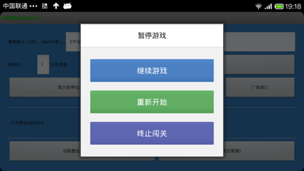
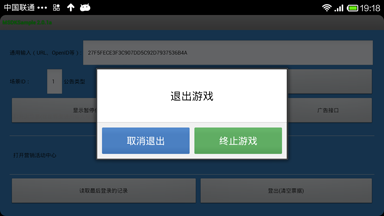
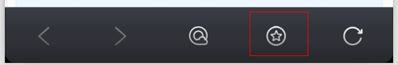
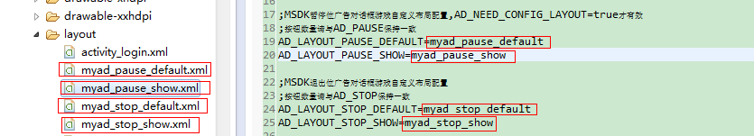

MSDK 広告 関連モジュール
===
一、概説
---
ゲームでは一時停止ボタンが設けられ、ユーザーがボタンをクルックする時、一時停止のダイアログボックスがポップアップされます。戻りキーを押す時に終了のダイアログボックスがポップアップされます。下図に示すように、MSDK2.1から、MSDKでは一時停止及び終了の自己定義ダイアログボックスが追加されます。

 

このゲームには表示される広告がある時、次のような画面が表示されます。複数の広告がある場合、一定の時間が経過すると画像が自動的に次の広告へジャンプされます。フリックすると次の広告に入ることができます。

 

ここで、ボタンの数は__adconfig.ini__で設定され、__2__又は__3__にしか設定されません。図3のように、一時停止箇所ダイアログボックスには「続行」、「再開」、「ミッション終了」など3つのボタンがあります。 ボタンの文字を変更できます。ボタンをクルックすると、ダイアログボックスが消え、MSDKのコールバックインターフェースOnADNotifyでゲームに通知し、ゲームはこの関数では具体的なロジックを実現します。それぞれのViewには__android:tag__というプロパティがあり、ゲームは異なるtag名でどのボタンに反応したか区分します。省略のレイアウトを利用する場合、図3に示すように、「続行」のviewTagは`FIRST_BTN_POSITION`、「再開」のviewTagは`SECOND_BTN_POSITION`，「ミッション終了」のviewTagは`THIRD_BTN_POSITION`となります。ゲームで戻りキーを押す時、MSDKのコールバックインターフェース`OnADBackPressedNotify`でゲームに通知します。

また、内蔵ブラウザを用いてナビゲーションバー広告を表示できます。ナビゲーションバー広告がある時、内蔵ブラウザの下にあるナビゲーションバーでは図5のように推奨ボタンが表示されます。クリックするとナビゲーションバーの広告ページが表示されます。
 

二、ゲーム接続
---
###Step 1：接続配置
__ MSDKSample/assets/adconfig.iniをゲームの対応エンジニアリングassetsディレクトリーにコピーして設定してください。__

assets/adconfig.iniで広告表示のスイッチを配置します：

    MSDK_AD=true // trueの時に広告を表示します

assets/adconfig.iniで広告のボタン数を設定します:

    ;MSDK一時停止箇所の広告ボタン数を設定し、2,3だけを記入できます。デフォルトでは2にします
    ;AD_PAUSE=2
    AD_PAUSE=3
    
    ;MSDK終了箇所の広告ボタン数を設定し、2,3だけを記入できます。デフォルトでは2にします
    ;AD_STOP=3
    AD_STOP=2

###Step 2：ゲームActivityライフサイクルのポイント
ゲームのマスタAcitivityのonResumeとonPauseではそれぞれMSDKの対応メソッドを呼び出します。これを必ず呼び出してください。

    @Override
    protected void onResume() {
        super.onResume();
        WGPlatform.onResume();
    }
    @Override
    protected void onPause() {
        super.onPause();
        WGPlatform.onPause();
    }
    @Override
    protected void onDestroy() {
        super.onDestroy();
        WGPlatform.onDestory(this);
    }

###Step 3：コールバック関数の設定

3.1ボタンをクリックし、又は戻りキーを押すと、msdkはゲームにコールバックし、ゲームで処理ロジックを追加します。Javaでの呼び出し方法は次のように処理します。MSDKSampleのcom.example.wegame.MainActivityに示すように、onCreateで呼び出しロジックを追加します。

    public class ADRet {
        // デフォルトレイアウトのviewTag
        // FIRST_BTN_POSITION 
        // SECOND_BTN_POSITION 
        // THIRD_BTN_POSITION 
        // ゲームはボタンViewのandroid:tagを変更した場合、viewTagは相応の値となります。
        public String viewTag = "";
        public eADType scene;
    }

    //広告ボタンをクリックする時のコールバック
    class MsdkADCallback implements WGADObserver {

        @Override
        public void OnADNotify(ADRet ret) {
            Logger.d("Java MsdkADCallback OnADNotify:" + ret.toString());
            // TODO: GAME ここで広告コールバックの処理を追加します
        }

        @Override
        public void OnADBackPressedNotify(ADRet ret) {
            Logger.d("Java MsdkADCallback OnADBackPressedNotify:" + ret.toString());
            // TODO GAME戻りキーを押すことで広告を閉じるには、closeメソッドを呼び出し必要があります
            WGPlatform.WGCloseAD(ret.scene);
        }
    }

    if (LANG.equals("java")) {
        WGPlatform.WGSetObserver(new MsdkCallback());
        // 広告のコールバック設定
        WGPlatform.WGSetADObserver(new MsdkADCallback());
    }

3.2 CPP方式コールバックの設定

MSDKSampleのcom_example_wegame_PlatformTest.cppに示すように、グローバルのコールバック対象を追加します。

    // 広告のコールバック
    class ADCAllback: public WGADObserver {

        virtual void OnADNotify(ADRet& adRet) {
            // ゲームはここで広告表示後、buttonクリックの処理ロジックを追加します
            LOGD("ADCAllback OnADNotify Tag:%s ", adRet.viewTag.c_str());
            if(adRet.scene == Type_Pause) {
                LOGD("ADCAllback OnADNotify scene:Type_Pause%s", "");
            } else if(adRet.scene == Type_Stop) {
                LOGD("ADCAllback OnADNotify scene:Type_Stop%s", "");
            }
        }

        virtual void OnADBackPressedNotify(ADRet& adRet) {
             // ゲームは広告表示後、戻りキーを押す時の処理ロジックを追加します
            LOGD("ADCAllback OnADBackPressedNotify Tag:%s ", adRet.viewTag.c_str());
            if(adRet.scene == Type_Pause) {
                LOGD("ADCAllback OnADBackPressedNotify scene:Type_Pause%s", "");
                // ゲームは広告のダイアログボックスを閉じるよう注意します
                WGPlatform::GetInstance()->WGCloseAD(adRet.scene);
            } else if(adRet.scene == Type_Stop) {
                LOGD("ADCAllback OnADBackPressedNotify scene:Type_Stop%s", "");
                // ゲームは広告のダイアログボックスを閉じるよう注意します
                WGPlatform::GetInstance()->WGCloseAD(adRet.scene);
            }
        }
    };

    // 広告のグローバルコールバック対象
    ADCAllback ad_callback;

    // 初期化
    JNIEXPORT jint JNICALL JNI_OnLoad(JavaVM* vm, void* reserved) {
        //TODO GAME C++層の初期化、ゲームのマスタActivityのonCreateの前に呼び出されなければなりません
        WGPlatform::GetInstance()->init(vm);
        WGPlatform::GetInstance()->WGSetObserver(&g_Test);
        //広告のコールバックの設定
    WGPlatform::GetInstance()->WGSetADObserver(&ad_callback);
        
        WGPlatform::GetInstance()->WGSetSaveUpdateObserver(&callback);
        return JNI_VERSION_1_4;
    }

###Step 4：呼び出し方法の説明
JAVAでは一時停止箇所及び終了箇所の広告ダイアログボックスの表示・終了に使用する関数を呼び出します

    /**
     * @param scene 広告シーンID、空きにすることができません
     * Type_Pause(1)一時停止箇所の広告を表示します
     * Type_Stop(2) 終了箇所広告を表示します
    */
    WGPlatform.WGShowAD(eADType scene); 
    WGPlatform.WGCloseAD (eADType scene);

CPPでは一時停止箇所及び終了箇所の広告ダイアログボックスの表示・終了に使用する関数を呼び出します
グローバルの列挙型の定義はWGPublicDefine.hにあります

    typedef enum _eADType
    {
        Type_Pause  = 1, // 一時停止箇所の広告
        Type_Stop = 2, // 終了箇所の広告
    }eADType;

一時停止箇所及び終了箇所の広告を表示・終了するための対応メソッド

    WGPlatform::GetInstance()->WGCloseAD(Type_Pause);
    WGPlatform::GetInstance()->WGCloseAD(Type_Stop);

###Step 5：リソースファイルの説明

5.1 ファイルのパス：

【1】MSDKLibrary\res\layout\msdk_ad_pause_three_default.xml

【2】MSDKLibrary\res\layout\msdk_ad_pause_three_show.xml

【3】MSDKLibrary\res\layout\msdk_ad_pause_two_default.xml

【4】MSDKLibrary\res\layout\msdk_ad_pause_two_show.xml

【5】MSDKLibrary\res\layout\msdk_ad_stop_three_default.xml

【6】MSDKLibrary\res\layout\msdk_ad_stop_three_show.xml

【7】MSDKLibrary\res\layout\msdk_ad_stop_two_default.xml

【8】MSDKLibrary\res\layout\msdk_ad_stop_two_show.xml

ここで、

【1】msdk_ad_pause_three_default.xmlは図1の効果に対応します

【2】msdk_ad_stop_three_default.xmlでは文字だけ違い、効果は同じです。MSDKLibrary\res\values\msdk_ad_strings.xmlで文字を変更できます。

 

【3】msdk_ad_stop_two_default.xmlとmsdk_ad_pause_two_default.xmlは図2に対応します。

【4】msdk_ad_pause_three_show.xmlとmsdk_ad_stop_three_show.xmlは図3に対応します。

【5】msdk_ad_stop_two_show.xmlとmsdk_ad_pause_two_show.xmlは図4に対応します。

**説明：ゲームは直接にMSDKLibrary\resで変更でき、広告関連のリソースはmsdk_adで開始するものです。実際に、ダイアログボックスのボタン数が決められたものですから、1つのゲームでは4つのレイアウトファイルだけで十分です。その他の制限は、Step 7を参照してください。。**

###Step 6：ゲーム配置のレイアウトファイルの説明

6.1 MSDKLibraryが変更することがあり、今後のアップデートの時、ファイルを比較して複製すると不便ですから、msdkでは配置項目を処理しました。ゲームは自分のエンジニアリング・ディレクトリーでレイアウトファイルを定義し、xmlファイル名をassets/adconfig.iniに書き込めば結構です。これらのレイアウトファイルをある程度制限する必要があります。

6.2配置の手順

先ず、レイアウト配置のスイッチをオンにします

    ;MSDK広告のレイアウトファイルの配置スイッチで、デフォルトのスイッチはfalseです。
    AD_NEED_CONFIG_LAYOUT=false

それから、エンジニアリングでダイアログボックスのレイアウトファイルを定義します。

最後に、コンフィグレーションファイルで配置します

    ;MSDK一時停止箇所の広告ダイアログボックスについて、ゲームはレイアウト配置を自己定義し、AD_NEED_CONFIG_LAYOUT=trueの場合、有効となります。
    ;レイアウトファイルのボタン数はAD_PAUSEと一致してください。
    ;広告がない時、ダイアログボックスのレイアウトファイル
    AD_LAYOUT_PAUSE_DEFAULT=myad_pause_default
    ;広告がある時、ダイアログボックスのレイアウトファイル
    AD_LAYOUT_PAUSE_SHOW=myad_pause_show

    ;MSDK終了箇所の広告ダイアログボックスについて、ゲームはレイアウト配置を自己定義します
    ;レイアウトファイルのボタン数はAD_STOPと一致してください
    ; 広告がない時、ダイアログボックスのレイアウトファイル
    AD_LAYOUT_STOP_DEFAULT=myad_stop_default
    ; 広告がある時、ダイアログボックスのレイアウトファイル
    AD_LAYOUT_STOP_SHOW=myad_stop_show

例えばMSDKSample/res/layoutでは4つのレイアウトファイルを定義した場合、コンフィグレーションファイルでの書き方は次の通りです。

 

###Step 7：リソースとレイアウトファイルの変更時の注意事項

**1、	ボタンのidがmsdk_ad_btn_1，msdk_ad_btn_2， msdk_ad_btn_3であることを確保してください。でないと、ダイアログボックス表示の時にボタンidが見つからなくなります**

**2、	広告がある時、画像のスクロール効果のレイアウトを保留してください。即ち、赤線のid名称ad_view_pagerを変更しないでください。できるだけ画像サイズを300dp*200dpに維持してください**
