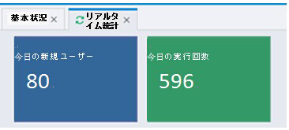
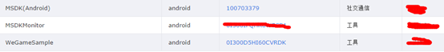
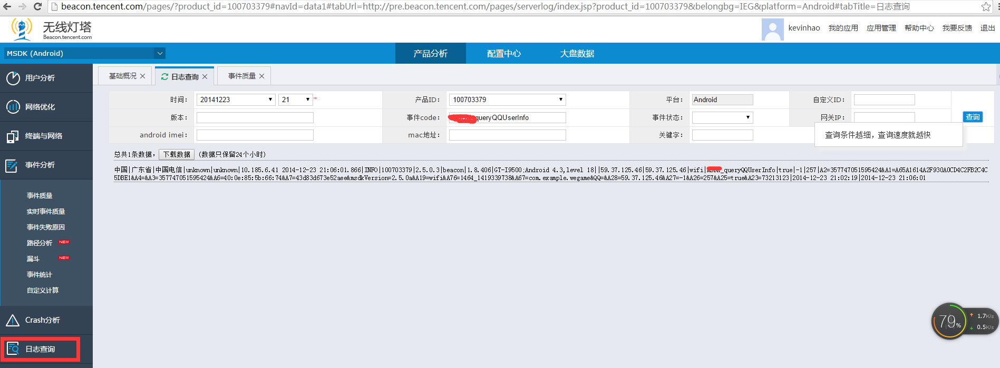

MSDK ライトハウス 関連モジュール
===
ライトハウス接続の配置
---
msdk1.7から、msdK接続のゲームはライトハウス側に対してライトハウスappkeyを申請せずに、qqAppIdをライトハウスkeyとして、ライトハウスの接続を実現します。ユーザー分析->リアルタイム統計ではデータが表示され、接続に成功したことを示します。

バージョン1.7から、AndroidManifest.xmlでライトハウスを設定する必要がなりません。下図に示すように、一部のゲームでは、次のコードによりデータの異常が発生することがありますから、次のコードを削除してください。

データが見えない場合、次の手順で処理します。

1、     ゲームは複数のライトハウスのアプリを申請しましたが、ライトハウスは1つのライトハウス・アプリだけをqqAppId(100703379)と関連付けることがあります。例えばmsdkはテストのためにライトハウスのアプリを3つ申請しましたが、MSDK(Android)はqqAppIdと関連付けのアプリで、WeGameSampleと関連付けていません。そのため、MSDK(Android)では新しいデータが見えますが、WeGameSampleでは新しいデータが見えません。ゲームはこれを確認してください。

2、     ゲームはMSDK1.7以降のバージョンに接続していますが、ライトハウスはゲームがこれまでに申請したappkeyをqqAppidと関連付けていませんから、データが見えません。ライトハウス@jiaganzhengにqqAppIdでお問合せてください。

3、     初めて接続する場合、先ず権限の有無を確認してください。ライトハウス@jiaganzhengにqqAppIdでお問合せてください。

自己定義データの報告
---
このイベントインターフェースでユーザーの重要イベントを記録して、ライトハウスとmTAに報告することで、イベントの発生回数を統計・分析できます。この機能を完成するには、WGReportEventというインターフェースを利用します。インターフェースの詳細は次の通りです。 

     /**データ報告の自己定義。このインターフェースはkey-value　1個の報告だけに対応します。1.3.4バージョンから、void WGReportEvent(String name,       HashMap<String, String> params, boolean isRealTime) を推奨します。
	 * @param name イベントの名称
	 * @param body イベントの内容
	 * @param isRealTimeリアルタイム報告の有無
	 * @return void
	 */
     public static void WGReportEvent(String name, String body, boolean isRealTime);

もう1つのインターフェース:
     
     /**
	 * @param eventName イベントの名称
	 * @param params key-value形式の自己定義イベント
	 * @param isRealTimeリアルタイム報告の有無
	 * @return void
	 */
    public static void WGReportEvent(String eventName, HashMap<String, String> params, boolean isRealTime);

パラメータの規定は次の通りです。** MSDK_はmsdkの自己定義イベントの名付けの特徴ですから、eventNameはMSDK_で開始しないでください。**

応用場面
---

QQユーザーの個人情報の検索のようなインターフェースの呼び出し回数を見たい場合、イベントをqueryQQUserInfoと名付け、呼び出し方法は次の通りです。

    WGReportEvent("queryQQUserInfo", null, true);

報告に成功したら、http://beacon.tencent.com/ 対応ライトハウスappのログから検索できます。リアルタイム報告の場合、上述の呼び出しをしてから、5分間以内に検索できます。

また、イベント品質リストから数量の統計を確認できます。

詳細はRTXライトハウス秘書にお問合せください。

注意：ライトハウスの自己定義イベントに関して、成功率と遅延の統計もできますが、現在、これらの機能をパッケージしていません。ゲームはこれらの機能を利用したい時、自分でUserAction.onUserActionを呼び出してください。使い方はライトハウスサイトのドキュメントを参照してください。

