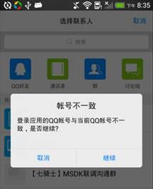
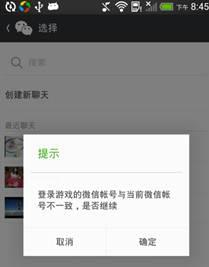
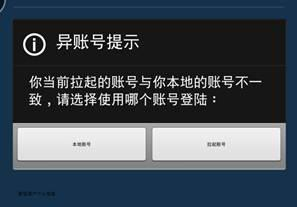


MSDK 別アカウントの整理
=======

別アカウントとは
---

別アカウントとは、現在ゲームでのアカウントはプラットフォームでログインしたアカウントと違うことです。次の2種類に分けられます。

1. プラットフォームが同じですが、アカウントが異なります（例えば、ゲームとモバイルQQは異なるQQ番号でログインした場合）
2. プラットフォームが異なります（例えば、ゲームはウィーチャットでログインしましたが、ゲーム関連の操作はモバイルQQ）です。

別アカウントのシーン
---

1. ゲームはメッセージを共有する時、プラットフォームを利用します。アカウントが一致しないため、プラットフォームは別アカウントをポップします。現在のプラットフォームは全てこの機能に対応しています。

 

2. ユーザーはプラットフォームからゲームを実行させ、アカウントが一致しないため、ゲームでは別アカウントをポップします。

 

`現在ゲームを運営する時、プラットフォームからゲームに要求される別アカウント、MSDKで実現する別アカウントは第2種類のものです。`

別アカウントの処理ロジック（開発はこれを考慮してください）
---
MSDKの別アカウントの処理ロジックには、別アカウント判断，ユーザー選択アカウント，別アカウントログインなど3つの手順を含んでいます。（詳細はMSDK接続ドキュメントを参照してください）。以下は簡単に紹介します。

####1. 別アカウントの判断：

ゲームは外部プラットフォームから実行される時、MSDKはhandCallbackでゲーム実行のプラットフォームとゲームのローカルアカウントの間で別アカウントがあるか判断し、別アカウントの判断結果をOnWakeupNotify(WakeupRet ret)メソッドのret.flagによりゲームにコールバックします。ゲームはコールバック結果により対応のログイン処理を完成します。具体的なret.flag及び対応処理は次の通りです。

	eFlag_Succ: 別アカウントがなく、ローカルアカウントでログインできました。 ゲームはこのflagを受信してから、直接にLoginRet構造体のトークンを読み込み、ゲームの授権プロセスを実行します。

	eFlag_AccountRefresh: 別アカウントがなく、MSDKは更新インターフェースを通じてローカルアカウントのトークンを更新しました。このflagを受信してから、直接にLoginRet構造体のトークンを読み込み、ゲームの授権プロセスを実行します。

	eFlag_UrlLogin：別アカウントがなく、ゲームは実行アカウントで快速にログインします。ゲームはこのflagを受信してから、onLoginNotifyのコールバックを待つ必要があります。

	eFlag_NeedLogin：ゲームのローカルアカウントも実行アカウントもログインできません。ゲームはこのflagを受信してから、ログインページを表示させ、ユーザーにログインしてもらいます。

	eFlag_NeedSelectAccount：ゲームのローカルアカウントと実行アカウントの間で、別アカウントがあり、ゲームはこのflagを受信してから、ダイアログボックスをポップアップさせ、ユーザーにログインするアカウントを選択させます。

####2. ユーザー選択：

別アカウント判断のret.flagがeFlag_NeedSelectAccountの時、ゲームはユーザーに対してメッセージをポップアップさせ、ローカルアカウント又は実行アカウントを選択してゲームにログインします。ゲームはユーザーの選択結果により、インターフェースWGSwitchUserを呼び出し、ユーザーのログインを完成します。

		/**
		 *  外部からのURLでログインします。別アカウントのシーンが発生し、ユーザーが使用外部実行アカウントを選択する時に、このインターフェースを呼び出します。
	 	*  ログインに成功した後、onLoginNotifyでコールバックします。
	 	*
	 	*  @param flag がYESの時、ユーザーは実行アカウントに切り替える必要があります。この時、当該インターフェースは前回に保存された実行アカウントのログインデータを用いて、ログインを試みます。ログインに成功した後、onLoginNotifyでコールバックします。トークンがなければ、又はトークンが無効の場合、関数はNOを戻し、onLoginNotifyコールバックが発生しません。
	 	*  @param flag がNOの時、ユーザーはローカルアカウントを利用します。この時、混同を回避するために、保存された実行アカウントのデータを削除します。
	 	*
	 	*  @return トークンがなければ，又はトークンが無効の場合、NOが戻ります。他の状況ではYESが戻ります。
		 */
		bool WGSwitchUser(bool flag);

####3.ログイン・コールバックの戻り：

WGSwitchUserのパラメータがtrueの時、MSDKはゲーム実行時の状態によりログインを試み、ログインの結果をonLoginNotifyでゲームにコールバックします。ゲームはコールバックの結果によりログイン結果を処理します。

プラットフォームからゲームへの別アカウントの9種類の状況
----

**R&Dはこれを考慮しません。MSDKからゲームにコールバックされるflagだけを考慮します。**：

|           |完全トークン付きで実行|完全トークン無しで実行|トークン無しで実行|
|: ------------- :|: ------------- :|: ------------- :|: ------------- :|
|ローカルトークンが有効|ユーザーに別アカウントをポップ|ユーザーに別アカウントをポップ|ローカルアカウントでログイン|
|ローカルトークンが無効|ユーザーに別アカウントをポップ|ユーザーに別アカウントをポップ|ゲームはログインページに戻り|
|ローカルにトークンが無し|実行アカウントでログイン|ゲームはログインページに戻り|ゲームはログインページに戻り|

別アカウントのバージョン対応
-----
####ゲームからプラットフォームへの別アカウント：

1. 1.3.0.11 以前のバージョンでは、ゲームからウィーチャットへの別アカウントは、MSDKの既知BUGにより、何のメッセージもなく自動的にログインします。MSDKのバージョンを1.3.0.11以降に更新して、この問題を解決できます。
2. ゲームからウィーチャットへの別アカウントはウィーチャット5.0以降で対応します。

####プラットフォームからゲームへの別アカウント：
1. MSDK 1.8.0から別アカウントに対応しますが、現在モバイルQQのみでトークン付きの実行を完成できます。
2. モバイルQQ4.6以前のバージョンでは、ゲームを起動している場合、モバイルQQからゲームへの別アカウントがありません。

##FAQ

1.共有のメッセージをクリックして別アカウントがありません。 [共有メッセージのクリック効果](share.md#共有メッセージのクリック効果)をクリックして、現在の操作で別アカウントをトリガーできるか確認してください。
2. モバイルQQでゲームを実行する時、ログインできません。 [モバイルQQによる快速ログインの対応条件](qq.md#快速ログイン) をクリックして、内容により現在のモバイルQQでゲームの快速ログインに対応するか確認してください。

