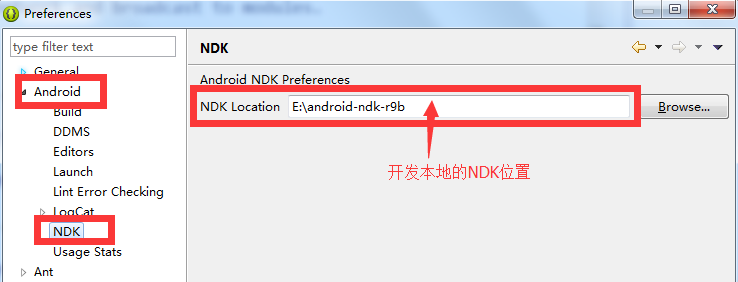

開発環境の配置
===

概説
---

ここでは開発環境関連の配置を明らかにします。

C++コンバイル配置
---
#### 概説：

MSDKのC++インターフェースはJNIで実現されるため、MSDKのC++インターフェースを利用するゲームは、インテグレーションの時にNDKを利用してコンバイルを完成する必要があります。MSDKはゲーム向けにソースコードのコンバイルを提供します。MSDKはNDK環境配置及びコンバイルの事例を提供しており、ゲームはこれを参照しながら変更できます。

#### Eclipse 環境配置：

**window -> preferences -> Android -> NDK**を選択し、下図のように配置します。

備考：最新のadtバージョン（adt-bundle-windows-x86-20140702）では、ndkをインテグレーションしていないため、ゲームはAndroidのオプションで上述の配置が見えないことがあります。解決方法は次の通りです。

1. eclipseのndK関連のプラグイン[com.android.ide.eclipse.ndk_23.0.2.1259578.jar](https://github.com/bihe0832/Settings-Tools/tree/master/adt/plugins)をダウンロードします。
2. ダウンロードした`com.android.ide.eclipse.ndk_23.0.2.1259578.jar` をadtディレクトリーの`\eclipse\plugins`に入れ、eclipseを再起動します。

#### コード導入：

ゲームは`MSDKLibrary/jni`ディレクトリーの.cpp及び.hファイルをゲーム・エンジニアリングに複製する必要があります。

#### makefile 配置：

ゲームはコードを導入してから、関連コードをmakefileに追加する必要があります。ゲームは実情に応じて`MSDKLibrary/jni`配下のAndroid.mkの配置情報をゲームのmakefileファイル又はAndroid.mkに導入することができます。

接続配置の自己検査
---

#### 概説：

ゲーム接続ではR&DはMSDKのdemoコードを直接に複製、貼り付けることがあります。MSDKのdemo関連の配置内容も一緒にゲーム・エンジニアリングにコピーされ、異常をもたらすことがあります。そのため、MSDKでは内部検査モジュールを追加し、ゲームの開発ではこの機能を利用して接続コストを低減できます。

####使い方：

ゲーム接続の環境は結合テスト又はテスト環境の場合、MSDKは初期化の時に検査モジュールを配置し、よく使われる設定に誤りがあるか検査します。ゲームはlogcatの内容を確認できます。

- **ゲームに配置エラーがある時のlog事例：**

		11-18 17:10:47.373: E/WeGame CheckBase.queryIntentFilter(9855): Msdk: the intent-filter of com.tencent.tauth.AuthActivity has not be configured correctly
		11-18 17:10:47.373: E/WeGame CheckBase.queryIntentFilter(9855): Msdk: the intent-filter of com.tencent.tauth.AuthActivity has not be configured correctly
		11-18 17:10:47.393: W/WeGame WeGame.Initialized(9855): MSDK Config Error!!!!
		11-18 17:10:47.403: W/WeGame WeGame.Initialized(9855): Check Result: 2
		11-18 17:10:47.403: D/WeGame WeGame.Initialized(9855):  ********************check result start********************
		11-18 17:10:47.403: W/WeGame WeGame.Initialized(9855): QQ AppID for Initialiezed must be the same as configed in AndroidMenifest.xml
		11-18 17:10:47.403: W/WeGame WeGame.Initialized(9855): AuthActivity Category Error
		11-18 17:10:47.403: D/WeGame WeGame.Initialized(9855):  ********************check result end**********************

- **ゲームの基本配置で問題がない場合のlog事例：**

		11-18 17:15:16.825: W/WeGame WeGame.Initialized(13524): Check Result: 0

#### 備考：

- このモジュールの検査結果**はゲーム開発のご参考まで利用してください**。全ての配置検査は強制的検査となり、ゲームは検査結果及びゲーム自分の要求により対応の配置検査項目の内容を変更します。ゲームでは全ての配置検査問題を解決する必要はありません。

