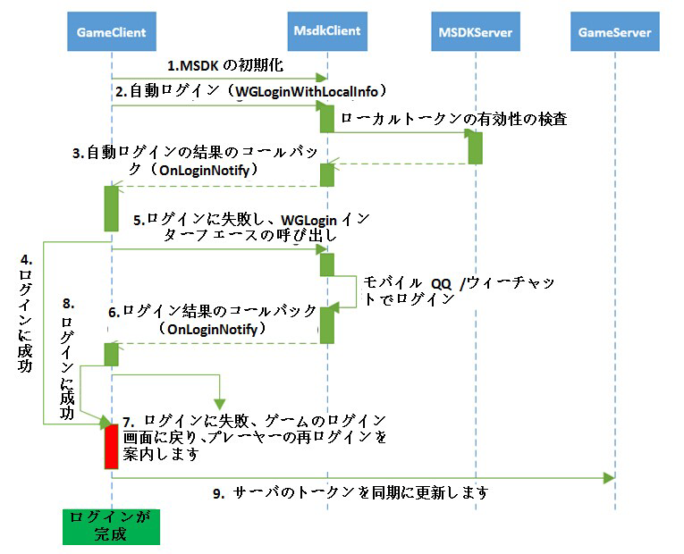
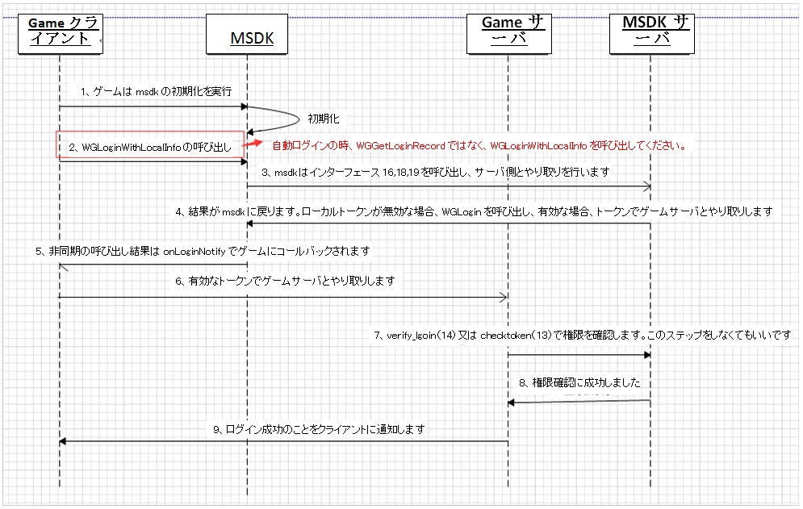
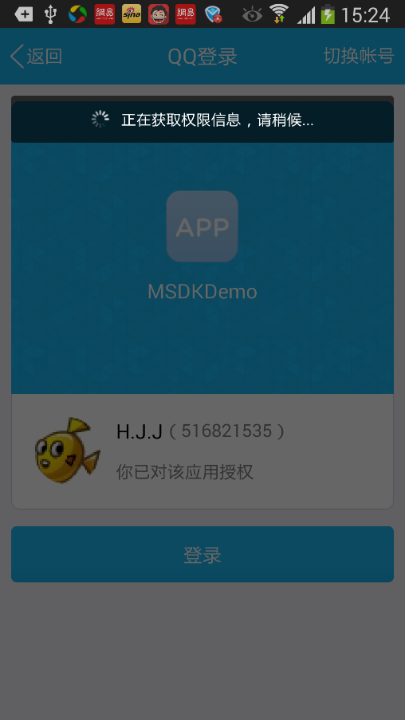

#MSDKログインモジュール

##概説

当該モジュールではMSDKの授権関連の全てのモジュールを整理します。授権ログイン、自動ログイン、快速ログイン、トークン更新、読み込み等モジュールの詳細説明を含めています。ゲームは当該モジュールを参照して、MSDKの授権関連のモジュールを認識してから、ゲームの要求に応じて対応のインターフェースを使用して授権などの機能を完成できます。

##用語解釈、インターフェース説明
	
###ログイン関連用語の解釈：
| 名称| 記述 |対応プラットフォーム| 呼び出しインターフェース |
|: ------------- :|
| 授権ログイン | ゲームはプラットフォームの授権画面を表示させ、ゲームがログインに必要なトークンを取得するように、ユーザーの授権を案内します| モバイルQQ/ウィーチャット | WGLogin |
| 快速ログイン | プレイヤーの操作により、プラットフォームでゲームを実行する時、ログイン関連のトークン情報を透明伝送し、ログインしてゲームに入ります。| モバイルQQ| なし |
| 自動ログイン | ゲームを実行する時、前回に利用したトークン情報を直接に利用してログインしてゲームに入ります| MSDK の機能| WGLoginWithLocalInfo |
| 自動更新 | MSDKはウィーチャット・トークンの自動更新インターフェースを提供します | MSDK の機能 | なし |
| 別アカウント | 現在、ゲームにログインしたアカウントとプラットフォームでログインしたアカウントは同じではありません| プラットフォーム/MSDKは対応| WGSwitchUser |

### ログイン関連インターフェースの概説

ログイン関連の呼び出しインターフェースの`WGGetLoginRecord`，`WGLogout`は同期インターフェースであり、その他のインターフェースは非同期のものですから、callbacKの形で最終の結果をOnLoginNotify（LoginRet）でゲームにコールバックします。別アカウント関連のインターフェースは別途に、MSDKの別アカウント・モジュールで説明します。具体的には次の通りです。

| 名称| 記述 |備考 |
|: ------------- :|
| WGGetLoginRecord |ローカルに保存された現在ユーザーのログイン・トークンを取得します |  |
| WGSetPermission |ゲームではユーザーの授権で取得するプラットフォーム情報を設定します| |
| WGLogin |プラットフォームによる授権とログインを実行します |  |
| WGLogout | 現在のログインアカウントのログイン情報を消去します |  |
| WGLoginWithLocalInfo |ローカルに保存されたログイン・トークンでログインを試みます|  |
| handleCallback |各プラットフォームのゲーム実行を処理します |  |
| WGRefreshWXToken |ウィーチャットのrefreshToken更新でaccessTokenを取得します | MSDK 2.0から、ゲームは自分でウィーチャットのトークンを更新しないでください|

### 推奨のログインプロセス

**手順説明：**

* 手順1：ゲームを実行してから、先ずMSDKを初期化し、呼び出しインターフェースは`WGPlatform.Initialized(Activity activity, MsdkBaseInfo baseInfo)`です。
* 手順2：自動ログインインターフェース`WGLoginWithLocalInfo()`を呼び出します。このインターフェースはMSDKサーバ側でローカル・トークンの有効・無効を検査します。
*手順3：自動ログインインターフェースは`OnLoginNotify(LoginRet ret)`を通じて、ログイン結果をゲームにコールバックします。`ret.flag`でログイン結果を判断し、`CallbackFlag.eFlag_Succ`(0)であれば、ログインに成功したことを示し、他は失敗となります。
*手順4：ログイン授権に成功しました。手順9へ進みます。
*手順5：自動ログインに失敗しました。` WGLogin(EPlatform platform)`を呼び出し、モバイルQQ又はウィーチャットのプラットフォームでログイン授権をします。
*手順6：ログイン結果を`OnLoginNotify(LoginRet ret)`でコールバックします。`ret.flag`でログイン結果を判断し、`CallbackFlag.eFlag_Succ`(0)であれば、ログインに成功したことを示し、他は失敗です。
*手順7：プラットフォームでログイン授権に失敗しました。ユーザーに再ログインを案内します。ユーザーが再ログインする場合、手順5へ進みます。
*手順8：ログイン授権に成功しまして。
*手順9：クライアントの最新トークンをゲームサーバに同期します。ゲームサーバでログイン・トークンを利用する場合、**ログイン成功のコールバックを受領してから、最新のトークンを同期しなければなりません。**サーバ側で無効のトークンで操作することを回避します。 

### ログイン関連インターフェースの推奨の使い方

1. 授権ログイン：直接に`WGLogin`を呼び出し、対応のプラットフォームで授権します。
- ゲームを実行し、ゲームはバックグラウンドからフロントエンドに切り替え、トークンの有効・無効を検査します。`WGLoginWithLocalInfo`を呼び出し、トークン有効性の確認を完成します。
-トークンの取得：直接に`WGGetLoginRecord`を呼び出し、ローカルから読み込みます。
- ログオフ：直接に`WGLogout`を呼び出し、現在ユーザーのログイン情報を消去します。

**特別説明：**
WGGetLoginRecordはローカル・トークンを取得するためのインターフェースです。ログインせずにWGLoginを呼び出す場合、成功した後、MSDKはトークンをローカルに保存します。この後、ゲームを再実行する時、自動ログインWGLoginWithLocalinfoを採用します。自動ログインのロジックのゲームはこの方式を推奨し、呼び出しのシーケンスは次の通りです。

一部のゲームは実行の直後に、WGGetLoginRecordを呼び出し、ローカル・トークンの有効・無効を判断します。ローカルトークンが有効の場合、直接にトークンをGameサーバとやり取りします。`このように使わないでください！！！自動ログインインターフェースWGLoginWithLocalinfo`を使ってください。

## 接続ログインの具体的な作業（R&Dはこれを閲覧しなければならない）

**R&Dは次の手順でMSDKログインモジュールの接続を完成し、接続コストを下げ、処理ロジックの漏れを回避できます。強く推奨します！！！**

1.ユーザー授権の権限を設定します：
	- ゲームはMSDK初期化の後に、モバイルQQの権限設定のインターフェースを呼び出し、ユーザーからゲームのプラットフォームに授権される権限を設定します。具体的な使い方[クリックして閲覧](#ユーザー授権の権限の設定WGSetPermission)。
- **授権ログインの処理**：
	1.ログインボタンのクリックイベントの処理関数では`WGLogin`を呼び出し、授権ログインを完成します。具体的な使い方[クリックして閲覧](#授権ログインの処理WGLogin)。
- **自動ログインの処理**：
	1. マスタActivityのonCreateではMSDK初期化の後に`WGLoginWithLocalInfo`を呼び出し、ゲームが実行される時の自動ログインを完成します。具体的な使い方[クリックして閲覧](#自動ログインの処理WGLoginWithLocalInfo)。
	-マスタActivityのonResumeでは、ゲームがバックグラウンドに切り替える時間を判断し、30分間を超えると、自動的に`WGLoginWithLocalInfo`を呼び出し、自動ログインを完成します。
		-ゲームがバックグラウンドに切り替える時間をどのように判断するかについて、ゲームはMSDKのdemoの使い方を参照し、切り替える時にタイムスタンプを記録し、タイムスタンプの戻ってから時間差を計算します
- **ユーザーログオフの処理**：
	-ログオフボタンのクリック・イベントの処理関数でWGLogoutを呼び出し、授権ログインを完成します。具体的な使い方[クリックして閲覧](#ユーザーログオフの処理WGLogout)
- ** MSDKのログインコールバックの処理**：
	- MSDKのコールバック処理のロジックには、onLoginNotifyの処理を追加します。具体的な使い方[クリックして閲覧](# MSDKのログインコールバックの処理)
- **プラットフォーム起動の処理**：
	-マスタActivityのonCreateとonNewIntentでhandleCallbackを呼び出し、プラットフォーム起動の処理を完成します。具体的な使い方[クリックして閲覧](#プラットフォーム起動の処理handleCallback)
- ** MSDKのプラットフォーム起動のコールバックの処理**：
	- MSDKコールバック処理のonWakeUpNotifyには、プラットフォーム起動の処理を追加するします。具体的な使い方[クリックして閲覧](#MSDKの起動コールバックの処理)
- **別アカウント処理のロジック**：
	-別アカウントの処理ロジックです。具体的な内容は[MSDK別アカウント接続](diff-account.md#別アカウント処理ロジック（開発はこれを考慮してください）)を参照してください。
- **他の特殊ロジック処理**：
	- 小メモリ機器の授権過程で、ゲームが殺された後のログイン方案。具体的な使い方[クリックして閲覧](#モバイルQQ授権で小メモリ機器の授権過程で、ゲームが殺された後のログイン方案)
	- MSDKウィーチャット・トークンの期間切れの自動更新メカニズム。具体的な使い方[クリックして閲覧](#ウィーチャット・トークンの自動更新)
	- ログインデータの報告インターフェースの呼び出し要求。具体的な使い方[クリックして閲覧](#ログインデータの報告)

##ユーザー授権の権限の設定WGSetPermission

####概説

ゲームはMSDK初期化の後に、モバイルQQの権限設定のインターフェースを呼び出し、ユーザーからゲームのプラットフォームに授権される権限を設定します。

####インターフェース声明

	/**
	 * @param permissions ePermission枚挙値 又は 演算の結果で、必要な授権項を示します
	 * @return void
	 */
	void WGSetPermission(int permissions);

#### インターフェースの呼び出し：

	// QQ起動の時にユーザー授権を必要とする項目を設定します
	WGPlatform.WGSetPermission(WGQZonePermissions.eOPEN_ALL); 

#### 注意事項：

1. ゲームはMSDK初期化の後に当該インターフェースを呼び出す必要があります。インターフェースパラメータには**`WGQZonePermissions.eOPEN_ALL`**を記入するよう推奨します。この項目がなければ、一部のインターフェースを呼び出す時に権限がないことを提示します。

##授権ログインの処理WGLogin

#### 概説：

**モバイルQQ/ウィーチャットクライアントを実行し、又はwebページ(モバイルQQがインストールされていない場合)で授権し、ユーザーが授権した後、onLoginNotifyでopenID、accessToken、payToken、pf、pfkey等ログイン情報の取得をゲームに通知します**

#### 効果展示：

####インターフェース声明：

	/**
	 * @param platform ゲームが伝えたプラットフォームの種類, 可能な値は: ePlatform_QQ, ePlatform_Weixinです。
	 * @return void
	 *   ゲームで設定したグローバルコールバックのOnLoginNotify(LoginRet& loginRet)メソッドでデータをゲームに戻します
	 */
	void WGLogin(ePlatform platform);

#### インターフェースの呼び出し：

	WGPlatform::GetInstance()->WGLogin(ePlatform_QQ); 

#### 注意事項：

- **共通**：
	- **ウィーチャット及びモバイルQQのbugにより、ゲームは幾つかのシーンでコールバックを受信できないことがあります。ゲームはWGLoginを呼び出した後に、カウントダウンを開始し、 カウントダウンが完了し、コールバックを受信しなかった場合、タイムアウトと認められ、ログイン画面に戻ります。カウントダウンの推奨時間は30sで、ゲームは自分で設定できます**コールバックを受信できないシーンとしては、次のような場面を含むが、これらに限られません。
		- ウィーチャットがログインしていない場合、ゲームはウィーチャットを起動し、ユーザー名とパスワードを入力してから、ログインします。ウィーチャットクライアントの既知BUGにより、ログインのコールバックがないかもしれません。
		- ウィーチャット授権過程で、左上の 戻り ボタンをクリックすると、授権のコールバックがなくなります。
		- openSDK 2.7 （MSDK 2.5）以前のバージョンではwebで授権し、授権キャンセルをクリックすると、コールバックがありません。
- **モバイルQQ 関連**：
	1. モバイルQQをインストールしていない場合、精品ゲームはWebページで授権できます。AndroidMenifest.xmlのAuthActivityの声明ではintent-filterに<data android:scheme="***" />を配置することを確保してください。詳細はこの節におけるモバイルQQ関連AndeoidMainfest配置の部分を参照してください。 **海納ゲームは現在、ページでの授権に対応しません**。WGIsPlatformInstalledインターフェースを通じて、モバイルQQをインストールしたか判断できます。モバイルQQをインストールしていない場合、ユーザーに対して授権不可のメッセージを表示します。
	- **偶にはOnLoginNotifyコールバックを受信できません。**`AndroidManifest.xml`及びモバイルQQ接続権限申明（[クリックして閲覧]()）では`com.tencent.tauth.AuthActivity`と`com.tencent.connect.common.AssistActivity`の一致性を確保してください。
	-ゲームのActivityがLaunch Activityの場合、ゲームActivity声明には、android:configChanges="orientation|screenSize|keyboardHidden"を追加する必要があります。でないとログインしてもコールバックがありません。

- **ウィーチャット関連**：

	1. ウィーチャット授権はウィーチャット4.0以降であることを保証してください。
	-ウィーチャットを起動する時。 ウィーチャットはアプリの署名がウィーチャット・バックグラウンドで配置される署名に合わせるか検査します(この署名はウィーチャットappIdの申請の時に提出された)。合っていない場合、授権されたウィーチャットクライアントも実行できません。
	- `WXEntryActivity.java` の場所が正しくないと（パッケージ名/wxapi ディレクトリーでなければなりません）、コールバックを受信できません。

##自動ログインの処理WGLoginWithLocalInfo

#### 概説：

このインターフェースはログインしたことのあるゲームに利用され、ユーザーがゲームを再開する時に使用します。ゲーム実行の時に先ずこのインターフェースを呼び出します。このインターフェースはバックグラウンドでトークンを確認し、OnLoginNotifyで結果をゲームにコールバックします。

####インターフェース声明：

	/**
	  *  @since 2.0.0
	  *  このインターフェースはログインしたことのあるゲームに利用され、ユーザーがゲームを再開する時に使用します。ゲーム実行の時に先ずこのインターフェースを呼び出します。このインターフェースはバックグラウンドでトークンを確認します。
	   *  このインターフェースはOnLoginNotifyで結果をゲームにコールバックします。このインターフェースはeFlag_Local_InvalidとeFlag_Succの2種類のflagだけを戻します。
	  *  ローカルにはトークンがなければ、又はローカル・トークンの確認に失敗した場合、戻したflagはeFlag_Local_Invalidであり、ゲームはこのflagを受信すると、ユーザーを案内して、授権ページで授権します。
	  *  ローカルにはトークンがあり、確認に成功した場合、flagはeFlag_Succであり、ゲームはこのflagを受信すると、直接にsdkの提供したトークンを利用でき、再確認する必要はありません。
	  *  @return void
	  *   Callback: 確認結果はOnLoginNotifyで戻ります
	  */
 	void WGLoginWithLocalInfo();

####注意事項：

1. ゲームは`WGLoginWithLocalInfo`でログインした後、取得したトークンをゲームバックグラウンドに伝送して有効性を確認する必要がありません。MSDKで確認してからゲームにコールバックします

##ユーザーログオフの処理WGLogout

#### 概説：

当該インターフェースを呼び出し、現在ログインアカウントのログイン情報を消去できます。

####インターフェース声明：

	/**
	 * @return bool 戻り値が廃棄され、全てtrueが戻ります。
	 */
	bool WGLogout();

####呼び出しサンプル：

    WGPlatform.WGLogout();

####注意事項：

1. ゲーム**ログオフボタンのクリック又は他のログインボックスのポップアップ・ロジックでは、WGLogoutを呼び出して、ローカルのログイン情報を消去する必要があります**。でないと授権失敗などの問題が発生します。

## MSDKのログインコールバックの処理

#### 概説：

MSDKのログインコールバックは次の場面があります。

- WGLogin授権のリターン
- WGLoginWithLocalInfoログインのリターン
-プラットフォーム起動の処理後（トークン付きの起動）

#### 具体処理：

	OnLoginNotify(LoginRet ret) {
        Logger.d("called");
        switch (ret.flag) {
            case CallbackFlag.eFlag_Succ:
				 CallbackFlag.eFlag_WX_RefreshTokenSucc
            	//授権成功の処理ロジック
				break;
            case CallbackFlag.eFlag_WX_UserCancel:
				 CallbackFlag.eFlag_QQ_UserCancel
				//ユーザーによる授権キャンセルのロジック
				break;
			case CallbackFlag.eFlag_WX_UserDeny
				//ユーザーによるウィーチャット授権の拒絶のロジック
				break;
            case CallbackFlag.eFlag_WX_NotInstall:
				//プレイヤーの機器にはウィーチャットのクライアントをインストールしていない時のロジック
				break;
			case CallbackFlag.eFlag_QQ_NotInstall:
				//プレイヤーの機器にはQQクライアントをインストールしていない時のロジック
				break;
            case CallbackFlag.eFlag_WX_NotSupportApi:
				//プレイヤーのウィーチャットクライアントはこのインターフェースに対応しない時のロジック
				break;
            case CallbackFlag.eFlag_QQ_NotSupportApi:
				//プレイヤーのモバイルQQクライアントはこのインターフェースに対応しない時のロジック
				break;
            case CallbackFlag.eFlag_NotInWhiteList
				//プレイヤーのアカウントがホワイトリストにない時のロジック
				break;
            default:
                // 他のログインに失敗した時のロジック
                break;
        }
    }

#### 注意事項：
**ここでは重要なloginNotifyのロジックを処理しています。完全なコールバックflag情報は [コールバック標識eFlag](const.md#コールバック標識eFlag)をクリックして閲覧できます。ゲームは自分の必要に応じて処理できます**

##プラットフォーム起動の処理handleCallback

#### 概説：

プラットフォーム起動とは、プラットフォーム又はチャンネル（モバイルQQ/ウィーチャット/ゲームホール/応用宝等）を通じてゲームを実行することです。ある場面ではプラットフォームはトークン付きでゲームを実行し、ゲームの直接ログインを実現します。従って、ゲームはプラットフォームの起動を処理する必要があります。

#### 具体処理：
ゲームは自分の`launchActivity`の`onCreat()`と`onNewIntent()`でhandleCallbackを呼び出す必要があります。でないと、コールバック無のログインなどの問題が発生します。

- **onCreate**:

        if (WGPlatform.wakeUpFromHall(this.getIntent())) {
        	// 起動のプラットフォームはホールです
        	Logger.d("LoginPlatform is Hall");
        } else {  
        	//起動のプラットフォームはホールではありません。
            Logger.d("LoginPlatform is not Hall");
            WGPlatform.handleCallback(this.getIntent());
        }

- **onNewIntent**

		if (WGPlatform.wakeUpFromHall(intent)) {
            Logger.d("LoginPlatform is Hall");
        } else {
            Logger.d("LoginPlatform is not Hall");
            WGPlatform.handleCallback(intent);
        }
#### 注意事項：

-事前にホールに対応の配置を追加してから、ゲームホールの起動を実現できます。ゲームはホールに接続しないと、`WGPlatform.wakeUpFromHall`を呼び出し、ホールからの起動であるか判断する必要があります。、ホールからの起動であれば、handleCallbackを呼び出しません。トークン付きのホール起動について [クリックして閲覧](qqgame.md)を参照してください。

## MSDK起動のコールバックの処理

#### 概説

プラットフォーム起動に対する処理は、主に別アカウント関連のロジックを処理します。具体的な処理は次の通りです。

#### 具体処理：

        if (CallbackFlag.eFlag_Succ == ret.flag
                || CallbackFlag.eFlag_AccountRefresh == ret.flag) {
            //起動後、ローカルアカウントでゲームにログインします。処理ロジックはonLoginNotifyと同じです。
            
        } else if (CallbackFlag.eFlag_UrlLogin == ret.flag) {
            // MSDKは起動アカウントのトークンで確認してログインします。結果はOnLoginNotifyでコールバックされます。ゲームはonLoginNotifyのコールバックを待ちます。

        } else if (ret.flag == CallbackFlag.eFlag_NeedSelectAccount) {
            // 現在ゲームには別アカウントがあり、ゲームはメッセージボックスをポップアップさせ、ユーザーにログインのアカウントを選択してもらいます。

        } else if (ret.flag == CallbackFlag.eFlag_NeedLogin) {
            //有効のトークンがなく、ゲームにログインできません。この時、ゲームはWGLogoutを呼び出し、ゲームをログオフして、ユーザーに再ログインをさせます。

        } else {
            //デフォルトの処理ロジックとしては、WGLogoutを呼び出し、ゲームをログオフして、ユーザーに再ログインをさせます。
        }

##別アカウント処理のロジック

別アカウント関連のモジュールは [MSDK別アカウント接続](diff-account.md#別アカウント処理ロジック（開発はこれを考慮してください）)を参照してください。

##他の特殊ロジック処理

### モバイルQQ授権の場合、小メモリ機器の授権過程で、ゲームが殺された後のログイン方案

現在、殆どのゲームは多くのメモリを占用するため、授権の過程では、モバイルQQを起動して授権する時、androiDのメモリ回収メカニズムをトリガさせ、バックグラウンドのゲームプロセスを殺すことで、ゲームのモバイルQQ授権があってもゲームを実行できなくなります。ゲームはマスタActivityには、次のコードを追加して、トークン付きでゲームに入ることを保証する必要があります。

	// TODO GAME はonActivityResultでWGPlatform.onActivityResultを呼び出す必要があります。
    @Override
	protected void onActivityResult(int requestCode, int resultCode, Intent data) {
		super.onActivityResult(requestCode, resultCode, data);
		WGPlatform.onActivityResult(requestCode, resultCode, data);
		Logger.d("onActivityResult");
	}

**注意：このインターフェースは2.5.0a以降で追加されるものです。前のバージョンはこれを呼び出さないでください。**

### ログインデータの報告

ログインデータの報告の正確性を保証するために、ゲーム接続の時に自分の`launchActivity`の`onResume`で`WGPlatform.onResume`を呼び出し, `onPause`で`WGPlatform.onPause`を呼び出さなければなりません。

### ウィーチャット・トークンの自動更新

1. MSDK2.0.0バージョンから、ゲーム運行の間、ウィーチャットのトークンを定時的に確認して更新します。更新を必要とする場合、MSDKは自動的に更新し、OnLoginNotifyでゲームに通知します。flagはeFlag_WX_RefreshTokenSuccとeFlag_WX_RefreshTokenFail（onLoginNotifyのコールバックに含まれています）です。
- **ゲームは新しいトークンを受領してから、ゲームクライアントに保存されるトークン及びサーバにあるトークンを同期更新し、これから、新しいトークンで後続プロセスの完成を保証します。**
- ゲームはウィーチャット・トークンの自動更新機能を必要としない場合、`assets\msdkconfig.ini`で、`WXTOKEN_REFRESH`を`false`に設定してください。

## 他のインターフェースリスト

###WGGetLoginRecord

#### 概説：

当該インターフェースを呼び出し、現在アカウントのログイン情報を取得できます。

####インターフェース声明：

	/**
	 * @param loginRet 戻りの記録
	 * @return 戻り値はプラットフォームidであり、種類はePlatformです。ePlatform_Noneが戻ると、ログイン記録がないことを示します。
	 *   loginRet.platform(種類はePlatform)はプラットフォームidであり、能な値はePlatform_QQ, ePlatform_Weixin, ePlatform_Noneです。
	 *   loginRet.flag(種類はeFlag)は現在のローカルトークンの状態を示し、可能な値と説明は次の通りです。
	 *     eFlag_Succ: 授権トークンが有効です
	 *     eFlag_QQ_AccessTokenExpired: モバイルQQ accessTokenは期間切れ、授権画面を表示させ、ユーザーの再授権を案内します
	 *     eFlag_WX_AccessTokenExpired: ウィーチャットaccessTokenが期間切れ、WGRefreshWXTokenを呼び出して更新する必要があります。
	 *     eFlag_WX_RefreshTokenExpired: ウィーチャットrefreshTokenであり、授権画面を表示させ、ユーザーの再授権を案内します
	 *   ret.tokenはVector<TokenRet>であり、ここに保存されるTokenRetとしてはtypeとvalueがあり、Vectorのエルゴードでtypeを判断し、必要なトークンを読み込みます。 
     *
	 */
	int WGGetLoginRecord(LoginRet& loginRet);

####呼び出しサンプル：

    LoginRet ret = new LoginRet();
    WGPlatform.WGGetLoginRecord(ret);

取得したLoginRetのflagはeFlag_Succであれば、ログイン有効と認められ、有効なトークン情報を読み込みます。次のような方式でtokenを取得できます。

ウィーチャットプラットフォーム：

    std::string accessToken = "";
    std::string refreshToken = "";
    for (int i = 0; i < loginRet.token.size(); i++) {
             if (loginRet.token.at(i).type == eToken_WX_Access) {
                 accessToken.assign(loginRet.token.at(i).value);
             } else if (loginRet.token.at(i).type == eToken_WX_Refresh) {
                 refreshToken.assign(loginRet.token.at(i).value);
             }
    }

QQプラットフォーム：

    std::string accessToken = "";
    std::string payToken = "";
    for (int i = 0; i < loginRet.token.size(); i++) {
        if (loginRet.token.at(i).type == eToken_QQ_Access) {
            accessToken.assign(loginRet.token.at(i).value);
        } else if (loginRet.token.at(i).type == eToken_QQ_Pay) {
            payToken.assign(loginRet.token.at(i).value);
        }
    }

#### 注意事項：

なし

##FAQ

1. 支払時にpaytoken期間切れというメッセージがあれば、ログイン画面を起動し、再授権してから支払います。paytoken期間切れの後に、再授権をしなければなりません。

