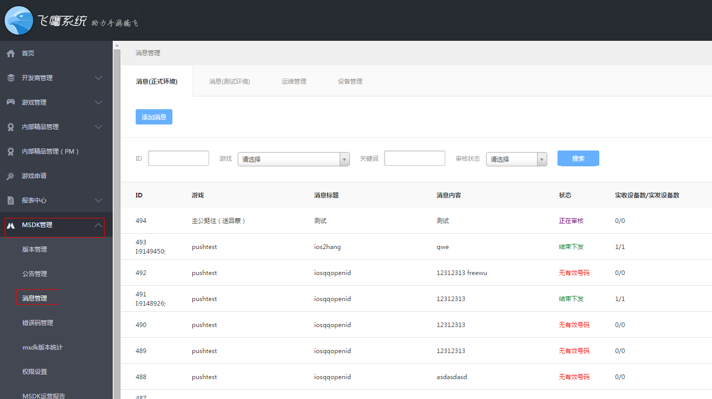
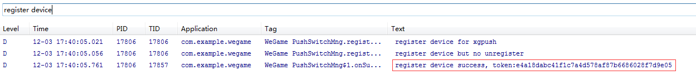
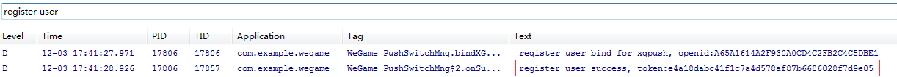

SDKプッシュ機能の接続
======
MSDK2.2aから伝書鳩プッシュモジュールを接続しており、プッシュ機能を通じて、ゲーム未運転の時、ユーザーの携帯電話に対してゲーム関連の情報をプッシュできます。
接続配置
------
ステップ1：配置項目の設定

assets/msdkconfig.iniではメッセージプッシュのスイッチを配置します。

    PUSH=true // trueの時にメッセージプッシュをオンにします

ステップ2: AndroidManifest.xmlの配置

    <!-- 【必須】 伝書鳩SDKに必要な権限 -->
    <uses-permission android:name="android.permission.INTERNET" />
    <uses-permission android:name="android.permission.READ_PHONE_STATE" />
    <uses-permission android:name="android.permission.ACCESS_WIFI_STATE" />
    <uses-permission android:name="android.permission.ACCESS_NETWORK_STATE" />
    <uses-permission android:name="android.permission.RECEIVE_BOOT_COMPLETED" />
    <uses-permission android:name="android.permission.RESTART_PACKAGES" />
    <uses-permission android:name="android.permission.BROADCAST_STICKY" />
    <uses-permission android:name="android.permission.WRITE_SETTINGS" />
    <uses-permission android:name="android.permission.RECEIVE_USER_PRESENT" />
    <uses-permission android:name="android.permission.WRITE_EXTERNAL_STORAGE" />
    <uses-permission android:name="android.permission.WAKE_LOCK" />
    <uses-permission android:name="android.permission.KILL_BACKGROUND_PROCESSES" />
    <uses-permission android:name="android.permission.GET_TASKS" />
    <uses-permission android:name="android.permission.READ_LOGS" />
    <uses-permission android:name="android.permission.VIBRATE" />
    <!-- 【オプション】 伝書鳩SDKに必要な権限 -->
    <uses-permission android:name="android.permission.BLUETOOTH" />
    <uses-permission android:name="android.permission.BATTERY_STATS" />
    
    <!-- 伝書鳩配置START -->
    <!-- 【必須】 伝書鳩通知バー -->
    <activity
        android:name="com.tencent.android.tpush.XGPushActivity"
        android:exported="false" >
        <intent-filter>
            <action android:name="" />
        </intent-filter>
    </activity>
    
    <!-- 【必須】 伝書鳩receiver放送の受信-->
    <receiver
        android:name="com.tencent.android.tpush.XGPushReceiver"
        android:process=":xg_service_v2" >
        <intent-filter android:priority="0x7fffffff" >
            <!-- 【必須】 伝書鳩SDKの内部放送 -->
            <action android:name="com.tencent.android.tpush.action.SDK" />
            <action android:name="com.tencent.android.tpush.action.INTERNAL_PUSH_MESSAGE" />
        </intent-filter>
        <intent-filter android:priority="0x7fffffff" >
            <!-- 【必須】 システム放送：coopen及びネットワーク切り替え-->
            <action android:name="android.intent.action.USER_PRESENT" />
            <action android:name="android.net.conn.CONNECTIVITY_CHANGE" />
        </intent-filter>
    </receiver> 
    
    <!-- 【必須】 伝書鳩service -->
    <service
     android:name="com.tencent.android.tpush.service.XGPushService"
        android:exported="true"
        android:persistent="true"
        android:process=":xg_service_v2" />
    <!-- 伝書鳩配置END -->

ステップ3、http://dev.ied.com/にログインし、メッセージ管理モジュールではプッシュメッセージの設定を行います。**メッセージ（正式環境）でメッセージを送信してください**

** "メッセージ管理"メニューが見えない場合、marsrabelma(馬勝)にお問合せください。**

結合テスト
------

1、上述の手順で配置し、ゲームを実行してlogをフィルタリングします。次のlogがあれば、機器の登録に成功したことを示し、飛鷹システムで全量プッシュを実現できます。

2、ログインに成功した後、次のlogがあれば、ユーザーのバンディングに成功し、飛鷹システムで番号パッケージのプッシュを実現できます。

伝書鳩接続アプリのソリューション
------
ゲームは既に伝書鳩プッシュと接続した場合、従来伝書鳩に接続したロジックを保留することがあります。この時にMSDKLibraryを導入すると、パッケージ競合の恐れがあります。

i)	ゲームはMSDKの方式で伝書鳩に接続し、従来接続した伝書鳩sdkを削除し、MSDKの方式でプッシュすることを推奨します

ii)	またMSDKの使用する伝書鳩sdkを選択して削除し、従来の伝書鳩接続の方式を利用できます。伝書鳩sdKの保存場所は次の通りです。

    MSDKLibrary\libs\armeabi\libtpnsSecurity.so
    MSDKLibrary\libs\armeabi-v7a\libtpnsSecurity.so
    MSDKLibrary\libs\mips\libtpnsSecurity.so
    MSDKLibrary\libs\x86\libtpnsSecurity.so 
    MSDKLibrary\libs\armeabi\Xg_sdk.jar

また、これらのlibsを削除すると、ゲームはMSDKのpush機能をオフする必要があります。次のように操作してください。assets/msdkconfig.iniではメッセージプッシュのスイッチを配置します。

    PUSH=false 

iii)	伝書鳩の公式サイトからダウンロードしたsdkを削除するが、MSDKの使用する伝書鳩sdk(MSDK2.2ではXg_sdk_v2.341.jarを利用する)を削除しません。従来の伝書鳩接続機能が通常に動作するか確認します。従来の伝書鳩接続機能を利用する場合、msdkプッシュのスイッチをオフにしてください。

伝書鳩とMTA難読化の注意事項
------
Android APP開発者はproguardツールを利用してコードの難読化を行います。MTAの外部インターフェースとNDKインターフェースは開示されたもので、難読化の時に次のコードを保留してください。でないと動作不可又は異常が発生する恐れがあります。

    -keep public class * extends android.app.Service
    -keep public class * extends android.content.BroadcastReceiver
    -keep class com.tencent.android.tpush.**  {* ;}
    -keep class com.tencent.mid.**  {* ;}

