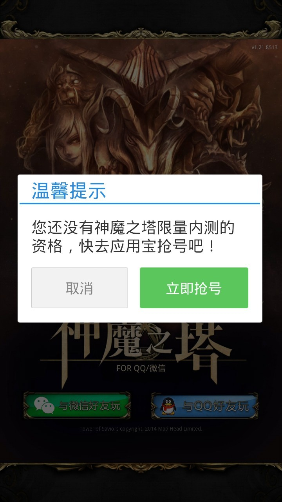
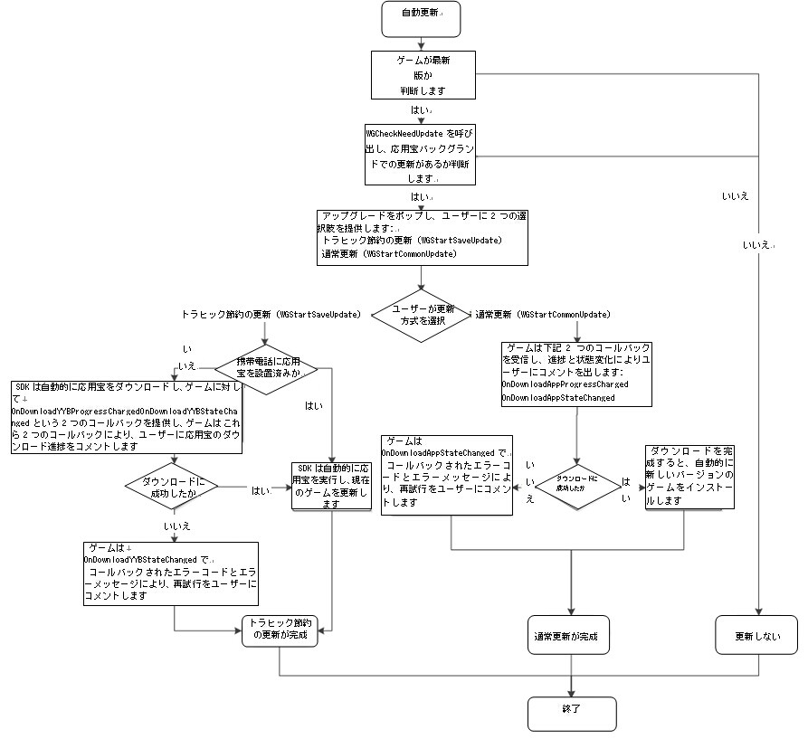
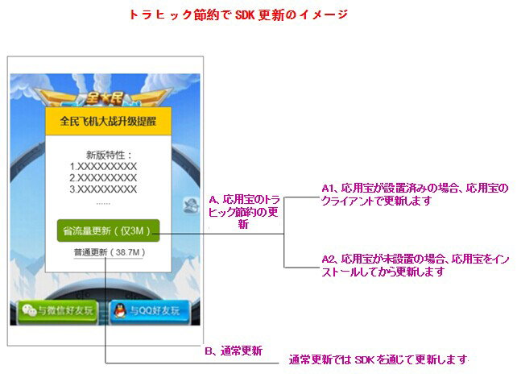
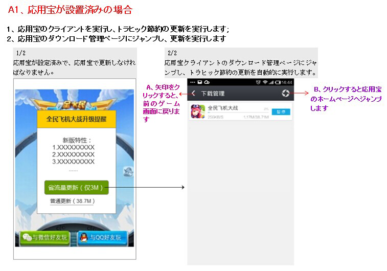
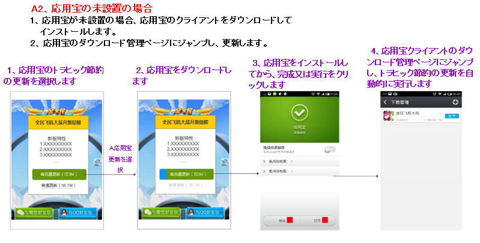
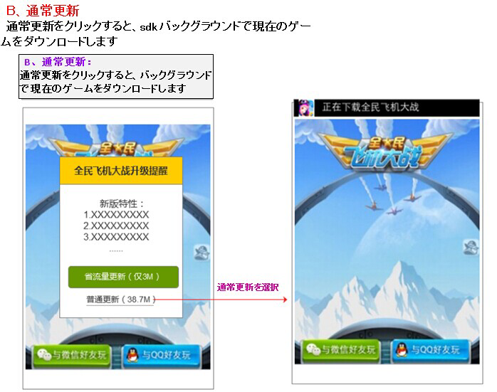
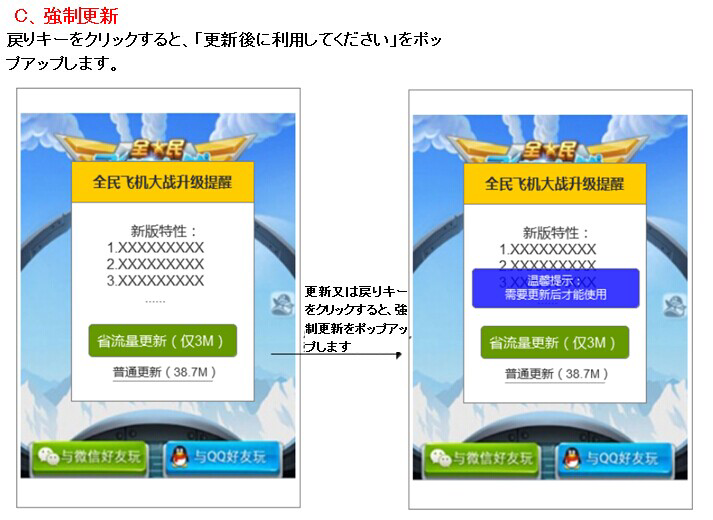

MSDK応用宝関連モジュール
==================


# 応用宝登録

## 登録のスイッチ配置

登録のスイッチは2箇所にあります。1つは**assets/msdkconfig.ini**でクライアント登録のスイッチを配置し、2つは応用宝で登録のスイッチを設定します。フロントエンドから登録機能をオンにする場合、これを設定すれば結構です。次の通りです。

	; MSDKオプションモジュール機能のスイッチ
	; 応用宝登録のスイッチ
	BETA=true

## 登録接続の手順

- **ステップ1：**ゲームのAndroidMenifest.xmlにはService声明を追加します

```
<service 
	android:name="com.tencent.tmassistantsdk.downloadservice.TMAssistantDownloadSDKService"
    android:exported="false"
    android:process=":TMAssistantDownloadSDKService" >
</service>
```

- **ステップ2：**ゲームのマスタAcitivityのonResumeとonDestroyでそれぞれMSDK対応のメソッドを呼び出します。

```
@Override
protected void onResume() {
    super.onResume();
    WGPlatform.onResume();
}
@Override
protected void onDestroy() {
    super.onDestroy();
    WGPlatform.onDestroy(this);
}
```

- **ステップ3：**登録ドキュメントを対応ゲーム名のファイルパスに変更します。**MSDKLibrary\res\values\com_tencent_tmassistant_sdk_strings.xml**変更方法：次の**「天天飛車」**を対応ゲーム名に変更してください。
	
```
<string name="white_list_dlg_body">天天飛車の限量内部テストの資格がございません。応用宝で登録してください！</string>
```

プラットフォームのログインを完成してから、MSDKに戻ると、MSDKはホワイトリストの確認リクエストを出します。このリクエストが戻る時に、MSDKはOnLoginNotifyでゲームに通知します。ユーザーがホワイトリストにある場合、flagはeFlag_Succとなり、通常ログインと同じです。ユーザーがホワイトリストにない場合、flagはeFlag_NotInWhiteListとなり、ゲームに戻る同時に、 MSDKはポップアップして、ユーザーに応用宝登録を案内します。.

**PS：登録機能の接続成功を確認する方法**
新しいQQアカウント又はウィーチャットアカウントでゲームにログインして、次のようにポップアップすると、応用宝登録機能の接続を完成したことを示します。

<div align=center>  </div>


#トラヒック節約更新

##トラヒック節約更新のスイッチ配置

更新機能を利用するには、**assets/msdkconfig.ini**でスイッチ`SAVE_UPDATE`を配置する必要があります。
	
	; SAVE_UPDATE
	SAVE_UPDATE=true

## トラヒック節約更新の接続配置

`AndroidManifest.xml`の配置
	
	<service 
		android:name="com.tencent.tmassistantsdk.downloadservice.TMAssistantDownloadSDKService"
        android:exported="false"
        android:process=":TMAssistantDownloadSDKService" >
    </service>

応用宝sdkによるゲーム更新は2つの方式があります。 

- 通常更新。直接にゲームで応用宝バックグラウンドから更新パッケージをダウンロードします。
- トラヒック節約更新、インクリメント更新とも呼ばれています。この更新方式ではアプリパッケージクのライアントを必要とします。トラヒック節約更新はファイル比較により、ユーザーに対して変更のある部分だけを更新します。これにより更新パッケージのサイズを低減し、更新の成功率を上げます。

応用宝のトラヒック節約更新のフローチャートは次の通りです。



## トラヒック節約更新の調整

応用宝トラヒック節約更新の利用は次の手順を必要とします。

- ステップ1: ゲームActivityライフサイクルの調整ポイントを設定します 

```
@Override
protected void onResume() {
    super.onResume();
    WGPlatform.onResume();
}
@Override
protected void onDestroy() {
	super.onDestroy();
	WGPlatform.onDestory(this);
}
```

- ステップ2: 初期化の時に、応用宝トラヒック節約更新のグローバルコールバック対象を設定し、関連のコールバックの詳細説明は、**MSDKLibrary/jni/CommonFiles/WGSaveUpdateObserver.h**を参照してください。

応用宝はコールバック類を更新し、ゲームはこれを自分で実現します


    WGPlatform.WGSetSaveUpdateObserver(new SaveUpdateDemoObserver()); 

    class SaveUpdateDemoObserver extends WGSaveUpdateObserver{
        @Override
        public void OnCheckNeedUpdateInfo(long newApkSize, String newFeature, long patchSize,
                final int status, String updateDownloadUrl, final int updateMethod) {
            Logger.d("called");
            String statusDesc = "";
            switch (status) {
                case TMSelfUpdateSDKUpdateInfo.STATUS_OK:
                    // 検索更新に成功しました
                    statusDesc = "Check success!";
                    break;
                case TMSelfUpdateSDKUpdateInfo.STATUS_CHECKUPDATE_RESPONSE_IS_NULL:
                    // 検索の応答は空白です。
                    statusDesc = "Response is null!";
                    break;
                case TMSelfUpdateSDKUpdateInfo.STATUS_CHECKUPDATE_FAILURE:
                    // 検索更新に失敗しました
                    statusDesc = "CheckNeedUpdate FAILURE!";
                    break;
            }
            if(status == TMSelfUpdateSDKUpdateInfo.STATUS_OK) {
                switch(updateMethod) {
                    case TMSelfUpdateSDKUpdateInfo.UpdateMethod_NoUpdate:
                        //更新パッケージがありません
                        statusDesc += "But no update package.";
                        break;
                    case TMSelfUpdateSDKUpdateInfo.UpdateMethod_Normal:
                        //全量更新パッケージがあります
                        // WGPlatform.WGStartCommonUpdate(); //ゲームを更新します
                        statusDesc += "Common package is available.";
                        break;
                    case TMSelfUpdateSDKUpdateInfo.UpdateMethod_ByPatch:
                        //トラヒック節約更新パッケージがあります
                        // WGPlatform.WGStartSaveUpdate(); //ゲームを更新します
                        statusDesc += "Save update package is available.";
                        break;
                    default :
                        statusDesc += "Happen error!";
                        break;
                }
            }
            Logger.d(statusDesc);
            MsdkCallback.sendResult(statusDesc);
        }

        @Override
        public void OnDownloadAppProgressChanged(final long receiveDataLen, final long totalDataLen) {
            // ゲームのダウンロード進捗はこれによってコールバックされ、ゲームはコールバックのパラメータによりプロセスバーを表示できます。
            Logger.d("totalData:" + totalDataLen + "receiveData:" + receiveDataLen);
        }

        @Override
        public void OnDownloadAppStateChanged(int state, int errorCode, String errorMsg) {
            // ダウンロードの進捗はこれによってコールバックされます
            switch (state) {
                    case TMAssistantDownloadSDKTaskState.DownloadSDKTaskState_SUCCEED:
                        // 応用宝内のゲームダウンロードを完成しました。更新が完成し、ゲームを続行します。
                    case TMAssistantDownloadSDKTaskState.DownloadSDKTaskState_DOWNLOADING:
                        // 応用宝内のゲームダウンロード中、ゲームは待ち動画などを表示し、又はOnDownloadAppProgressChangedに合せて、ダウンロードのプロセスバーを表示します
                        break;
                    case TMAssistantDownloadSDKTaskState.DownloadSDKTaskState_WAITING:
                        // 応用宝内のゲームダウンロードを待っています。ユーザーに対して、お待ちくださいというメッセージを表示します。
                        break;
                    case TMAssistantDownloadSDKTaskState.DownloadSDKTaskState_PAUSED:
                        break;
                    case TMAssistantDownloadSDKTaskState.DownloadSDKTaskState_FAILED:
                        // 詳細なエラーコードはerrorCodeにあり、エラーコードの定義はTMAssistantDownloadSDKErrorCodeのDownloadSDKErrorCodeで開始する属性にあります。
                        break;
                    case TMAssistantDownloadSDKTaskState.DownloadSDKTaskState_DELETE:
                        break;
            } 
            Logger.d(String.format("%d, %d, %s", state, errorCode, errorMsg));
        }
        
        /**
         * トラヒック節約更新(WGStartSaveUpdate)。応用宝をインストールしていない時、先ず応用宝をダウンロードします。これは応用宝ダウンロードパッケージの進捗コールバックです
         * @param url 現在ジョブのurl
         * @param receiveDataLen 受信したデータサイズ
         * @param totalDataLen受信する全部データのサイズ（ターゲットファイルのサイズを取得できない場合、このパラメータは－1を戻します）
         */
        @Override
        public void OnDownloadYYBProgressChanged(String url, final long receiveDataLen, final long totalDataLen) {
            //応用宝のダウンロード進捗はこれによってコールバックされ、ゲームはコールバックのパラメータによりプロセスバーを表示できます。
            Logger.d("totalData:" + totalDataLen + "receiveData:" + receiveDataLen);
        }
        
        /**
         * @param url 指定ジョブのurl
         * @param state ダウンロード状態:値 TMAssistantDownloadSDKTaskState.DownloadSDKTaskState_*
         * @param errorCode エラーコード
         * @param errorMsg エラー記述、nullの可能性もあります
         */
        @Override
        public void OnDownloadYYBStateChanged(final String url, final int state, final int errorCode, final String errorMsg) {
             Logger.d("OnDownloadYYBStateChanged " + "\nstate:" + state + 
                    "\nerrorCode:" + errorCode + "\nerrorMsg:" + errorMsg);
        }
    }


- ステップ3: `WGCheckNeedUpdate`を呼び出し、コールバック`OnCheckNeedUpdateInfo`の`updateMethod`で利用可能な更新方式を選択します。インターフェースは次の通りです。

```
/**
 * @param saveUpdateObserver トラヒック節約更新のグローバルコールバックです。更新関連の全てのコールバックはこの対象でコールバックされます。
 */
void WGSetSaveUpdateObserver(WGSaveUpdateObserver * saveUpdateObserver);

/**
 * @return void
 *   検索結果はWGSetSaveUpdateObserverインターフェースで設定したコールバック対象のOnCheckNeedUpdateInfoメソッドにコールバックされます
 */
void WGCheckNeedUpdate()

/**
 *通常更新を開始します。この更新では応用宝クライアントに依存せず、ダウンロード進捗と状態の変化会はOnDownloadAppProgressChangedとOnDownloadAppStateChangedでゲームにコールバックされます
 */
void WGStartCommonUpdate();

/**
 *携帯電話には応用宝をインストールしていない場合、このインターフェースは応用宝を自動的にダウンロードし、OnDownloadYYBProgressChangedとOnDownloadYYBStateChangedの2つのインターフェースを通じて、それぞれコールバックします。
 *携帯電話には応用宝をインストールした場合、このインターフェースは応用宝ダウンロードを起動します。ダウンロード進捗と状態の変化はOnDownloadAppProgressChangedとOnDownloadAppStateChangedでゲームにコールバックされます
 */
void WGStartSaveUpdate()

```

## トラヒック節約更新の体験図

体験図はトラヒック節約の利用場面だけを模擬します。ここで**画面はゲームが自己定義します**。応用宝のコールバック関数は状態とダウンロード進捗を更新します。詳細はトラヒック節約接続の節を参照してください。トラヒック節約更新を調整する場合、携帯電話のゲームバージョンは応用宝にアップされたバージョンより古いこと。











