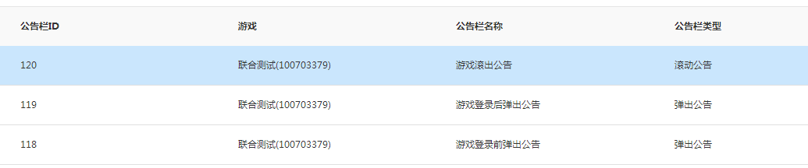

MSDK公告モジュール
===

モジュール紹介
---

### 概説
公告システムはSDKの提供するゲーム内の情報通知システムです。Web側の可視化操作を通じて、イベント、ゾーンのデータアクセス不可などの情報通知を実現し、情報の到達率を効果的に向上しました。現在、次のような機能をゲームに提供できます。

-シーン別に異なる公告を送信します（例えばログイン前の公告、ログイン後の公告）
-ユーザー範囲の選択：全員公告、ゾーン・OS別、番号指定（ウィーチャットアカウント、ウィーチャットアカウント）
- いろいろな公告方式：ポップ公告、スクロール公告
- 豊富な公告内容：テキスト、画像、ウェブページなど

### 用語解釈

|  用語 | 解釈 |
| ------------- |:-------------:|
| 掲示板 | SDK公告モジュールでは場所の異なる公告を示すフィールド。ゲームは公告配置の時に選択し、クライアントが公告展示のインターフェースを呼び出す時のsceneパラメータです |
| ポップアップ公告 |ポップアップボックスの形式で公告を展示し、テキスト、画像、ウェブページの3種の形式に対応します。数通の公告の場合、ユーザーが現在の公告を閉じてから、次の公告をポップアップします。 ポップアップ公告ではジャンプリンクを追加し、クリックすると内蔵ブラウザで対応のリンクを表示します |
| スクロール公告 |ゲーム画面のトップでスクロールする形式で公告を展示します。現在、テキストだけに対応します。数通の公告がある時、組合せてスクロール展示します |

## 接続にあたって（重要、必ずご覧になってください）

- 公告モジュールはSDK初期化及びプレイヤーがログインした後に、システムのバックグラウンドで当該APPの有効公告を表示します。また、公告モジュールは定時表示のメカニズムがあります（デフォルトでは10分間に1回表示します）
-公告展示のインターフェース及び公告データ取得のインターフェースを呼び出す時、ローカルのデータベースから当該アプリの現在有効な公告を取得します。ゲームは直接にSDK自分の公告UIを使用して、ゲームの接続コストを低減できます。
- **当該機能はMSDK 1.7.0a バージョン以降に提供します。公告はスクロール公告、ポップアップの2種類があります。** MSDK 2.0.0a から、公告内容は文字から画像とウェブページの3種類に増加しました。
- **`SDKの異なる場所で展示する公告について、掲示板で区分します。例えば、ログイン前の公告とログイン後の公告はSDK公告モジュールに対応して、異なる掲示板に相当します`**

推奨の使い方
---

### 方案の概説

ここではゲームのSDK公告モジュールへの接続の推奨方案を提供します。あるゲームのSDK公告モジュールへの接続を模擬しまうｓ。

-ログイン前、ログイン後の複数場所のポップアップ公告及びゲームの任意場所でのスクロール公告を接続します。
- ゲームはSDK公告モジュールの提供するUI風格を使用します 

### 接続プロセス

1. SDK公告管理側[http://dev.ied.com/](http://dev.ied.com/)でゲーム対応の掲示板を追加します。下図はSDK Demoの対応掲示板の情報です。

	

- クライアント接続：

	1. `AndroidMainfest`と`assets/msdkconfig.ini`でMSDK公告関連の配置を追加し、このドキュメント[接続配置](notice.md#接続配置)及び[のスイッチ配置](notice.md#のスイッチ配置)の閲覧モジュールを追加します。

	- クライアント公告の呼び出し（ご参考まで）：
		- ゲームの初期化が終了し、ログイン画面で止まる時にログイン前公告を展示します。インターフェース[公告展示インターフェース](notice.md#公告展示インターフェース)を使用し、対応の掲示板IDのパラメータで、ログイン前公告を展示できます。
		- ゲームはloginNotifyの成功コールバックを受領し、ゲームのメイン画面に入る時にログイン後公告を展示します。インターフェース[公告展示インターフェース](notice.md#公告展示インターフェース)を使用し、対応の掲示板IDのパラメータで、ログイン後公告を展示できます。
		- ゲームはスクロール公告を展示したい場所（例えばログイン後のゲーム主画面など)でインターフェースを呼び出し、スクロール公告を展示します。インターフェース[公告展示インターフェース](notice.md#公告展示インターフェース)を使用し、対応の掲示板IDのパラメータを利用します。展示開始の後にタイマーを設定し、時間満了後、スクロール公告を不表示にします。

### 結合テスト
	
1.クライアント`assets/msdkconfig.ini`に配置されるドメインが`http://msdktest.qq.com`であることを確認します
2. プロダクト要員は公告管理部 [http://dev.ied.com/](http://dev.ied.com/)で公告（テスト環境）を選択し、公告を追加します。
3. クライアントは製品の配置する公告種類（ログイン前後，スクロールポップアップ、番号パッケージの有無などのテスト）により、公告を表示できない場合、 [ゲーム公告の展示不可の検査手順](notice.md#ゲーム公告の展示不可の検査手順)をクリックして、手順に従って検査してください。

接続配置
---
#### 公告初期化：
	
公告モジュールに対して単独に初期化する必要がなく、MSDKの初期化を完成すれば結構です。**ゲームはモバイルQQ又はウィーチャットプラットフォームだけを接続する場合、初期化（onCreate）時に対応プラットフォームのappidだけを設定してください。他のゲームまたはプラットフォームのappidを気ままに記入しないでください。でないとゲームのログイン前の公告表示に失敗する恐れがあります。**

#### 公告AndroidMainfest配置：

ここではMSDK公告画面関連の権限設定です。

	<!-- TODO Notice 公告 配置 START -->
    <!--  MSDKは公告関連の配置をポップアップします。 -->
   	<activity
       	android:name="com.tencent.msdk.notice.AlertMsgActivity"
       	android:configChanges="orientation|screenSize|keyboardHidden"
       	android:screenOrientation="sensor"
       	android:theme="@style/NoticeAlertTheme" >
    </activity>
	<!--  MSDKは公告関連の配置をスクロールします -->
    <service android:name="com.tencent.msdk.notice.RollFloatService" >
    </service>
    <!-- TODO Notice 公告 配置  END -->

**備考：ゲームは画面の方向に応じて公告activityの画面方向（android:screenOrientationの値）を設定できます。**

スイッチ配置
---
MSDKはスイッチを提供し、ゲームがMSDK公告表示のオン・オフ、及び公告の定時表示の頻度を制御します。
####公告表示のオン・オフ
	
公告モジュールはデフォルトではオフとなり、公告モジュールを使用するゲームは、assets/msdkconfig.iniではneedNoticeの値をtrueに設定する必要があります。
####公告の定時表示時間の設定

デフォルトでは公告モジュールの自動表示時間は10分間です。ゲームは必要に応じてassets/msdkconfig.iniでnoticeTimeの値を対応の時間に設定できます。**（ゲームの設定可能な最小表示時間は5分間です）**

##公告展示インターフェース

WGShowNoticeを呼び出すと、MSDK配置の画面で現在有効の公告を表示します。ポップアップ公告の場合、ジャンプリンクの有無を設定できます。ジャンプリンク付きの公告に対して、詳細をクリックすると、MSDK内蔵ブラウザを起動し、対応の詳細URLを表示します。

#### インターフェース声明：
	
	/**
	 *対応種類の指定掲示板の公告を展示します
	 * @param scene 掲示板IDで、空白にすることができません。 このパラメータは公告管理側の「掲示板」設定に対応します。
	 */

  	void WGShowNotice(unsigned char *scene);

#### インターフェースの呼び出し：

	String sceneString = "1";
	WGPlatform.WGShowNotice(sceneString);
	
#### 注意事項：
1.インターフェースを呼び出す時に使用する掲示板id(scene)は、公告管理側**で設定した「掲示板」IDに対応しており、公告ID(msgid)で掲示板IDに代わらないでください**	
2. 2.4.0から当該インターフェースを調整しました。2.4.0以前のバージョンに接続するゲームは次のインターフェースドキュメントを参照してください。
	
###元の公告展示インターフェース（当該インターフェースは2.4.0から廃棄され、 [公告展示インターフェース](notice.md#公告展示インターフェース)）に変更しました

WGShowNoticeを呼び出すと、MSDK配置の画面で現在有効の公告を表示します。ポップアップ公告の場合、ジャンプリンクの有無を設定できます。ジャンプリンク付きの公告に対して、詳細をクリックすると、MSDK内蔵ブラウザを起動し、対応の詳細URLを表示します。

#### インターフェース声明：
	 	/** 	 *対応種類の指定掲示板の公告を展示します 	 * @param type   表示する公告の種類 	 * 	  eMSG_NOTICETYPE_ALERT: ポップアップ公告 	 * 	  eMSG_NOTICETYPE_SCROLL: スクロール公告 	 * 	  eMSG_NOTICETYPE_ALL: ポップアップ公告&&スクロール公告 	 * @param scene 掲示板IDで、空白にすることができません。 このパラメータは公告管理側の「掲示板」設定に対応します。 	 */
   	void WGShowNotice(eMSG_NOTICETYPE type, unsigned char *scene);
 #### インターフェースの呼び出し：
 	eMSG_NOTICETYPE noticeTypeID = eMSG_NOTICETYPE.eMSG_NOTICETYPE_ALERT;
	String sceneString = "1";
	WGPlatform.WGShowNotice(noticeTypeID, sceneString);
	
#### 注意事項：
インターフェースを呼び出す時に使用する掲示板id(scene)は、公告管理側**で設定した「掲示板」IDに対応しており、公告ID(msgid)で掲示板IDに代わらないでください**  スクロール公告の不表示のインターフェース
---

WGHideScrollNoticeを呼び出すと、展示中のスクロール公告を不表示にします。

#### インターフェース声明：

	/** 	 *展示中のスクロール公告を不表示にします 	 */

	 void WGHideScrollNotice();  #### インターフェースの呼び出し：

	WGPlatform.WGHideScrollNotice(); 
## 公告データ取得のインターフェース

WGGetNoticeDataを呼び出すと、指定種類の現在有効な公告データリストを戻します。
#### インターフェース声明：

	/**
	 *ローカルデータベースから指定sceneで指定typeの現在有効な公告を読み込みます
	 * @param sence このパラメータは公告管理側の「掲示板」に対応します
	 * @return NoticeInfo構造的アレイで、NoticeInfo構造は次の通りです。
		typedef struct
		{
			std::string msg_id;			//公告id
			std::string open_id;		//ユーザーopen_id
			std::string msg_url;		//公告ジャンプリンク
			eMSG_NOTICETYPE msg_type;	//公告の種類，eMSG_NOTICETYPE
			std::string msg_scene;		//公告展示の掲示板で、管理側バックグラウンドで配置されます
			std::string start_time;		//公告有効期間の開始時間
			std::string end_time;		//公告有効期間の終了時間
			eMSG_CONTENTTYPE content_type;	//公告内容の種類，eMSG_CONTENTTYPE

			//ウェブページ公告の特殊フィールド
			std::string content_url;     //ウェブページ公告URL
			//画像公告の特殊フィールド
			std::vector<PicInfo> picArray;    //画像アレイ
			//テキスト公告の特殊フィールド
			std::string msg_title;		//公告タイトル
			std::string msg_content;	//公告内容
			}NoticeInfo;
	 */
		 
	 std::vector<NoticeInfo> WGGetNoticeData(unsigned char *scene);

#### インターフェースの呼び出し：
	
	String sceneString = "1";
	Vector<NoticeInfo> noticeInfos = new Vector<NoticeInfo>();
    noticeInfos = WGPlatform.WGGetNoticeData(sceneString);

#### 注意事項：
1. インターフェースを呼び出す時に使用する掲示板id(scene)は、公告管理側**で設定した「掲示板」IDに対応しており、公告ID(msgid)で掲示板IDに代わらないでください**	 
2. **2.4.0から当該インターフェースを調整しました。2.4.0以前のバージョンに接続するゲームは次のインターフェースドキュメントを参照してください。**  

###元の公告展示インターフェース（当該インターフェースは2.4.0から廃棄され、 [公告データの取得インターフェース](notice.md#公告データの取得インターフェース)）に変更しました

WGGetNoticeDataを呼び出すと、指定種類の現在有効な公告データリストを戻します。
#### インターフェース声明：
 	/** 	 *ローカルデータベースから指定sceneで指定typeの現在有効な公告を読み込みます 	 * @param type展示する公告種類。種類はeMSG_NOTICETYPEで、具体値は次の通りです。 	 * 	  eMSG_NOTICETYPE_ALERT: ポップアップ公告 	 * 	  eMSG_NOTICETYPE_SCROLL: スクロール公告 	 * @param sence このパラメータは公告管理側の「掲示板」に対応します 	 * @return NoticeInfo構造的アレイで、NoticeInfo構造は次の通りです。 		typedef struct 		{ 			std::string msg_id;			//公告id 			std::string open_id;		//ユーザーopen_id 			std::string msg_url;		//公告ジャンプリンク 			eMSG_NOTICETYPE msg_type;	//公告の種類，eMSG_NOTICETYPE 			std::string msg_scene;		//公告展示の掲示板で、管理側バックグラウンドで配置されます 			std::string start_time;		//公告有効期間の開始時間 			std::string end_time;		//公告有効期間の終了時間 			eMSG_CONTENTTYPE content_type;	//公告内容の種類，eMSG_CONTENTTYPE
 			//ウェブページ公告の特殊フィールド
			std::string content_url;     //ウェブページ公告URL 			//画像公告の特殊フィールド 			std::vector<PicInfo> picArray;    //画像アレイ 			//テキスト公告の特殊フィールド 			std::string msg_title;		//公告タイトル 			std::string msg_content;	//公告内容 			}NoticeInfo; 	 */ 		  	 std::vector<NoticeInfo> WGGetNoticeData(eMSG_NOTICETYPE type,unsigned char *scene);
 #### インターフェースの呼び出し： 	
	eMSG_NOTICETYPE noticeTypeID = eMSG_NOTICETYPE.eMSG_NOTICETYPE_ALERT;
	String sceneString = "1"; 	Vector<NoticeInfo> noticeInfos = new Vector<NoticeInfo>();
    noticeInfos = WGPlatform.WGGetNoticeData(noticeTypeID, sceneString);
     
#### 注意事項：
インターフェースを呼び出す時に使用する掲示板id(scene)は、公告管理側**で設定した「掲示板」IDに対応しており、公告ID(msgid)で掲示板IDに代わらないでください**          ゲーム公告の展示不可の検査手順
---
 1. 公告モジュールがオンになっていますか
 	**ゲームassets/msdkconfig.iniのneedNoticeの値がtrueであるか検査します。Trueでない場合、trueに変更してから試行します。Trueである場合、検査を継続します。**検査方法：
 	- MSDKログを調べ、次のログがあれば、公告モジュールのオフ状態にあることを示します。
	
			WeGame NoticeManager.init	 notice module is closed!  		次のログがあれば、公告モジュールがオンになっていることを示します。  			WeGame NoticeManager.init	 notice module init start!  	-ゲームパッケージをデコンパイリングし、assetsディレクトリーのmsdkconfig.iniファイルを検索し、needNoticeを配置したか検査し、needNoticeの値がtrueであるか確認します。

-呼び出しインターフェースには有効な内容があるか確認します。

	** MSDKのログを調べ、呼び出しインターフェースのログには公告があるか検査します。0でない場合、MSDK関連のR&Dにお問い合わせください。0の場合、検査を継続します。**検査方法：

	MSDKログで**noticeVector size**の値を調べます。

		WeGame NoticeDBModel.getNoticeRecordBySceneAndType	 query result:0
		WeGame NoticeManager.getNoticeFromDBBySceneAndType	 noticeVector size:0

- 查看取得する公告的appidが正確か：

	** MSDKのログを調べ、公告取得時のappidが正確か確認します。ログイン前公告がモバイルQQとウィーチャットappiDの組合の場合、ログイン後公告は対応のプラットフォームappidとなります。正しくない場合、初期化で変更してから、再試行します。正しい場合、検査を継続します。**検査方法：

	MSDKログから**NoticeManager.getNoticeInfo**呼び出し時のappiD値を調べ、devバックグラウンド、公告リクエストのタイミング（ログインの有無）と比較し、正確か確認します。**特に単一プラットフォームのゲームは気ままに他のプラットフォームの情報を記入すると、公告取得の失敗をもたらすことがあります**：

		WeGame NoticeManager.getNoticeInfo	 appid：100703379|wxcde873f99466f74a;openid:
		WeGame NoticeManager.getNoticeInfo	 Notice Model:mat_id may be null:860463020910104;mMatId:860463020910104
- 公告が管理部から下クライアントに送信されたか検査します。

	**ゲームのローカルデータを消去してから、ゲームを再開します。それからMSDKのログを調べ、バックグラウンドから配信された公告リストには配置の公告があるか確認します。ない場合、MSDKバックグラウンドにお問合せください。ある場合、検査を継続します。**検査方法：
	
	MSDKログからリクエスト/notice/gather_data/のリターン内容を確認します。サンプルは次の通りです。
		
		strResult:{"appid":"100703379|wxcde873f99466f74a","invalidMsgid":[{"invalidMsgid":"499"},{"invalidMsgid":"500"},{"invalidMsgid":"483"},{"invalidMsgid":"509"},{"invalidMsgid":"513"}],"list":[{"appid":"100703379|wxcde873f99466f74a","beginTime":"1403614800","contentType":2,"contentUrl":"http://www.qq.com","endTime":"1412168400","msgContent":"","msgUrl":"http://www.baidu.com","msgid":"528","noticeType":0,"openid":"","picUrlList":[],"scene":"10","title":""},{"appid":"100703379|wxcde873f99466f74a","beginTime":"1403614800","contentType":1,"contentUrl":"","endTime":"1412168400","msgContent":"","msgUrl":"","msgid":"527","noticeType":0,"openid":"","picUrlList":[{"hashValue":"7a7ac418fb79917875cfd80c81ee4768","picUrl":"http://img.msdk.qq.com/notice/527/20140624211729_610X900.jpg","screenDir":1},{"hashValue":"2243f401734483f09ceeffd86006262d","picUrl":"http://img.msdk.qq.com/notice/527/20140624211739_1080X440.jpg","screenDir":2}],"scene":"10","title":""},{"appid":"100703379|wxcde873f99466f74a","beginTime":"1403573435","contentType":0,"contentUrl":"","endTime":"1412127095","msgContent":"& &&互換性テストケース,2& &&特殊文字について","msgUrl":"","msgid":"490","noticeType":0,"openid":"","picUrlList":[],"scene":"10","title":"& &&互換性テスト2&"},{"appid":"100703379|wxcde873f99466f74a","beginTime":"1396575095","contentType":0,"contentUrl":"","endTime":"1412127095","msgContent":"スクロール公告を配置する時、改行を入力できません。何故ですか？\r\n\r\n","msgUrl":"","msgid":"491","noticeType":1,"openid":"","picUrlList":[],"scene":"11","title":""},{"appid":"100703379|wxcde873f99466f74a","beginTime":"1396575095","contentType":0,"contentUrl":"","endTime":"1412127095","msgContent":"次は改行\r\n　1つの改行，\r\nもう1つの改行\r\nああ、また1つ\r\nよし、これは最後でしょう\r\nなに、また1つ\r\nこれは本当に最後のものです","msgUrl":"","msgid":"492","noticeType":0,"openid":"","picUrlList":[],"scene":"10","title":"改行テスト"},{"appid":"100703379|wxcde873f99466f74a","beginTime":"1396575095","contentType":0,"contentUrl":"","endTime":"1412127095","msgContent":"次は改行\r\n1つの改行，\r\nもう1つの改行\r\nああ、また1つ\r\nよし、これは最後でしょう\r\nなに、また1つ\r\nこれは本当に最後のものです\r\n次は詳細をクリックすると、ジャンプします。ジャンプ\r\n","msgUrl":"http://im.qq.com","msgid":"493","noticeType":0,"openid":"","picUrlList":[],"scene":"10","title":"改行+ジャンプテスト"},{"appid":"100703379|wxcde873f99466f74a","beginTime":"1396575095","contentType":0,"contentUrl":"","endTime":"1412127095","msgContent":"スクロール公告を配置する時、改行を入力できません。何故ですか？\r\n\r\n","msgUrl":"","msgid":"494","noticeType":1,"openid":"","picUrlList":[],"scene":"11","title":""},{"appid":"100703379|wxcde873f99466f74a","beginTime":"1396575095","contentType":0,"contentUrl":"","endTime":"1412127095","msgContent":"& &&互換性テストケース,2& && 特殊文字について*&……￥%……@#——+（）？』『，スクロール掲示板にあるはずです。側にはスクロール公告があるはずです。前ですか後ですか？","msgUrl":"","msgid":"495","noticeType":1,"openid":"","picUrlList":[],"scene":"11","title":""},{"appid":"100703379|wxcde873f99466f74a","beginTime":"1403229600","contentType":0,"contentUrl":"","endTime":"1404011100","msgContent":"全部のユーザーに対してジャンプ付きの公告を配信し、終了時間は現在時間に迫っています","msgUrl":"http://www.qq.com","msgid":"487","noticeType":0,"openid":"","picUrlList":[],"scene":"1","title":"終了時間、ジャンプあり"},{"appid":"100703379|wxcde873f99466f74a","beginTime":"1403748000","contentType":0,"contentUrl":"","endTime":"1403834400","msgContent":"ウィーチャット+モバイルQQ+android+スクロール","msgUrl":"","msgid":"514","noticeType":1,"openid":"","picUrlList":[],"scene":"4","title":""}],"msg":"success","ret":0,"sendTime":"1403777179"}

	その中に全ての公告内容があり、ゲームはバックグラウンドでの配置公告のid等で検索範囲を絞り、公告の配信の有無を確認できます。
		
-公告是がローカルタイムの有効期間にあるか検査します。

	** MSDKのログを検査し、公告展示を呼び出す時のローカルタイムを確認します。ローカルタイムが公告の有効期間内にない場合、ローカルタイムを変更してから再試行します。ローカルタイムが有効期間にある場合、検査を継続します。**検査方法：

	前の手順により、公告の開始・終了時間などの関連情報を調べ、MSDKログでNoticeDBModel.getNoticeRecordBySceneAndTypeの呼び出し時currentTimeStampの値を確認します。

		WeGame MsdkThreadManager.showNoticeByScene	 showNotice
		WeGame NoticeManager.setAppinfo	 mAppId：wxcde873f99466f74a;mOpenId:oGRTijsKcz0dOi__dwJTZmINGfx0
		WeGame NoticeDBModel.getNoticeRecordBySceneAndType	 appId:wxcde873f99466f74a,openid:oGRTijsKcz0dOi__dwJTZmINGfx0,scene:10,noticetype:eMSG_NOTICETYPE_ALERT,currentTimeStamp:1403835077
		WeGame NoticeDBModel.getNoticeRecordBySceneAndType	 query result:5
		
	公告取得時のローカルタイムを比較し、ローカルタイムが公告の有効期間内にあるか検査します（公告の開始と終了時間の時間帯）。
	
-呼び出しインターフェースのパラメータが正確か検査します

	** MSDKログとゲームの公告管理側での配置を比較し、公告インターフェース呼び出しの配置とバックグラウンドが同じであるか確認します。同じでない場合、変更してから再試行します。同じであれば、検査を継続します。**検査方法：

	MSDKログから、次のようなログを確認します。

		WeGame NoticeDBModel.getNoticeRecordBySceneAndType	 appId:100703379|wxcde873f99466f74a,openid:,scene:11,noticetype:eMSG_NOTICETYPE_SCROLL,currentTimeStamp:1409632268

	公告呼び出しの時に伝送されたscene値とnoticetypeは、ゲームの公告管理部に配置されたものと同じであるか確認します，**特にscene値は管理部の公告配置の掲示板IDに対応します。**
	
-ゲームのappid配置が正確か検査します

	**ゲームのonCreateで配置されたappidは、devプラットフォームで登録されたものと同じであるか確認します。同じでない場合、変更してから再試行します。同じであれば、MSDK開発にお問合せください。**
	

