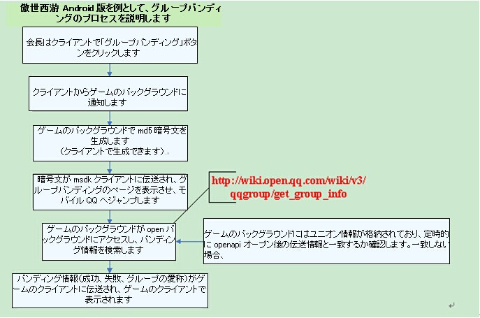
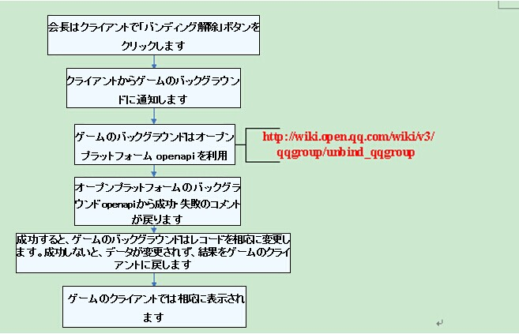
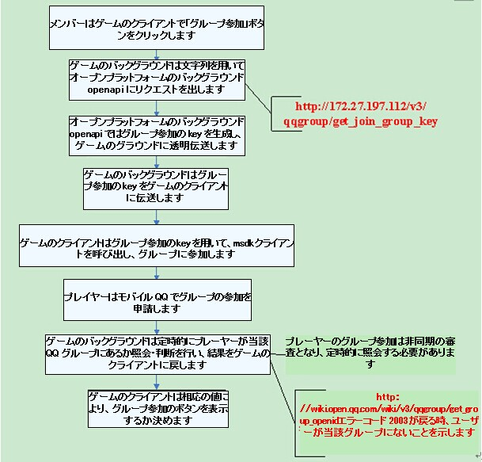
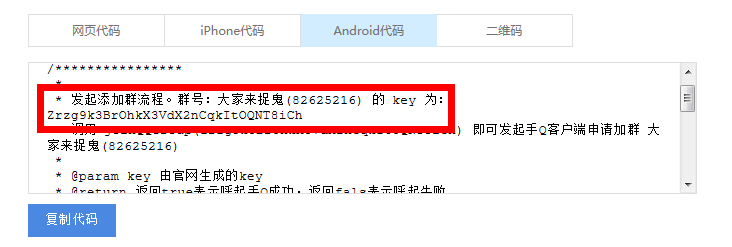

MSDK モバイルQQ 関連モジュール
=======

接続配置
------

#### AndroidMainfest配置

- ゲームは次のサンプルで配置情報を記入します。

		<!-- TODO SDK接続 QQ接続配置 START -->
		<activity
		    android:name="com.tencent.tauth.AuthActivity"
		    android:launchMode="singleTask"
		    android:noHistory="true" >
		    <intent-filter>
		        <action android:name="android.intent.action.VIEW" />
		        <category android:name="android.intent.category.DEFAULT" />
		        <category android:name="android.intent.category.BROWSABLE" />
		        <data android:scheme="tencentゲームのモバイルQQ appid" />
		    </intent-filter>
		</activity>
		<activity
		    android:name="com.tencent.connect.common.AssistActivity"
		    android:configChanges="orientation|screenSize|keyboardHidden"
		    android:screenOrientation="portrait"
		    android:theme="@android:style/Theme.Translucent.NoTitleBar" />
		<!-- TODO SDK接続 QQ接続配置 END -->

- **注意事項：**

	1. **com.tencent.tauth.AuthActivityのintent-filterの```<data android:scheme="tencentゲームのモバイルQQ appid" />```
	のtencentの後にゲームのモバイルQQ appidを記入します。**例えば```<data android:scheme="tencent100703379" />```

	- **ゲームのActivityのlaunchModeをsingleTopに設定する必要があります**。singleTopに設定してから、プラットフォームによるゲーム実行のシーンでは、ゲームActivityが2つ実行されることがあります。ゲームActivityのonCreateでは現在Activityが重複のゲームActivityであるか検査します。重複の場合、現在ゲームActivityをfinishします。

#### Appid 配置：

- この部分の内容はJava層の初期化で完成しました。

		public void onCreate(Bundle savedInstanceState) {
			...
    		//ゲームは自分のQQ AppIdで結合テストをしなければなりません
            baseInfo.qqAppId = "1007033***";
            baseInfo.qqAppKey = "4578e54fb3a1bd18e0681bc1c7345***";

            //ゲームは自分のウィーチャットAppIdで結合テストをしなければなりません
            baseInfo.wxAppId = "wxcde873f99466f***"; 
            baseInfo.wxAppKey = "bc0994f30c0a12a9908e353cf05d4***";

            //ゲームは自分の支払offerIdで結合テストをしなければなりません
            baseInfo.offerId = "100703***";
    		...
    		WGPlatform.Initialized(this, baseInfo);
    		WGPlatform.handleCallback(getIntent());
    		...
		}
- **注意事項：**

	1. baseInfo値の記入エラーにより、QQ、ウィーチャットの共有，ログイン失敗をもたらします。覚えてください！！！

#### 利用場面：

前述のログインページは次の通りです。ユーザーがクリックすると、QQ友達とWGLoginを呼び出します


#### 注意事項：

1.	モバイルQQをインストールしていない時、精品ゲームはWebページで授権できます。AndroidMenifest.xmlのAuthActivityの声明ではintent-filterで<data android:scheme="***" />を配置することを確保してください。詳細は本節のモバイルQQ関連AndeoidMainfest配置を参照してください。 **海納ゲームは現在ページ授権に対応しません**。WGIsPlatformInstalledインターフェースを通じて、モバイルQQをインストールしたか判断し、モバイルQQをインストールしていない場合、ユーザーに授権不可のメッセージを表示します。

- **偶にはOnLoginNotifyコールバックを受信できません。**

	AndroidManifest.xml と本節前部の説明では、com.tencent.tauth.AuthActivityとcom.tencent.connect.common.AssistActivityの一致性を確保してください。

- ゲームのActivityがLaunch Activityの場合、ゲームActivity声明には、android:configChanges="orientation|screenSize|keyboardHidden"を追加する必要があります。でないとログインしてもコールバックがありません。

## 快速ログイン

快速ログインとは、プレイヤーがモバイルQQ又はウィーチャット内で共有メッセージをクリックすることで、直接にゲームを実行する時、プラットフォームはログイン関連のトークン情報を透明伝送し、直接にログインを完成し、ゲームに入ります。この場面では、ゲームを実行してから、ユーザーは再授権せずにゲームに入ることができます。

### モバイルQQゲームセンターの快速ログインの配置

モバイルQQはゲームセンターでクリックして実行する時、直接にゲームにログインできます。ただし、ゲームセンターのページでゲームに入る時、ゲームの配置に依存されます。具体的な配置方法はゲームの**`運営協同計画PM`**によってモバイルQQゲームセンターに要求を出し、ゲームセンターの担当者は配置を完成します。配置は次の通りです。

1. openIDの対応：

	下図のように、openIDを選択します

 

2. openID、accessToken、PayTokenの対応

	1.対応のオプションを選定します

	2.ゲームの別アカウント対応のバージョンのversionCodeを記入します。記入してから、このcode及びそれ以上のバージョンは、トークン付きでゲームを実行できますが、これまでのバージョンではopenIDのみでゲームを実行します。ゲームの正常ロジックを影響しません。
 

3. 注意事項

	配置する時、前の3項目を配置するだけで結構です。後の項目を配置しなくてもいいです。

個人情報の検索
------

ユーザーがモバイルQQで授権してから、ゲームはユーザーのニックネーム、顔写真とその他の情報を必要とします。個人情報には、nickname, openId, gender, pictureSmall, pictureMiddle, pictureLargeを含みます。 この機能を完成するには、WGQueryQQMyInfoというインターフェースを利用します。インターフェースの詳細は次の通りです。
#### インターフェース声明：

	/**
	 *自分のQQ資料を取得します
	 * @return void
	 *   このインターフェースの呼び出し結果はOnRelationCallBack(RelationRet& relationRet) でデータをゲームにコールバックします。,
	 *   RelationRet対象のpersons属性はVector<PersonInfo>です。0番目のものはユーザーの個人情報です。
	 *   モバイルQQ授権のユーザーは次のような個人情報を取得できます
	 *   nickname, openId, gender, pictureSmall（40*40）, pictureMiddle（40*40）, pictureLarge（100*100）, その他のフィールドは空白です.
	 */
	bool WGQueryQQMyInfo();

#### インターフェースの呼び出し：

インターフェース呼び出しのサンプル：

	WGPlatform::GetInstance()->WGQueryQQMyInfo();
コールバック受信のサンプル：

	virtual void OnRelationNotify(RelationRet& relationRet) {
    switch (relationRet.flag) {
    case eFlag_Succ:
        // relationRet.persons.at(0) に保存されているのは個人情報
        break;
    default:
        break;
    	}
	}

共遊び友達情報の検索
------

ユーザーはモバイルQQでゲームに授権してから、ゲーム内の友達情報(例えば友達の点数ランキング)を表示する必要があります。この機能を完成するには、WGQueryQQGameFriendsInfoというインターフェースを利用します。インターフェースの詳細は次の通りです。
#### インターフェース声明：
	
	/**
	* QQ友達情報を取得し、コールバックはOnRelationNotifyにあります。
	* ここでRelationRet.personsはVectorであり、Vectorの内容は友達情報です。QQ友達情報のprovinceとcityは空白です
	* @return void
	* このインターフェースの呼び出し結果はOnRelationNotify(RelationRet& relationRet)で
	* データをゲームにコールバックします。。 RelationRet対象のpersons属性はVector<PersonInfo>です。
	* それぞれのPersonInfo対象は友達情報です。
	* 友達情報にはnickname, openId, gender, pictureSmall, pictureMiddle, pictureLargeがあります。
	*/
	bool WGQueryQQGameFriendsInfo();
	
#### インターフェースの呼び出し：

インターフェース呼び出しのサンプル：

	WGPlatform::GetInstance()->WGQueryQQGameFriendsInfo();

コールバック受信のサンプル：

	virtual void OnRelationNotify(RelationRet& relationRet) {
    	switch (relationRet.flag) {
    	case eFlag_Succ:
        // relationRet.persons に保存されているのは全ての友達情報
       		break;
    	default:
        	break;
    	}
	}
構造化メッセージの共有
------

このメッセージを共有するために、モバイルQQを運行し、ユーザーの参与で共有の過程を完成する必要があります。ゲーム内外の友達に共有できます。ゲーム外の友達を招待するのに用いられます。

メッセージが共有されると、 メッセージの受信者はメッセージをクリックし、インターフェースの呼び出し時に伝えてきたURLを実行できます。一般的に、このURLはゲームセンターのURLに配置されます。これにより、モバイルQQゲームセンターで自動実行として配置され、メッセージをクリックしてゲームを実行することができます。

ユーザーの携帯電話にモバイルQQがインストールされていない場合、又はモバイルQQのバージョンが4.0より古い場合、このインターフェースはWebページを呼び出し、共有機能を完成します。この機能を完成するために、WGSendToQQというインターフェースを利用する必要があります。インターフェースの詳細は次の通りです。
#### 利用場面：
	招待、自慢
#### インターフェース声明：

	/**
	 * @param scene標識をモバイルQQ会話又はQzoneに送信します
	 * 		eQQScene.QQScene_QZone: 空間に共有します(バージョン4.5以上の場合、これに対応します)
	 * 		eQQScene.QQScene_Session: モバイルQQ会話に共有します
	 * @param title 構造化メッセージのタイトル
	 * @param desc 構造化メッセージの概要情報
	 * @param url  内容のジャンプurlであり、ゲーム対応のゲームセンターのページを記入します。ゲームは共有メッセージで実行される時、 MSDKはゲームOnWakeup(WakeupRet& wr)にコールバックします。 wr.extInfoではkey-valueの方式で全ての自己定義パラメータを戻します。
	 * @param imgUrl 共有メッセージのサムネイルURL
	 * @param imgUrlLen 共有メッセージのサムネイルURL長さ
	 * @return void
	 *   ゲームで設定したグローバルコールバックのOnShareNotify(ShareRet& shareRet)は、データをゲームにコールバックします。shareRet.flag値はリターン状態を示し、 可能な値と説明は次の通りです。
	 *     eFlag_Succ: 共有に成功しました
	 *     eFlag_Error: 共有に失敗しました
	 *     
	 *     @return void
	 *	ゲームで設定したグローバルコールバックのOnShareNotify(ShareRet& shareRet)はデータをゲームにコールバックします。shareRet.flag値はリターン状態を示し、 可能な値と説明は次の通りです。
	 *     eFlag_Succ: 共有に成功しました
	 *     eFlag_Error: 共有に失敗しました
	 *   注意:
	 *     共有はSDカードを必要とします。SDカードがない場合、共有に失敗することがあります。
	 *     モバイルQQクライアント4.6までのバージョンでは、コールバックで課題がありますから、このコールバックで他のロジックをしないください。(現在のflagは全てeFlag_Succが戻されます)
	 *     
	 */ 
	void WGSendToQQ(
		const eQQScene& scene,
		unsigned char* title, 
		unsigned char* desc,
		unsigned char* url, 
		unsigned char* imgUrl,
		const int& imgUrlLen
		);
	
#### インターフェースの呼び出し：

インターフェース呼び出しのサンプル：

	int scene = 1; 
	std::string title = "title";
	std::string summary = "summary";
	std::string targetUrl = "http://www.qq.com";
	std::string imgUrl = "http://mat1.gtimg.com/erweimaNewsPic.png";
	WGPlatform::GetInstance()-> WGSendToQQ(
		1, 
		((unsigned char *) title.c_str()),
		((unsigned char *)summary.c_str()), 
		((unsigned char *)targetUrl.c_str()),
		((unsigned char *)imgUrl.c_str()),
		imgUrl.length()
	);

コールバック受信のサンプル：

	virtual void OnShareNotify(ShareRet& shareRet) {
    	LOGD("OnShareNotify: platform:%d flag:%d",
            shareRet.platform, shareRet.flag);
    	// 処理共有コールバック
    	if (shareRet.platform == ePlatform_QQ) {
        	switch (shareRet.flag) {
        		case eFlag_Succ:
            		// 共有に成功しました
            		break;
        		case eFlag_Error:
            		// 共有に失敗しました
            		break;
        		}
    		} else if (shareRet.platform == ePlatform_Weixin) {
        	...
    	}
	}

#### 注意事項：

* モバイルQQを実行し、デフォルトで空間への共有をポップアップすることは、モバイルQQ4.5以上バージョンが対応します。
* `共有画像の推奨サイズは200*200で、画像の1辺が100より小さくなると、正常に表示できません`

音楽メッセージの共有
------
音楽の共有を完成するために、モバイルQQを運行し、ユーザーの参与で共有の過程を完成する必要があります。

メッセージが共有されると、メッセージ受信者は再生ボタンをクリックして、音楽を再生でき、会話を終了しても引き続き再生できます。メッセージをクリックすると、指定のページへジャンプできます。

ユーザーの携帯電話にモバイルQQがインストールされていない場合、又はモバイルQQのバージョンが4.0より古い場合、 このインターフェースはWebページを呼び出し、共有機能を完成します。この機能を完成するために、次のインターフェースを利用する必要があります。 
#### 利用場面：
	招待、自慢
#### インターフェース声明：

	WGSendToQQWithMusic。
	/**
	 *音楽メッセージをモバイルQQ会話に共有します
	 * @param scene eQQScene:
	 * QQScene_QZone : 空間に共有
	 * QQScene_Session：会話に共有
	 * @param title 構造化メッセージのタイトル
	 * @param desc 構造化メッセージの概要情報
	 * @param musicUrl  メッセージをクリックしてジャンプするURL
	 * @param musicDataUrl  音楽データURL（例えばhttp:// ***.mp3）
	 * @param imgUrl 		共有メッセージのサムネイルURL
	 * @return void
	 *ゲームで設定したグローバルコールバックのOnShareNotify(ShareRet& shareRet)はデータをゲームにコールバックします。shareRet.flag値はリターン状態を示し、 可能な値と説明は次の通りです。
	 *eFlag_Succ: 共有に成功しました
	 *eFlag_Error: 共有に失敗しました
	 */
	void WGSendToQQWithMusic(
		const eQQScene& scene,
		unsigned char* title,
		unsigned char* desc,
		unsigned char* musicUrl,
		unsigned char* musicDataUrl,
		unsigned char* imgUrl
	);

#### インターフェースの呼び出し：

インターフェース呼び出しのサンプル：

	int scene = 1; 
	std::string title = "title";
	std::string desc = "desc";
	std::string musicUrl = "http://y.qq.com/i/song.html?songid=1135734&source=qq";
	std::string musicDataUrl = "http://wekf.qq.com/cry.mp3";
	std::string imgUrl = "http://imgcache.qq.com/music/photo/mid_album_300/g/l/002ma2S64Gjtgl.jpg";
	WGPlatform::GetInstance()->WGSendToQQWithMusic(
		1, 
		((unsigned char *) title.c_str()),
		((unsigned char *)desc.c_str()), 
		((unsigned char *)musicUrl.c_str()),
		((unsigned char *)musicDataUrl.c_str()),
		((unsigned char *)imgUrl.c_str()),
		imgUrl.length()
	);

コールバック受信のサンプル：

	virtual void OnShareNotify(ShareRet& shareRet) {
    	LOGD("OnShareNotify: platform:%d flag:%d",
            shareRet.platform, shareRet.flag);
    	//共有コールバックの処理
    	if (shareRet.platform == ePlatform_QQ) {
        	switch (shareRet.flag) {
        		case eFlag_Succ:
            		// 共有に成功しました
            		break;
        		case eFlag_Error:
            		// 共有に失敗しました
            		break;
        		}
    		} else if (shareRet.platform == ePlatform_Weixin) {
        	...
    	}
	}

#### 注意事項：

* `共有画像の推奨サイズは200*200で、画像の1辺が100より小さくなると、正常に表示できません`

リアエンド共有
------

前の手順で友達の情報を獲得してから、メッセージを指定の友達(友達のopenIdを指定)に共有する必要があります。この共有ではモバイルQQクライアントを実行する必要がなく、共有の過程でユーザーの参与を必要とせず、インターフェースを呼び出すことで共有を完成できます。但し、ゲーム内の友達しか共有できません。メッセージが共有されると、メッセージの受信者はメッセージをクリックし、インターフェースの呼び出し時に伝えてきたURLを実行できます。一般的に、このURLはゲームセンターのURLに配置されます。これにより、モバイルQQゲームセンターで自動実行として配置され、メッセージをクリックしてゲームを実行することができます. この機能を完成するために、WGSendToQQGameFriendというインターフェースを利用する必要があります。インターフェースの詳細は次の通りです。

#### 利用場面：
	好意後に友達に通知します
#### インターフェース声明：

	/**
	 * @param act友達が共有メッセージをクリックすることでページを実行するか、直接にゲームを実行ゲームします。1が伝えてくると、ゲームを実行し、0が伝えてくると、targetUrlを実行します。
	 * @param fopenid 友達のopenId
	 * @param title 共有のタイトル
	 * @param summary 共有の概要
	 * @param targetUrl内容のジャンプ先urlについて、ゲームに対応するゲームセンターのページを記入します。共有メッセージでゲームを実行する時、MSDKはゲームに対してOnWakeup(WakeupRet&wr)コールバックを戻します。wr.extInfoにはkey-valueの形で全ての自己定義パラメータを戻します。
	 * @param imageUrl 共有のサムネイルURL
	 * @param previewText オプション、文字のプレビューです
	 * @param gameTag オプション、このパラメータには下記の何れかを記入しなければなりません。
				 MSG_INVITE                //招待
				 MSG_FRIEND_EXCEED       //自慢
				 MSG_HEART_SEND          //好意
				 MSG_SHARE_FRIEND_PVP    //PVP対戦
	 */ 
		bool WGSendToQQGameFriend(
			int act, 
			unsigned char* fopenid,
			unsigned char *title, 
			unsigned char *summary,
			unsigned char *targetUrl, 
			unsigned char *imgUrl,
			unsigned char* previewText, 
			unsigned char* gameTag
		);

#### インターフェースの呼び出し：

インターフェース呼び出しのサンプル：

	int act = 1;
	std::string friendOpenId = "791AB3A5864670BB6E331986FB86582A";
	std::string title = "qq title";
	std::string summary = "qq summary";
	std::string targetUrl = "http://qq.com";
	std::string imageUrl = "http://mat1.gtimg.com//erweimaNewsPic.png";
	std::string previewText = "qq previewText";
	std::string gameTag = "qq gameTag";
	WGPlatform::GetInstance()->WGSendToQQGameFriend(
		1, 
		((unsigned char *) friendOpenId.c_str()), 
		((unsigned char *)title.c_str()), 
		((unsigned char *)summary.c_str()), 
		((unsigned char *)targetUrl.c_str()), 
		((unsigned char *)picUrl.c_str()), 
		((unsigned char *)previewText.c_str()), 
		((unsigned char *)game_tag.c_str())
	);

コールバック受信のサンプル：

	virtual void OnShareNotify(ShareRet& shareRet) {
    	LOGD("OnShareNotify: platform:%d flag:%d",
            shareRet.platform, shareRet.flag);
    	// 処理共有コールバック
    	if (shareRet.platform == ePlatform_QQ) {
       		switch (shareRet.flag) {
        	case eFlag_Succ:
            	// 共有に成功しました
            	break;
        	case eFlag_Error:
            	// 共有に失敗しました
            	break;
        	}
    	} else if (shareRet.platform == ePlatform_Weixin) {
        	...
    	}
	}

#### 注意事項：
この共有メッセージはPC QQで表示されません。受信側は「QQ手游」公共番号に注目してから受信できます。1人のユーザーは1日に1つのゲームから20通前後のメッセージを受信できます。

大画像メッセージの共有
------
このメッセージを共有するために、モバイルQQを運行し、ユーザーの参与で共有の過程を完成する必要があります。ゲーム内外の友達に共有できます。一般的に成績を自慢するか、詳細図を必要とする他の機能に用いられます。

メッセージが共有されると、 メッセージ受信者がメッセージをクリックしてもゲームを運行できません。

ユーザーの携帯電話にモバイルQQがインストールされていない場合、又はモバイルQQのバージョンが4.0より古い場合、このインターフェースはWebページを呼び出し、共有機能を完成します。画像の短辺が640pxを超える時、バックグランドで画像を圧縮します。この機能を完成するために、インターフェース有： WGSendToQQWithPhotoというインターフェースを利用する必要があります。インターフェースの詳細は次の通りです。
#### 利用場面：
	自慢

#### インターフェース声明：

	/**
	 * @param scene標識をモバイルQQ会話又はQzoneに送信します
	 * 		eQQScene.QQScene_QZone:空間に共有します
	 * 		eQQScene.QQScene_Session: モバイルQQ会話に共有します
	 * @param imgFilePath画像を共有するローカルファイルのパスで、画像をsdカードに入れておく必要があります。共有する毎に画像のパスを同じにしないください。でないと画像表示の問題が発生します。ゲームは共有する毎に異なる画像のアドレスを保証する必要があります
	 * @return void
	 *   ゲームで設定したグローバルコールバックのOnShareNotify(ShareRet& shareRet)はデータをゲームにコールバックします。 shareRet.flag値はリターン状態を示し、 可能な値と説明は次の通りです。
	 *     eFlag_Succ: 共有に成功しました
	 *     eFlag_Error: 共有に失敗しました
	 * ご注意：モバイルQQクライアント4.6までのバージョンでは、コールバックで課題がありますから、このコールバックで他のロジックをしないください。(現在のflagは全てeFlag_Succが戻されます)
	 */
	void WGSendToQQWithPhoto(const eQQScene& scene, unsigned char* imgFilePath);
#### インターフェースの呼び出し：
インターフェース呼び出しのサンプル：

	// png,jpgの画像形式に対応し、sdcardに入れておく必要があります。
	std::string filePath = "/mnt/sdcard/test.png";
	WGPlatform::GetInstance()->WGSendToQQWithPhoto(
	1, 
	((unsigned char *)filePath.c_str())
	);
		
コールバック受信のサンプル：

	virtual void OnShareNotify(ShareRet& shareRet) {
    	LOGD("OnShareNotify: platform:%d flag:%d",
            shareRet.platform, shareRet.flag);
    	//共有のコールバックを処理します
    	if (shareRet.platform == ePlatform_QQ) {
        	switch (shareRet.flag) {
        		case eFlag_Succ:
            		// 共有に成功しました
            		break;
        		case eFlag_Error:
            		// 共有に失敗しました
            		break;
        		}
    		} else if (shareRet.platform == ePlatform_Weixin) {
        	...
    	}
	}

#### 注意事項：

1. このインターフェースでは画像のローカルパスしか対応しません。共有する毎に画像のパスを同じにしないください。でないと画像表示の問題が発生します。ゲームは共有する毎に異なる画像のアドレスを保証する必要があります。
2. モバイルQQを実行し、空間共有のポップアップが表示するために、モバイルQQ4.5以上のバージョンを必要とします。
3. 大画像メッセージをwebで共有できません。


QQグループのバンディング
------

ゲームギルド/ユニオンでは、ギルド会長はゲームで会長が作成した群を呼び出し、ある群を当該ギルドのギルド群とすることができます。呼び出しインターフェース：WGBindQQGroup。**現在、当該インターフェースゲームはメインスレッドで呼び出されます。**

#### インターフェース声明：
	
	/**
	 * ゲームグループのバンディング：ゲームギルド/ユニオンでは、ギルド会長は“バンディング”ボタンをクリックし、会長が作成したグループを呼び出し、あるグループを当該ギルドのギルドグループとすることができます。
	 * @param cUnionid ギルドID，opensdkでは数字だけ記入できます。文字を記入するとバンディング失敗をもたらします。 
	 * @param cUnion_name ギルド名称
	 * @param cZoneid ゾーンID，opensdkでは数字だけ記入できます。文字を記入するとバンディング失敗をもたらします。
	 * @param cSignature ゲーム連盟会長の身分確認の署名で、生成アルゴリズムとしては
					プレイヤーopenid_ゲームappid_ゲームappkey_ギルドid_ゾーンid に対してmd5を行います。この方法でバンディングに成功できない場合、RTX でOpenAPIHelperにお問合せください。
	 *
	 */
	void WGBindQQGroup(unsigned char* cUnionid, unsigned char* cUnion_name,
			unsigned char* cZoneid, unsigned char* cSignature);

#### インターフェースの呼び出し：
インターフェース呼び出しのサンプル：

	std::string cUnionid = "1";
	std::string cUnion_name = "union_name";
	std::string cZoneid = "1";
	//sigature とunionid及びzoneidは関連付けており、変更する時に同期に変更する必要があります
	std::string cSignature = "5C336B37DBCDB04D183A3F4E84B2AB0E";
	WGPlatform::GetInstance()->WGBindQQGroup(
		(unsigned char *)cUnionid.c_str(),
		(unsigned char *)cUnion_name.c_str(), 
		(unsigned char *)cZoneid.c_str(),
		(unsigned char *)cSignature.c_str()
	);

### グループバンディングのプロセス：

### バンディング解除プロセス：

#### 注意事項：

1.	**ゲーム内でグループバンディングの時、ギルドidとゾーンidは数字だけ記入できます。**，文字を記入するとバンディング失敗をもたらします。一般に「パラメータのベリファイに失敗」というメッセージを表示します。

- ゲーム内でグループバンディング時の署名の生成規則としては、プレイヤーopenid\_ゲームappid\_ゲームappkey\_ギルドid\_ゾーンid のmd5値とします。今回の規則で生成した署名は利用できない場合、直接にRTX で OpenAPIHelperにお問合せください。

- 3.	ゲームでは１つのギルドIDは1つのQQ群だけとバンディングします。ユーザーはギルドQQ群を解散する場合、ギルドIDとギルドQQ群は自動的にバンディングを解除できません。そうすると、ギルドIDで新しいQQ群とバンディングできなくなります。この時、アプリはこのインターフェースを呼び出し、ギルドIDとQQ群のバンディングを解除することで、新しいギルドQQ群を作成し、又は既存の他のQQ群とバンディングします。インターフェースの呼び出し方法はRTX でOpenAPIHelperにお問合せ、又はopensdk wiki：[http://wiki.open.qq.com/wiki/v3/qqgroup/unbind_qqgroup](http://wiki.open.qq.com/wiki/v3/qqgroup/unbind_qqgroup)を参照してください。

- **呼び出しapiの変数はできるだけ臨時変数を利用しないでください**

- より多くの内容は[ゲーム内グループ・友達加入のFAQ](qq.md#グループ・友達加入のFAQ)を参照してください

QQグループの加入
------
プレイヤーはゲームで直接にQQグループを加入します。呼び出しインターフェース：WGJoinQQGroup。**現在、当該インターフェースゲームはメインスレッドで呼び出されます。**

#### インターフェース声明：

	/**
	 * ゲームでのグループ追加、ギルドはqqグループのバンディングに成功すると、ギルドメンバーは “グループ追加”ボタンをクリックし、当該ギルドグループに参加できます
	 * @param cQQGroupKey追加するQQグループに対応するkeyです。ゲームserverはopenAPIのインターフェースを呼び出すことでこれを取得できます。呼び出し方法はRTX でOpenAPIHelperにお問合せください。
	 */
	void WGJoinQQGroup(unsigned char* cQQGroupKey);

#### インターフェースの呼び出し：
インターフェース呼び出しのサンプル：

	std::string cQqGroupKey = "xkdNFJyLwQ9jJnozTorGkwN30Gfue5QN";
	WGPlatform::GetInstance()->WGJoinQQGroup((unsigned char *)cQqGroupKey.c_str());

### 加グループプロセス：


#### 注意事項：

1. 4.	ゲームでグループ追加の時に、使用するパラメータは対応のQQグループのアカウントではなく、openAPIバックグラウンドで生成した特殊なKey値を利用します。ゲームで利用する時、openAPIのインターフェースを呼び出して取得するする必要があります。呼び出し方法はRTX で OpenAPIHelperにお問合せく、結合テストの段階では [http://qun.qq.com](http://qun.qq.com)**( グループ追加コンポーネント/Androidコードの箇所)を参照してください**下図の通りです：

- **呼び出しapiの変数はできるだけ臨時変数を利用しないでください**

- より多くの内容は[ゲーム内グループ・友達加入のFAQ](qq.md#グループ・友達加入のFAQ)を参照してください

QQ友達の追加
------
プレーヤーはゲームで直接に他のゲームプレーヤーをQQ友達として追加します。呼び出しインターフェース：WGAddGameFriendToQQ。**現在当該インターフェースゲームはメインスレッドで呼び出されます。**
#### インターフェース声明：

	/**
	 * ゲームでの友達追加
	 * @param cFopenid 追加する友達のopenid
	 * @param cDesc追加する友達の備考
	 * @param cMessage友達追加の時に送信する確認情報
	 */
	void WGAddGameFriendToQQ(unsigned char* cFopenid, unsigned char* cDesc,
			unsigned char* cMessage);

#### インターフェースの呼び出し：
インターフェース呼び出しのサンプル：

	std::string cFopenid = "66C7CFB0D5336EA1FABAD9B0FEECCE74";
	std::string cDesc = "apiWGAddGameFriendToQQ";
	std::string cMessage = "add";
	WGPlatform::GetInstance()->WGAddGameFriendToQQ(
		(unsigned char *)cFopenid.c_str(),
		(unsigned char *)cDesc.c_str(), 
		(unsigned char *)cMessage.c_str()
	);

グループ・友達加入のFAQ
---

### 1. 身分確認に失敗しましたメッセージを表示しました。何故ですか？

- 1.	ゲームでグループをバンディングする時、ギルドidとゾーンidは数字でなければなりません。文字を記入するとバンディング失敗をもたらします。「パラメータのベリファイに失敗しました」というメッセージを表示します。
- 2.	ゲームでグループをバンディングする時、署名の生成規則としてはプレイヤーopenid\_ゲームappid\_ゲームappkey\_ギルドid\_ゾーンidのmd5値とします。今回の規則で生成した署名は利用できない場合、直接にRTX で OpenAPIHelperにお問合せください。
- ゾーンidがなければ、0で示します。（demoでバンディングに失敗した原因としては、署名が固定されたためです。自分で新しい署名を計算してください。appid、appkey、openidをlogcatの中から見つけることができます）

### 2.　どのように、ギルドIDにはどのグループがバンディングされたか検索しますか。

 [http://wiki.open.qq.com/wiki/v3/qqgroup/get_group_openid](http://wiki.open.qq.com/wiki/v3/qqgroup/get_group_openid)を参照してください。リターンコードのエラーコードは2004で、当該グループとappidはバンディング関係がありません

### 3. どのように、ギルド成員がグループにあるか検索しますか。
 
[http://wiki.open.qq.com/wiki/v3/qqgroup/get_group_openid](http://wiki.open.qq.com/wiki/v3/qqgroup/get_group_openid)を参照してください。リターンコードのエラーコードは2003で、当該グループとappidはバンディング関係がありません

### 4. どのようにQQグループ・バンディングの成功の有無を判断しますか。
 [http://wiki.open.qq.com/wiki/v3/qqgroup/get_group_openid](http://wiki.open.qq.com/wiki/v3/qqgroup/get_group_openid) を参照してください。リターンコードは0で、group_openidはQQグループのgroup_openidを示します。またgroup_openidでグループ名を検索します（第6条参照） 

**特別説明：msdkとモバイルQQはバンディング結果を戻しません。ゲームは自らバンディングの成功の有無を照会する必要があります**

### 5. どのようにグループバンディングを解除しますか。
 [http://wiki.open.qq.com/wiki/v3/qqgroup/unbind_qqgroup](http://wiki.open.qq.com/wiki/v3/qqgroup/unbind_qqgroup)を参照してください。
### 6.どのように、ギルドIDにどのグループをバンディングしたか照会しますか。
 [http://wiki.open.qq.com/wiki/v3/qqgroup/get_group_info](http://wiki.open.qq.com/wiki/v3/qqgroup/get_group_info)を参照してください。
### 7. より多くの問題は、
 [http://wiki.open.qq.com/wiki/API%E5%88%97%E8%A1%A8](http://wiki.open.qq.com/wiki/API%E5%88%97%E8%A1%A8)
アプリ展開類API----QQ能力展開----ギルドQQグループを参照してください。

モバイルQQ機能の対応バージョン
------
1. **概説**：
	
	モバイルQQの機能はモバイルQQのバージョンに依存します。バージョンの具体的な機能の対応は次の通りです。
	
| 機能名称| 機能説明|Android モバイルQQの対応状況|
|: ------------- :|: ------------- :|: ------------- :|
| 授権ログイン| webで授権 | モバイルQQ 4.0以降 |
| 構造化メッセージの共有|共有|モバイルQQ 4.5以降 |
| 授権 |  |	4.1以降 |
| 定向共有 |  | 4.1以降 |
| 大画像共有 |  | 4.1以降 |
| QZone共有のポップアップ	|モバイルQQの起動でデフォルトとしてポップアップ	| 4.5以降 |
| 快速授権 | モバイルQQによるゲーム実行で、授権状態がある| 4.6以降 |
| Qzone&momentsの共有 |  | 4.5以降 |
| 別アカウント | プラットフォームによるゲーム実行で、openid付きでゲームに入るか（別アカウント） | 4.2以降 |
| ゲーム内でグループ追加 | モバイルQQによるゲーム実行で、授権状態がある | 4.7以降 |
| ゲーム内でグループバンディング | モバイルQQによるゲーム実行で、授権状態がある | 5.1以降 |
| ゲーム内で友達追加 | モバイルQQによるゲーム実行で、授権状態がある | 5.1以降 |

ゲームセンターのページ
------
モバイルQQゲームセンターの詳細ページは、モバイルQQが精品ゲームに提供するモバイルQQゲームセンターのリンクです（効果は下図の通り）。ゲームのメッセージ共有のターゲットアドレスにこのリンクを記入する時、メッセージをクリックすると、当該ターゲットリンクへジャンプし、自動的にトークン付きでゲームを実行し、ゲームの快速ログインを実現します（ゲームセンターで起動ボタンをクリックするのと同じです）。

共有URLアドレス：

http://gamecenter.qq.com/gcjump

フィールドのき規則	
					
| フィールド| 必須か | 種類 | 説明 |
|: ------- :|: ------- :|: ------- :|: ------- :|
| appid | 必須 | Integer | アプリの唯一標識ID |
| pf | 必須 | String |歴史の原因で “invite”として固定し、ゲームセンターはinviteのpf値を検出すると、直接にゲームを実行します|
| plat | 必須 |	String | 出所はプラットフォーム、値はqqです |
| from | 必須 | String | <p>メッセージの出所はプラットフォーム、可能な値は次の通り。</p><p>androidqq：AndroidQQ</p><p>iphoneqq：iPhone QQ</p> |
| ADTAG | 必須 | String | <p>異なる構造化メッセージの出所を標識し、可能な値は次の通り。</p><p>gameobj.msg_invite（招待）</p><p>gameobj.msg_exceed（超過）</p><p>gameobj.msg_heart（好意）</p><p>gameobj.msg_pvp（挑戦）</p><p>gameobj.msg_show（自慢）</p> |
| originuin	| 必須 | String | 開始側のopenID |
| platformdata | オプション | String | ゲームに透明伝送するデータ |
| gamedata | オプション | String | ゲームに透明伝送するデータ |

インスタンス

http://gamecenter.qq.com/gcjump?appid={YOUR_APPID}&pf=invite&from=iphoneqq&plat=qq&originuin=111&ADTAG=gameobj.msg_invite

利用場面：

クライアントの下記のインターフェースで利用します。

	WGSendToQQ：対応のパラメータはurlです
	WGSendToQQGameFriend：対応のパラメータはtargetUrlです
	WGSendToQQWithMusic：対応のパラメータはmusicUrlです

