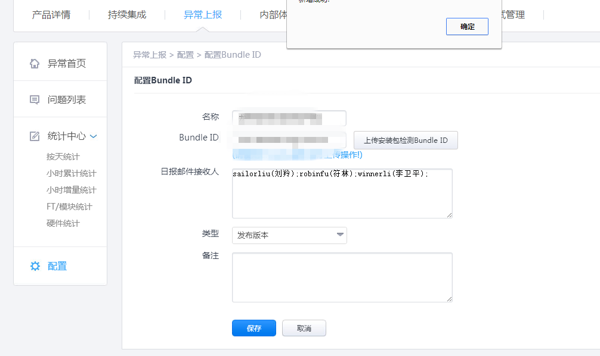
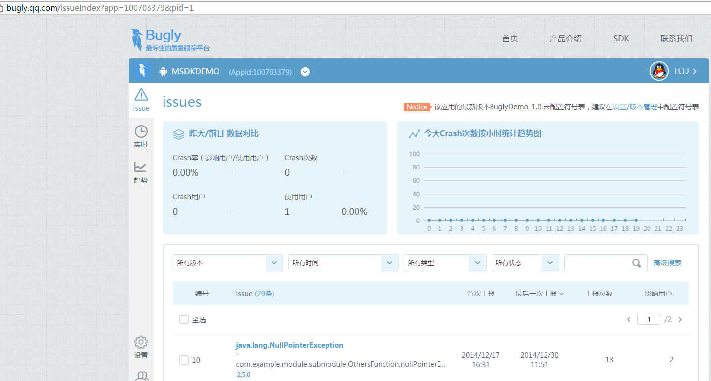

MSDK Crash報告モジュール
===
概説
---
MSDK2.5aまで（MSDK2.5aを含まない) Crash報告はRQDを利用して報告します。報告に成功した後、crashの詳細スタックはhttp://rdm.wsd.com/ で調べられ、テンセント社の従業員がRTXでログインして調べる必要があります。自作以外のゲームの調べは不便です。MSDK2.5以降ではｍbuglyで報告しますから、http://bugly.qq.com/ で調べることができます。QQアカウントで関連アプリをバンディングすることで、自作以外のゲームも便利で調べることができます。もちろん、 http://rdm.wsd.com/ でも調べることができます。ゲームは余分の操作を必要とせず、crash報告を閉じるのスイッチの違いだけです。詳細は**RQD報告スイッチの設定**及び**Bugly報告スイッチの設定**を参照してください。

RQD報告スイッチの設定
---
rdmデータ報告のオン・オフの設定関数:

     public static void WGEnableCrashReport(boolean bRdmEnable, boolean bMtaEnable)

この関数がWGPlatformにあります。bRdmEnableをfalseに設定すると（bMtaEnableをfalseに設定）、rdm crash報告をオフにします。デフォルトではcrash報告がオンですから、この関数を呼び出す必要がありません。

Bugly報告スイッチの設定
---
bugly報告スイッチのオン・オフは/assets/msdkconfig.iniで設定します

      ; bugly報告のスイッチをオフにします。デフォルトではこれをfalseに設定しています。Trueに設定すると、crash報告機能がオフになります。
      CLOSE_BUGLY_REPORT=false

RDMプラットフォームでCrashデータの閲覧
---
####登録バンディング

DEV登録のゲームは自動的にRDMに登録しますから、手動で登録する必要がありません。手動で登録する場合、直接にRDMにログインし、異常報告モジュールをクリックして、製品 BoundID を配置すれば結構です。

手順： [http://rdm.wsd.com/](http://rdm.wsd.com/)にログインし、御社の製品 -> 異常報告を確認できます。未登録の場合、下図が表示されます。

ここで、boundID は御社のAndroidManifestのpackageNameです。未登録の製品に対して、データ報告の時にデータが廃棄されます。

詳細はrdm秘書にお問合せ、android問題はspiritchenにお問合せください。

####報告データの閲覧
- サイト:[http://rdm.wsd.com/](http://rdm.wsd.com/)->異常報告->問題リスト

buglyプラットフォームでCrashデータを閲覧します
---
- サイト:[http://rdm.wsd.com/](http://rdm.wsd.com/)-> QQアカウントでログイン->相応のAppを選択します

