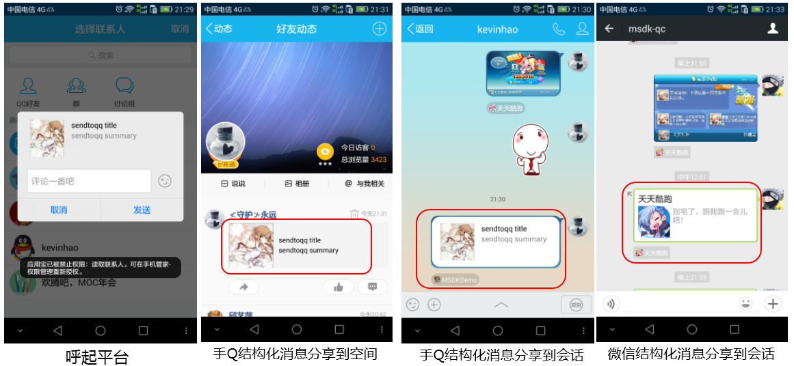
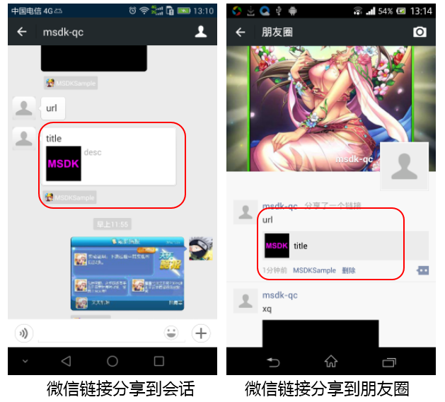
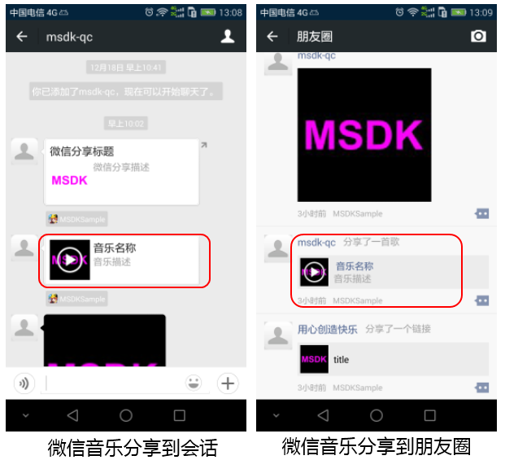
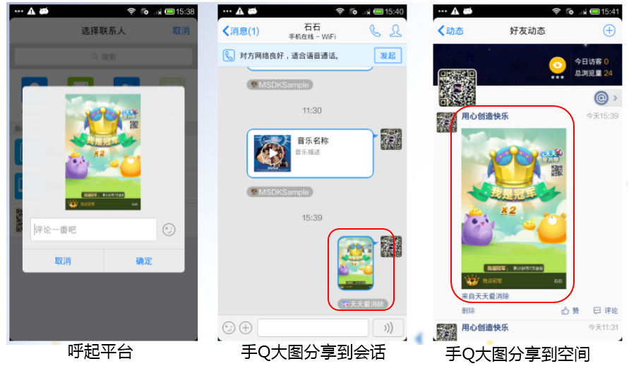
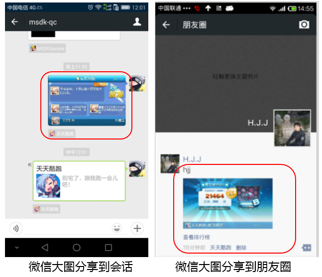
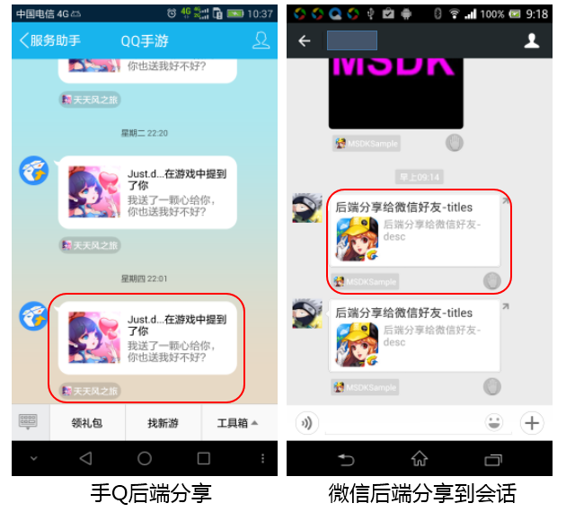

#MSDK共有モジュール

## 概説

当該モジュールではMSDKの共有関連のモジュールを整理しています。各種共有の共有方法、利用場面、共有効果、クリック効果、注意事項、呼び出しインターフェースの説明を含めています。ゲームは本文の記述を参照しながら、MSDKの共有関連のインターフェースを認識してから、ゲームの必要に応じて、対応の共有インターフェースを利用してプレイヤーとのやり取りを実現することができます。

## MSDK 推奨の使い方

MSDKはゲームのよくある場面により、各種場面での推奨の共有メッセージの種類を提供しています。ゲームはMSDK推奨の使い方を参照して、自分の機能を実現できます。

- **友達招待（登録招待を含むが、限られません。）**：構造化メッセージ、音楽メッセージ
- **共遊び友達間の招待（例えば指定部屋の招待など）**：構造化メッセージ、音楽メッセージ、リアエンド共有
- **好意後の友達通知又はゲーム内の友達通知**：リアエンド共有
- **ゲーム内の実績自慢**：画像メッセージ又は構造化メッセージ
- **ゲーム公式サイト関連のイベント共有**：リンクメッセージ、構造化メッセージ

## 各種共有メッセージの比較

### メッセージ共有の相違点の比較

| 共有種類 | 共有場所 |共遊び友達以外に共有できるか | クライアントを起動するか | 呼び出しインターフェース | 詳細説明 |
|: ----- :|: ----- :|: ----- :|: ----- :|: ----- :|: ----- :|: ----- :|
| QQ構造化メッセージの共有 		| 会話/空間 	| はい | 必要   | WGSendToQQ           | [クリックして閲覧](qq.md#構造化メッセージの共有)|
| ウィーチャット構造化メッセージの共有 	| 会話 			| はい | 必要   | WGSendToWX           | [クリックして閲覧](wechat.md#構造化メッセージの共有)|
| ウィーチャットリンクメッセージの共有 		| 会話/moments 	| はい | 必要   | WGSendToWeixinWithUrl| [クリックして閲覧](wechat.md#リンク共有)|
| QQ音楽メッセージの共有 		| 会話/空間 	| はい | 必要   | WGSendToQQWithMusic  | [クリックして閲覧](qq.md#音楽メッセージの共有)|
| ウィーチャット音楽メッセージの共有 		| 会話/moments	| はい | 必要   | WGSendToWXWithMusic  | [クリックして閲覧](wechat.md#音楽メッセージの共有)|
| QQ画像共有 			| 会話/空間 	| はい | 必要   | WGSendToQQWithPhoto  | [クリックして閲覧](qq.md#大画像メッセージの共有)|
| ウィーチャット画像共有 			| 会話/moments 	| はい | 必要   | WGSendToWXWithPhoto  | [クリックして閲覧](wechat.md#大画像メッセージの共有)|
| QQリアエンド共有 			| QQ公共アカウント	| いいえ | 不要 | WGSendToQQGameFriend | [クリックして閲覧](qq.md#リアエンド共有)|
| ウィーチャットリアエンド共有 			| 会話 			| いいえ | 不要 | WGSendToWXGameFriend | [クリックして閲覧](wechat.md#リアエンド共有)|

### 共有メッセージのクリック効果

ここでは共有メッセージの共通的な特性とクリック効果を記載します。具体な差分は次の説明ドキュメントを参照してください。

### モバイルQQ

1.共有メッセージの**シッポ**をクリックすると、ゲームを実行します。この時、何れの情報もないため、別アカウントの判断結果を受信できず、**別アカウント処理**ができません。また、別アカウントの処理をする必要もありません。
* **モバイルQQのインターフェース・パラメータの一部にはジャンプリンクがあり、ゲームは次のロジックでジャンプリンクを追加できます**：
	1. PR2レビュー済みのゲーム
		- リンク配置：ジャンプリンクをモバイルQQゲームセンターのゲームのページ（詳細は[ゲームセンターのページ](qq.md#ゲームセンターのページ)を参照してください）に設定できます。
		- 対応状況：ゲームセンターの異なる配置により、トークン付きでのゲーム実行又はトークン無しのゲーム実行を実現できます（[配置方法はQQ快速ログイン](qq.md#快速ログイン)を参照してください）

	2. PR2レビューをしていないゲーム
		- リンク配置：ジャンプリンクを応用宝のページに設定できます（詳細は応用宝vivianhuiにお問合せください）
		- 対応状況：ゲームの実行又はゲームのダウンロードができます

	3. PR2をせず、応用宝に接続しないゲーム
		- リンク配置：ジャンプリンクを他のリンクしかに設定できません。
		- 対応状況：メッセージをクリックすると対応のサイトにジャンプします。ゲームはサイトでゲームのダウンロード又はweb実行を実現できます。
* **モバイルQQゲームセンターの詳細ページについて**：モバイルQQゲームセンターの詳細ページは、モバイルQQが精品ゲームに提供するモバイルQQゲームセンターのリンクです。ゲームのメッセージ共有のターゲットアドレスにこのリンクを記入する時、メッセージをクリックすると、当該ターゲットリンクへジャンプし、自動的にトークン付きでゲームを実行し、ゲームの快速ログインを実現します（ゲームセンターで起動ボタンをクリックするのと同じです）。モバイルQQゲームセンターの具体的な使用、配置方法は：[ゲームセンターの詳細ページ](qq.md#ゲームセンターの詳細ページ)を参照してください。

### ウィーチャット

*共有メッセージのメッセージボディをクリックすると、ゲームを実行できます（運営経理による配置を必要）。シッポをクリックすると、ゲームの公式サイトにに入ります(運営経理による配置を必要)。
* ウィーチャットは快速ログインに対応しません。即ち、ウィーチャットからゲームを実行する時、ゲームは別アカウントの判断結果を受信できますが、このアカウントでログイン授権できません。

## 構造化メッセージの共有

### 利用場面：

構造化メッセージを任意プラットフォームの友達に送信でき、構造化メッセージをクリックして、パラメータ付きでゲームを実行できますから、一般的に構造化メッセージは招待、自慢に用いられます。

### 共有効果：

### クリック効果：

#### モバイルQQ

*共有メッセージのメッセージボディをクリックする時、targetUrlにジャンプします（インターフェースを呼び出す時のパラメータ）。targetUrlがゲーム対応のゲームセンターのページurlに設定された場合（運営経理が提供）、ゲームを実行でき、ゲームセンターの配置によりトークン付きで、直接に実行のアカウントでログイン授権できます。

### 注意事項：

1. モバイルQQ空間のサムネイルのサイズは200*200を推奨します。過大・過小の画像が表示されないことがあります。
2. ウィーチャットの構造化メッセージをmomentsに共有できず、友達だけに共有でき、サムネイルは32Kを超えません。
3.ウィーチャットからゲームを実行する時、openidしかなく、ウィーチャットで再ログインし、授権してから、実行のアカウントでゲームにログインできます。

### インターフェース説明：

- モバイルQQ構造化メッセージ： [WGSendToQQ](qq.md#構造化メッセージの共有)インターフェース説明をクリックして閲覧します。
- ウィーチャット構造化メッセージ： [WGSendToWeixin](wechat.md#構造化メッセージの共有)インターフェース説明をクリックして閲覧します。

## リンクメッセージの共有

リンクメッセージは実に構造化メッセージの一種です。ウィーチャットの構造化メッセージは構造体をクリックして指定リンクにジャンプできないため、リンクメッセージを追加しました。リンクメッセージも任意の友達に送信でき、構造体をクリックするとリンクを開くことができます。従って、リンクメッセージは招待、自慢、イベントページの共有などに用いられます。

### 共有効果：

### クリック効果：

メッセージをクリックすると、ウィーチャットで`WGSendToWeixinWithUrl`インターフェースの`url`でパラメータ指定のサイトを表示します。

### インターフェース説明：

* リンクメッセージの共有： [WGSendToWeixinWithUrl](wechat.md#リンク共有)インターフェース説明をクリックして閲覧します。

##音楽メッセージの共有

音楽メッセージは構造化メッセージの展示形式に近く、共有メッセージをクリックすると、直接にモバイルQQ又はウィーチャットで音楽を再生できます。一般にゲーム音楽の共有に用いられます。

### 共有効果：

### クリック効果

#### モバイルQQ

* **モバイルQQ会話**では、音楽メッセージのアイコンをクリックすると、直接に音楽を再生します。音楽メッセージのアイコン右側の構造体をクリックすると、`WGSendToQQWithMusic`インターフェースの`musicUrl`対応サイトを表示します。
* **モバイルQQ空間**では、音楽メッセージのアイコンをクリックすると、`musicUrl`パラメータで指定するサイトにジャンプします。音楽メッセージのアイコン右側領域をクリックすると、このメッセージの詳細ページを表示します。

#### ウィーチャット

*音楽メッセージのアイコンをクリックすると、ウィーチャットでは直接に音楽を再生します。音楽メッセージのアイコン右側領域をクリックすると、`WGSendToWXWithMusic`インターフェースの`musicUrl`パラメータで指定するサイトを表示します。

### 注意事項：

1. モバイルQQ空間のサムネイルのサイズは200*200を推奨します。過大・過小の画像が表示されないことがあります。
2. ウィーチャットでの音楽共有は、ローカル画像を利用する必要があります。

### インターフェース説明：

* モバイルQQ音楽メッセージ： [WGSendToQQWithMusic](qq.md#音楽メッセージの共有)インターフェース説明をクリックして閲覧します。
* ウィーチャット音楽メッセージ： [WGSendToWXWithMusic](wechat.md#音楽メッセージの共有)インターフェース説明をクリックして閲覧します。

## 画像メッセージの共有

画像メッセージは大画像メッセージとも呼ばれ、メッセージ全体は1枚の画像であり、戦績、実績などの自慢に用いられます。

### 共有効果：

### クリック効果

-画像メッセージの画像をクリックすると、オリジナル画像が表示されます。

### 注意事項：

1. ウィーチャットの大画像共有では画像は10MB以下としてください。.
2. 画像共有ではローカル画像を利用するため、sdcardエリエアのような第三者アプリがアクセスできる場所に画像を保存してください。

### インターフェース説明：

* モバイルQQ画像メッセージ： [WGSendToQQWithPhoto](qq.md#大画像メッセージの共有)インターフェース説明をクリックして閲覧します。
* ウィーチャット画像メッセージ： [WGSendToWXWithPhoto](wechat.md#大画像メッセージの共有)インターフェース説明をクリックして閲覧します。

## リアエンド共有

リアエンド共有ではモバイルQQ又はウィーチャットを起動せずに、共遊び友達だけに共有できます(1つのゲームを一緒に遊ぶ友達)。リアエンド共有は、好意、招待、自慢などに用いられます。

### 共有効果：

### クリック効果

#### モバイルQQ

モバイルQQのリアエンド共有では友達へのメッセージは**「QQ手游」**サービス番号にあります。

*共有メッセージのメッセージボディをクリックすると、targetUrl（呼び出しインターフェースの対応のパラメータ）へジャンプします。targetUrlをゲーム対応のゲームセンターのページurl（運営経理が提供）に設定すると、ゲームを実行できます。

#### ウィーチャット

リアエンドの会話へ共有メッセージは、友達のチャット記録にあります。

* リアエンドの会話へ共有し、共有のメッセージをクリックすると、直接にゲームを実行できます。

### 注意事項：

1. モバイルQQのリアエンド共有メッセージは、PC版QQと海外版QQで表示されません。携帯電話QQのリアエンドメッセージは、統一に携帯電話QQの「QQ手游」サービス番号に送信されますから、受信側は当該サービス番号を注目してから（デフォルトでは注目）、メッセージを受信できます。1人のユーザーは1日に1つのゲームから20通前後のメッセージを受信できます。
2. ウィーチャットではリアエンド共有の頻度を制限することは、1つのゲームの1つのユーザーに対して制限します。

### インターフェース説明：

* モバイルQQリアエンド共有： [WGSendToQQGameFriend](qq.md#リアエンド共有)インターフェース説明をクリックして閲覧します。
* ウィーチャットリアエンド共有： [WGSendToWXGameFriend](wechat.md#リアエンド共有)インターフェース説明をクリックして閲覧します。

