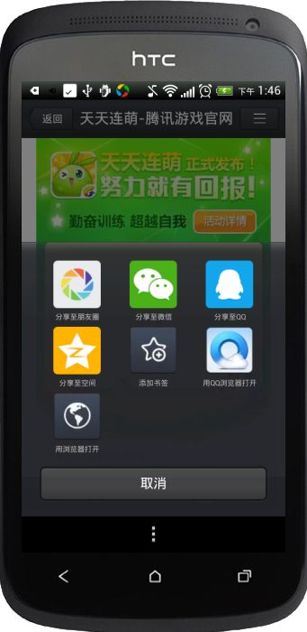

MSDK 内蔵ブラウザ関連モジュール
======
MSDKは内蔵ブラウザに対応し、この内蔵Webviewはセキュリティ、パフォーマンスなどでシステムの内蔵Webviewより優れています。このWebviewではQQ及びウィーチャットへの共有機能を提供しています。ゲーム内でマーケティングイベントのページ、フォーラム、ストラテジーなどのWebページを表示する時、内蔵ブラウザの接続は2つの手順を必要とします。

接続配置
------
MSDK2.0.0a以前では次の方式で配置します。

    <activity
       android:name="com.tencent.mtt.spcialcall.SpecialCallActivity"
       android:configChanges="orientation|keyboardHidden|navigation|fontScale|locale|screenSize"
       android:screenOrientation="unspecified"
       android:theme="@style/ThrdCallActivity"
       android:exported="false"
       android:windowSoftInputMode="adjustPan" >
    <intent-filter>
       <action android:name="com.tencent.QQBrowser.action.VIEWLITE" />
       <category android:name="android.intent.category.DEFAULT" />
       <category android:name="android.intent.category.BROWSABLE" />
       <data android:scheme="http" />
       <data android:scheme="https" />
       <data android:scheme="file" />
    </intent-filter>
    </activity>
MSDK2.0.0a以降は次の方式で配置します。

    <activity
       android:name="com.tencent.msdk.webview.WebViewActivity"
       android:configChanges="orientation|screenSize|keyboardHidden|navigation|fontScale|locale"
       android:theme="@android:style/Theme.NoTitleBar"
       android:screenOrientation="unspecified"
       android:windowSoftInputMode="adjustPan">
    </activity>

内蔵ブラウザの横画面を始終に維持する必要がある場合、`android:screenOrientation="unspecified"`を次のように変更します。
`android:screenOrientation="landscape"`

内蔵ブラウザの縦画面を始終に維持する必要がある場合、`android:screenOrientation="unspecified"`を次のように変更します。
`android:screenOrientation="portrait"`

1.9.0バージョンにアップグレードした場合、1.9.0以前の配置を削除してから新しい配置を追加することができます。

ブラウザを開きます
------
WGOpenUrlインターフェースを呼び出し、URLを伝えると、SDKが提供するWebviewを利用できます。WGOpenUrlインターフェースの説明は次の通りです。

    /**
      *内蔵ブラウザを開きます。この内蔵Webviewはセキュリティ、パフォーマンスなど各方面でシステム内蔵のWebviewより優れています。携帯電話にQQブラウザをインストールしている場合、QQブラウザのコアを利用し、より優秀な性能を獲得できます。同時に内蔵ブラウザでQQとウィーチャットへの共有機能を提供します。..
      *@param openUrl表示するurl
      */
    void WGOpenUrl(unsigned char * openUrl);

呼び出しサンプルコードは次の通りです。

    WGPlatform::GetInstance()->WGOpenUrl(cOpenUrl);

展示効果は次の通りです。

 

パラメータの透明伝送の説明
------
###1、ログイン状態の暗号化伝送
ゲームにログインし、内蔵ブラウザでページにアクセスする時、暗号化後のログイン状態パラメータを付けます。具体的なやり方は次の通りです。

1.MSDKはこれらのパラメータを暗号化し、ページに伝えます。

2. ページは暗号文を取得してから、MSDKバックグラウンドの復号化インターフェースを呼び出し、明文を取得します。

3. 明文のTokenでログインを確認します。

###2、被暗号化のデータ
下表のログイン状態パラメータを暗号化します。

MSDKはURLの後に次のようなパラメータを付けます。__復号化の失敗を避けるために重複のパラメータを伝えないでください。

###3、例を挙げて説明
ブラウザでURL：http：//apps.game.qq.com/ams/gac/index.htmlを表示する場合、キャプチャしたパケットから、次のURLにアクセスしたことが分かります。

`http://apps.game.qq.com/ams/gac/index.html?sig=***&timestamp=**&appid=***&openid=***&algorithm=v1&msdkEncodeParam=***&version=1.6.2i&encode=1`

その中、msdkEncodeParam で伝送するのは、下記のパラメータを暗号化した暗号文（url encode）です。

`acctype=weixin&appid=100732256&openid=ol7d0jsVhIm3BQwlNG9g2f4puyUg&access_token=OezXcEiiBSKSxW0eoylIeCKi7qrm-
vXrr62qKiSw2otDBgCzzKZZfeBOSv9fplYsIPD844sNIDeZgG3IyarYcGCNe8XuYKHncialLBq0qj9-rVGhoQVkgSYJ8KXr9Rmh8IvdqK3zsXryo37sMJAa9Q&platid=0`

ログイン状態の暗号化・復号化
------
###1、どのように復号化しますか
サービスページで上述のURLを取得し、リクエストを構成し、MSDK復号化インターフェースを呼び出します。現在、復号化インターフェースには2種類のパレメータ伝送方案があり、サービス・バックグラウンドはalgorithmパラメータにより実現し、２種類の暗号化パラメータ伝送方案を実現する必要があります。

1、	MSDK1.8.1a以降、暗号化パレメータの伝送方案は次の通りです。（ここのURLはMSDKのテスト環境です）

`http://msdktest.qq.com/comm/decrypv1/?sig=***&timestamp=**&appid=***&openid=***&algorithm=v2&version=1.8.1i&encode=1`

ステップ１で取得したmsdkEncodeParam の暗号文をPost方式でbodyに入れ、Post方式で伝送します。key「msdkEncodeParam=」を付けないことを注意してください。。

2、MSDK1.8.1a以前のバージョンでは、暗号化パレメータの伝送方案は次の通りです。（端末ではこの方案を使わなくなりますが、古いバージョンとの互換性のために、バックグラウンドで実現する必要があります。）

`http://msdktest.qq.com/comm/decrypv1/?sig=***&timestamp=**&appid=***&openid=***&algorithm=v1&version=1.6.2i&encode=1`
 
msdkEncodeParam の暗号文URL Decodeをbodyに入れ、Post方式で伝送します。key「msdkEncodeParam=」を付けないことを注意してください。キャプチャパケットは次の通りです。

###2、暗号文の復号化コードのサンプル（phpバージョン）

###3、暗号文の復号化コードのサンプル（Cコード）
1、次のファイルUrlCoding.hを導入します

    #ifndef URL_H
    #define URL_H

    #ifdef __cplusplus
       extern "C" {
          #endif
    
          int php_url_decode(const char *str, int len, char *out, int *outLen);
          char *php_url_encode(char const *s, int len, int *new_length);
          int php_url_decode_special(const char *str, int len, char *out, int *outLen);
    
          #ifdef __cplusplus
       }
    #endif

    #endif /* URL_H */

2、次のファイルUrlCoding.cを導入します

    #include <stdlib.h>
    #include <string.h>
    #include <ctype.h>
    #include <sys/types.h>
    #include <stdio.h>
    #include "UrlCoding.h"
    
    static unsigned char hexchars[] = "0123456789ABCDEF";
    
    static int php_htoi(const char *s)
    {
        int value;
        int c;
        
        c = ((unsigned char *)s)[0];
        if (isupper(c))
            c = tolower(c);
        value = (c >= '0' && c <= '9' ? c - '0' : c - 'a' + 10) * 16;
        
        c = ((unsigned char *)s)[1];
        if (isupper(c))
            c = tolower(c);
        value += c >= '0' && c <= '9' ? c - '0' : c - 'a' + 10;
        
        return (value);
    }
    
    
    char *php_url_encode(char const *s, int len, int *new_length)
    {
        register unsigned char c;
        unsigned char *to, *start;
        unsigned char const *from, *end;
        
        from = (unsigned char *)s;
        end  = (unsigned char *)s + len;
        start = to = (unsigned char *) calloc(1, 3*len+1);
        
        while (from < end)
        {
            c = *from++;
            
            if (c == ' ')
            {
                *to++ = '+';
            }
            else if ((c < '0' && c != '-' && c != '.') ||
                     (c < 'A' && c > '9') ||
                     (c > 'Z' && c < 'a' && c != '_') ||
                     (c > 'z'))
            {
                to[0] = '%';
                to[1] = hexchars[c >> 4];
                to[2] = hexchars[c & 15];
                to += 3;
            }
            else
            {
                *to++ = c;
            }
        }
        *to = 0;
        if (new_length)
        {
            *new_length = to - start;
        }
        return (char *) start;
    }
    
    
    int php_url_decode(const char *str, int len, char *out, int *outLen)
    {
        const char *data = str;
        char *orgOut = out;
        while (len--)
        {
            if (*data == '+')
            {
                *out = ' ';
            }
            else if (*data == '%' && len >= 2 && isxdigit((int) *(data + 1)) && isxdigit((int) *(data + 2)))
            {
                *out = (char) php_htoi(data + 1);
                data += 2;
                len -= 2;
            }
            else
            {
                *out = *data;
            }
            data++;
            out++;
        }
    //  *out = '/0';
        *outLen = out - orgOut;
        return *outLen;
    }
    
    //特にWGCommonMethods.hのencodeForURLのために実現する復号化メソッド  haywoodfu 2014-04-23
    int php_url_decode_special(const char *str, int len, char *out, int *outLen)
    {
        const char *data = str;
        char *orgOut = out;
        while (len--)
        {
            if (*data == '+')
            {
                *out = ' ';
            }
            else if (*data == '%' && len >= 2 && isxdigit((int) *(data + 1)) && isxdigit((int) *(data + 2)))
            {
                int value = 0;
                sscanf((data+1), "%2x", &value);
                *out = (char) value;
                data += 2;
                len -= 2;
            }
            else
            {
                *out = *data;
            }
            data++;
            out++;
        }
    //  *out = '/0';
        *outLen = out - orgOut;
        return *outLen;
    }

3、	伝えてきた文字列encodeParamをphp_url_decodeとphp_url_decode_specialで復号化し、暗号文を獲得します。

