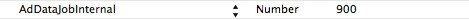

広告
===

##概説
 - この機能は2.1.0バージョン以降に提供されます。ゲームはinfoに次の配置を追加し、広告データの定時表示を行う必要があります。


---

##広告インターフェース
 - WGShowADを呼び出し、MSDKの配置した画面で現在有効の公告を表示します。WGHideScrollNoticeを呼び出し、展示中のスクロール公告を不表示にします。
```ruby
 void WGPlatform::WGShowAD(const _eADType& scene) const;
```
>記述:指定sceneで現在有効の公告を表示します。パラメータtypeでどの公告を展示するか決めます。次の通りです。
```ruby
typedef enum _eADType
{
   Type_Pause  = 1, // 一時停止箇所の広告
Type_Stop = 2, // 終了箇所の広告
}eADType;
```
iOSでは現在、Type_Pauseだけを利用します（一時停止箇所の広告）。
パラメータ: 
  - Type　展示する広告種類

 - 
```ruby
void WGCloseAD (const _eADType& scene);
```
>記述:展示中の広告を不表示にします
注：広告展示画面のボタンはAdvertisementConfig.plistでカスタマイズされます。Plistでボタン数、画像とtagを配置します。このtagはユーザーによってクリックされると、ゲームにコールバックされます。このplistファイルはframework/Resources/ AdvertisementResourcesの対応サブディレクトリーにあります。テンプレート元素と定義の詳細説明は付録Gを参照してください。

---
##サンプルコード
 -公告データリストを取得するためのインターフェース呼び出しのコードサンプル：
```ruby
WGPlatform *plat = WGPlatform::GetInstance();
plat->WGShowAD(Type_Pause);
```

 -「Get Started-Step5」に従って、WGAdObserverを設定した後、ユーザーによるボタンクルックのイベントはobserverのOnADNotify関数にコールバック在されます。サンプルコードは次の通りです。
```ruby
void MyAdObserver::OnADNotify(ADRet& adRet) 
{
NSString *string = [NSString stringWithCString:(const char*)adRet.viewTag.c_str() encoding:NSUTF8StringEncoding];
    NSLog(@"btn tag == %@",string);
    
    WGPlatform *plat = WGPlatform::GetInstance();
    plat->WGCloseAD(Type_Pause);
}
```

