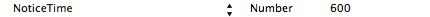

公告
===

##概説
 - この機能は1.6.1バージョン以降に提供されます。公告は2種類のインターフェースを提供しています。1.6.2バージョンの公告はまだテスト段階にあるため、ゲームはこれを利用しないでください。ゲームはinfoに配置を追加して公告機能をオフにする必要があります。公告機能を利用する場合、YESと設定します。下図の通りです。

 - 2.0.1i以後のバージョンは公告データの定時表示機能に対応します。Infoでは次の項目を配置する必要があります。

---

## MSDKによる画面表示の公告インターフェース
 - WGShowNoticeを呼び出し、MSDKの配置した画面で現在有効の公告を表示します。WGHideScrollNoticeを呼び出し、表示中のスクロール公告を不表示にします。
```ruby
Void WGShowNotice (eMSG_NOTICETYPE type, unsigned char *scene);
```
>記述: 現在、指定sceneの有効な公告を表示します。次のように、パラメータtypeでどの種類の公告を確定します。
```
typedef enum _eMSG_NOTICETYPE
{
	//全ての公告種類
eMSG_NOTICETYPE_ALL = 0,
//ポップアップ公告
eMSG_NOTICETYPE_ALERT,
//スクロール公告
    eMSG_NOTICETYPE_SCROLL,
}eMSG_NOTICETYPE;
```
パラメータ: 
1、Type　表示する公告の種類です
2、scene 公告シーンID、空白にすることができません。このパラメータは公告管理側の「掲示板」に対応し、公告欄の作成に有効な公告表示だけを取ります。
 - 
```ruby
void WGHideScrollNotice ();
```
>記述: 表示中のスクロール公告を不表示にします
注：公告の表示画面はplistで設定されます。現在、ポップアップ公告には、「下地白、下地青、下地黒、自己定義」など4種類のテンプレートがあり、これらのテンプレート及び対応のリソースファイルがWGPlatformResources.bundle/AnnouncementResources配下のサブディレクトリーにあります。テンプレートの要素と定義は付録Fを参照してください。

---

##公告データリストのインターフェース
```ruby
std::vector<NoticeInfo> WGGetNoticeData(eMSG_NOTICETYPE type,unsigned char *scene);
```
>記述: 現在、指定sceneの有効な公告を表示します。次のように、パラメータtypeでどの種類の公告を確定します。
```ruby
typedef enum _eMSG_NOTICETYPE
{
	//全ての公告種類
eMSG_NOTICETYPE_ALL = 0,
//ポップアップ公告
eMSG_NOTICETYPE_ALERT,
//スクロール公告
    eMSG_NOTICETYPE_SCROLL,
}eMSG_NOTICETYPE;
```
パラメータ: 
2、Type表示する公告の種類です。
3、scene告シーンID、空白にすることができません。このパラメータは公告管理側の「掲示板」に対応し、公告欄の作成に有効な公告表示だけを取ります。
戻り：
1、NoticeInfoのアレイで、NoticeInfo構造は次の通りです。
```ruby
typedef struct
{
    std::string msg_id; //公告id
    std::string open_id; //ユーザーopen_id
    std::string msg_content; //公告内容
    std::string msg_title; //公告タイトル
  std::string msg_url; //公告からのリンク先
  eMSG_NOTICETYPE msg_type; //公告の種類，eMSG_NOTICETYPE
  std::string msg_scene; //公告表示のシーン、管理側のバックグラウンドで配置します
  std::string start_time; //公告の有効期間の開始時間
  std::string end_time; //公告の有効期間の終了時間
std::string content_url; //ウェブページ公告url
std::vector<PicInfo> picArray; //画像公告の画像データ
}NoticeInfo; 
typedef struct
{
eMSDK_SCREENDIR screenDir;      //横画面・縦画面   1：横画面 2：縦画面
    std::string picPath;    //画像のローカルパス
    std::string hashValue;  //画像のhash値
}PicInfo; 
```

---

## サンプルコード
 -公告データリスト取得インターフェースの呼び出しのサンプルコード：
```ruby
WGPlatform *plat = WGPlatform::GetInstance();
std::vector<NoticeInfo> vec = plat->WGGetNoticeData(eMSG_NOTICETYPE_ALERT, (unsigned char *)[scene UTF8String]);
            for (int i = 0; i < vec.size(); i++) {
                NoticeInfo info = vec[i];
                NSLog(@"NoticeInfo msgID: %@\nNoticeInfo msgTitle:%@\nNoticeInfo msgContent:%@",
                [NSString stringWithUTF8String: info.msg_id.c_str()],
                [NSString stringWithUTF8String: info.msg_title.c_str()],
                [NSString stringWithUTF8String: info.msg_content.c_str()]);
            }
```
## FAQ
 -リソースファイルを正確に導入しないことでCrashをもたらします。
	MsdkReources.bundleをエンジニアリングの「Copy Bundle Resources」に正確に導入しないと、公告表示の時にcrashが発生します。

 - AppDelegate(AppController)でwindow属性を作成しないと、公告を呼び出す時にcrashが発生します。	
	[AppController window]: unrecognized selector sent to instance 0x17fa7130
	解決方法： AppDelegate(AppController)ではwindowのpropertyを追加し、作成したkeywindowに指向します。

