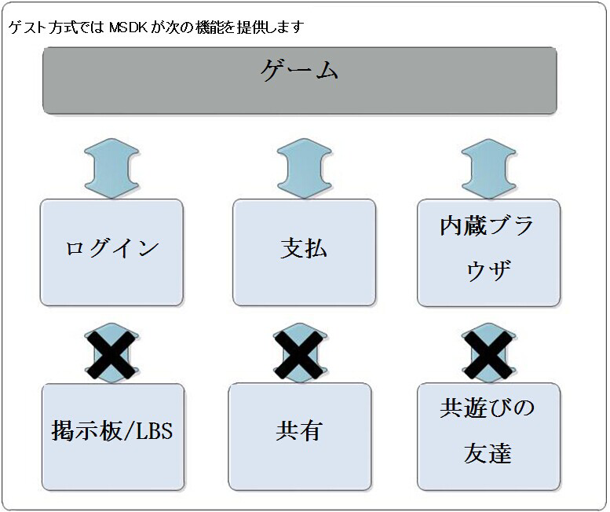
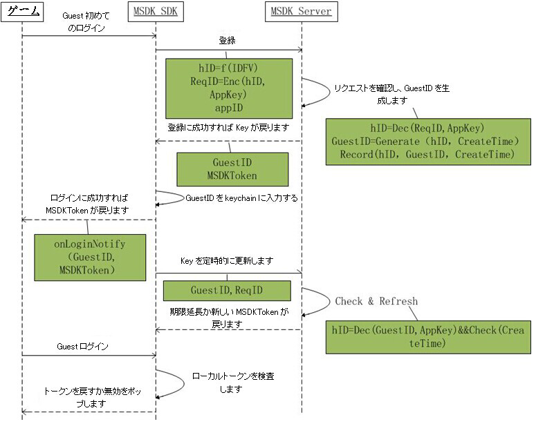
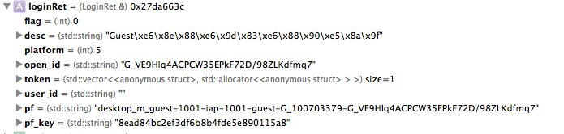

Guestモード
===

##次の内容と機能があります。 
 - MSDK Guestモードでは、MSDKの機能を次の通り割愛します。

---

##ログインのシーケンス
 - Guestモードでは、ログインは登録とログインの2つのシーケンスに分けられます。但し、これら2つのシーンの差別はMSDKにマスクされているため、ゲームはその違いを考える必要がありません。ここで方案を説明します。

---

##プロセス比較
 - OpenID体系とGuestモードのプロセス比較：

---

##必要な変更
###Step1: どのようにして、Guestモードでログインしますか。
-下記のコードを呼び出します。
```ruby
WGPlatform* plat = WGPlatform::GetInstance();
    //先ずOBを設定してください。
    MyObserver* ob = new MyObserver();
    plat->WGSetObserver(ob);
    plat->WGSetPermission(eOPEN_ALL);
    plat->WGLogin(ePlatform_Guest);
```

- 2.4.0i以降は、delegate方式を利用できます。コードは次の通りです。
```
[MSDKService setMSDKDelegate:self];
MSDKAuthService *authService = [[MSDKAuthService alloc] init];
[authService setPermission:eOPEN_ALL];
[authService login:ePlatform_Guest];
```

###Step2:onLoginNotifyコールバック
 - onLoginNotifyで戻ったLoginRetは次の通りです。 
 
登録エラー（eFlag_Guest_RegisterFailed）が戻る場合、WGResetGuestIDを呼び出してから、改めて登録リクエストを出してください[フォールトトレランス・メカニズムの追加]。登録に成功した後、取得したGuestIDがKeychainに書き込まれ、Appを削除してから再インストールしても、ゲストの進捗も失われません。

- - 2.4.0i以降は、delegate方式でコールバックします。コードは次の通りです。
```
-(void)OnLoginWithLoginRet:(MSDKLoginRet *)ret
{
    //内部の実現ロジックはvoid MyObserver::OnLoginNotify(LoginRet& loginRet)と同じです
}
```

###Step3: どのようにして支払いますか
 -従来と同じで、registerPay->payを実行します。パラメータは少し違いがあり、session_idとsession_typeの値に注意してください。
```ruby
registerPay：
 WGPlatform* plat = WGPlatform::GetInstance();
    if (!plat->WGIsSupprotIapPay())
    {
        NSLog(@"iap支払に対応しません");
        return;
    }
    
    LoginRet ret;
    int retCode = plat->WGGetLoginRecord(ret);
    //    plat->WGRegisterPay();
    std::string openid = ret.open_id;
    std::string paytoken;    
    std::string sessionId;
    std::string sessionType;    
    if (retCode == ePlatform_Guest)
    {
        for(int i=0;i<ret.token.size();i++)
        {
            TokenRet* pToken = &ret.token[i];
            if(pToken->type == eToken_Guest_Access)
            {
                paytoken = pToken->value;
                break;
            }
        }
        sessionId = "hy_gameid";
        sessionType = "st_dummy";
    }
    std::string pf = plat->WGGetPf();
    std::string pfKey = plat->WGGetPfKey();    
    plat->WGRegisterPay(
                        ((unsigned char*)"1450000495"),
                        (unsigned char *)openid.c_str(),
                        (unsigned char *)paytoken.c_str(),
                        (unsigned char *)sessionId.c_str(),
                        (unsigned char *)sessionType.c_str(),
                        NULL
                        );
Pay：
    WGPlatform* plat = WGPlatform::GetInstance();
    if (!plat->WGIsSupprotIapPay())
    {
        NSLog(@"iap支払に対応しません");
        return;
    }
    LoginRet ret;
    int retCode = plat->WGGetLoginRecord(ret);
    std::string openid = ret.open_id;
    std::string paytoken;
    
    std::string sessionId;
    std::string sessionType;
    if (retCode == ePlatform_Guest)
    {
        for(int i=0;i<ret.token.size();i++)
        {
            TokenRet* pToken = &ret.token[i];
            if(pToken->type == eToken_Guest_Access)
            {
                paytoken = pToken->value;
                break;
            }
        }
        sessionId = "hy_gameid";
        sessionType = "st_dummy";
    }
    
    std::string pf = "desktop_m_qq-10001-iap-10001";//plat->WGGetPf();
    std::string pfKey = "abcdefg";//plat->WGGetPfKey();
    
    plat->WGSetIapEnvirenment((unsigned char*)"test");// test ではサンドボックス環境を設定し、release では実網環境を設定します。 [注釈の補足]
    unsigned char * payItem = (unsigned char*)PayPayitem;
    unsigned char * productId = (unsigned char*)PayProductid;
    
    bool isDepositGameCoin = true;
    uint32_t productType = 0;
    uint32_t quantity = 1;
    unsigned char * zoneId = (unsigned char*)"1";
    unsigned char * varItem = (unsigned char*)"com.lightspeed.weshoothd.600*1";
    
    MyObserver* ob = new MyObserver();
    plat->WGSetObserver(ob);
    
    plat->WGSetIapEnalbeLog(true);
    
    plat->WGPay(
                ((unsigned char*)"1450000495"),
                (unsigned char *)openid.c_str(),
                (unsigned char *)paytoken.c_str(),
                (unsigned char *)sessionId.c_str(),
                (unsigned char *)sessionType.c_str(),
                payItem, productId,
                isDepositGameCoin, productType,
                quantity,
                zoneId,
                varItem,
                (unsigned char*)"dsafasdfa"
                ); 
```

###Step4: 呼び出し不可の関数を呼び出した場合
 - 	相応のコールバックではeFlag_InvalidOnGuestを戻します。

###Step5: どのようにして、Guestアカウントをリセットしますか
 - 	GameServerでは関係データをクリアしてから、下記のコードを呼び出し、MSDKの端末に残されたGuestアカウントデータをクリアできます。次回にGuestモードでログインする場合、新しいGuestアカウントを生成します。
```ruby
WGPlatform* plat = WGPlatform::GetInstance();
plat->WGResetGuestID();
```

- 2.4.0i以降は、delegate方式を利用できます。コードは次の通りです。
```
[MSDKService setMSDKDelegate:self];
MSDKAuthService *authService = [[MSDKAuthService alloc] init];
[authService resetGuestId];
```

