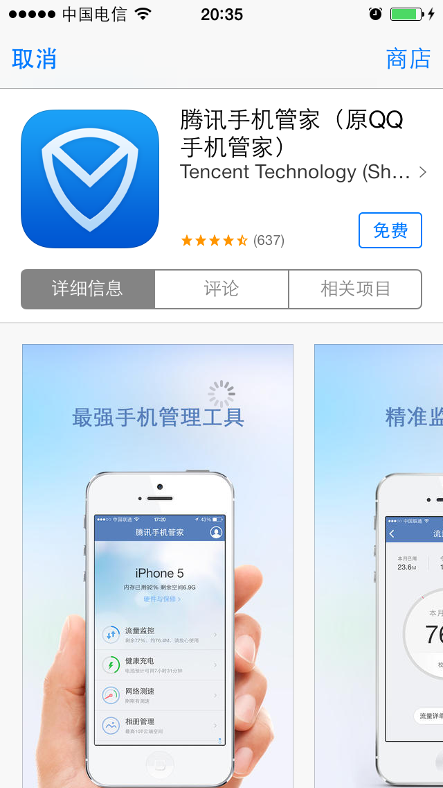

内蔵ブラウザ
===

##概説
 - この機能は1.6.1バージョン以降に提供され、XCode5.0以上のバージョンでコンバイルする必要があります。
次のコードを呼び出し、指定のurlを開きます。
```ruby
WGPlatform* plat = WGPlatform::GetInstance();
plat->WGOpenUrl((unsigned char*)[url UTF8String]);
```
	AMS販売イベントセンターを呼び出す必要がある場合、次のコードを呼び出します。
```ruby
WGPlatform* plat = WGPlatform::GetInstance();
plat->WGOpenAmsCenter(NULL);
```
---

##使用時の注意事項
 - ブラウザモジュールはxibを通じて画面をカスタマイズします。このxibはWGPlatformResources.bundle/ディレクトリーにあり、xibに使用するpngなどのリソースファイルはWGPlatformResources.bundle/WebViewResourcesディレクトリーにあります。iOS7.0と互換する必要があるため、Xcode5.0以降を必要とします。
 - モバイルQQ共有ではURL長さ512バイト以内を制限するため、長いリンクを短いリンクを転換する必要があります。
 - WGOpenAmsCenter()を呼び出して、AMSイベントセンターを開き、エンジニアリングのInfo.plistには次の項目を設定する必要があります（デフォルト値はhttp://apps.game.qq.com/ams/ame/gac.php?returntype=html ）：

---

##a.	ログイン状態パラメータの暗号化伝送
  - ### 全体プラン
ゲームにログインした場合、内蔵ブラウザを通じてウェブページにアクセスする時、暗号化後のログイン状態パラメータを付きます。次のように実現します。
1.MSDKはこれらパラメータを暗号化し、ページに伝えます。
2.ページは暗号文を獲得してから、MSDKバックグランドの複合化インターフェースを呼び出し、平文を獲得します。
3.明文のTokenでログインし確認します。

  - ### URLに含まれるパラメータ
  - MSDKはURLの後に次のパラメータを付加します。複合化の失敗を避けるために、重複のパラメータを伝えないでください。

|パラメータ名|	説明	|値|
|--|--|--|
|timestamp|	リクエストのタイムスタンプ||	
|appid |	ゲームID|	　|
|algorithm|	暗号化アルゴリズムの標識|	v1|
|msdkEncodeParam|	暗号文|	　|
|version|	MSDKのバージョン番号|	例えば1.6.2i|
|sig|	リクエストそのものの署名|	|
|encode|	エンコードのパラメータ|	1|
|openid|	ユーザーが授権した後、プラットフォームから戻る唯一標識 | | 

 
  - ###暗号化データ
  -暗号化するログイン状態パラメータは下表の通りです。

|パラメータ名|	説明|	値|
|--|--|--|
|acctype |	アカウントタイプ|	qq/wx|
|appid 	|ゲームID	　||
|openid |	ユユーザーが授権した後、プラットフォームから戻る唯一標識||
|access_token|	ユーザーの授権トークン|	　|
|platid 	|端末の種類|	0.iOS；1.Android|
 
    
   -例を挙げて説明すると、内蔵ブラウザで表示するURLがhttp://apps.game.qq.com/ams/gac/index.htmlの場合、パケットキャプチャで解析すると、実際にアクセスするURLは次のようになります。
http://apps.game.qq.com/ams/gac/index.html?sig=***&timestamp=**&appid=***&openid=***&algorithm=v1&msdkEncodeParam=***&version=1.6.2i&encode=1 
   - その中、msdkEncodeParam で伝送するのは、次のパラメータで暗号化した暗号文（url encode）です。
acctype=weixin&appid=100732256&openid=ol7d0jsVhIm3BQwlNG9g2f4puyUg&access_token=OezXcEiiBSKSxW0eoylIeCKi7qrm-
vXrr62qKiSw2otDBgCzzKZZfeBOSv9fplYsIPD844sNIDeZgG3IyarYcGCNe8XuYKHncialLBq0qj9-rVGhoQVkgSYJ8KXr9Rmh8IvdqK3zsXryo37sMJAa9Q&platid=0

- ### どのように復号化しますか
- サービスページでは前記のURLを取得し、MSDK復号化インターフェースを呼び出します。現在、復号化インターフェースには2種類のパラメータ伝送の方法があり、サービスバックグラウンドはalgorithmパラメータにより、2種類の暗号かパラメータ伝送方法を実現し、互換性を満足する必要があります。
- MSDK1.7.1i以降、暗号化のパラメータ伝送の方法は次の通りです。（以下のURLはMSDKのテスト環境です）
http://msdktest.qq.com/comm/decrypv1/?sig=***&timestamp=**&appid=***&openid=***&algorithm=v2&version=1.7.1i&encode=1
	ステップ１で獲得したmsdkEncodeParam の暗号文をPostの方式でbodyに入れ、Post方式で伝送します。key“msdkEncodeParam=” を付けないように注意してください。
- MSDK1.7.1i以前のバージョンでは、暗号化のパラメータ伝送の方法は次の通りです。（端末ではこの方案を既に利用しなくなりましたが、古いバージョンとの互換性のために、バックグラウンドで実現する必要があります）
http://msdktest.qq.com/comm/decrypv1/?sig=***&timestamp=**&appid=***&openid=***&algorithm=v1&version=1.6.2i&encode=1 
将msdkEncodeParam の暗号文URL Decodeをbodyに入れ、Post方式で伝送します。key“msdkEncodeParam=”を付けないように注意してください。パケットキャプチャは次の通りです。

- ###復号化のコードサンプル（phpバージョン）
- コードサンプル：
```php
<?php
//var_dump($argv);
$getparam = urldecode($argv[1]);
$postparam = $argv[2];
$algorithm = $argv[3];
//$sUrl = "http://msdktest.qq.com/comm/decrypv1/?" . $getparam;
$sUrl = "http://msdktest.qq.com/comm/decrypv1/?" . $getparam;
//var_dump($sUrl);
//var_dump($postparam);
$curl  =  curl_init();
curl_setopt( $curl, CURLOPT_URL, $sUrl );
curl_setopt( $curl, CURLOPT_RETURNTRANSFER,1 );
curl_setopt( $curl, CURLOPT_CUSTOMREQUEST, "POST" );
$str = $algorithm == "v2" ? $postparam : urldecode(urldecode($postparam));
curl_setopt( $curl, CURLOPT_POSTFIELDS, $str );
try{
	$data = curl_exec($curl);
} catch ( exception $e ){
	print $e->getMessage().$sUrl;
}
curl_close($curl);
print $data;
?>
```
- ###復号化のコードサンプル（Cコード）：
1.下記の2つのファイルを導入します。

```ruby
#ifndef URL_H
#define URL_H

#ifdef __cplusplus
extern "C" {
#endif
    int php_url_decode(const char *str, int len, char *out, int *outLen);
    char *php_url_encode(char const *s, int len, int *new_length);
    int php_url_decode_special(const char *str, int len, char *out, int *outLen);
#ifdef __cplusplus
}
#endif
#endif /* URL_H */
```
- 
```ruby
#include <stdlib.h>
#include <string.h>
#include <ctype.h>
#include <sys/types.h>
#include <stdio.h>
#include "UrlCoding.h"
static unsigned char hexchars[] = "0123456789ABCDEF";
static int php_htoi(const char *s)
{
	int value;
	int c;
    
	c = ((unsigned char *)s)[0];
	if (isupper(c))
		c = tolower(c);
	value = (c >= '0' && c <= '9' ? c - '0' : c - 'a' + 10) * 16;
    
	c = ((unsigned char *)s)[1];
	if (isupper(c))
		c = tolower(c);
	value += c >= '0' && c <= '9' ? c - '0' : c - 'a' + 10;
    
	return (value);
}
char *php_url_encode(char const *s, int len, int *new_length)
{
	register unsigned char c;
	unsigned char *to, *start;
	unsigned char const *from, *end;
	
	from = (unsigned char *)s;
	end  = (unsigned char *)s + len;
	start = to = (unsigned char *) calloc(1, 3*len+1);
    
	while (from < end)
	{
		c = *from++;
        
		if (c == ' ')
		{
			*to++ = '+';
		}
		else if ((c < '0' && c != '-' && c != '.') ||
				 (c < 'A' && c > '9') ||
				 (c > 'Z' && c < 'a' && c != '_') ||
				 (c > 'z'))
		{
			to[0] = '%';
			to[1] = hexchars[c >> 4];
			to[2] = hexchars[c & 15];
			to += 3;
		}
		else
		{
			*to++ = c;
		}
	}
	*to = 0;
	if (new_length)
	{
		*new_length = to - start;
	}
	return (char *) start;
}
int php_url_decode(const char *str, int len, char *out, int *outLen)
{
    const char *data = str;
    char *orgOut = out;
	while (len--)
	{
		if (*data == '+')
		{
			*out = ' ';
		}
		else if (*data == '%' && len >= 2 && isxdigit((int) *(data + 1)) && isxdigit((int) *(data + 2)))
		{
			*out = (char) php_htoi(data + 1);
			data += 2;
			len -= 2;
		}
		else
		{
			*out = *data;
		}
		data++;
		out++;
	}
//	*out = '/0';
    *outLen = out - orgOut;
	return *outLen;
}
//特にWGCommonMethods.hのencodeForURLのために実現する復号化メソッド  haywoodfu 2014-04-23
int php_url_decode_special(const char *str, int len, char *out, int *outLen)
{
    const char *data = str;
    char *orgOut = out;
	while (len--)
	{
		if (*data == '+')
		{
			*out = ' ';
		}
		else if (*data == '%' && len >= 2 && isxdigit((int) *(data + 1)) && isxdigit((int) *(data + 2)))
		{
            int value = 0;
            sscanf((data+1), "%2x", &value);
			*out = (char) value;
			data += 2;
			len -= 2;
		}
		else
		{
			*out = *data;
		}
		data++;
		out++;
	}
//	*out = '/0';
    *outLen = out - orgOut;
	return *outLen;
}
```

2.伝えてきた文字列encodeParamを前後にphp_url_decodeとphp_url_decode_specialで復号化し、暗号文を獲得します。


---


## Appインストール済みの判断
-ページには次のようなJSコードを追加して、ページで対応するAppをインストールしたか判断できます。
```
document.addEventListener('WebViewJavascriptBridgeReady', onBridgeReady, false)
function onBridgeReady(event) {
var bridge = event.bridge
bridge.init(function(message, responseCallback) {
var data = { 'Javascript Responds':'Wee!' }
responseCallback(data)
})
bridge.callHandler('getInstallState', {'packageName':'com.tencent.news','packageUrl' :'qqnews://can_open_me_if_install_and_regeister_this_scheme'
}, function(msg) {
if(msg.indexOf("get_install_state:yes") > -1) {
log("install :テンセントニュース");} 
else {
log("not install :テンセントニュース");
}
})
```

---

##アプリ内部でApp Store詳細ページの表示
（iOS6.0以降）下図のように、ページのitunesリンク（http://itunes.apple.com/cn/app/id439638720?mt=8）をクリックすると、アプリでこのアプリのAppStore詳細ページを表示できます。


---

##共有
下図のように、「共有」ボタンをクリックすると、現在のページをmoments、QZone、ウィーチャット友達、QQ友達に共有できます。ご注意：モバイルQQ共有のURLは最大512バイトですから、URLが比較的に長い場合、短いリンクを利用してください。


---

##AMS販促イベントセンターの運行
 - WGOpenAmsCenterインターフェースを呼び出し、AMS販売イベントセンターを運行できます。イベントセンターのURLはinfo.plistのAMS_URL項に配置されています。
```ruby
eFlag WGOpenAmsCenter(unsigned char* params);
```
>記述: 打开AMS販売イベントセンター
パラメータ: 
paramsはURLの後に付けられたパラメータを伝えることができ、長さは256に制限され、形式は"key1=***&key2=***"とし、特殊文字をurlencodeする必要があります。URLに付けられた固定パラメータはMSDKと重複できません。リストは次の通りです。
パラメータ名	説明	値
  - timestamp	リクエストのタイムスタンプ	
  - appid 	ゲームID	　
  - algorithm	暗号化アルゴリズムの標識	v1
  - msdkEncodeParam	暗号文	　
  - version	MSDKバージョン番号	例えば1.6.2i
  - sig	リクエストそのものの署名	
  - encode	エンコードのパラメータ	1
戻り：
  - eFlagの戻り値で、通常の場合eFlag_Succを戻します。Paramsが長すぎると、eFlag_UrlTooLongを戻します。

- 呼び出しのコードサンプル：
```ruby
WGPlatform *plat = WGPlatform::GetInstance();
plat->WGOpenAmsCenter((unsigned char*)"a=1&d=2");
```

