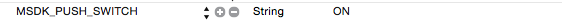

メッセージプッシュ
===

 > 2.2バージョンから、MSDKは伝書鳩プッシュに接続します   [伝書鳩公式サイト](http://xg.qq.com/)。

##概説

 -下図のように、info.plistではプッシュのスイッチを配置します。

既に伝書鳩プッシュと接続したゲームはMSDK2.3.0を更新する時、MSDKの伝書鳩プッシュを閉じたい場合、このスイッチを配置しないかOFFに設定してください。その他のゲームはMSDKの伝書鳩プッシュと接続したい場合、このスイッチをONに配置しなければなりません。

 - MSDK ios プッシュはApple社のAPNSに依存し、developer.apple.comでアプリのプッシュ機能をオンにする必要があります。また、プッシュ証書と署名ファイル(.mobileprovision)を作成する必要があります。
 - プッシュssl証書：MSDKはこの証書を用いて、アプリに対してプッシュメッセージを送信するため、この証書及びパスワードをMSDKに提出する必要があります。dev.ied.comでこの証書を配置します
 - 署名ファイル：ゲーム運営の時、エンジニアリングBuild PhasesProvisioning Profileでこの署名ファイルを設定する必要があります。
 - ゲームはまた、UIApplicationDelegateでプッシュ関連の5つのメソッドを実現する必要があります。
>*ゲームはMSDKのプッシュ機能をテストする時、正式なプッシュ証書を用いて、AD Hoc 方式でパッケージングしてテストする必要があります。全量プッシュの方式でプッシュしないでください。*

```ruby
- (BOOL)application:(UIApplication *)application didFinishLaunchingWithOptions:(NSDictionary *)launchOptions;
- (void)application:(UIApplication *)application didRegisterForRemoteNotificationsWithDeviceToken:(NSData *)deviceToken;
- (void)application:(UIApplication *)application didFailToRegisterForRemoteNotificationsWithError:(NSError *)error;
- (void)application:(UIApplication *)application didReceiveRemoteNotification:(NSDictionary *)userInfo;
- (void)applicationDidBecomeActive:(UIApplication *)application;
```

##登録プッシュ
 - 概説の署名ファイルを精確に配置してからこそ、登録プッシュを実現できます。
ゲームはdidFinishLaunchingWithOptionsメソッドでMSDKのWGRegisterAPNSPushNotificationメソッドを呼び出し、プッシュ登録を行う必要があります。
コードサンプル：
```ruby
- (BOOL)application:(UIApplication *)application didFinishLaunchingWithOptions:(NSDictionary *)launchOptions{
    …
    WGPlatform* plat = WGPlatform::GetInstance();
    plat->WGRegisterAPNSPushNotification(launchOptions);
    …
} 
```

- 2.4.0i以降のバージョンは次の方式を採用することもできます。
```
-(BOOL)application:(UIApplication *)application didFinishLaunchingWithOptions:(NSDictionary *)launchOptions{
…
[MSDKXG WGRegisterAPNSPushNotification:launchOptions];
…
}
```

---

##登録成功
 - 登録に成功した場合、ゲームはdidRegisterForRemoteNotificationsWithDeviceTokenのコールバック・メソッドを受信します。ゲームはこのメソッドでWGSuccessedRegisterdAPNSWithTokenメソッドを呼び出し、deviceTokenをMSDKに報告する必要があります。
コードサンプル：
```ruby
- (void)application:(UIApplication *)application didRegisterForRemoteNotificationsWithDeviceToken:(NSData *)deviceToken{
    WGPlatform *plat = WGPlatform::GetInstance();
    plat->WGSuccessedRegisterdAPNSWithToken(deviceToken);
} 
```

- 2.4.0i以降のバージョンは次の方式を採用することもできます。
```
-(void)application:(UIApplication *)application didRegisterForRemoteNotificationsWithDeviceToken:(NSData *)deviceToken
{
…
[MSDKXG WGSuccessedRegisterdAPNSWithToken:deviceToken];
…
}
```

---

##登録失敗
 - 登録に失敗した場合、ゲームはdidFailToRegisterForRemoteNotificationsWithErrorのコールバック・メソッドを受信します。ゲームはWGFailedRegisteredAPNSメソッドを呼び出し、MSDKに登録プッシュの失敗を通知する必要があります。
サンプルコード：
```ruby
- (void)application:(UIApplication *)application didFailToRegisterForRemoteNotificationsWithError:(NSError *)error{
    WGPlatform *plat = WGPlatform::GetInstance();
    plat->WGFailedRegisteredAPNS();
} 
```

- 2.4.0i以降のバージョンは次の方式を採用することもできます。
```
-(void)application:(UIApplication *)application didFailToRegisterForRemoteNotificationsWithError:(NSError *)error
{
…
[MSDKXG WGFailedRegisteredAPNS];
…
}
```

---


##メッセージ受信
 -登録プッシュに成功してから、アプリはプッシュメッセージを受信すると、didReceiveRemoteNotificationメソッドに入ります。ゲームはこのメソッドでWGReceivedMSGFromAPNSWithDictメソッドを呼び出し、プッシュメッセージをMSDKに提出して解析してもらい、解析結果をゲームに通知します。
サンプルコード：
```ruby
- (void)application:(UIApplication *)application didReceiveRemoteNotification:(NSDictionary *)userInfo{
    WGPlatform *plat = WGPlatform::GetInstance();
    plat->WGReceivedMSGFromAPNSWithDict(userInfo);
} 
```

- 2.4.0i以降のバージョンは次の方式を採用することもできます。
```
-(void)application:(UIApplication *)application didReceiveRemoteNotification:(NSDictionary *)userInfo
{
…
[MSDKXG WGReceivedMSGFromAPNSWithDict:userInfo];
…
}
```

---

##badgeクリア

 - アプリはapplicationDidBecomeActiveでWGCleanBadgeNumberメソッドを呼び出し、アプリアイコンの右上のプッシュ条項をクリアする必要があります。
サンプルコード：
```ruby
- (void)applicationDidBecomeActive:(UIApplication *)application{
    WGPlatform *plat = WGPlatform::GetInstance();
    plat->WGCleanBadgeNumber();
} 
```

- 2.4.0i以降のバージョンは次の方式を採用することもできます。
```
-(void)applicationDidBecomeActive:(UIApplication *)application
{
…
[MSDKXG WGCleanBadgeNumber];
…
}
```

