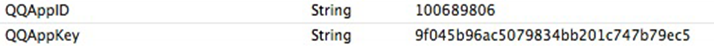
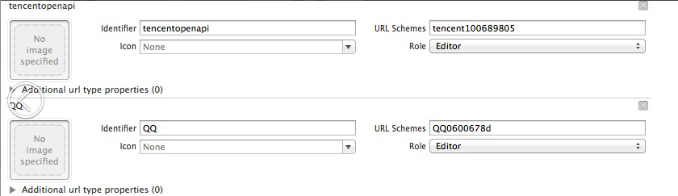
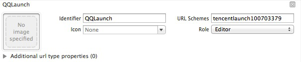

QQ接続
===

## 接続配置

  *エンジニアリングの設定した`Target->Info->Custom iOS Target Properties`で、配置項目を追加し、主な配置項目は次の通りです。

  
  
| Key      |    Type | Value  |備考|関連モジュール|
| :-------- | --------:| :-- |:--|:---:|
| QQAppID  | String |  ゲームにより異なる |モバイルQQのAppID|全て|
| QQAppKey  | String |  ゲームにより異なる |モバイルQQのAppKey|全て|
  
  *	エンジニアリングの設定した`Target->Info->URL Types`でURL Schemeを設定し、次の通り配置します。
    
	
  
| Identifier|    URL Scheme | サンプル  | 備考  |
| :-------- | :--------| :--: | :--: |
| tencentopenapi  | 形式：tencent+ゲームのQQAppID |tencent100703379|  モバイルQQ接続の時、記入しなければなりません。中間にはスペースがありません   |
| QQ  | 形式：QQ+ゲームのQQAppIDの16進数 |QQ06009C93 | モバイルQQ接続の時、記入しなければなりません。中間にはスペースがありません   |
| QQLaunch  | 形式：tencentlaunch+ゲームのQQAppID |tencentlaunch100703379|  モバイルQQ接続の時、記入しなければなりません。中間にはスペースがありません   |

   > **注：ゲームにより配置が異なります。詳細はゲームとMSDKの窓口、又はRTXで「MSDKホットライン」にお問合せください。**
 
 ---
## 授権ログイン
 ### 概説
 - モバイルQQクライアントを実行し、又はwebページで授権し、授権に成功した後、openId、accessToken、payToken (付録Aのトークン種類)、pfとpfKeyをゲームに戻します。
モバイルQQの授権を完成するには、WGSetPermissionとWGLoginインターフェースを呼び出す必要があります。
```
void WGSetPermission(unsigned int permissions);
```
>記述: QQログイン時にユーザー授権の権限リストを設定します
パラメータ:
- permissions　 WGQZonePermissionsには全ての権限の定義があります。必要な権限、又は演算の結果を選定して、このパラメータとします。

 - 
```
void WGLogin(ePlatform platform);
```
>記述: ログインの統一インターフェースで、_ePlatform. ePlatform_QQを伝送し、モバイルQQを呼び出して授権します。
パラメータ: 
  - _ePlatform. ePlatform_QQを伝送し、モバイルQQクライアントを呼び出して授権します
  -グローバル・コールバック対象が設定済みの場合、授権又は失敗はOnLoginNotify（LoginRet ret）を通じて、ゲームにコールバックされます。LoginRet.platformは現在の授権プラットフォームです。LoginRet.flagは授権結果を示します。
eFlag_Succ                     //成功
    eFlag_QQ_NoAcessToken         //モバイルQQ授権に失敗しました。accesstokenを取得しませんでした
    eFlag_QQ_UserCancel            //ユーザーがモバイルQQ授権をキャンセルしました
    eFlag_QQ_LoginFail             //モバイルQQ授権に失敗しました
    eFlag_QQ_NetworkErr           //ネットワーク異常


#### サンプルコード
- 授権の呼び出しコードは次の通りです。
```
WGPlatform* plat = WGPlatform::GetInstance();//MSDKの初期化
MyObserver* ob = new MyObserver();
plat->WGSetObserver(ob);//コールバックの設定
plat->WGSetPermission(eOPEN_ALL);//権限の設定
plat->WGLogin(ePlatform_QQ);//モバイルQQクライアントを呼び出し、又はwebで授権
```
- 授権コールバックコードは次の通りです。
```ruby
void MyObserver::OnLoginNotify(LoginRet& loginRet)
{
if(eFlag_Succ == loginRet.flag)
{
    …//login success
    std::string openId = loginRet.open_id;
    std::string payToken;
    std::string accessToken;
    if(ePlatform_QQ == loginRet.Platform)
    {
        for(int i=0;i< loginRet.token.size();i++)
        {
            TokenRet* pToken = & loginRet.token[i];
            if(eToken_QQ_Pay == pToken->type)
            {
                paytoken = pToken->value;
            }
            else if (eToken_QQ_Access == pToken->type)
{
     accessToken = pToken->value;
}
        }
    }
else if (ePlatform_Weixin == loginRet.platform)
{
        ….
}
} 
else
{
    …//login fail
     NSLog(@"flag=%d,desc=%s",loginRet.flag,loginRet.desc.c_str()); 
}
}
```
- 2.4.0i以降は、delegate方式を利用できます。コードは次の通りです。
```
[MSDKService setMSDKDelegate:self];
MSDKAuthService *authService = [[MSDKAuthService alloc] init];
[authService setPermission:eOPEN_ALL];
[authService login:ePlatform_QQ];
```
- コールバックコードは次の通りです。
```
-(void)OnLoginWithLoginRet:(MSDKLoginRet *)ret
{
    //内部の実現ロジックはvoid MyObserver::OnLoginNotify(LoginRet& loginRet)と同じです
}
```


####注意事項
- クライアント授権はモバイルQQバージョン4.0以降を必要とします
- モバイルQQをインストールしていない場合、又は配置エラーの場合、webで授権します。web授権はモバイルQQの内蔵webVeiwを起動して授権する必要があります。外部ブラウザを起動する場合、RTXで「MSDKホットライン」にお問合せください。
- URL Typesのscheme tencentopenapiを正確に配置してからこそ、モバイルQQクライアントによる授権を実行できます。
---
##快速ログイン
###概説
-モバイルQQのゲームリスト、又は共有リンクでは、モバイルQQのログイン済みのアカウント情報をゲームに伝送してログインを実現でき、ゲームの再授権をする必要がありません。

- 環境依存：
>1. MSDK 1.8.0i以降;
>2. モバイルQQ4.6.2以降;
>3. ゲーム配置のscheme：
	
- 成功すれば、ゲームを実行し、openId、accessToken、payToken (付録Aのトークン種類)、pfとpfKeyを付けます。

- 快速ログインと別アカウントの結果はwakeupRetのflagで戻ります。関連のflag説明は次の通りです。
```ruby
eFlag_Succ: 
別アカウントがなく、実行できました。この場合、AppのURLにはトークンがなく、前のバージョンと同じです。
eFlag_AccountRefresh: 
別アカウントがなく、MSDKはAppのURLに付けられたトークン情報を用いて、ローカルアカウントのトークンを更新しました。
eFlag_UrlLogin：
別アカウントがなく、ゲームは快速ログインの情報を用いて、ログインできました。ゲームはこのflagを受信してから、直接にLoginRet構造体のトークンを読み込み、ゲームの授権プロセスを実行します。
eFlag_NeedLogin：
ゲームのローカルアカウントも実行アカウントもログインできません。ゲームはこのflagを受信してから、ログインページを表示させ、ユーザーにログインしてもらいます。
eFlag_NeedSelectAccount：
ゲームのローカルアカウントと実行アカウントの間で別アカウントが存在します。ゲームはこのflagを受信してから、ダイアログボックスをポップアップさせ、ユーザーにログインするアカウントを選択させます。
flagがeFlag_NeedSelectAccountの場合、ゲームはダイアログボックスをポップアップさせ、ユーザーに元のアカウントか快速ログインのアカウントを選択してもらいます。これはモバイルQQプラットフォームで実現しなければならないロジックであり、このロジックを実現しないと、プラットフォーム審査の時、運営を拒絶されます。
```
メッセージのサンプル（画面はゲームによって実現されます）
	


- ユーザーが選択してから、WGSwitchUserインターフェースを呼び出し、別アカウントの後続ロジックを処理する必要があります。（2つのオプションは次のインターフェースを呼び出す必要があり、詳細はサンプルコードを参照してください）
```ruby
bool WGSwitchUser(bool flag);
```
>記述:　外部URLでログインします。別アカウントの場面が発生した場合、ユーザーが外部実行アカウントを選択する時に、このインターフェースを呼び出します。
パラメータ:
>- flag
>- YESであれば、ユーザーは外部アカウントに切り替える必要があり、インターフェースは前回に保存された別アカウントのログインデータを用いてログインします。ログインに成功した後、onLoginNotifyでコールバックします。トークンがなければ，又はトークンが無効の場合、関数はNOを戻し、onLoginNotifyコールバックが発生しません。
>- NOであれば、ユーザーは元のアカウントを引き続き利用します。この時、混同を回避するために、保存した別アカウントのデータを削除します。
戻り トークンがなければ、又はトークンが無効の場合、NOが戻ります。他の状況ではYESが戻ります。

###サンプルコード

- app起動の時にコールバック設定を追加するコード
```ruby
-(BOOL)application:(UIApplication*)application openURL:(NSURL *)url sourceApplication:(NSString *)sourceApplication annotation:(id)annotation
{
    NSLog(@"url == %@",url);
    WGPlatform* plat = WGPlatform::GetInstance();
    WGPlatformObserver *ob = plat->GetObserver();
    if (!ob) {
        MyObserver* ob = new MyObserver();
        ob->setViewcontroller(self.viewController);
        plat->WGSetObserver(ob);
    }
    return [WGInterface HandleOpenURL:url];
}
```
-コールバックのコードサンプルは次の通りです。

        void MyObserver::OnWakeupNotify (WakeupRet& wakeupRet)
            {
        switch (wakeupRet.flag) {
             case eFlag_Succ:
         [viewController setLogInfo:@"起動に成功"];
        break;
        case eFlag_NeedLogin:
            [viewController setLogInfo:@"別アカウントが発生し、ログインページに入る必要があります"];
            break;
        case eFlag_UrlLogin:
            [viewController setLogInfo:@"別アカウントが発生し、外部からのログインに成功しました"];
            
            break;
        case eFlag_NeedSelectAccount:
        {
            [viewController setLogInfo:@"別アカウントが発生し、ユーザーに選択してもらう必要があります"];
            UIAlertView *alert = [[[UIAlertView alloc]initWithTitle:@"別アカウント" message:@"別アカウントを発見し、どのアカウントでログインするかを選択してください" delegate:viewController cancelButtonTitle:@"切り替えず、元のアカウントを使用します" otherButtonTitles:@"外部アカウントに切り替えてログインします", nil] autorelease];
            [alert show];
        }
            break;
        case eFlag_AccountRefresh:
            [viewController setLogInfo:@"外部アカウントとログインしたアカウントが同じで、外部のトークンを用いてローカル・トークンを更新します"];
            break;
        default:
            break;
         }
            if(eFlag_Succ == wakeupRet.flag ||
       eFlag_NeedLogin == wakeupRet.flag ||
       eFlag_UrlLogin == wakeupRet.flag ||
       eFlag_NeedSelectAccount == wakeupRet.flag ||
       eFlag_AccountRefresh == wakeupRet.flag)
             {
        [viewController setLogInfo:@"起動に成功"];
             }
             else
          {
        [viewController setLogInfo:@"起動に失敗"];
          }
            } 

        - (void)alertView:(UIAlertView *)alertView clickedButtonAtIndex:(NSInteger)buttonIndex {
          BOOL switchFlag = NO;
          switch (buttonIndex) {
             case 0:
            NSLog(@"アカウントを切り替えないことを選択しました");
            break;
        case 1:
        {
            NSLog(@"アカウントを切り替えることを選択しました");
            switchFlag = YES;
        }
            break;
        default:
            break;
                   }
             WGPlatform* plat = WGPlatform::GetInstance();
                          plat->WGSwitchUser(switchFlag);
        }


### 注意事項
-快速ログインはモバイルQQバージョン4.6以降を必要とします。
- URL Typesのscheme でtencentlaunch+AppIDを設定してからこそ、ログイン情報を付けます。
- ---

##モバイルQQ関係チェーンの検索

- ###個人情報の検索
#### 概説
ユーザーがモバイルQQで授権してから、openIdとaccessTokenだけを取得できます。この時、ゲームはユーザーのニックネーム、性別、顔写真とその他の情報を必要とします。モバイルQQ授権に成功した後、WGQueryQQMyInfoを呼び出して、個人情報を取得できます。
- 
```ruby
bool WGQueryQQMyInfo();
```
>記述:ユーザーQQアカウントの基本情報を取得します
戻り値：
  - false:モバイルQQが未授権又はAppIDなどの配置が間違っています
  -  true:パラメータには異常がありません
OnRelationNotify(RelationRet& relationRet)でゲームにコールバックします
RelationRet（付録A）構造体におけるPersonInfoのprovinceとcityフィールドについて、モバイルQQは空白で、小、中、大画像のサイズは40 40 100（画素）です。

 #### 呼び出しサンプルコード：
- 
```ruby
WGPlatform *plat = WGPlatform::GetInstance();
plat->WGQueryQQMyInfo();
```
#### コールバックのサンプルコード：
- 
```ruby
OnRelationNotify(RelationRet &relationRet)
{
    NSLog(@"relation callback");
    NSLog(@"count == %d",relationRet.persons.size());
    for (int i = 0; i < relationRet.persons.size(); i++)
    {
        PersonInfo logInfo = relationRet.persons[i];
        NSLog(@"nikename == %s",logInfo.nickName.c_str());
        NSLog(@"openid==%s",logInfo.openId.c_str());
    }
}
```

- 2.4.0i以降は、delegate方式を利用できます。コードは次の通りです。
```
[MSDKService setMSDKDelegate:self];
MSDKRelationService *service = [[MSDKRelationService alloc] init];
[service queryMyInfo];
```
- コールバックコードは次の通りです。
```
-(void)OnRelationWithRelationRet:(MSDKRelationRet *)ret
{
    //内部の実現ロジックはOnRelationNotify(RelationRet &relationRet)と同じです
}
```

 ###共遊び友達情報の検索
####概説
- ゲームが授権した後、ユーザーの共遊び友達のニックネーム、性別、顔写真、openid等の情報を検索する必要があります。WGQueryQQGameFriendsInfoを呼び出して取得できます。
```ruby
bool WGQueryQQGameFriendsInfo();
```
>記述:ユーザーのQQ共遊び友達の基本情報を取得します
戻り値：
   - false:モバイルQQが未授権又はAppIDなどの配置が間違っています
   - true:パラメータには異常がありません
通过OnRelationNotify(RelationRet& relationRet) ゲームにコールバックします
RelationRet（付録A）構造体におけるPersonInfoのprovinceとcityフィールドについて、モバイルQQは空白で、小、中、大画像のサイズは40、40、100（画素）です。

- 呼び出しサンプルコード：
 ```ruby
WGPlatform *plat = WGPlatform::GetInstance();
plat->WGQueryQQGameFriendsInfo();
コールバックのサンプルコード：
OnRelationNotify(RelationRet &relationRet)
{
    NSLog(@"relation callback");
    NSLog(@"count == %d",relationRet.persons.size());
    for (int i = 0; i < relationRet.persons.size(); i++)
    {
        PersonInfo logInfo = relationRet.persons[i];
        NSLog(@"nikename == %s",logInfo.nickName.c_str()]);
        NSLog(@"openid==%s",logInfo.openId.c_str();
    }
}
```
- 2.4.0i以降は、delegate方式を利用できます。コードは次の通りです。
```
[MSDKService setMSDKDelegate:self];
MSDKRelationService *service = [[MSDKRelationService alloc] init];
[service queryMyGameFriendsInfo];
```
- コールバックコードは次の通りです。
```
-(void)OnRelationWithRelationRet:(MSDKRelationRet *)ret
{
    //内部の実現ロジックはOnRelationNotify(RelationRet &relationRet)と同じです
}
```

####注意事項
- モバイルQQ授権に成功しました
---

##モバイルQQ構造化メッセージの共有
  
-   ###概説
- モバイルQQ構造化メッセージは、WGSendToQQを通じてモバイルQQ共有を実行できます。モバイルQQから共有先（グループ、ディスカッション・グループ、友達）又はQzoneを選択できます。ゲーム内ではWGSendToQQGameFriendインターフェースを通じて、指定の友達に共有できます（モバイルQQを実行しない）。指定の友達のopenIdを伝送する必要があるため、共遊び友達にしか共有できません。

 ###モバイルQQクライアントを実行して共有します
-モバイルQQ(iphone版)を実行し、又はウェブページを通じて、モバイルQQ内で共有の友達又は空間を選択します。モバイルQQの会話でこのメッセージをクリックすると、伝えてきたurlを開きます。このurlは一般的にゲームのモバイルQQゲームセンターでのページと配置されています。Qzoneではこのメッセージをクリックすると、大画像を表示します。ウェブページ共有の体験はあまり良くないため、使用を推奨しません。ゲームはモバイルQQのインストールをポップアップできます。
 ```ruby
void WGSendToQQ(const eQQScene[Int を eQQSceneに変換]& scene, unsigned char* title,  unsigned char* desc,   unsigned char* url,  unsigned char* imgData, const int& imgDataLen);
```
>記述:メッセージをモバイルQQ会話又はQzoneに共有します。urlはゲームのモバイルQQゲームセンターでのページを記入し、メッセージをクリックすると、モバイルQQゲームセンターのページでゲームを実行します。
パラメータ:
    - scene moments
    - QQScene_Qzone：モバイルQQを実行し、デフォルトで空間への共有をポップアップします。
    - QQScene_session：モバイルQQを実行し、空間がないため、友達にしか共有できません
    - title 共有のタイトル
    - desc 共有の詳細記述
    - url  内容のジャンプurlで、対応のゲームセンターの詳細ページ&ゲームの自己定義フィールドを記入します。モバイルQQでこの会話をクリックすると、MSDKはゲームの自己定義パラメータをOnWakeupNotify(Wakeu    pRet ret) ret.extInfoを通じて、ゲームに透明伝送します。ゲームはパラメータの透明伝送を必要としない場合、直接にゲームセンターの詳細ページを記入します。自己定義フィールドの透明伝送はモバイルQQ4.6以降を必要とします。
 例えば、ゲームセンターのページを「AAAAA」、ゲームの自己定義フィールドを「bbbbb」とすれば、urlはAAAAA&bbbbbとなります。BbbbbはwakeupRet.extInfoでゲームに戻されます。
    - imgData 画像ファイルのデータ
    - imgDataLen 画像ファイルのデータサイズ
共有の成功・失敗はOnShareNotify(ShareRet ret)を通じてゲームにコールバックされます。ret.flagはそれぞれの共有結果を示し、詳細はeFlag(付録A)を参照してください

	呼び出しコードサンプル：
```ruby
WGPlatform* plat = WGPlatform::GetInstance();
MyObserver* ob = new MyObserver();
plat->WGSetObserver(ob);
NSString* gameid=@"やや太い";
NSString* question=@"何が問題か、動くか";
NSString* 	url=@"XXXXX"
NSString *path = "188.jpg"
NSData* data = [NSData dataWithContentsOfFile:path];
plat->WGSendToQQ(
                     1,
                     (unsigned char*)[gameid UTF8String],
                     (unsigned char*)[question UTF8String],
                     (unsigned char*) [url UTF8String],
                     (unsigned char*)[data bytes],
                     [data length]
                     ); 
	コールバックのコードサンプル：
void MyObserver::OnShareNotify(ShareRet& shareRet)
{
    if (eFlag_Succ == shareRet.flag)
{
    NSLog(@"共有に成功しました");
    }
    else if(eFlag_QQ_UserCancel == shareRet.flag)
{
    NSLog(@"ユーザーが共有をキャンセルしました");
    }
    else if(eFlag_QQ_NetworkErr == shareRet.flag)
    {
        NSLog(@"ネットワークエラー");
    }
}
```

- 2.4.0i以降は、delegate方式を利用できます。コードは次の通りです。
```
[MSDKService setMSDKDelegate:self];
MSDKShareService *service = [[MSDKShareService alloc] init];
[service WGSendToQQ:QQScene_QZone
title:(unsigned char*)[gameid UTF8String]
desc:(unsigned char*)[revStr UTF8String]
url:(unsigned char*)"XXXX"
imgData:NULL
imgDataLen:0];
```
- コールバックコードは次の通りです。
```
-(void)OnShareWithShareRet:(MSDKShareRet *)ret
{
    //内部の実現ロジックはvoid MyObserver::OnShareNotify(ShareRet& shareRet)と同じです
}
```

###友達への直接共有（モバイルQQクライアントを実行しない）
####概説
-モバイルQQクライアントを実行せず、直接に指定の共遊び友達に送信します。共遊び友達のopenIdはWGQueryQQGameFriendsInfoインターフェースを通じて取得します。この共有メッセージはpc QQで表示しません。
```ruby
bool WGSendToQQGameFriend(int act, unsigned char* fopenid, unsigned char *title, unsigned char *summary, unsigned char *targetUrl, unsigned char *imgUrl, unsigned char* previewText, unsigned char* gameTag, unsigned char* extMsdkInfo[1.7.0i])
```
>記述: ポイント・ツー・ポイントの共有です(メッセージをモバイルQQの友達に共有し、ダイアログボックスで表示します)。共有の内容はモバイルQQでしか見えず、PCQQでは表示されません。モバイルQQではこの会話をクリックするとゲームを実行できます
戻り値：
     false:モバイルQQが授権又はパラメータが不適切です
     true:パラメータには異常がありません
パラメータ: 
 - act 必須パラメータ
0：モバイルQQでこの共有メッセージをクリックすると、targetUrlのアドレスへジャンプします
1：モバイルQQでこの共有メッセージをクリックすると、ゲームを実行します
 - fopenid 必須パラメータ　　対応ゲームでの友達のopenidであり、この友達へ共有します
 - title必須パラメータ   共有タイトル
 - summary 必須パラメータ   摘要
 - targetUrl 必須パラメータ 共有url
 - imgUrl 必須パラメータ 
共有画像url (画像の寸法は128*128とし、サイトへアクセスできることを保証し、サイズは2M以下とします)
 - previewText必須ではありません。
 - 共有の文字内容で、空白とすることができます。例えば「私は天天連萌を遊んでいる」など、長さは45バイト以下とします
 - gameTag 必須ではありません。
    game_tag	好意共有、超過共有など、プラットフォームで共有種類の統計に用いられます。この値はゲームによって作成され、モバイルQQプラットフォームに同期します。現在、次のような値があります。
MSG_INVITE                //招待
MSG_FRIEND_EXCEED       //自慢
MSG_HEART_SEND          //好意
  MSG_SHARE_FRIEND_PVP    //PVP対戦
 - extMsdkInfo は共有の時にゲームが伝送し、ShareRet.extInfoでゲームにコールバックされます。[1.7.0i]
共有の終了はOnShareCallBack(ShareRet ret)でゲームにコールバックされます。Ret.flagはそれぞれの共有結果を示し、詳細はeFlag(付録A)を参照してください


 - 呼び出しコードサンプル：
```ruby
unsigned char* openid = (unsigned char*)"86EA9CA0C965B7EE9793E7D0B29161B8";
unsigned char* picUrl = (unsigned char*)"XXXXX";
unsigned char* title = (unsigned char*)"msdk テスト QQ 共有が始まります";
unsigned char* target_url = (unsigned char*)"http://www.qq.com";
unsigned char* summary = (unsigned char*)"msdk 摘要も始まります";
unsigned char* previewText = (unsigned char*)"私は天天愛消除を遊んでいます";
unsigned char* game_tag = (unsigned char*)"MSG_INVITE";
WGPlatform *plat = WGPlatform::GetInstance();
plat->WGSendToQQGameFriend(
                               1,
                               openid1,
                               title,
                               summary,
                               target_url,
                               picUrl,
                               previewText,
                               game_tag
                               );
```
コールバックのコードサンプル：
```ruby
void MyObserver::OnShareNotify(ShareRet& shareRet)
{
    if (eFlag_Succ == shareRet.flag)
{
        NSLog(@"共有に成功しました");
    }
    else 
{
   NSLog(@"error message = %s",shareRet.desc.c_str()); 
    }
}
```

- 2.4.0i以降は、delegate方式を利用できます。コードは次の通りです。
```
[MSDKService setMSDKDelegate:self];
MSDKShareService *service = [[MSDKShareService alloc] init];
[service WGSendToQQGameFriend:0
fopenid:(unsigned char *)"E7B0E64C39A09127A698326F4941A9B6"
title:(unsigned char *)"WGShare_WGSendToQQGameFriend_LONG_URL"
summary:(unsigned char *)"WGShare_WGSendToQQGameFriend_LONG_URL_Summary"
targetUrl:(unsigned char *)"http://bbs.oa.com"
imgUrl:(unsigned char *)"http://bbs.oa.com"
previewText:(unsigned char *)"WGShare_WGSendToQQGameFriend_LONG_URL_PreviewText"
gameTag:(unsigned char *)"MSG_INVITE"];
```
- コールバックコードは次の通りです。
```
-(void)OnShareWithShareRet:(MSDKShareRet *)ret
{
    //内部の実現ロジックはvoid MyObserver::OnShareNotify(ShareRet& shareRet)と同じです
}
```

####注意事項
 - モバイルQQバージョン4.0以降を必要とします
 - 直接共有は、先ずモバイルQQの授権をしなければなりません
 -モバイルQQのQzoneへの共有到ポップアップはモバイルQQ4.5以降を必要とします。
 - WGSendToQQ自己定義フィールドの透明伝送はモバイルQQ4.6以降を必要とします。
##モバイルQQ大画像共有
###概説
WGSendToQQWithPhotoを呼び出すには、モバイルQQを実行し、モバイルQQ内部で共有の友達又は空間を選択して、大画像を共有します。モバイルQQでこの共有メッセージをクリックすると、全画面で画像をプレビューします。
```ruby
void WGSendToQQWithPhoto(const eQQScene[Int 转 eQQScene]& scene, unsigned char* imgData, const int& imgDataLen)
```
>記述:メッセージをモバイルQQの会話又はQzoneに共有します
  -  scene moments
QQScene_Qzone：モバイルQQを実行し、デフォルトで空間への共有をポップアップします。
QQScene_session：モバイルQQを実行し、空間がないため、友達にしか共有できません
  - imgData 画像ファイルのデータ
  - imgDataLen 画像ファイルのデータサイズ

 - 共有の成功・失敗はOnShareNotify(ShareRet ret)を通じてゲームにコールバックされます。ret.flagはそれぞれの共有結果を示し、詳細はeFlag(付録A)を参照してください
###サンプルコード
呼び出しコードサンプル：
```ruby
WGPlatform* plat = WGPlatform::GetInstance();
MyObserver* ob = new MyObserver();
ob->setViewcontroller(self);
plat->WGSetObserver(ob);
NSString *path = "422.png";
NSData* data = [NSData dataWithContentsOfFile:path];
plat->WGSendToQQWithPhoto(1,(unsigned char*)[data bytes], [data length]);
```
 - コールバックのコードサンプル：
```ruby
void MyObserver::OnShareNotify(ShareRet& shareRet)
{
    if (eFlag_Succ == shareRet.flag)
{
        NSLog(@"共有に成功しました");
}
else if(eFlag_QQ_NotInstall == shareRet.flag)
{
        NSLog(@"モバイルQQをインストールしていません");
    }
    else if(eFlag_QQ_UserCancel == shareRet.flag)
{
        NSLog(@"ユーザーが共有をキャンセルしました");
    }
    else if(eFlag_QQ_NetworkErr == shareRet.flag)
    {
            NSLog(@"ネットワークエラー");[統一なコードインデント]
    }
}
```

- 2.4.0i以降は、delegate方式を利用できます。コードは次の通りです。
```
UIImage *image = [UIImage imageNamed:@"422.png"];
NSData *data = UIImageJPEGRepresentation(image, 1.0);
[MSDKService setMSDKDelegate:self];
MSDKShareService *service = [[MSDKShareService alloc] init];
[shareService WGSendToQQWithPhoto:QQScene_QZone
imgData:(unsigned char*)[data bytes]
imgDataLen:(int)[data length]];
```
- コールバックコードは次の通りです。
```
-(void)OnShareWithShareRet:(MSDKShareRet *)ret
{
    //内部の実現ロジックはvoid MyObserver::OnShareNotify(ShareRet& shareRet)と同じです
}
```

###注意事項
 - モバイルQQ4.2以降
 - モバイルQQを実行し、Qzoneへの共有をポップアップするには、モバイルQQ4.5以降を必要とします
 - webで共有できません。
 ---
##モバイルQQ接続の注意事項
 - ###モバイルQQ機能の対応バージョン
`WGGetIphoneQQVersion()`メソッドでモバイルQQバージョン番号を取得できます。
```ruby
int WGGetIphoneQQVersion();
[MSDKInfoService getIphoneQQVersion];//2.4.0i以降
```
>記述: ユーザーのQQアカウントの基本情報を取得します
    モバイルQQバージョン番号の枚挙は次の通りです。
        typedef enum QQVersion
    	{
        kQQVersion3_0,
        kQQVersion4_0,      // ssoログインに対応
    	kQQVersion4_2_1,    //ios7と互換性があります
    	kQQVersion4_5,      //4.5バージョン
    	kQQVersion4_6,      //4.6バージョン
	    } QQVersion;
戻り値：
   モバイルQQバージョン

- 機能の対応モバイルQQバージョン

|機能|	説明|	モバイルQQの対応バージョン|
|----|----|----|
|授権|		|4.0以降|
|構造化共有|	|	4.0以降|
|大画像共有	||	4.0以降|
|QZone共有のポップアップ|	モバイルQQを実行し、デフォルトではポップアップ|	4.5以降|
|快速ログイン|	モバイルQQゲームを実行し、ログイン状態を付けます。|4.6以降|
|構造化メッセージの透明伝送フィールド|	MSDKはこのフィールドをゲームに透明伝送します|	|
|別アカウント|	プラットフォームでゲームを実行し、openidの有無をゲーム（別アカウント）に伝送します|	4.2以降|

##モバイルQQゲームで友達とグループを追加します
 - ###概説
 次のインターフェースは2.0.2i以後に提供されます。モバイルQQ5.1バージョン以上で、App idがモバイルQQバックグラウンドでの審査・運営を必要とします。
WGAddGameFriendToQQ:ゲームでその他のプレイヤーを選択でき、このインターフェースを呼び出し、友達として追加します。
WGBindQQGroup:ギルド会長は自分で作成したグループを選択し、あるグループをこのギルドのギルドグループとしてバンディングできます
```ruby
void WGAddGameFriendToQQ(
unsigned char* cFopenid, unsigned char* cDesc, unsigned char* cMessage)
```
>記述: ゲームで友達を追加します
  - パラメータ: 
  - cFopenid  必須パラメータ　追加する友達のopenid
  - cDesc  必須パラメータ　追加する友達の備考
  - cMessage    友達追加の時に送信する確認情報
  追加の成功・失敗はOnShareNotify(ShareRet ret)を通じてゲームにコールバックされます。ret.flagはそれぞれの共有結果を示し、詳細はeFlag(付録A)を参照してください

 ```ruby
void  WGBindQQGroup (unsigned char* cUnionid, unsigned char* cUnion_name,
                       unsigned char* cZoneid, unsigned char* cSignature)
```
>記述: ゲームグループのバンディング：ギルド/連合内では、ギルド会長は「バンディング」ボタンをクリックし、会長が自分で作成したグループを呼び出し、あるグループをこのギルドのギルドグループとしてバンディングできます。
  - パラメータ: 
  - cUnionid ギルドID，opensdkでは数字だけ記入できます。文字を記入するとバンディング失敗をもたらします。1つのギルドには1つのグループだけをバンディングできます。バンディングを解除する場合、QQ API ドキュメント（次の通り）を参照してください。他の問題があれば、rtxでOpenAPIHelper(OpenAPI技術支援) http://wiki.open.qq.com/wiki/v3/qqgroup/unbind_qqgroupにお問合せください
  - cUnion_name ギルド名称
  - cZoneid ゾーンID，opensdkでは数字だけ記入できます。文字を記入するとバンディング失敗をもたらします。
  - cSignature ゲーム連盟会長の身分確認の署名で、生成アルゴリズムとしてはopenid_AppID_appkey_ギルドid_区id に対してmd5を行います。
  追加の成功・失敗はOnShareNotify(ShareRet ret)を通じてゲームにコールバックされます。ret.flagはそれぞれの共有結果を示し、詳細はeFlag(付録A)を参照してください
  
 - ###サンプルコード 
 呼び出しコードサンプル：
```ruby
WGPlatform* plat = WGPlatform::GetInstance();
//友達の追加
plat->WGAddGameFriendToQQ((unsigned char*)"D2DEFFFBE310779E88CD067C9D3329E5", (unsigned char*)"友達追加のテスト", (unsigned char*)"こんにちは～");
  //グループバンディング
    LoginRet ret;
    plat->WGGetLoginRecord(ret);    
    NSString *uinionId = @"1";
    NSString *zoneId = @"1";
    NSString *openId = [NSString stringWithCString:ret.open_id.c_str() encoding:NSUTF8StringEncoding];
    NSString *AppID = @"100703379";
    NSString *appKey = @"4578e54fb3a1bd18e0681bc1c734514e";
    NSString *orgSigStr = [NSString stringWithFormat:@"%ld",(unsigned long)[[NSString stringWithFormat:@"%@_%@_%@_%@_%@",openId,AppID,appKey,uinionId,zoneId]hash]];
    
    plat->WGBindQQGroup((unsigned char*)"1", (unsigned char*)"1", (unsigned char*)"test", (unsigned char*)[orgSigStr UTF8String]);
```
コールバックのコードサンプル：
```ruby
void MyObserver::OnShareNotify(ShareRet& shareRet)
{
    if (eFlag_Succ == shareRet.flag)
{
        NSLog(@"共有に成功しました");
}
else if(eFlag_QQ_NotInstall == shareRet.flag)
{
        NSLog(@"モバイルQQをインストールしていません");
    }
    else if(eFlag_QQ_UserCancel == shareRet.flag)
{
        NSLog(@"ユーザーが共有をキャンセルしました");
    }
    else if(eFlag_QQ_NetworkErr == shareRet.flag)
    {
            NSLog(@"ネットワークエラー");
    }
}
```

- 2.4.0i以降は、delegate方式を利用できます。コードは次の通りです。
```
//友達の追加
MSDKRelationService *service = [[MSDKRelationService alloc] init];
[service addFriend:@"C1BF66286792F24E166C9A5D27CFB519"
remark:@"友達追加のテスト"
description:@"こんにちは～"
subId:nil];
//グループバンディング
NSString *uinionId = @"33";
NSString *zoneId = @"1";
NSString *openId = [NSString stringWithCString:ret.open_id.c_str() encoding:NSUTF8StringEncoding];
NSString *appId = @"100703379";
NSString *appKey = @"4578e54fb3a1bd18e0681bc1c734514e";
NSString *orgSigStr = [NSString stringWithFormat:@"%@_%@_%@_%@_%@",openId,appId,appKey,uinionId,zoneId];
NSString *md5Str = [self md5HexDigest:orgSigStr];
MSDKRelationService *service = [[MSDKRelationService alloc] init];
[service bindGroup:md5Str
unionId:uinionId
zoneId:zoneId
appDisplayName:@"MSDKSampleTest"];
```
- コールバックコードは次の通りです。
```
-(void)OnShareWithShareRet:(MSDKShareRet *)ret
{
    //内部の実現ロジックはvoid MyObserver::OnShareNotify(ShareRet& shareRet)と同じです
}
```

###注意事項
 - モバイルQQ5.1以降
 - 1つのギルドには1つのグループだけをバンディングできます。バンディングを解除する場合、QQ API ドキュメント（次の通り）を参照してください。他の問題があれば、rtxでOpenAPIHelper(OpenAPI技術支援)にお問合せください。
http://wiki.open.qq.com/wiki/v3/qqgroup/unbind_qqgroup
 -ゲームで友達とグループのバンディング・インターフェースを利用するには、App idがモバイルQQバックグラウンドでの審査・運営を必要とします。
 ---

