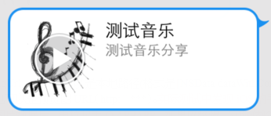

音楽の共有
=== 

##概説
 - この機能は1.7.0バージョン以降に提供され、ウィーチャット及びモバイルQQへの共有インターフェースを提供します。

---

## インターフェースの説明
 - WGShowNoticeを呼び出し、MSDKの配置した画面で現在有効な公告を表示します。
```ruby
void WGSendToQQWithMusic(const int& scene,
                             unsigned char* title,
                             unsigned char* desc,
                             unsigned char* musicUrl,
                             unsigned char* musicDataUrl,
                             unsigned char* imgUrl);
```
>記述:メッセージをモバイルQQ会話又はQzoneに共有します。urlはゲームのモバイルQQゲームセンターでのページを記入します。メッセージをクリックするとモバイルQQで音楽を再生します。
パラメータ:
  - scene　空間又は会話への共有を示します
0：モバイルQQを実行し、デフォルトで空間への共有をポップアップします。
1：モバイルQQを実行し、友達にしか共有できません。
  - title 共有のタイトル
  - desc 共有の詳細記述
  - musicUrl 音楽内容のジャンプurlで、対応のゲームセンターの詳細ページ&ゲームの自己定義フィールドを記入します。モバイルQQでこの会話をクリックすると、MSDKはゲームの自己定義パラメータをOnWakeupNotify(WakeupRet ret) ret.extInfoでゲームに透明伝送します。ゲームはパラメータの透明伝送を必要としない場合、直接にゲームセンターの詳細ページを記入します。自己定義フィールドの透明伝送はモバイルQQ4.6以降を必要とします。
例えば、ゲームセンターのページを「AAAAA」、ゲームの自己定義フィールドを「bbbbb」とすれば、urlはAAAAA&bbbbbとなります。BbbbbはwakeupRet.extInfoでゲームに戻されます。
  - musicDataUrl このパラメータを用いて、下図の再生ボタンに示すように、共有の音楽メッセージの再生ボタンをクリックすると直接に再生できます。一般的な形式はhttp://***.mp4とします

  - imgUrl  iOSではローカルパス(形式は[NSData dataWithContentsOfFile:path]に規定します)、又はプレビュー図URL（http:// ***）とすることができます。実際のテストではiOSのモバイルQQコンポーネントは先ずURL画像データを取得してから、モバイルQQ のAPPを起動することが分かりますP。ネットワークのスピードが遅く、実際の体験は悪くなる可能性があります。この時、画面で相応的な処理をする必要があります。
       Androidではプレビュー図URLしか利用できません。
共有の成功・失敗はOnShareNotify(ShareRet ret)を通じてゲームにコールバックされます。ret.flagはそれぞれの共有結果を示し、詳細はeFlag(付録A)を参照してください

 - 
```ruby
void WGSendToWeixinWithMusic(const int &scene,
                                 unsigned char* title,
                                 unsigned char* desc,
                                 unsigned char* musicUrl,
                                 unsigned char* musicDataUrl,
                                 unsigned char *mediaTagName,
                                 unsigned char *imgData,
                                 const int &imgDataLen,
                                 unsigned char *messageExt,
                                 unsigned char *messageAction);
```
>記述: App音楽メッセージをウィーチャット友達に共有し、この共有メッセージをクリックすると、ウィーチャットで音楽を再生できます。
パラメータ: 
  - scene momentsか会話への共有を示します
0：ウィーチャットを実行し、友達にしか共有できません。
1：ウィーチャットを実行し、デフォルトではmomentsへの共有をポップアップします
  - title 共有のタイトル
  - desc 共有の記述
  - musicUrl 音楽内容のジャンプurl
  - musicDataUrl このパラメータを用いて、下図の再生ボタンに示すように、共有の音楽メッセージの再生ボタンをクリックすると直接に再生できます。一般的な形式はhttp://***.mp4とします。
  - mediaTagName 利用者は自分で値を設定します。この値はウィーチャットに伝送され統計に利用します。共有のリターンもこの値を伝え、共有源を区分します。
  - imgData共有時に表示するサムネイルデータ（32K以下）
  - imgDataLen 共有時に表示するサムネイルのサイズであり、thumbImgDataに合わせる必要があります。空きにすることができません
  - messageExt ゲーム共有の時にこのフィールドを伝送します。ウィーチャットではこの共有会話をクリックすると、ゲームを実行します。MSDKはこのフィールドをゲームに透明伝送します。ウィーチャット5.1以降を必要とします。
  - messageAction 　一番目のパラメータsceneが1の時に機能し、momentsへの共有メッセージには1つのボタンが追加され、ボタンをクルックするとゲームを実行し、ランキング又はゲームのホームページへジャンプします。
     messageAction値は次の通りです。
     WECHAT_SNS_JUMP_SHOWRANK       ランキングへジャンプします
     WECHAT_SNS_JUMP_URL            リンクへジャンプします
     WECHAT_SNS_JUMP_APP           APPへジャンプします
共有の成功・失敗はOnShareNotify(ShareRet ret)を通じてゲームにコールバックされます。Ret.flagはそれぞれの共有結果を示し、詳細はeFlag(付録A)を参照してください

---

##サンプルコード
 -音楽をウィーチャットに共有するための呼び出しコードサンプル：
```ruby
WGPlatform *plat = WGPlatform::GetInstance();
    NSString *path = [[QQViewController testResourcePath] stringByAppendingPathComponent:@"music.jpg"];//news.jpg
    NSData* data = [NSData dataWithContentsOfFile:path];
    plat->WGSendToWeixinWithMusic(1,                 
                                (unsigned char*)"音楽のテスト",  
                                (unsigned char*)"音楽共有のテスト",  
                                (unsigned char*)"http://y.qq.com/#type=song&mid=000cz9pr0xlAId",  
                                 (unsigned char*)"http://tsmusic24.tc.qq.com/M500000cz9pr0xlAId.mp3",      
                                NULL, 
                                 (unsigned char*)[data bytes], 
                                [data length], 
                               NULL, 
                               NULL);
```
 - コールバックのコードサンプル：
```ruby
void MyObserver::OnShareNotify(ShareRet& shareRet)
{
    if (eFlag_Succ == shareRet.flag)
{
    NSLog(@"共有に成功しました");
}
     else if(eFlag_WX_NotInstall == shareRet.flag)
{
    NSLog(@"ウィーチャットをインストールしていません");
    }
 else if(eFlag_WX_UserCancel == shareRet.flag)
{
    NSLog(@"ユーザーが共有をキャンセルしました");
    }
    else if(eFlag_WX_UserDeny == shareRet.flag)
{
    NSLog(@"ユーザーが共有を拒絶しました");
    }
}
```
 -音楽をモバイルQQに共有するための呼び出しコードサンプル：
```ruby
NSString *path = [[QQViewController testResourcePath] stringByAppendingPathComponent:@"music.jpg"];        
    plat->WGSendToQQWithMusic(2,
                          (unsigned char*)"音楽のテスト",
                              (unsigned char*)"音楽共有のテスト",
                              (unsigned char*)"http://y.qq.com/#type=song&mid=000cz9pr0xlAId",
                              (unsigned char*)"http://tsmusic24.tc.qq.com/M500000cz9pr0xlAId.mp3",
                              (unsigned char*)[path UTF8String]); 
```
又は
```ruby
    WGPlatform *plat = WGPlatform::GetInstance();        
    plat->WGSendToQQWithMusic(1, (unsigned char*)"音楽のテスト",
                              (unsigned char*)"音楽共有のテスト",
                              (unsigned char*)"http://y.qq.com/#type=song&mid=000cz9pr0xlAId",
                              (unsigned char*)"http://tsmusic24.tc.qq.com/M500000cz9pr0xlAId.mp3",                              (unsigned char*)"http://www.monsterworking.com/wp-content/uploads/music.jpg");
```
 - コールバックのコードサンプル：
```ruby
void MyObserver::OnShareNotify(ShareRet& shareRet)
{
    if (eFlag_Succ == shareRet.flag)
{
        NSLog(@"共有に成功しました");
    }
    else if(eFlag_QQ_UserCancel == shareRet.flag)
{
        NSLog(@"ユーザーが共有をキャンセルしました");
    }
    else if(eFlag_QQ_NetworkErr == shareRet.flag)
    {
        NSLog(@"ネットワークエラー");
    }
}
```

