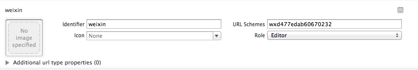

ウィーチャット接続
===

##ウィーチャット接続配置
 
  * エンジニアリングの設定した`Target->Info->Custom iOS Target Properties`で、配置項目を追加し、主要配置項目は次の通りです。
  

| Key      |    Type | Value  |備考|関連モジュール|
| :-------- | --------:| :-- |:--|:---:|
| WXAppID  | String |  ゲームにより異なる |ウィーチャットのAppID|全て|
| WXAppKey  | String |  ゲームにより異なる |ウィーチャットのAppKey|全て|
  
  *	エンジニアリングの設定した`Target->Info->URL Types`でURL Schemeを設定し、配置は次の通りです。
  
  
| Identifier|    URL Scheme | サンプル  | 備考  |
| :-------- | :--------| :--: | :--: |
| weixin  | ゲームのウィーチャットAppID |wxcde873f99466f74a | ウィーチャットの接続は必須   |

---

##ウィーチャット授権
 - ###概説
ウィーチャットクライアントを実行し、授権を行い、ウィーチャットopenId、accesstokenとrefreshtoken(付録Aのトークン種類)，pfとpfKeyを取得します。
```ruby
void WGLogin(ePlatform platform);
```
>記述: ログインの統一インターフェースから_ePlatform. ePlatform_Weixinを伝送し、ウィーチャットを呼び出して授権します。
パラメータ: 
   -  _ePlatform. ePlatform_Weixinを伝送し、ウィーチャットクライアントを呼び出して授権します
Observerに設定した場合、授権・失敗はOnLoginNotify（LoginRet ret）を通じてゲームにコールバックされます。コールバック結果ret.flagの説明は次の通りです。
```
eFlag_WX_NotInstall     = 2000,     //ウィーチャットをインストールしていません
    eFlag_WX_NotSupportApi  = 2001,     //ウィーチャットのバージョンは対応しません
eFlag_WX_UserCancel     = 2002,     //ユーザーがウィーチャット授権をキャンセルしました
    eFlag_WX_UserDeny       = 2003,     //ユーザーがウィーチャット授権を拒絶しました
eFlag_WX_LoginFail      = 2004,     //ウィーチャット授権に失敗しました
```

- ###サンプルコード
呼び出しコードは次の通りです。
```ruby
MyObserver* ob = new MyObserver(); 
plat->WGSetObserver(ob);//コールバック対象を設定します
plat->WGLogin(ePlatform_Weixin);
```
コールバックコードは次の通りです。
```ruby
void MyObserver::OnLoginNotify(LoginRet& loginRet)
{
if(eFlag_Succ == loginRet.flag)
{
    …//login success
    std::string openId = loginRet.open_id;
    std::string refreshToken;
    std::string accessToken;
    if(ePlatform_Weixin == loginRet.Platform)
    {
        for(int i=0;i< loginRet.token.size();i++)
        {
            TokenRet* pToken = & loginRet.token[i];
            if(eToken_WX_Access == pToken->type)
            {
                accessToken = pToken->value;
            }
            else if (eToken_WX_Refresh == pToken->type)
{
     refreshToken = pToken->value;
}
        }
    }
else if(ePlatform_QQ == loginRet.Platform)
{
}
}
else
{
    …//login fail
     NSLog(@"flag=%d,desc=%s",loginRet.flag,loginRet.desc.c_str()); 
}
}
```

- 2.4.0i以降は、delegate方式を利用できます。コードは次の通りです。
```
[MSDKService setMSDKDelegate:self];
MSDKAuthService *authService = [[MSDKAuthService alloc] init];
[authService login:login:ePlatform_Weixin];
```
- コールバックコードは次の通りです。
```
-(void)OnLoginWithLoginRet:(MSDKLoginRet *)ret
{
//内部の実現ロジックはvoid MyObserver::OnLoginNotify(LoginRet& loginRet)と同じです
}
```
- ### 注意事項
 - ウィーチャットバージョン4.0以降
 
---

## ウィーチャット関係チェーン・インターフェース
 - ###ウィーチャット個人情報の検索
 - WGQueryWXMyInfoを呼び出し、ウィーチャットの個人情報を検索します。ニックネーム、性別、顔写真、都市、省などの情報を含めています。
```ruby
bool WGQueryWXMyInfo();
```
>記述:ユーザーのウィーチャットアカウントの基本情報を取得します
戻り値：
   false:ウィーチャットが未授権又はAppIDなどの配置が間違っています
   true:パラメータには異常がありません
OnRelationNotify(RelationRet& relationRet) でゲームにコールバックします
RelationRet（付録B）構造体におけるPersonInfoの小、中、大三幅画像のサイズは、46、96、132（画素）であり、個人情報の国と言語情報はcountryとlangを通じてゲームに戻されます。[1.7.0は国・言語情報を新規追加しました。 ]

 - 呼び出しサンプルコード：
```ruby
WGPlatform *plat = WGPlatform::GetInstance();
plat->WGQueryWXMyInfo();
コールバックのサンプルコード：
OnRelationNotify(RelationRet &relationRet)
{
    NSLog(@"relation callback");
    NSLog(@"count == %d",relationRet.persons.size());
    for (int i = 0; i < relationRet.persons.size(); i++)
    {
        PersonInfo logInfo = relationRet.persons[i];
        NSLog(@"nikename==%s",logInfo.nickName.c_str()]);
        NSLog(@"openid==%s",logInfo.openId.c_str());
    }
}
```

- 2.4.0i以降は、delegate方式を利用できます。コードは次の通りです。
```
[MSDKService setMSDKDelegate:self];
MSDKRelationService *service = [[MSDKRelationService alloc] init];
[service queryMyInfo];
```
- コールバックコードは次の通りです。
```
-(void)OnRelationWithRelationRet:(MSDKRelationRet *)ret
{
//内部の実現ロジックはOnRelationNotify(RelationRet &relationRet)と同じです
}
```

- ###ウィーチャットの共遊び友達情報の検索
WGQueryWXGameFriendsInfoを呼び出し、ウィーチャットの共遊び友達の情報を検索します。ニックネーム、性別、顔写真、都市、省などの情報を含めています。
```ruby
bool WGQueryWXGameFriendsInfo();
```
>記述:ユーザーのウィーチャット共遊び友達の基本情報を取得します
戻り値：
   false:ウィーチャットが未授権又はAppIDなどの配置が間違っています
   true:パラメータには異常がありません
通过OnRelationNotify(RelationRet& relationRet) ゲームにコールバックします
RelationRet（付録A）構造体におけるPersonInfoの小、中、大三幅画像のサイズは、46、96、132（画素）であり、友達の情報には国と言語がありません。

 - 呼び出しサンプルコード：
```ruby
WGPlatform *plat = WGPlatform::GetInstance();
plat->WGQueryWXGameFriendsInfo();
```
コールバックのサンプルコード：
```ruby
OnRelationNotify(RelationRet &relationRet)
{
    NSLog(@"relation callback");
    NSLog(@"count == %d",relationRet.persons.size());
    for (int i = 0; i < relationRet.persons.size(); i++)
    {
        PersonInfo logInfo = relationRet.persons[i];
        NSLog(@"nikename==%s",logInfo.nickName.c_str());
        NSLog(@"openid==%s",logInfo.openId.c_str());
    }
}
```

- 2.4.0i以降は、delegate方式を利用できます。コードは次の通りです。
```
[MSDKService setMSDKDelegate:self];
MSDKRelationService *service = [[MSDKRelationService alloc] init];
[service queryMyGameFriendsInfo];
```
- コールバックコードは次の通りです。
```
-(void)OnRelationWithRelationRet:(MSDKRelationRet *)ret
{
//内部の実現ロジックはOnRelationNotify(RelationRet &relationRet)と同じです
}
```

###注意事項
 - ウィーチャット授権に成功しました

---

##ウィーチャット構造化メッセージの共有
 - ###ウィーチャットクライアントを実行し、友達に共有します。
ゲームはウィーチャットクライアントを実行することで、共有を実現し、ウィーチャットで共有先の友達を選択します。画像サイズは32k以下とします。32kを超えると、ウィーチャットはデフォルトの画像を表示します。ウィーチャットのmomentsに共有できません。
```ruby
void WGSendToWeixin(unsigned char* title, unsigned char* desc, unsigned char* mediaTagName, unsigned char* thumbImgData, const int& thumbImgDataLen, unsigned char* messageExt);
```
>記述: Appメッセージをウィーチャットの友達に共有し、この共有の詳細をクリックするとゲームを実行できます。このようなメッセージをmomentsに共有できません。Momentsへの共有はWGSendToWeixinWithPhotoインターフェースを使用します。
パラメータ: 
- title 共有のタイトル
  - desc 共有の記述
  - mediaTagName 利用者は自分で値を設定します。この値はウィーチャットに伝えられ、統計に利用します。共有戻りの時にもこの値を付け、共有源を区分できます。
  - thumbImgData 共有時に表示するサムネイルのデータ（32K以下）
  - thumbImgDataLen 共有時に表示するサムネイルの長さであり、thumbImgDataに合わせる必要があり、空きにすることができません。
  - messageExt ゲーム共有はこのフィールドを伝送し、ウィーチャットではこの共有会話をクリックすると、ゲームを実行します。MSDKはこのフィールドをゲームに透明伝送します。ウィーチャット5.1以降を必要とします。
 共有の成功・失敗はOnShareNotify(ShareRet ret)を通じてゲームにコールバックされます。Ret.flagはそれぞれの共有結果を示し、詳細はeFlag(付録A)を参照してください

 - 
```ruby
void WGSendToWeixin(const eWechatScene& scene, unsigned char* title, unsigned char* desc, unsigned char* url, unsigned char* mediaTagName, unsigned char* thumbImgData, const int& thumbImgDataLen);
```
>記述: MSDK接続済みの旧バージョンゲームとの互換性を保証するために、このインターフェースを保留します。新規接続のゲームはこのインターフェースを考慮する必要がありません。

 - 呼び出しサンプルコード：
```ruby
WGPlatform* plat = WGPlatform::GetInstance();
MyObserver* ob = new MyObserver();
plat->WGSetObserver(ob);
NSString* title=@"共有タイトル";
NSString* desc=@"共有内容";
char*  mediaTag = "MSG_INVITE";
NSString *path = "29.jpg";
NSData* data = [NSData dataWithContentsOfFile:path];
plat->WGSendToWeixin(
                         (unsigned char*)[title UTF8String],
                         (unsigned char*)[desc UTF8String],
                         (unsigned char*)mediaTag,
                         (unsigned char*)[data bytes],
                         [data length],
                         (unsigned char*)ext
                         ); 
```
 - コールバックのコードサンプル：
```ruby
void MyObserver::OnShareNotify(ShareRet& shareRet)
{
    if (eFlag_Succ == shareRet.flag)
{
    NSLog(@"共有に成功しました");
}
     else if(eFlag_WX_NotInstall == shareRet.flag)
{
    NSLog(@"ウィーチャットをインストールしていません");
    }
 else if(eFlag_WX_UserCancel == shareRet.flag)
{
    NSLog(@"ユーザーが共有をキャンセルしました");
    }
    else if(eFlag_WX_UserDeny == shareRet.flag)
{
    NSLog(@"ユーザーが共有を拒絶しました");
    }
}
```

- 2.4.0i以降は、delegate方式を利用できます。コードは次の通りです。
```
[MSDKService setMSDKDelegate:self];
UIImage *image = [UIImage imageNamed:@"4.jpg"];
NSData *data = UIImageJPEGRepresentation(image, 0.5);
MSDKShareService *service = [[MSDKShareService alloc] init];
[service WGSendToWeixin:(unsigned char*)"共有タイトル"
desc:(unsigned char*)"共有内容"
mediaTagName:(unsigned char*)"MSG_INVITE"
thumbImgData:(unsigned char*)[data bytes]
thumbImgDataLen:(int)[data length]
messageExt:(unsigned char*)"msdkwuwuwu"];
```
- コールバックコードは次の通りです。
```
-(void)OnShareWithShareRet:(MSDKShareRet *)ret
{
    //内部の実現ロジックはvoid MyObserver::OnShareNotify(ShareRet& shareRet)と同じです
}
```

 ###ウィーチャットの友達への直接共有
 - WGSendToWXGameFriendを呼び出し、指定openiDのウィーチャット共遊び友達に共有します。ウィーチャットクライアントを実行しません。
 ```ruby
WGSendToWXGameFriend(unsigned char *fOpenId, unsigned char *title, unsigned char *description, unsigned char *mediaId, unsigned char *extinfo, unsigned char *mediaTagName,  unsigned char *extMsdkInfo)[1.7.0i]
```
>記述:共有メッセージをウィーチャット友達に送信します（同じゲームをインストールした友達にしか送信できません）。ウィーチャットでこのメッセージをクリックすると、ゲームを実行します。
戻り値：
      false:モバイルQQ未授権又はパラメータが不適切です
      true:パラメータには異常がありません
パラメータ: 
  - fopenid 必須パラメータ 友達対応のゲームのopenidであり、この友達へ共有します
  - title必須パラメータ   共有タイトル
  - description必須パラメータ   アプリメッセージの記述
  - mediaId必須パラメータ ゲームのアイコンです。バックグラウンドのインターフェース/share/upload_wxを通じて取得します
  - extinfo必須ではありません。
第三者プログラムの簡単な自己定義データです。ウィーチャットは第三者プログラムにコールバックして処理します。長さは2k以下とします。クライアントでこれをクリックすると、このフィールドを取得できます。
  - mediaTagName 必須ではありません。
ゲームのメッセージ種類を区分し、データ統計に利用します。
  - extMsdkInfo 共有の時にゲームが伝送し、ShareRet.extInfoでゲームにコールバックされます。[1.7.0i]
共有の終了はOnShareCallBack(ShareRet ret)を通じてゲームにコールバックされます。Ret.flagはそれぞれの共有結果を示し、詳細はeFlag(付録A)を参照してください

- 呼び出しサンプルコード：
```ruby
unsigned char* title = (unsigned char*)"msdk テスト QQ 共有が始まります";
unsigned char* description = (unsigned char*)"私は天天愛消除を遊んでいます";
unsigned char* media_tag_name = (unsigned char*)"MSG_INVITE";
unsigned char* fopenid = (unsigned char*)"oKdX1juRjuwIwIeSXRrTiq51kjc4";
unsigned char* mediaid = (unsigned char*)XXXXX";
unsigned char* extinfo = (unsigned char*)"balabalabalabala";
WGPlatform *plat = WGPlatform::GetInstance();
plat->WGSendToWXGameFriend(fopenid, title, description, mediaid, extinfo, media_tag_name);
```
- コールバックのコードサンプル：
```
void MyObserver::OnShareNotify(ShareRet& shareRet)
{
    if (eFlag_Succ == shareRet.flag)
{
        NSLog(@"共有に成功しました");
    }
    else 
{
   NSLog(@"error message = %s",shareRet.desc.c_str()); 
    }
}
```
- 2.4.0i以降は、delegate方式を利用できます。コードは次の通りです。
```
[MSDKService setMSDKDelegate:self];
MSDKShareService *service = [[MSDKShareService alloc] init];
[service WGSendToWXGameFriend:(unsigned char*)"oGRTijiaT-XrbyXKozckdNHFgPyc"
title:(unsigned char*)"msdk テスト QQ 共有が始まります"
description:(unsigned char*)"私は天天愛消除を遊んでいます"
mediaId:(unsigned char*)""
messageExt:(unsigned char*)"balabalabalabala"
mediaTagName:(unsigned char*)"MSG_INVITE"];
```
- コールバックコードは次の通りです。
```
-(void)OnShareWithShareRet:(MSDKShareRet *)ret
{
//内部の実現ロジックはvoid MyObserver::OnShareNotify(ShareRet& shareRet)と同じです
}
```

### 注意事項
-  WGSendToWeixin共有画像は32K以下とします
 - 画像サイズは10M以下とします

 ---
 
##ウィーチャットの大画像共有
 - ### 概説
ゲームはウィーチャットクライアントを実行して、共有を実現し、ウィーチャットで共有先の友達を選択します。画像サイズは10M以下とします。
```ruby
void WGSendToWeixinWithPhoto(const eWechatScene[Int 转为 eWechatScene]& scene, unsigned char* mediaTagName, unsigned char* imgData, const int& imgDataLen, unsigned char* messageExt, unsigned char* messageAction);
```
>記述:画像メッセージをウィーチャットに共有します。この種類のメッセージは会話とmomentsだけに共有できます。共有の画像をクリックすると大画像を表示します。
パラメータ: 
  - scene momentsか会話への共有を示します 
WechatScene_Session：会話
WechatScene_Timeline：moments
  - mediaTagName利用者は自分で値を設定します。この値はウィーチャットに伝えられ、統計に利用します。共有戻りの時にもこの値を付け、共有源を区分できます。
  - imgData共有の画像データです。png形式の画像はUIImagePNGRepresentationメソッドで画像データを取得する必要があります。
  - imgDataLen 共有の画像データ長さ
  - messageExt ゲーム共有は文字列を伝えます。このメッセージでゲームを実行すると、OnWakeUpNotify(wakeupRet ret)のret.messageExtでゲームに透明伝送します。
  - messageAction 　1つ目のパラメータsceneが1の時にのみ機能します。momentsへの共有メッセージにはボタンが追加され、ボタンをクルックするとゲームを実行し、ランキング又はゲームのホームページへジャンプできます。値と役割は次の通りです。
WECHAT_SNS_JUMP_SHOWRANK       ランキングへジャンプ
WECHAT_SNS_JUMP_URL            リンクへジャンプ
WECHAT_SNS_JUMP_APP           APPへジャンプ[momentsボタンの表示は、ネットワーク遅延があります。ウィーチャット5.1以降を必要とします]
void WGSendToWeixinWithPhoto(const int& scene, unsigned char* mediaTagName, unsigned char* imgData, const int& imgDataLen);
記述: MSDK接続済みの旧バージョンゲームとの互換性を保証するために、このインターフェースを保留します。新規接続のゲームはこのインターフェースを考慮する必要がありません。
共有の成功・失敗はOnShareNotify(ShareRet ret)を通じてゲームにコールバックされます。Ret.flagはそれぞれの共有結果を示し、詳細はeFlag(付録A)を参照してください

 ### コードサンプル
呼び出しコードサンプル：
```ruby
WGPlatform* plat = WGPlatform::GetInstance();
MyObserver* ob = new MyObserver();
ob->setViewcontroller(self);
plat->WGSetObserver(ob);
char* mediaTag = "mediaTag";
UIImage *image = [UIImage imageNamed:@"356.png"];
NSData *data = UIImagePNGRepresentation(image);
plat->WGSendToWeixinWithPhoto(
                                  1,
                                  (unsigned char*)mediaTag,
                                  (unsigned char*)[data bytes],
                                  [data length],
                                  (unsigned char*)"msdkwuwuwu",
                                  (unsigned char*)"WECHAT_SNS_JUMP_APP"
                                  ); 
```
コールバックのコードサンプル：
```ruby
void MyObserver::OnShareNotify(ShareRet& shareRet)
{
    if (eFlag_Succ == shareRet.flag)
{
    NSLog(@"共有に成功しました");
}
     else if(eFlag_WX_NotInstall == shareRet.flag)
{
    NSLog(@"ウィーチャットをインストールしていません");
    }
 else if(eFlag_WX_UserCancel == shareRet.flag)
{
    NSLog(@"ユーザーが共有をキャンセルしました");
    }
    else if(eFlag_WX_UserDeny == shareRet.flag)
{
    NSLog(@"ユーザーが共有を拒絶しました");
    }
}
```

- 2.4.0i以降は、delegate方式を利用できます。コードは次の通りです。
```
[MSDKService setMSDKDelegate:self];
UIImage *image = [UIImage imageNamed:@"356.png"];
NSData *data = UIImageJPEGRepresentation(image, 1.0);
MSDKShareService *service = [[MSDKShareService alloc] init];
[service WGSendToWeixinWithPhoto:WechatScene_Session
mediaTagName:(unsigned char*)"mediaTag"
imgData:(unsigned char*)[data bytes]
imgDataLen:(int)[data length]
messageExt:NULL
messageAction:NULL];
```
- コールバックコードは次の通りです。
```
-(void)OnShareWithShareRet:(MSDKShareRet *)ret
{
//内部の実現ロジックはvoid MyObserver::OnShareNotify(ShareRet& shareRet)と同じです
}
```

###注意事項
 - 画像サイズは10M以下とします

---

##URLをウィーチャットへ共有
 - ###概説
WGSendToWeixinの機能と同じであり、共有URLのパラメータを追加し、momentsへ共有できます。
```ruby
void WGSendToWeixinWithUrl(
                        const eWechatScene& scene,
                        unsigned char* title,
                        unsigned char* desc,
                        unsigned char* url,
                        unsigned char* mediaTagName,
                        unsigned char* thumbImgData,
                        const int& thumbImgDataLen,
                        unsigned char* messageExt
                        );
```
>記述: Appメッセージをウィーチャット友達に共有し、この共有の詳細をクリックすると、ゲームを実行できます。この種類のメッセージをmomentsに共有できません。Momentsへの共有はWGSendToWeixinWithPhotoインターフェースを使用します。
パラメータ: 
  - scene 共有のシーン
  - title 共有のタイトル
  - desc 共有の記述
  - url 共有のURL
  - mediaTagName利用者は自分で値を設定します。この値はウィーチャットに伝えられ、統計に利用します。共有戻りの時にもこの値を付け、共有源を区分できます。
  - thumbImgData 共有時に表示するサムネイルのデータ（32K以下）
  - thumbImgDataLen 共有時に表示するサムネイルの長さであり、thumbImgDataに合わせる必要があり、空きにすることができません。
  - messageExt ゲーム共有はこのフィールドを伝送し、ウィーチャットではこの共有会話をクリックすると、ゲームを実行します。MSDKはこのフィールドをゲームに透明伝送します。ウィーチャット5.1以降を必要とします。
  - 共有の成功・失敗はOnShareNotify(ShareRet ret)を通じてゲームにコールバックされます。Ret.flagはそれぞれの共有結果を示し、詳細はeFlag(付録A)を参照してください

 - ###コードサンプル
呼び出しコードサンプル：
```ruby
WGPlatform *plat = WGPlatform::GetInstance();
NSString* title=@"共有タイトル";
NSString* desc=@"共有内容";
NSString* url = @"http://www.baidu.com";
const char*  mediaTag = "MSG_INVITE";
const char*  ext = "msdkwuwuwu";
NSString *path = [[QQViewController testResourcePath] stringByAppendingPathComponent:@"4.png"];
NSData* data = [NSData dataWithContentsOfFile:path];
plat->WGSendToWeixinWithUrl(WechatScene_Session, (unsigned char*)[title UTF8String], (unsigned char*)[desc UTF8String],(unsigned char*)[url UTF8String], (unsigned char*)mediaTag,(unsigned char*)[data bytes],(int)[data length], (unsigned char*)ext);
```
コールバックのコードサンプル：
```ruby
void MyObserver::OnShareNotify(ShareRet& shareRet)
{
    shareRet.extInfo = 「xxx」;//ゲーム共有時に伝えたextMsdkInfoフィールド
    if (eFlag_Succ == shareRet.flag)
{
    NSLog(@"共有に成功しました");
}
     else if(eFlag_WX_NotInstall == shareRet.flag)
{
    NSLog(@"ウィーチャットをインストールしていません");
    }
 else if(eFlag_WX_UserCancel == shareRet.flag)
{
    NSLog(@"ユーザーが共有をキャンセルしました");
    }
    else if(eFlag_WX_UserDeny == shareRet.flag)
{
    NSLog(@"ユーザーが共有を拒絶しました");
    }
}
```

- 2.4.0i以降は、delegate方式を利用できます。コードは次の通りです。
```
[MSDKService setMSDKDelegate:self];
UIImage *image = [UIImage imageNamed:@"4.png"];
NSData* data = UIImageJPEGRepresentation(image, 1.0);
MSDKShareService *service = [[MSDKShareService alloc] init];
[service WGSendToWeixinWithUrl:WechatScene_Session
title:(unsigned char*)"共有タイトル"
desc:(unsigned char*)"共有内容"
url:(unsigned char*)"http://www.baidu.com"
mediaTagName:(unsigned char*)"MSG_INVITE"
thumbImgData:(unsigned char*)[data bytes]
thumbImgDataLen:(int)[data length]
messageExt:(unsigned char*)"msdkwuwuwu"];
```
- コールバックコードは次の通りです。
```
-(void)OnShareWithShareRet:(MSDKShareRet *)ret
{
//内部の実現ロジックはvoid MyObserver::OnShareNotify(ShareRet& shareRet)と同じです
}
```

###注意事項
 -ウィーチャット5.2バージョン以降を必要とします

---

## ウィーチャットのaccesstoken更新
- 概説
ウィーチャットaccessTokenの有効期間は2時間しかなく、refreshTokenの有効期間は30日間です。refreshTokenの期間が経過しない限り、refreshTokenでaccessTokenを更新できます。更新後、新しいaccessTokenとrefreshTokenが得ます。それぞれのrefreshTokenは1回しか利用できません。
WGRefreshWXToken()インターフェースはMSDK serverの/auth/wxexpired_login/ サービスに対応します。ゲームはWGRefreshWXToken()を用いてウィーチャットaccessTokenを更新すれば、MSDK serverの/auth/wxexpired_login/を呼び出してaccessTokenを更新する必要がありません。ゲームに対してWGRefreshWXToken()インターフェースを用いてaccessTokenの期間延長を提案します。ゲームはトークンを保存する必要がなく、WGGetLoginRecord(loginRet ret)でトークンを取得します。[1.7.0]
```ruby
void WGRefreshWXToken();
```
>記述:　ウィーチャットaccessTokenの期間を延長し、WGGetLoginRecord（LoginRet ret）を呼び出します。ret.flag がeFlag_WX_AccessTokenExpiredの時に、このインターフェースを呼び出し、ウィーチャットのトークンを更新します。
更新結果はOnLoginNotify(LoginRet ret)を通じてゲームにコールバックされます。
ret.flag = eFlag_WX_RefreshTokenSucc   tokenの更新に成功しました
ret.flag = eFlag_WX_RefreshTokenFail    tokenの更新に失敗しました

- サンプルコード
呼び出しコードサンプル：
```ruby
WGPlatform* plat = WGPlatform::GetInstance();
plat->WGRefreshWXToken()
```
コールバックのコードサンプル：
```ruby
void MyObserver::OnLoginNotify(LoginRet& loginRet)
{
if(eFlag_WX_RefreshTokenSucc == loginRet.flag)
{
    …//refresh success
    std::string openId = loginRet.open_id;
    std::string refreshToken;
    std::string accessToken;
    for(int i=0;i< loginRet.token.size();i++)
    {
        TokenRet* pToken = & loginRet.token[i];
        if(eToken_WX_Access == pToken->type)
        {
            accessToken = pToken->value;
        }
        else if (eToken_WX_Refresh == pToken->type)
{
refreshToken = pToken->value;
}
     }
}
else
{
    …//login fail
     NSLog(@"flag=%d,desc=%s",loginRet.flag,loginRet.desc.c_str()); 
}
}
```
- 2.4.0i以降は、delegate方式を利用できます。コードは次の通りです。
```
[MSDKService setMSDKDelegate:self];
MSDKAuthService *authService = [[MSDKAuthService alloc] init];
[authService refreshWXToken];
```
- コールバックコードは次の通りです。
```
-(void)OnShareWithShareRet:(MSDKShareRet *)ret
{
//内部の実現ロジックはvoid MyObserver::OnShareNotify(ShareRet& shareRet)と同じです
}
```

###注意事項
- 更新コールバックflagはeFlag_WX_RefreshTokenSuccとeFlag_WX_RefreshTokenFailです。
- それぞれのrefreshTokenは1回の期間延長だけに使用できます。

---

##ウィーチャットの各バージョンの対応状況は次の通りです。
- ###ウィーチャット機能の対応バージョン

|機能	|説明|	ウィーチャットのバージョン|
|---|---|---|
|授権|	|	4.0以上|
|指定共有|	友達から友達へ共有|	4.0以上|
|大画像共有|	画像の共有（WGSendToWeixinWithPhotoインターフェース|	4.0以上|
|moments共有|	momentsへの共有|	4.2以上|
|別アカウントの表示|	ウィーチャットのログインアカウントをMSDKに通知します|	5.0以上|
|momentsジャンプ|	momentsメッセージには1つのボタンが追加され、ランキングへジャンプし、ゲームのページを表示し、又は直接ゲームを実行します|	5.1以上|

