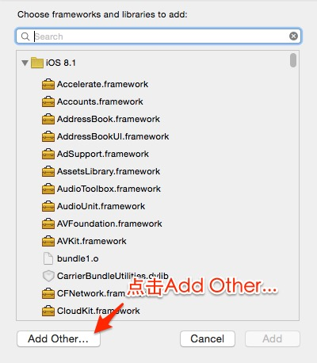
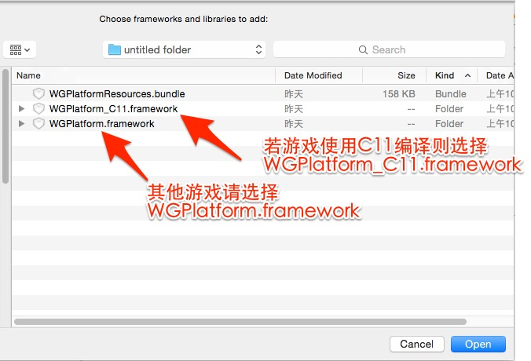
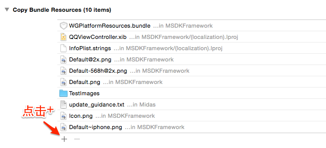
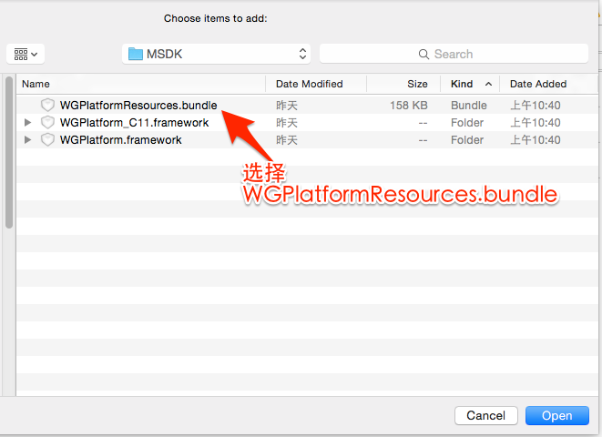

快速接続
======

### Let's Get Started!

>最新バージョンの Xcode（5.0+）を使用し、iOS 5.1.1以降のバージョンを確保してください。Xcode 5 と iOS 6 以降を推奨します。

---
##Step1:必要なライブラリーの導入

 * `Target->Build Phases->Link Binary With Libraries`にはエンジニアリングに必要なシステム・ライブラリーを導入します。次の通りです。
```ruby
libz.dylib
libstdc++.dylib
libz.1.1.3.dylib
libsqlite3.dylib
libxml2.dylib
libstdc++.6.0.9.dylib
CoreTelephony.framework
SystemConfiguration.framework
UIKit.framework
Foundation.framework
CoreGraphics.framework
MobileCoreServices.framewrok
StoreKit.framework
CFNetwork.framewrok
CoreData.framework
Security.framework
CoreLocation.framework
ImageIO.framework
CoreText.framework
QuartzCore.framework
```
---	
##Step2: MSDKの導入
* 2.3.4i以前のバージョン:
  - [ダウンロードSDK](http://mcloud.ied.com/wiki/MSDK%E4%B8%8B%E8%BD%BD)
  - SDKのヘッダーファイル、クラス・ライブラリーファイルは`WGPlatform.framework`にあり、エンジニアリングで設定した`Target->Build Phases->>Link Binary With Libraries`に導入される必要があります。
  1. 
  2. 
  3. 
  - SDKの内蔵ブラウザ、公告に必要なリソースファイルは、`WGPlatformResources.bundle`にあり、エンジニアリングで設定した`Target->Build Phases->Build Phases->Copy Bundle Resources`に導入される必要があります。
  1. 
  2. 
  3. 

* 2.4.0i以降のバージョンはプラグイン化となり、必要に応じて相応のフレームを導入でき、導入方式は2.3.4iと同じです。
  1. MSDKFoundation：基礎的なライブラリーであり、他のライブラリーを利用するには、先ずこのフレームを導入しなければなりません。
  2. MSDK:モバイルQQとウィーチャットのログイン、共有機能；
  3. MSDKMarketing：クロス販売、内蔵ブラウザ機能を提供します。公告、内蔵ブラウザに必要なリソースファイルはWGPlatformResources.bundleファイルにあります。
  4. MSDKXG：伝書鳩Push機能を提供します。
  上述4つのコンポーネントは同時に、C99及びC11言語のものを提供します。その中、**_C11パッケージはC11のバージョンです。
  
---
##Step3:配置項目
 
  *.plistファイルには配置項目を追加し、主な配置項目は次の通りです。

| Key      |    Type | Value  |備考|関連モジュール|
| :-------- | --------:| :-- |:--|:---:|
| MSDK_URL  | String |  msdktest.qq.com |MSDKテスト環境であり、正式運営の前にmsdk.qq.comに変更する必要があります|全て|
| MSDK_PUSH_URL  | String |  pushtest.msdk.qq.com | MSDKが情報を報告するためのテスト環境であり、正式運営の前にpush.msdk.qq.comに変更する必要があります|全て|
| QQAppID  | String |  ゲームにより異なる |モバイルQQのAppid|全て|
| QQAppKey  | String |  ゲームにより異なる |モバイルQQのAppKey|全て|
| WXAppID  | String |  ゲームにより異なる |ウィーチャットのAppid|全て|
| WXAppKey  | String |  ゲームにより異なる |ウィーチャットのAppKey|全て|
| CHANNEL_DENGTA  | String |  1001 |iOSシステムチャンネル番号|統計|
| MSDK_PUSH_SWITCH  | String |  ON |これはプッシュ機能のスイッチです。MSDKプッシュを利用しない場合、配置する必要がありません|プッシュ|
| MSDK_XGPUSH_URL  | String |  伝書鳩プッシュURLです。配置しなくても良いです |伝書鳩プッシュURLです。これを配置しないと、デフォルト値を使用します|プッシュ|
| MSDK_OfferId  | String |  ゲームにより異なる |支払に必要なOfferId|支払|
| NeedNotice  | Boolean |  公告機能の利用の有無|Yes-利用No（又は配置しない）-利用不可|公告|
| Noticetime  | Number |  公告の自動表示の時間間隔（秒） |デフォルトは15分間|公告|  
| NSLocationWhenInUseUsageDescription  | NSString |  iOS8でのLBS測位機能 |値を空白にすることができます|LBS| 
 
  *	エンジニアリングで設定した`Target->Info->URL Types`では、URL Schemeを設定し、次のように配置します。
  
| Identifier|    URL Scheme | サンプル  | 備考  |
| :-------- | :--------| :--: | :--: |
| weixin  | ゲームのウィーチャットAppID |wxcde873f99466f74a | ウィーチャット接続の場合、記入しなければなりません   |
| tencentopenapi  | 形式：tencent+ゲームのQQAppID |tencent100703379|  モバイルQQの接続の場合、記入しなければなりません。中間には空白がありません   |
| QQ  | 形式：QQ+ゲームのQQAppIDの16進数|QQ06009C93 | モバイルQQの接続の場合、記入しなければなりません。中間には空白がありません   |
| QQLaunch  | 形式：tencentlaunch+ゲームのQQAppID |tencentlaunch100703379|  モバイルQQの接続の場合、記入しなければなりません。中間には空白がありません   |

   > **注：ゲームにより、配置は異なりますから、詳細はゲームとMSDKの窓口、又はRTXで「MSDKホットライン」にお問合せください。**
  
---
 ##Step4:コールバック対象を実現します
 
  * グローバル・コールバック対象は、ゲーム授権、共有、検索又はプラットフォーム起動などの結果を処理します。この対象は`WGPlatformObserver`クラスの全てのメソッドを受継ぎ、実現する必要があります。
  * 例： MyObserverというグローバルコールバック対象を新規作成し、次のようにコードを貼り付けます。
  * 2.3.4i以前のバージョン:
  ```ruby
//MyObserver.h
//C99のコンバイル・オプションを利用する場合
#import <WGPlatform/WGPlatform.h>
#import <WGPlatform/WGPublicDefine.h>
//C11のコンバイル・オプションを利用する場合
#import <WGPlatform_C11/WGPlatform.h>
#import <WGPlatform_C11/WGPublicDefine.h>
class MyObserver: public WGPlatformObserver,public APMidasInterfaceObserver
{
public:
    void OnLoginNotify(LoginRet& loginRet);//ログインのコールバック
    void OnShareNotify(ShareRet& shareRet);//共有のコールバック
    void OnWakeupNotify(WakeupRet& wakeupRet);//プラットフォームによる起動のコールバック
    void OnRelationNotify(RelationRet& relationRet);//関係チェーンの検索に関するコールバック
    void OnLocationNotify(RelationRet &relationRet);//測位関連のコールバック
    void OnLocationGotNotify(LocationRet& locationRet);//測位関連のコールバック
    void OnFeedbackNotify(int flag,std::string desc);//フィードバック関連のコールバック
    std::string OnCrashExtMessageNotify();//crash時の処理
}
```
```ruby
//MyObserver.mm
#include "MyObserver.h"
void MyObserver::OnLoginNotify(LoginRet& loginRet){}
void MyObserver::OnShareNotify(ShareRet& shareRet){}
void MyObserver::OnWakeupNotify(WakeupRet& wakeupRet){}
void MyObserver::OnRelationNotify(RelationRet &relationRet){}
void MyObserver::OnLocationNotify(RelationRet &relationRet) {}
void MyObserver::OnLocationGotNotify(LocationRet& locationRet){}
void MyObserver::OnFeedbackNotify(int flag,std::string desc){}
std::string MyObserver::OnCrashExtMessageNotify(){return "message";}
```

  * 2.4.0i以降のバージョン:
```ruby
//MyObserver.h
//C99のコンバイル・オプションを利用する場合
#import <MSDK/MSDK.h>
//C11のコンバイル・オプションを利用する場合
#import <MSDK_C11/MSDK.h>
class MyObserver: public WGPlatformObserver,public WGADObserver
{
public:
void OnLoginNotify(LoginRet& loginRet);//ログインのコールバック
void OnShareNotify(ShareRet& shareRet);//共有のコールバック
void OnWakeupNotify(WakeupRet& wakeupRet);//プラットフォームによる起動のコールバック
void OnRelationNotify(RelationRet& relationRet);//関係チェーンの検索に関するコールバック
void OnLocationNotify(RelationRet &relationRet);//測位関連のコールバック
void OnLocationGotNotify(LocationRet& locationRet);//測位関連のコールバック
void OnFeedbackNotify(int flag,std::string desc);//フィードバック関連のコールバック
std::string OnCrashExtMessageNotify();//crash時の処理
void OnADNotify(ADRet& adRet);//広告コールバック
}
```
```ruby
//MyObserver.mm
#include "MyObserver.h"
void MyObserver::OnLoginNotify(LoginRet& loginRet){}
void MyObserver::OnShareNotify(ShareRet& shareRet){}
void MyObserver::OnWakeupNotify(WakeupRet& wakeupRet){}
void MyObserver::OnRelationNotify(RelationRet &relationRet){}
void MyObserver::OnLocationNotify(RelationRet &relationRet) {}
void MyObserver::OnLocationGotNotify(LocationRet& locationRet){}
void MyObserver::OnFeedbackNotify(int flag,std::string desc){}
std::string MyObserver::OnCrashExtMessageNotify(){return "message";}
void MyObserver::OnADNotify(ADRet& adRet){}
```

---
## Step5:グローバル・コールバック対象を設定します

 * `AppDelegate.mm` ファイルを開き、次の語句をヘッダーに追加します。
  * 2.3.4i以前のバージョン:
 ```ruby
//C99のコンバイル・オプションを利用する場合
#import <WGPlatform/WGPlatform.h>
#import "WGPlatform/WGInterface.h"
#import <WGPlatform/WGPublicDefine.h>
//C11のコンバイル・オプションを利用する場合
#import <WGPlatform_C11/WGPlatform.h>
#import "WGPlatform_C11/WGInterface.h"
#import <WGPlatform_C11/WGPublicDefine.h>
#import "MyObserver.h"
```
   *次のコードを`application:didFinishLaunchingWithOptions:`に貼り付けます。
 ```ruby
WGPlatform *plat = WGPlatform::GetInstance();
MyObserver  *pObserver =plat->GetObserver();
MyADObserver *adObserver =(MyADObserver *)plat->GetADObserver();
if(!pObserver){
        pObserver = new MyObserver(); 
        plat -> WGSetObserver(pObserver);
}
```
   * 次のコードを`application:openURL:sourceApplication:annotation:` に貼り付けます。
```ruby
WGPlatform* plat = WGPlatform::GetInstance();
MyObserver* ob =(MyObserver *) plat->GetObserver();
        if (!ob) {
            ob = new MyObserver();
            plat->WGSetObserver(ob);
        }
return  [WGInterface  HandleOpenURL:url];
```

  * 2.4.0i以降のバージョン:
```ruby
//C99のコンバイル・オプションを利用する場合
#import <MSDK/MSDK.h>
#import "MyObserver.h"
//C11のコンバイル・オプションを利用する場合
#import <MSDK_C11/MSDK.h>
#import "MyObserver.h"
```
   * 次のコードを`application:didFinishLaunchingWithOptions:` に貼り付けます。
```ruby
WGPlatform* plat = WGPlatform::GetInstance();
WGPlatformObserver *ob = plat->GetObserver();
if (!ob)
{
        MyObserver* ob = MyObserver::GetInstance();
        plat->WGSetObserver(ob);
}

又は
WGPlatformObserver *ob = [MSDKService getObserver];
if (!ob)
{
        MyObserver* ob = MyObserver::GetInstance();
        [MSDKService setObserver:ob];
}

```
   * 次のコードを`application:openURL:sourceApplication:annotation:` に貼り付けます。
```ruby
WGPlatform* plat = WGPlatform::GetInstance();
WGPlatformObserver *ob = plat->GetObserver();
if (!ob)
{
        MyObserver* ob = MyObserver::GetInstance();
        plat->WGSetObserver(ob);
}
return  [WGInterface  HandleOpenURL:url];

又は
WGPlatformObserver *ob = [MSDKService getObserver];
if (!ob)
{
        MyObserver* ob = MyObserver::GetInstance();
        [MSDKService setObserver:ob];
}
return [MSDKService handleOpenUrl:url];

```

>**対象を作成してから、対象を1回だけ設定するだけで結構です。重複に設定すると上書きされ、直近に設定した対象だけ、コールバックを受信できます。ゲーム初期化の時にグローバル・コールバック対象を設定するよう提案します。**

---
## Step:6 Good To Go!
###それから：[QQ接続](QQ.md) [ウィーチャット接続](WX.md) 

