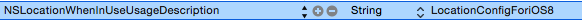

LBS測位
===

##概説
 - この機能は1.6.2バージョン以降に提供されます。周りの人の情報取得及び自分の位置情報の消去のインターフェースを提供します。

>** 2.3.0iバージョンから、iOS8システムに接続する時、下図のように、info.plistにはNSLocationWhenInUseUsageDescription(string)フィールドを追加する必要があります。**



MSDK更新の過程で、このインターフェースはiOS8との互換性問題があれば、直接にMSDKのバックグラウンドインターフェースを利用できます。（詳細はMSDKバックグラウンド・ドキュメントを参照してください）：/relation/nearby

---

##周りの人の取得
- ###概説
周りの人の情報を取得します
```ruby
void WGGetNearbyPersonInfo();
```
>記述: WGGetNearbyPersonInfoを呼び出し、周りの人の情報を取得するには、ユーザーはAppが現在の位置を利用することを許可する必要があります。でないとデータがなくなります。
呼び出しの成功・失敗はOnLocationNotify(RelationRet &ret)を通じてゲームにコールバックされます。ret.flagはそれぞれの共有結果を示し、詳細はeFlag(付録A)を参照してください

- ###サンプルコード
呼び出しコードは次の通りです。
```ruby
WGPlatform *plat = WGPlatform::GetInstance();
MyObserver* ob = new MyObserver(); 
plat->WGSetObserver(ob);//コールバック対象を設定します
plat->WGGetNearbyPersonInfo();
```
- コールバックのコードサンプル：
```ruby
void MyObserver::OnLocationNotify(RelationRet &relationRet) {
NSLog(@"relation callback");
NSLog(@"count == %d",relationRet.persons.size());
for (int i = 0; i < relationRet.persons.size(); i++)
{
PersonInfo logInfo = relationRet.persons[i];
NSLog(@"nikename == %@",[NSString stringWithCString:(const char*)logInfo.nickName.c_str() encoding:NSUTF8StringEncoding]);
NSLog(@"openid==%@",[NSString stringWithCString:(const char*)logInfo.openId.c_str() encoding:NSUTF8StringEncoding]);
}
}
```

- 2.4.0i以降は、delegate方式を利用できます。コードは次の通りです。
```
[MSDKService setMSDKDelegate:self];
MSDKLocationBasedService *service = [[MSDKLocationBasedService alloc] init];
[service GetNearbyPersonInfo];
```
- コールバックコードは次の通りです。
```
-(void)OnLocationWithRelationRet:(MSDKRelationRet *)ret
{
    //内部の実現ロジックはvoid MyObserver::OnLocationNotify(RelationRet &relationRet)と同じです
}
```

##位置情報の消去
- ###概説
位置情報を消去します
```ruby
bool WGCleanLocation();
```
>記述:　ユーザー自分の位置情報を消去します。ログインする必要があります 
戻り：正常の場合YESが戻ります。ログインしない場合、appidが空白な場合、openidが空白な場合は、NOが戻ります。
共有の成功・失敗はOnLocationNotify(RelationRet &ret)を通じてゲームにコールバックされます。Ret.flagはそれぞれの共有結果を示し、詳細はeFlag(付録A)を参照してください

- ###サンプルコード
呼び出しコードは次の通りです。
```ruby
WGPlatform *plat = WGPlatform::GetInstance();
MyObserver* ob = new MyObserver(); 
plat->WGSetObserver(ob);//コールバック対象を設定します
plat->WGCleanLocation();
```

- 2.4.0i以降は、delegate方式を利用できます。コードは次の通りです。
```
[MSDKService setMSDKDelegate:self];
MSDKLocationBasedService *service = [[MSDKLocationBasedService alloc] init];
[service CleanLocation];
```

##プレイヤーの位置情報の取得
- ###概説
プレイヤーの位置情報を取得します
```ruby
bool WGReportLocationInfo (); 2.0.0i以降のバージョンで提供されます
```
>記述:　ユーザー自分の位置情報を取得し、ゲームに戻す同時にMSDKバックグラウンドに送信します。ログインする必要があります 
戻り：正常の場合YESが戻ります。ログインしない場合、appidが空白な場合、openidが空白な場合は、NOが戻ります。
共有の成功・失敗はOnLocationGotNotify(LocationRet &ret)を通じてゲームにコールバックされます。Ret.flagはそれぞれの共有結果を示し、詳細はeFlag(付録A)を参照してください。LocationRet定義の詳細は付録Bを参照してください

- ###サンプルコード
呼び出しコードは次の通りです。
```ruby
WGPlatform *plat = WGPlatform::GetInstance();
MyObserver* ob = new MyObserver(); 
plat->WGSetObserver(ob);//コールバック対象を設定します
plat-> WGReportLocationInfo ();
```
- コールバックのコードサンプル：
```ruby
void MyObserver:: OnLocationNotify (LocationRet &ret)
{
    NSLog(@"get GPS: callback:%d, longtitude:%f, latitude:%f",flag,ret.longtitude,ret.latitude);
}
```

- 2.4.0i以降は、delegate方式を利用できます。コードは次の通りです。
```
[MSDKService setMSDKDelegate:self];
MSDKLocationBasedService *service = [[MSDKLocationBasedService alloc] init];
[service GetLocationInfo];
```
- コールバックコードは次の通りです。
```
-(void)OnLocationGotWithLocationRet:(MSDKLocationRet *)ret
{
    //内部の実現ロジックはvoid MyObserver:: OnLocationNotify (LocationRet &ret)と同じです
}
```

