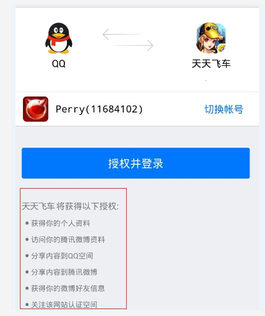

# FAQ #

1.結果を印刷する時、「 Request overly frequency」又は 「too many times」というメッセージが表示された場合、リクエスト回数が多すぎることを示します。バックグラウンドのサービスではリクエストが1秒に1回以上出されないことを規定しています。

2. 「msdk.qq.com接続失敗 (0)」又は 「msdktest.qq.comリンク失敗(0)」という異常メッセージが表示された場合、サーバがmsdk.qq.com 又は msdktest.qq.comドメインを解析できないことを示します。運営保守にお問合せください。

3.ret=-309又は ret=-308 又はret=-306,又はret=-101が表示された場合、ウィーチャットプラットフォームのリターンのタイムアウト、又はリンク切断によって発生したことを示します。この異常に対して、msdkバックグラウンドは毎日統計し、フォローアップします。

4.「-73，internal error」が表示された場合、ユーザーがパスワードを変更し、tokenが無効となることを示します。 

		シーン		
		a.ユーザーがパスワードを変更してから、再授権で新しいtokenを取得しました。
		b.古いtokenで確認すると、このエラーが発生します。
5.「-1，system error」が表示された場合、ウィーチャットプラットフォームのデータ処理の異常によって発生したことを示します。弊社はこのようなエラーを監視し、フォローアップします。再現でき、又は出現の回数が多い場合、弊社にお問合せください。

6.「-69,internal error」が表示された場合、アプリが権限システムにないことを示します。弊社にフィードバックしてください。

7.「100015，access token is revoked」 が表示された場合、tokenがユーザーによって廃棄されたことを示します。

8./share/qqよくあるエラー：
	
	A. {"msg":"100030,is_friend is 0","ret":-10000} 友達関係以外のユーザーに好意メッセージ をプッシュした場合のエラー。 
		　　
    B. {"msg":"30,null ServiceError: :workid=yaaf_mpqq_msgsendsvr cmdid=1 com.tencent.jungle.api.APIException: 	30,response errorCode error 30","ret":-10000} 
		各ユーザーの公共アカウントでは1つのゲームは１日に受信する共有メッセージは30通以下とします。 
		
	C. {"msg":"103,指定共有（携帯電話側）友達 ServiceError: :workid=qconnshare cmdid=11 com.tencent.jungle.api.APIException: 103,response errorCode error 103","ret":-10000}
		　　パラメータが長すぎ、title は  45バイトを超えることができません 
		　　
	D. {"msg":"32,null ServiceError: :workid=yaaf_mpqq_msgsendsvr cmdid=1 com.tencent.jungle.api.APIException: 32,response errorCode error 32","ret":-10000}
		共有の公共アカウントへの注目をキャンセルしました
		
	

9. 「100030,this api without user authorization  」が表示された場合、未授権を示します。例えば 
    

10./auth/check_tokenウィーチャットtoken確認インターフェースでは「40001,invalid credential」と表示されました。これは正常な現象です。有効期間は2時間しかありません。期間切れの時にこのインターフェースを呼び出すと、このエラーコードが表示されます。

11./share/wxウィーチャットへの共有インターフェースを表示しません。何故ですか？

	　　各ユーザーは1つの appidで、１日に最大5通のリクエストしか受信できません。それを超えると成功を保証できません。

12./share/upload_wxインターフェースのアップロードした画像ははっきりしていません。何故ですか？

	　　urlencode は"スペース"を記号「+」に変換します。Rawurlencodeを利用すれば解決できます。

13.ウィーチャット及びモバイルQQで友達を追加してから、どれぐらい経過してゲームで追加の友達を表示できますか。

	ウィーチャットは1時間以上かかります。モバイルQQは直ちに更新します。

