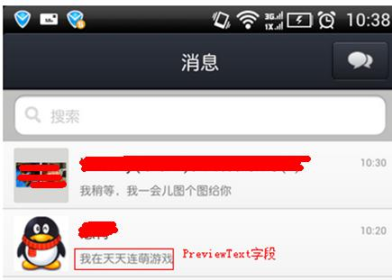

# 2.モバイルQQインターフェース 

## 2.1 Oauthサービス 

　携帯電話Oauth授権ログインの関連機能を実現します。
### 2.1.1/auth/verify_login 

#### 2.1.1.1インターフェースの説明 

　　　ユーザーのログイン状態を確認し、openkeyの期間切れの有無を判断します。期間切れがない場合、openkeyの有効期間を延長します（呼び出す毎に期間を2時間延長します）。
urlにはmsdkExtInfo=xxx（リクエストのシリアル番号）を付け、コールバックの内容でmsdkExtInfoのオリジナル・データを戻し、純異常リクエストを実現できます。msdkExtInfoはオプションのパラメータです。

#### 2.1.1.2入力パラメータの説明 

| パラメータ名称| 種類|記述|
| ------------- |:-------------:|:-----|
| appid|int| アプリのQQオープンプラットフォームでの唯一id |
| openid|string|一般ユーザーの唯一標識（QQプラットフォーム） |
| openkey|string|授権トークンaccess_token |
| userip|string|ユーザークライアントip|

#### 2.1.1.3出力パラメータの説明 

| パラメータ名称| 記述|
| ------------- |:-----|
| ret|リターンコード  0：正確，その他：失敗 |
| msg|retが0以外の場合、「エラーコード、エラーメッセージ」が表示されます。詳細注釈は第5節を参照してください|

#### 2.1.1.4 インターフェース呼び出し説明 

| パラメータ名称| 記述|
| ------------- |:-----|
| url|http://msdktest.qq.com/auth/verify_login/ |
| URI|?timestamp=**&appid=**&sig=**&openid=**&encode=1|
| 形式|JSON |
| リクエスト方式|POST  |

#### 2.1.1.5 リクエストサンプル 
	POST /auth/verify_login/?timestamp=*&appid=**&sig=***&openid=**&encode=1 
	HTTP/1.0
	Host:$domain
	Content-Type: application/x-www-form-urlencoded
	Content-Length: 198

	{
	    "appid": 100703379,
	    "openid": "A3284A812ECA15269F85AE1C2D94EB37",
	    "openkey": "933FE8C9AB9C585D7EABD04373B7155F",
	    "userip": "192.168.5.114"
	}

	//戻り結果：
	{"ret":0,"msg":"user is logged in"}

2.2 Shareサービス
---
　モバイルQQ及び携帯電話Qzoneの指定共有の能力を提供します。

### 2.2.1 /share/qq ###

#### 2.2.1.1インターフェースの説明 ####

ポイントツーポイントの指定共有(メッセージをモバイルQQ友達に共有し、公共アカウント「QQモバイルゲーム」で表示します)。

***PS：共有の内容はモバイルQQでしか見えず、PCQQでは表示されません。受信側は「QQモバイルゲーム」公共番号に注目してから受信できます。1人のユーザーは1日に1つのゲームから20通前後のメッセージを受信できます。***

#### 2.2.1.2入力パラメータの説明 ####

| パラメータ名称| 種類|記述|
| ------------- |:-------------:|:-----|
| appid|int| アプリのQQオープンプラットフォームでの唯一id |
| openid|string|一般ユーザーの唯一標識（QQプラットフォーム） |
| openkey|string|授権トークンaccess_token |
| userip|string|ユーザークライアントip|
|act|int|ジャンプ動作(0: URLジャンプ；1:APPジャンプ,デフォルト:0)|
|oauth_consumer_key|int|appid(アプリのQQプラットフォームでの唯一id)|
|dst|int|msf-モバイルQQ(iphone, android qq等を含む),現在は1001を記入します|
|flag|int|ローミング (0:はい；1:いいえ. 現在は1を記入します)|
   |image_url|string|共有画像url (画像寸法の規格は128*128です。サイトにアクセス可能できることを保証します。また、画像サイズは2M以下とします)|
    |openid|string|ユーザー標識|
    |access_token|string|授権トークン|
    |src|int|メッセージ出所 (デフォルトの値:0)|
    |summary|string|摘要、長さは45バイト以下|
    |target_url|string|ゲームセンターの詳細ページのURL http://gamecenter.qq.com/gcjump?appid={YOUR_APPID}&pf=invite&from=iphoneqq&plat=qq&originuin=111&ADTAG=gameobj.msg_invite ，長さは1024バイト以下|
   |title|string|共有タイトル,長さは45バイト以下|
    |fopenids|vector<jsonObject>又はjson文字列(互換性)|Jsonアレイであり、データ形式は [{"openid":"","type":0}]です。Openidは友達openidであり、typeを0に固定します。1人の友達にしか伝送できません|
    |appid|int|アプリのQQプラットフォームでの唯一idであり、oauth_consumer_keyと同様|
	|previewText|string|必須ではありません。共有の文字内容であり、空白とすることができます。例えば「私は天点連萌を遊んでいる」など、長さは45バイト以下|
    |game_tag|string|必須ではありません。game_tag	は好意共有、超過共有などプラットフォームの共有種類の統計に利用します。この値はゲームによって決められ、モバイルQQプラットフォームに同期します。現在の値は次の通り。 MSG_INVITE                //招待 MSG_FRIEND_EXCEED       //自慢 MSG_HEART_SEND          //好意 MSG_SHARE_FRIEND_PVP    //PVP対戦</td>
    |
***入力パラメータの種類を注意してください。1.5参照***
#### 2.2.1.3出力パラメータの説明 

| パラメータ名称| 記述|
| ------------- |:-----|
| ret|リターンコード  0：正確，その他：失敗 |
| msg|retが0以外の場合、「エラーコード、エラーメッセージ」が表示されます。詳細注釈は第5節を参照してください|

#### 2.2.1.4 インターフェース呼び出し説明 

| パラメータ名称| 記述|
| ------------- |:-----|
| url|http://msdktest.qq.com/auth/share/qq/ |
| URI|?timestamp=**&appid=**&sig=**&openid=**&encode=1|
| 形式|JSON |
| リクエスト方式|POST  |

#### 2.2.1.5 リクエストサンプル ####

	POST 
	/share/qq/?timestamp=*&appid=**&sig=***&openid=**&encode=1 HTTP/1.0
	Host:$domain
	Content-Type: application/x-www-form-urlencoded
	Content-Length: 198

	{
	    "act": 0,
	    "oauth_consumer_key": 100703379,
	    "dst": 1001,
	    "flag": 1,
	    "image_url": "http://mat1.gtimg.com/www/images/qq2012/erweimaVideoPic.png",
	    "openid": "A3284A812ECA15269F85AE1C2D94EB37",
	    "access_token": "933FE8C9AB9C585D7EABD04373B7155F",
	    "appid": 100703379,
	    "src": 0,
	    "summary": "摘要",
	    "target_url": "http://gamecenter.qq.com/gcjump?appid={YOUR_APPID}&pf=invite&from=iphoneqq&plat=qq&originuin=111&ADTAG=gameobj.msg_invite
	",
	    "title": "test by hunter",
	    "fopenids": [{"openid":"69FF99F3B17436F2F6621FA158B30549","type":0}],//jsonアレイ
	    "previewText": "私は天点連萌を遊んでいる"
	}

	//戻り結果
	{"ret":0,"msg":"success"}

#### 2.2.1.6 リターンコード ####
リターンコードは戻り結果のmsgパラメータの最初のカンマ前の整数によるものです

| リターンコード| 記述|
| ------------- |:-----|
| 100000|権限確認エラー！uin,skeyエラー|
| 100001|パラメータエラー！必要なパラメータがなく、又はパラメータ種類が間違っています|
| 100003|サービスエラー！関係の開発者にお問合せください |
| 100004|不適切な用語エラー！キーワードはエロ、政治などに関わっています  |
|100100|CGIはpost方式しかリクエストできません|
|100101|CGIにはRefererの制限があります|
|100012|サービス・タイムアウト！関係の開発者にお問合せください|
|111111 |未知エラー！関係の開発者にお問合せください |
|99999 | 頻度制限エラー|
|その他 |バックグラウンドサービスからエラーを戻しましたか。関係の開発者にお問合せください |

#### 2.2.1.8 共有画面キャプチャのサンプル####

2.3 Relationサービス
---
### 2.3.1.1インターフェースの説明 ###
　　　ユーザーのQQアカウントの基本情報を取得します。
#### 2.3.1.2入力パラメータの説明 ####

| パラメータ名称| 種類|記述|
| ------------- |:-------------:|:-----|
| appid|string| アプリのプラットフォームでの唯一id |
| accessToken|string|ログイン状態 |
| openid|string|ユーザーのあるアプリでの唯一標識 |

#### 2.3.1.3出力パラメータの説明 ####

| パラメータ名称| 記述|
| ------------- |:-----|
| ret|リターンコード  0：正確，その他：失敗 |
| msg|retが0以外の場合、「エラーコード、エラーメッセージ」が表示されます。詳細注釈は第5節を参照してください|
| nickName|ユーザーのQQ空間でのニックネーム（モバイルQQニックネームと同じ） |
| gender|性別 取得できなければ、デフォルトとして"男"を戻します  |
| picture40|寸法40×40画素のQQ顔写真URL |
| picture100|寸法100×100画素のQQ顔写真URL。ご注意：全てのユーザーはQQの100x100の顔写真を保有するわけではありませんが、40x40画素のものは必須です|
| yellow_vip|黄色ダイヤユーザーですか。0は黄色ダイヤではないことを示します |
| yellow_vip_level|黄色ダイヤレベル |
| yellow_year_vip|年額黄色ダイヤユーザーですか。0表示否 |
| is_lost|is_lostが1であれば、デグレードされたデータを取得したことを示します。この時、サービス層にはキャッシュデータがあれば、先ずキャッシュデータを利用します。それがなければ、現在のデータを利用します。このタグが1の場合、データをキャッシュしないでください。|

#### 2.3.1.4 インターフェース呼び出し説明 ####

| パラメータ名称| 記述|
| ------------- |:-----|
| url|http://msdktest.qq.com/relation/qqprofile/ |
| URI|?timestamp=**&appid=**&sig=**&openid=**&encode=1|
| 形式|JSON |
| リクエスト方式|POST  |

#### 2.3.1.5 リクエストサンプル ####

	POST /relation/qqprofile/?timestamp=*&appid=**&sig=***&openid=**&encode=1 HTTP/1.0
	Host:$domain
	Content-Type: application/x-www-form-urlencoded
	Content-Length: 198

	{
	    "appid": 100703379,
	    "accessToken": "FCCDE5C8CDAD70A9A0E229C367E03178",
	    "openid": "69FF99F3B17436F2F6621FA158B30549"
	}

	//戻り結果
	{
	    "ret": 0,
	    "msg": "success",
	    "nickName": "ハント",
	    "gender": "男",
	    "picture40": "http://q.qlogo.cn/qqapp/100703379/A3284A812ECA15269F85AE1C2D94EB37/40",
	    "picture100": "http://q.qlogo.cn/qqapp/100703379/A3284A812ECA15269F85AE1C2D94EB37/100",
	    "yellow_vip": 0,
	    "yellow_vip_level": 0,
	    "yellow_year_vip": 0,
	    "is_lost": "0"
	}

### 2.3.2/relation/qqfriends_detail ###

#### 2.3.2.1インターフェースの説明 ####
QQ共遊び友達の詳細な個人情報を取得するためのインターフェース
#### 2.3.2.2入力パラメータの説明 ####

| パラメータ名称| 種類|記述|
| ------------- |:-------------:|:-----|
| appid|string| アプリのプラットフォームでの唯一id |
| accessToken|string|ログイン状態 |
| openid|string|ユーザーのあるアプリでの唯一標識 |
| flag|int|flag=1の時、自分を含まない友達関係チェーンを戻します。flag=2の時、自分を友達を含む関係チェーンを戻します。その他の値は無効で、現在のロジックを使用します。|

***（入力パラメータの種類を注意してください。1.5参照）***

#### 2.3.2.3出力パラメータの説明 ####
| パラメータ名称| 記述|
| ------------- |:-----|
| ret|リターンコード  0：正確，その他：失敗 |
| msg|retが0以外の場合、「エラーコード、エラーメッセージ」が表示されます。詳細注釈は第5節を参照してください|
| list|QQ共遊び友達の個人情報リスト，種類	`vector<QQGameFriendsList>`|
| is_lost|is_lostが1であれば、デグレードされたデータを取得したことを示します。この時、サービス層にはキャッシュデータがあれば、先ずキャッシュデータを利用します。それがなければ、現在のデータを利用します。このタグが1の場合、データをキャッシュしないでください。|

	struct QQGameFriendsList {
	    string          openid;      //友達のopenid
	    string          nickName;   //ニックネーム(先ず備考を出力します。備考がなければニックネームを出力します)
	    string          gender;      //性別。ユーザーが記入しない場合、デフォルトで男を戻します
		string          figureurl_qq;  //友達QQ顔写真URL,であり、URLの後に/40，/100のようなパラメータを追加することで、規格の異なる画像を取得できます。
	　　40*40(/40)、100*100(/100)
	 };

#### 2.3.2.4 インターフェース呼び出し説明 ####

| パラメータ名称| 記述|
| ------------- |:-----|
| url|http://msdktest.qq.com/relation/qqfriends_detail/ |
| URI|?timestamp=**&appid=**&sig=**&openid=**&encode=1|
| 形式|JSON |
| リクエスト方式|POST  |

#### 2.3.2.5 リクエストサンプル ####
	POST /relation/qqfriends_detail/?timestamp=1381288134&appid=100703379&sig=3f308f92212f75cd8d682215cb3fa852&openid=F4382318AFBBD94F856E8%2066043C3472E&encode=1
	
	{
	    "appid": 「100703379」,
	    "openid": "A3284A812ECA15269F85AE1C2D94EB37",
	　　　"accessToken": "933FE8C9AB9C585D7EABD04373B7155F",
	    "flag": 1
	}
	//戻り結果
	{
	    "ret": 0,
	    "msg": "success",
	    "lists": [
	        {
	            "openid": "69FF99F3B17436F2F6621FA158B30549",
	            "nickName": "張鴻",
	            "gender": "男",
	            "figureurl_qq": "http://q.qlogo.cn/qqapp/100703379/69FF99F3B17436F2F6621FA158B30549/"
	        }
	    ],
	    "is_lost": "0"
	}

### 2.3.3/relation/qqstrange_profile ###
#### 2.3.3.1インターフェースの説明 ####
共遊びの他人（友達を含む）の個人情報を取得します。 
***PS：1.このインターフェースについて、現在「周りの人」などの機能だけを提供します 
2. 即ち、先ずクライアントで共遊びの他人のopenidリストを取得してからこそ、このインターフェースを呼び出します***

#### 2.3.3.2入力パラメータの説明 ####

| パラメータ名称| 種類|記述|
| ------------- |:-------------:|:-----|
| appid|string| アプリのプラットフォームでの唯一id |
| accessToken|string|ログイン状態 |
| openid|string|ユーザーのあるアプリでの唯一標識 |
| vcopenid|vector<string>|検索する共遊び他人（友達を含む）のopenidリストです。例えば：vcopenid:[「${openid}」,」${openid1}」]|

***（入力パラメータの種類を注意してください。1.5参照）***

#### 2.3.3.3出力パラメータの説明 ####

| パラメータ名称| 記述|
| ------------- |:-----|
| ret|リターンコード  0：正確，その他：失敗 |
| msg|retが0以外の場合、「エラーコード、エラーメッセージ」が表示されます。詳細注釈は第5節を参照してください|
| list| QQ共遊びの他人（友達を含む）個人情報情報リスト，種類vector< QQStrangeList>|
| is_lost | is_lostが1であれば、デグレードされたデータを取得したことを示します。この時、サービス層にはキャッシュデータがあれば、先ずキャッシュデータを利用します。それがなければ、現在のデータを利用します。このタグが1の場合、データをキャッシュしないでください。|
	struct QQStrangeList {
	    string          openid;          //openid
	    string          gender;          //性別 "1"
	    string          nickName;        //ニックネーム
	    string          qzonepicture50;  //ユーザー顔写真で、寸法50×50画素の友達QQ空間での顔写真URL
	    string          qqpicture40;     //ユーザー顔写真で、寸法40×40画素の友達QQ顔写真URL
	    string          qqpicture100;    //ユーザー顔写真で、寸法100×100画素の友達QQ顔写真URL
	    string          qqpicture;       //ユーザー顔写真で、寸法は画素適応の友達QQ顔写真URLであり、URLの後に/40，/100のようなパラメータを追加することで、規格の異なる画像を取得できます。40*40(/40)、100*100(/100)
	}; 

#### 2.3.3.4 インターフェース呼び出し説明 ####

| パラメータ名称| 記述|
| ------------- |:-----|
| url|http://msdktest.qq.com/relation/qqstrange_profile/ |
| URI|?timestamp=**&appid=**&sig=**&openid=**&encode=1|
| 形式|JSON |
| リクエスト方式|POST  |

#### 2.3.3.5 リクエストサンプル ####

	POST /relation/qqstrange_profile/?timestamp=1381288134&appid=100703379&sig=3f308f92212f75cd8d682215cb3fa***&openid=F4382318AFBBD94F856E8%2066043C3472E&encode=1
	
	{
	    "appid": 100732256,
	    "openid": "B9EEA5EE1E99694146AC2700BFE6B88B",
	    "accessToken": "C9A1F622B7B4AAC48D0AF3F73B1A3D83",
	    "vcopenid": [
	        "B9EEA5EE1E99694146AC2700BFE6B88B"
	    ]
	}
	//戻り結果
	{
	    "ret": 0,
	    "msg": "success",
	    "lists": [
	        {
	            "openid": "B9EEA5EE1E99694146AC2700BFE6B88B",
	            "gender": "1",
	            "nickName": "/xu゛♥早く来いஇ",
	            "qzonepicture50": "http://thirdapp1.qlogo.cn/qzopenapp/aff242e95d20fb902bedd93bb1dcd4c01ed5dc2a14b37510a81685c74529ab1e/50",
	            "qqpicture40": "http://q.qlogo.cn/qqapp/100732256/B9EEA5EE1E99694146AC2700BFE6B88B/40",
	            "qqpicture100": "http://q.qlogo.cn/qqapp/100732256/B9EEA5EE1E99694146AC2700BFE6B88B/100",
	            "qqpicture": "http://q.qlogo.cn/qqapp/100732256/B9EEA5EE1E99694146AC2700BFE6B88B"
	        }
	　　　],
	　　　"is_lost": "0"
	}

##  2.4.profileサービス  ##

　　QQアカウントVIP情報の検索サービスを提供します。

### 2.4.1 /profile/load_vip ###
  QQアカウントVIP情報を取得します。

#### 2.4.1.2入力パラメータの説明 ####

| パラメータ名称 | 種類|記述|
| ------------- |:-------------:|:-----|
| appid|int| アプリのプラットフォームでの唯一id |
| login|login|ログイン種類で、デフォルトでは2を記入します |
| uin|int|ユーザー標識で、openidアカウント体系の場合、デフォルトで0を記入します |
| openid|string|ユーザーのあるアプリでの唯一標識|
| vip|int|検索種類:(1会員；4青ダイヤ；8赤ダイヤ；16スーパー会員;32ゲーム会員；64心悦；128黄色ダイヤ；上述を任意に組合せることができます。 同時に会員と青ダイヤを検索したい場合、5を入力します。同時に青ダイヤと赤ダイヤを検索したい場合、12を入力します。3種類を全て検索したい場合、13を入力します)。|
***（入力パラメータの種類を注意してください。1.5参照） ***

#### 2.4.1.3出力パラメータの説明 ####

| パラメータ名称| 記述|
| ------------- |:-----|
| ret|リターンコード  0：正確，その他：失敗 |
| msg|retが0以外の場合、「エラーコード、エラーメッセージ」が表示されます。詳細注釈は第5節を参照してください|
| list|情報リストvector<VIP> 種類（後述）であり、スーパー会員を取得する時、struct VIPではisvipとflagパラメータのみ有効となります。|
	
	struct VIP {
	　　VIPFlag :flag; //その種類のVIP
	　　int isvip; // VIPか(ユーザーのVIP状態を判断するための唯一標識です。0いいえ，1はい)
	　　int year; //年額か(0いいえ，1はい)
	　　int level; //VIPレベル(0いいえ，1はい)
	　　int luxury; //豪華版か(0いいえ，1はい)
	　　int ispay;//ゲーム会員か。ゲーム会員の検索の時のみに有効
	　　int qqLevel;//QQクラウン、太陽、月、星のどのレベルですか。VIP_NORMALのみで有効
	};
	enum VIPFlag
	{
	　　VIP_NORMAL(会員) = 1
	　　VIP_BLUE（青ダイヤ） = 4,
	　　VIP_RED （赤ダイヤ）= 8,
	　　VIP_SUPER (スーパー会員)= 16,
	　　VIP_GAME(ゲーム会員)=32,
	　　VIP_XINYUE = 64,  //心悦クラブの特権会員です。このフラグビットによるリクエストの時、isvipとlevelが有効となります
	　　VIP_YELLOW = 128, //黄色ダイヤ会員であり、levelフィールドが無効となり、その他のものは有効です。
	};

#### 2.4.1.4 インターフェース呼び出し説明 ####
| パラメータ名称| 記述|
| ------------- |:-----|
| url|http://msdktest.qq.com/relation/load_vip/ |
| URI|?timestamp=**&appid=**&sig=**&openid=**&encode=1|
| 形式|JSON |
| リクエスト方式|POST  |

#### 2.4.1.5 リクエストサンプル ####

	POST /profile/load_vip/?timestamp=*&appid=**&sig=***&openid=**&encode=1 HTTP/1.0
	Host:$domain
	Content-Type: application/x-www-form-urlencoded
	Content-Length: 198
	{
	    "appid": 100703379,
	    "login": 2,
	    "uin": 0,
	    "openid": "A3284A812ECA15269F85AE1C2D94EB37",
	    "vip": 13
	}
	//戻り形式
	{
	    "ret": 0,
	    "msg": "",
	    "lists": [{
	        "flag": 1,
	        "year": 0,
	        "level": 0,
	        "luxury": 0,
	　　	"ispay": 0,
	        "isvip": 0,
	        "qqLevel": 1
	    },
	    {
	        "flag": 4,
	        "year": 0,
	        "level": 0,
	        "luxury": 0,
	　　	"ispay": 0,
	        "isvip": 0,
	        "qqLevel": 0
	
	    },
	    {
	        "flag": 8,
	        "year": 0,
	        "level": 0,
	        "luxury": 0,
	        "ispay": 0,
	        "isvip": 0,
	        "qqLevel": 0
	    }]
	}

### 2.4.2 /relation/qqfriends_vip ###

#### 2.4.2.1インターフェースの説明 ####
 　 QQ会員情報を一括検索します。

#### 2.4.2.2入力パラメータの説明 ####

| パラメータ名称| 種類|記述|
| ------------- |:-------------:|:-----|
| appid|string| アプリのプラットフォームでの唯一id |
| openid|string|ユーザーのあるアプリでの唯一標識 |
| accessToken|string|ユーザーのアプリでのログイントークン |
| fopenids|vector<string>|友達openidリストです。1回に最大50を入力できます|
| flags|string|VIPサービスの検索標識です。現在、QQ会員情報：qq_vipのみに対応します。後期により多くのサービスのユーザーVIP情報検索に対応する予定です。複数のVIPサービスを検索したい場合、「,」で切り分けます。この値を入力しないと、デフォルトでは全てを検索します|
| userip|string|呼び出し側のip情報|
| pf|string|プレイヤーのログインプラットフォームです。デフォルトではopenmobileです。openmobile_android/openmobile_ios/openmobile_wpなどが挙げられ、この値はクライアントのモバイルQQログインの戻りによるものです|

***（入力パラメータの種類を注意してください。1.5参照） ***

### 2.4.2.3出力パラメータの説明 ###

| パラメータ名称| 記述|
| ------------- |: -----|
| ret|リターンコード  0：正確，その他：失敗 |
| msg|retが0以外の場合、「エラーコード、エラーメッセージ」が表示されます。詳細注釈は第5節を参照してください|
| list|種類：vector<QQFriendsVipInfo>,QQゲーム友達vip情報リスト(後述)|
| is_lost|is_lostが1の場合、oidb取得のデータタイムアウトを示します。ゲームサービスがis_lostの1時に、デグレードを行い、直接にキャッシュデータ又はデフォルトデータを読み込むよう提案します|
	
	struct QQFriendsVipInfo {
	    1   optional     string          openid;          //友達openid
	    2   optional     int             is_qq_vip;       // QQ会員か（0：いいえ； 1：はい）
	    3   optional     int             qq_vip_level;    //QQ会員レベル（QQ会員であれば、このフィールドを戻します）
	    4   optional     int             is_qq_year_vip;  //年額QQ会員か（0：いいえ； 1：はい）
	};

#### 2.4.2.4 インターフェース呼び出し説明 ####

| パラメータ名称| 記述|
| ------------- |:-----|
| url|http://msdktest.qq.com/relation/qqfriends_vip/ |
| URI|?timestamp=**&appid=**&sig=**&openid=**&encode=1|
| 形式|JSON |
| リクエスト方式|POST  |

#### 2.4.2.5 リクエストサンプル ####

	POST /relation/qqfriends_vip/?timestamp=*&appid=**&sig=***&openid=**&encode=1 HTTP/1.0
	Host:$domain
	Content-Type: application/x-www-form-urlencoded
	Content-Length: 198
	
	{
	    "appid": "100703379",
	    "openid": "A3284A812ECA15269F85AE1C2D94EB37",
	    "accessToken": "964EE8FACFA24AE88AEEEEBD84028E19",
	    "fopenids": [
	        "69FF99F3B17436F2F6621FA158B30549"
	    ],
	    "flags": "qq_vip",
	    "pf": "openmobile",
	    "userip": "127.0.0.1"
	}
	//戻り結果
	{
	    "is_lost": "0",
	    "lists": [
	        {
	            "is_qq_vip": 1,
	            "is_qq_year_vip": 1,
	            "openid": "69FF99F3B17436F2F6621FA158B30549",
	            "qq_vip_level": 6
	        }
	    ],
	    "msg": "success",
	    "ret": 0
	}

### 2.4.3 /profile/get_gift ###

#### 2.4.3.1インターフェースの説明 ####
　　　青ダイヤのギフトを受領します。1回呼び出すと、ギフトをクリアします。

#### 2.4.3.2入力パラメータの説明 ####

| パラメータ名称| 種類|記述|
| ------------- |:-------------:|:-----|
| appid|string| アプリのプラットフォームでの唯一id |
| openid|string|ユーザーのあるアプリでの唯一標識 |

#### 2.4.3.3出力パラメータの説明 ####

| パラメータ名称| 記述|
| ------------- |:-----|
| ret|リターンコード  0：正確，その他：失敗 |
| msg|retが0以外の場合、「エラーコード、エラーメッセージ」が表示されます。詳細注釈は第5節を参照してください|
| GiftPackList|vector<GiftPackInfo> 種類|
	struct GiftPackInfo
	{
	  string     giftId;                 //ギフトid
	  string     giftCount;              //対応のギフト数
	};

#### 2.4.3.4 インターフェース呼び出し説明 ####
| パラメータ名称| 記述|
| ------------- |:-----|
| url|http://msdktest.qq.com/relation/get_gift/ |
| URI|?timestamp=**&appid=**&sig=**&openid=**&encode=1|
| 形式|JSON |
| リクエスト方式|POST  |

#### 2.4.3.5 リクエストサンプル ####

	POST http://msdktest.qq.com/profile/get_gift/?timestamp=1381288134&appid=100703379&sig=3f308f92212f75cd8d682215cb3fa8**&openid=F4382318AFBBD94F856E866043C3472E&encode=1
	
	{
	    "appid": "100703379",
	    "openid": "F4382318AFBBD94F856E866043C3472E"
	}
	//戻り結果
	{
	    "GiftPackList": [
	        {
	            "giftCount": "1",
	            "giftId": "1001"
	        }
	    ],
	    "msdkExtInfo": "testhunter",
	    "msg": "success",
	    "ret": 0
	}

### 2.4.4 /profile/get_wifi ###

#### 2.4.4.1インターフェースの説明 ####
　　　携帯wifiの資格を取得します。
#### 2.4.4.2入力パラメータの説明 ####

| パラメータ名称| 種類|記述|
| ------------- |:-------------:|:-----|
| appid|string| アプリのプラットフォームでの唯一id |
| openid|string|ユーザーのあるアプリでの唯一標識 |

#### 2.4.4.3出力パラメータの説明 ####

| パラメータ名称| 記述|
| ------------- |:-----|
| ret|リターンコード  0：正確，その他：失敗 |
| msg|retが0以外の場合、「エラーコード、エラーメッセージ」が表示されます。詳細注釈は第5節を参照してください|
| wifiVip|1: wifivip資格です。0: wifivip資格ではありません|

#### 2.4.4.4 インターフェース呼び出し説明 ####

| パラメータ名称| 記述|
| ------------- |:-----|
| url|http://msdktest.qq.com/profile/get_wifi/ |
| URI|?timestamp=**&appid=**&sig=**&openid=**&encode=1|
| 形式|JSON |
| リクエスト方式|POST  |

#### 2.4.4.5 リクエストサンプル ####

	POST http://msdktest.qq.com/profile/get_wifi/?timestamp=1381288134&appid=100703379&sig=3f308f92212f75cd8d682215cb3fa8**&openid=F4382318AFBBD94F856E866043C3472E&encode=1
	
	{
	    "appid": "100703379",
	    "openid": "A3284A812ECA15269F85AE1C2D94EB37"
	}
	
	//戻り結果
	{
	    "msg": "success",
	    "ret": 0,
	    "wifiVip": 1
	}

### 2.4.5 /profile/qqscore_batch ###

#### 2.4.5.1インターフェースの説明 ####
　　　プレイヤーの実績をQQプラットフォームに報告し、QQゲームセンターで友達の点数ランキングを表示します。（リアルタイム動作）

#### 2.4.5.2入力パラメータの説明 ####

| パラメータ名称| 種類|記述|
| ------------- |:-------------:|:-----|
| appid|string| アプリのプラットフォームでの唯一id |
| openid|string|ユーザーのあるアプリでの唯一標識 |
| accessToken|string|第三者の呼び出しトークンであり、トークンイン取得ターフェースを通じて取得します|
| param|Vector<ReportParam>|ReportParam構造体は後述。 type:1:LEVEL（レベル），2:MONEY（お金）, 3:SCORE（スコア）, 4:EXP（経験）, 5:HST_SCORE(歴史最高点数)， 6:PRE_WEEK_FINAL_RANK(先週データの精算順位です。精算データの有効期間が次回の精算まで注意してください。でないと期間切れデータを表示してしまいます)，  7：CHALLENGE_SCORE（pk記録データです。ログインの時に報告しませんが、局別に報告します） は対応の数字を伝送します。一対一ですから、間違わないように伝送してください  data:実績値 expireds:タイムアウト時間，unixタイムスタンプ，単位sです。どの時刻でデータが期間切れたかを示し、0の時、永久にタイムアウトしないことを示します。伝送しないと、デフォルトでは0となります。 bcover:1は上書き報告を示し、今回の報告により、従来のデータを上書きします。伝送しない場合、又は他の値を伝送する場合、インクリメント報告を示し、前回より高いデータしか記録しません|
	
	struct ReportParam
	{
	    0   optional     int             type;    
	    1   optional     string          data;    
	    2   optional     string          expires; 
	    3   optional     int             bcover;  
	};
***（入力パラメータの種類を注意してください。1.5参照）***

#### 2.4.5.3出力パラメータの説明 ####

| パラメータ名称| 記述|
| ------------- |:-----|
| ret|リターンコード  0：正確，その他：失敗 |
| msg|retが0以外の場合、「エラーコード、エラーメッセージ」が表示されます。詳細注釈は第5節を参照してください|

#### 2.4.5.4 インターフェース呼び出し説明 ####

| パラメータ名称| 記述|
| ------------- |:-----|
| url|http://msdktest.qq.com/relation/qqscore_batch/ |
| URI|?timestamp=**&appid=**&sig=**&openid=**&encode=1|
| 形式|JSON |
| リクエスト方式|POST  |

### 2.4.5.5 リクエストサンプル ###

	POST http://msdktest.qq.com/profile/qqscore_batch/?timestamp=1381288134&appid=100703379&sig=3f308f92212f75cd8d682215cb3fa8**&openid=F4382318AFBBD94F856E866043C3472E&encode=1
	
	{
	    "appid": "100703379",
	    "accessToken": "E16A9965C446956D89303747C632C27B",
	    "openid": "A3284A812ECA15269F85AE1C2D94EB37",
	    "param": [
	        {
	            "type": 3,
	            "bcover": 1,
	            "data": "999",
	            "expires": "123459751"
	        },
	        {
	            "type": 2,
	            "bcover": 1,
	            "data": "1999",
	            "expires": "123459751"
	        }
	    ]
	}
	
	//戻り結果
	{"msg":"success","ret":0,"type":0}

